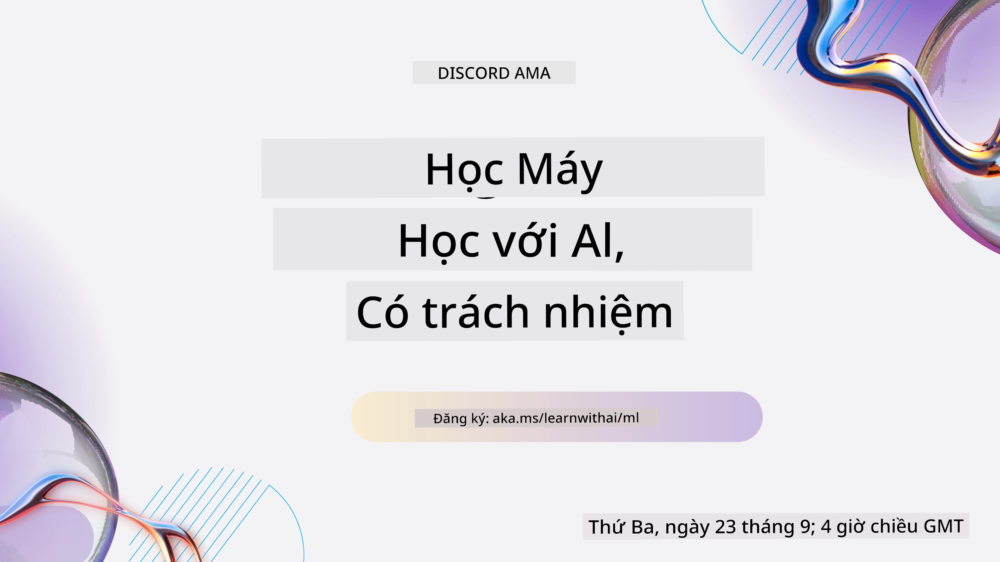
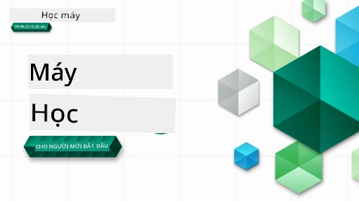

[](https://github.com/microsoft/ML-For-Beginners/blob/master/LICENSE)
[](https://GitHub.com/microsoft/ML-For-Beginners/graphs/contributors/)
[](https://GitHub.com/microsoft/ML-For-Beginners/issues/)
[](https://GitHub.com/microsoft/ML-For-Beginners/pulls/)
[](http://makeapullrequest.com)

[](https://GitHub.com/microsoft/ML-For-Beginners/watchers/)
[](https://GitHub.com/microsoft/ML-For-Beginners/network/)
[](https://GitHub.com/microsoft/ML-For-Beginners/stargazers/)

### 🌐 Hỗ trợ đa ngôn ngữ

#### Hỗ trợ qua GitHub Action (Tự động & Luôn Cập nhật)

<!-- CO-OP TRANSLATOR LANGUAGES TABLE START -->
[Tiếng Ả Rập](../ar/README.md) | [Tiếng Bengal](../bn/README.md) | [Tiếng Bulgaria](../bg/README.md) | [Tiếng Miến Điện (Myanmar)](../my/README.md) | [Tiếng Trung (Giản thể)](../zh-CN/README.md) | [Tiếng Trung (Phồn thể, Hồng Kông)](../zh-HK/README.md) | [Tiếng Trung (Phồn thể, Macau)](../zh-MO/README.md) | [Tiếng Trung (Phồn thể, Đài Loan)](../zh-TW/README.md) | [Tiếng Croatia](../hr/README.md) | [Tiếng Séc](../cs/README.md) | [Tiếng Đan Mạch](../da/README.md) | [Tiếng Hà Lan](../nl/README.md) | [Tiếng Estonia](../et/README.md) | [Tiếng Phần Lan](../fi/README.md) | [Tiếng Pháp](../fr/README.md) | [Tiếng Đức](../de/README.md) | [Tiếng Hy Lạp](../el/README.md) | [Tiếng Do Thái](../he/README.md) | [Tiếng Hindi](../hi/README.md) | [Tiếng Hungary](../hu/README.md) | [Tiếng Indonesia](../id/README.md) | [Tiếng Ý](../it/README.md) | [Tiếng Nhật](../ja/README.md) | [Tiếng Kannada](../kn/README.md) | [Tiếng Khmer](../km/README.md) | [Tiếng Hàn](../ko/README.md) | [Tiếng Lithuania](../lt/README.md) | [Tiếng Mã Lai](../ms/README.md) | [Tiếng Malayalam](../ml/README.md) | [Tiếng Marathi](../mr/README.md) | [Tiếng Nepal](../ne/README.md) | [Tiếng Pidgin Nigeria](../pcm/README.md) | [Tiếng Na Uy](../no/README.md) | [Tiếng Ba Tư (Farsi)](../fa/README.md) | [Tiếng Ba Lan](../pl/README.md) | [Tiếng Bồ Đào Nha (Brazil)](../pt-BR/README.md) | [Tiếng Bồ Đào Nha (Bồ Đào Nha)](../pt-PT/README.md) | [Tiếng Punjabi (Gurmukhi)](../pa/README.md) | [Tiếng Romania](../ro/README.md) | [Tiếng Nga](../ru/README.md) | [Tiếng Serbia (Chữ Kirin)](../sr/README.md) | [Tiếng Slovakia](../sk/README.md) | [Tiếng Slovenia](../sl/README.md) | [Tiếng Tây Ban Nha](../es/README.md) | [Tiếng Swahili](../sw/README.md) | [Tiếng Thụy Điển](../sv/README.md) | [Tiếng Tagalog (Filipino)](../tl/README.md) | [Tiếng Tamil](../ta/README.md) | [Tiếng Telugu](../te/README.md) | [Tiếng Thái](../th/README.md) | [Tiếng Thổ Nhĩ Kỳ](../tr/README.md) | [Tiếng Ukraina](../uk/README.md) | [Tiếng Urdu](../ur/README.md) | [Tiếng Việt](./README.md)

> **Ưu tiên sao chép cục bộ?**
>
> Kho lưu trữ này bao gồm hơn 50 bản dịch ngôn ngữ làm tăng đáng kể dung lượng tải về. Để sao chép mà không có bản dịch, sử dụng sparse checkout:
>
> **Bash / macOS / Linux:**
> ```bash
> git clone --filter=blob:none --sparse https://github.com/microsoft/ML-For-Beginners.git
> cd ML-For-Beginners
> git sparse-checkout set --no-cone '/*' '!translations' '!translated_images'
> ```
>
> **CMD (Windows):**
> ```cmd
> git clone --filter=blob:none --sparse https://github.com/microsoft/ML-For-Beginners.git
> cd ML-For-Beginners
> git sparse-checkout set --no-cone "/*" "!translations" "!translated_images"
> ```
>
> Điều này cung cấp cho bạn mọi thứ cần thiết để hoàn thành khóa học với tốc độ tải nhanh hơn nhiều.
<!-- CO-OP TRANSLATOR LANGUAGES TABLE END -->

#### Tham gia Cộng đồng của Chúng tôi

[](https://discord.gg/nTYy5BXMWG)

Chúng tôi đang có một chuỗi học cùng AI trên Discord, tìm hiểu thêm và tham gia tại [Chuỗi Học cùng AI](https://aka.ms/learnwithai/discord) từ ngày 18 - 30 tháng 9 năm 2025. Bạn sẽ nhận được các mẹo và thủ thuật sử dụng GitHub Copilot cho Khoa học Dữ liệu.



# Học Máy cho Người Mới Bắt Đầu - Một Chương Trình Học

> 🌍 Du hành vòng quanh thế giới khi chúng ta khám phá Học Máy thông qua các nền văn hóa thế giới 🌍

Các Nhà vận động điện toán đám mây của Microsoft hân hạnh giới thiệu chương trình học 12 tuần, 26 bài học toàn diện về **Học Máy**. Trong chương trình này, bạn sẽ học về cái mà đôi khi gọi là **học máy cổ điển**, chủ yếu sử dụng thư viện Scikit-learn và tránh học sâu, được bao phủ trong [chương trình AI cho Người Mới Bắt Đầu](https://aka.ms/ai4beginners). Kết hợp các bài học này với [chương trình Khoa học Dữ liệu cho Người Mới Bắt Đầu](https://aka.ms/ds4beginners) của chúng tôi, nữa nhé!

Du hành với chúng tôi vòng quanh thế giới khi chúng ta áp dụng những kỹ thuật học máy cổ điển này trên dữ liệu từ nhiều khu vực trên thế giới. Mỗi bài học bao gồm các bài quiz trước và sau bài học, hướng dẫn bằng văn bản để hoàn thành bài, giải pháp, bài tập, và nhiều hơn nữa. Phương pháp giảng dạy dựa trên dự án của chúng tôi cho phép bạn học ngay trong lúc xây dựng, một cách được chứng minh giúp kỹ năng mới 'bám lâu'.

**✍️ Xin chân thành cảm ơn các tác giả** Jen Looper, Stephen Howell, Francesca Lazzeri, Tomomi Imura, Cassie Breviu, Dmitry Soshnikov, Chris Noring, Anirban Mukherjee, Ornella Altunyan, Ruth Yakubu và Amy Boyd

**🎨 Cảm ơn thêm các họa sĩ minh họa** Tomomi Imura, Dasani Madipalli, và Jen Looper

**🙏 Cảm ơn đặc biệt 🙏 đến các tác giả, người đánh giá và đóng góp nội dung Microsoft Student Ambassador**, đặc biệt là Rishit Dagli, Muhammad Sakib Khan Inan, Rohan Raj, Alexandru Petrescu, Abhishek Jaiswal, Nawrin Tabassum, Ioan Samuila, và Snigdha Agarwal

**🤩 Lời biết ơn thêm đến Microsoft Student Ambassadors Eric Wanjau, Jasleen Sondhi, và Vidushi Gupta cho các bài học R của chúng tôi!**

# Bắt Đầu

Làm theo các bước sau:
1. **Tạo Fork của Kho Lưu Trữ**: Nhấn nút "Fork" ở góc trên bên phải của trang này.
2. **Sao chép Kho Lưu Trữ**:   `git clone https://github.com/microsoft/ML-For-Beginners.git`

> 💡 **Mẹo Bắt Đầu Nhanh:** Muốn bắt đầu trong trình duyệt mà không cần cài Python cục bộ? Dùng [GitHub Codespaces](https://github.com/features/codespaces) để tạo môi trường phát triển đám mây cho fork của bạn. Mở menu màu xanh lá **Code**, chọn **Codespaces**, và tạo một codespace; cài đặt các phụ thuộc cần thiết cho từng bài học bên trong nó nếu cần.

> [tìm tất cả tài nguyên bổ sung cho khóa học này trong bộ sưu tập Microsoft Learn của chúng tôi](https://learn.microsoft.com/en-us/collections/qrqzamz1nn2wx3?WT.mc_id=academic-77952-bethanycheum)

> 🔧 **Cần giúp đỡ?** Xem [Hướng dẫn Khắc phục Sự cố](TROUBLESHOOTING.md) để tìm giải pháp cho các vấn đề phổ biến về cài đặt, thiết lập và chạy bài học.


**[Sinh viên](https://aka.ms/student-page)**, để sử dụng chương trình học này, hãy fork toàn bộ repo về tài khoản GitHub của bạn và hoàn thành các bài tập một mình hoặc theo nhóm:

- Bắt đầu với một bài quiz trước giờ học.
- Đọc bài giảng và hoàn thành các hoạt động, tạm dừng và suy ngẫm tại mỗi bước kiểm tra kiến thức.
- Cố gắng tạo các dự án bằng cách hiểu bài học thay vì chạy mã giải; tuy nhiên bạn có thể tìm mã giải trong thư mục `/solution` của mỗi bài học hướng dự án.
- Làm bài quiz sau giờ học.
- Hoàn thành thử thách.
- Hoàn thành bài tập.
- Sau khi hoàn thành một nhóm bài học, hãy đến [Bảng Thảo luận](https://github.com/microsoft/ML-For-Beginners/discussions) và "học bằng cách nói ra" bằng cách điền vào bảng đánh giá PAT thích hợp. 'PAT' là một Công Cụ Đánh Giá Tiến Bộ là bảng chấm điểm bạn điền để tăng cường học tập của mình. Bạn cũng có thể phản hồi các PAT khác để cùng nhau học.

> Để học thêm, chúng tôi khuyến khích theo các module và lộ trình học [Microsoft Learn](https://docs.microsoft.com/en-us/users/jenlooper-2911/collections/k7o7tg1gp306q4?WT.mc_id=academic-77952-leestott).

**Giáo viên**, chúng tôi đã [bao gồm một số đề xuất](for-teachers.md) về cách sử dụng chương trình học này.

---

## Video hướng dẫn

Một số bài học có sẵn dưới dạng video ngắn. Bạn có thể tìm thấy tất cả những video này trong bài học, hoặc trên [danh sách phát ML for Beginners trên kênh Microsoft Developer YouTube](https://aka.ms/ml-beginners-videos) bằng cách nhấp vào hình ảnh bên dưới.

[](https://aka.ms/ml-beginners-videos)

---

## Gặp Gỡ Nhóm

[](https://youtu.be/Tj1XWrDSYJU)

**Ảnh Gif bởi** [Mohit Jaisal](https://linkedin.com/in/mohitjaisal)

> 🎥 Nhấp vào hình ảnh trên để xem video về dự án và những người đã tạo ra nó!

---

## Phương pháp giảng dạy

Chúng tôi đã chọn hai nguyên tắc giảng dạy khi xây dựng chương trình học này: đảm bảo nó mang tính thực hành **dựa trên dự án** và bao gồm **các bài kiểm tra thường xuyên**. Ngoài ra, chương trình có một **chủ đề** chung để tạo sự liên kết.

Bằng cách đảm bảo nội dung phù hợp với các dự án, quá trình học trở nên hấp dẫn hơn cho học viên và việc ghi nhớ các khái niệm được tăng cường. Ngoài ra, một bài kiểm tra nhẹ trước giờ học giúp sinh viên định hướng học tập, trong khi một bài kiểm tra khác sau giờ học giúp củng cố kiến thức. Chương trình này được thiết kế linh hoạt và vui nhộn, có thể học toàn bộ hoặc học từng phần. Các dự án bắt đầu nhỏ và ngày càng phức tạp hơn vào cuối chu kỳ 12 tuần. Chương trình cũng bao gồm một phần sau kịch bản về ứng dụng thực tế của ML, có thể dùng làm bài tập thêm hoặc làm cơ sở thảo luận.

> Tìm các hướng dẫn [Quy tắc ứng xử](CODE_OF_CONDUCT.md), [Đóng góp](CONTRIBUTING.md), [Bản dịch](..), và [Khắc phục sự cố](TROUBLESHOOTING.md). Chúng tôi hoan nghênh phản hồi xây dựng của bạn!

## Mỗi bài học bao gồm

- bản ghi chép tóm tắt tùy chọn
- video bổ sung tùy chọn
- video hướng dẫn (chỉ một số bài học)
- [bài kiểm tra khởi động trước giờ học](https://ff-quizzes.netlify.app/en/ml/)
- bài học bằng văn bản
- với các bài học hướng dự án, hướng dẫn từng bước cách xây dựng dự án
- các bước kiểm tra kiến thức
- một thử thách
- tài liệu đọc bổ sung
- bài tập
- [bài kiểm tra sau giờ học](https://ff-quizzes.netlify.app/en/ml/)

> **Ghi chú về ngôn ngữ**: Các bài học này chủ yếu viết bằng Python, nhưng nhiều bài cũng có bản R. Để hoàn thành bài học R, vào thư mục `/solution` và tìm bài học R. Chúng bao gồm phần mở rộng .rmd đại diện cho tệp **R Markdown**, có thể được định nghĩa đơn giản là nhúng `code chunks` (của R hoặc ngôn ngữ khác) và một `YAML header` (hướng dẫn định dạng đầu ra như PDF) trong một `tài liệu Markdown`. Do đó, nó là khung tác giả mẫu cho khoa học dữ liệu vì nó cho phép bạn kết hợp mã của mình, kết quả đầu ra, và suy nghĩ bằng cách viết chúng trong Markdown. Hơn nữa, tài liệu R Markdown có thể được xuất ra các định dạng như PDF, HTML, hoặc Word.

> **Ghi chú về các bài kiểm tra**: Tất cả các bài quiz đều nằm trong [thư mục Quiz App](../../quiz-app), với tổng cộng 52 bài quiz, mỗi bài có ba câu hỏi. Chúng được liên kết trong bài học nhưng ứng dụng quiz có thể chạy cục bộ; theo hướng dẫn trong thư mục `quiz-app` để lưu trữ cục bộ hoặc triển khai lên Azure.

| Số bài học |                             Chủ đề                              |                   Nhóm bài học                   | Mục tiêu học tập                                                                                                             |                                                              Bài học liên quan                                                               |                        Tác giả                        |
| :-----------: | :------------------------------------------------------------: | :-------------------------------------------------: | ------------------------------------------------------------------------------------------------------------------------------- | :--------------------------------------------------------------------------------------------------------------------------------------: | :--------------------------------------------------: |
|      01       |                Giới thiệu về máy học                |      [Introduction](1-Introduction/README.md)       | Tìm hiểu các khái niệm cơ bản về máy học                                                                                |                                             [Lesson](1-Introduction/1-intro-to-ML/README.md)                                             |                       Muhammad                       |
|      02       |                Lịch sử của máy học                 |      [Introduction](1-Introduction/README.md)       | Tìm hiểu lịch sử của lĩnh vực này                                                                                         |                                            [Lesson](1-Introduction/2-history-of-ML/README.md)                                            |                     Jen and Amy                      |
|      03       |                 Công bằng và máy học                  |      [Introduction](1-Introduction/README.md)       | Những vấn đề triết học quan trọng về công bằng mà học viên nên xem xét khi xây dựng và áp dụng mô hình ML là gì? |                                              [Lesson](1-Introduction/3-fairness/README.md)                                               |                        Tomomi                        |
|      04       |                Kỹ thuật cho máy học                 |      [Introduction](1-Introduction/README.md)       | Các kỹ thuật mà các nhà nghiên cứu ML sử dụng để xây dựng mô hình ML là gì?                                                                       |                                          [Lesson](1-Introduction/4-techniques-of-ML/README.md)                                           |                    Chris and Jen                     |
|      05       |                   Giới thiệu về hồi quy                   |        [Regression](2-Regression/README.md)         | Bắt đầu với Python và Scikit-learn cho các mô hình hồi quy                                                                  |         [Python](2-Regression/1-Tools/README.md) • [R](../../2-Regression/1-Tools/solution/R/lesson_1.html)         |      Jen • Eric Wanjau       |
|      06       |                Giá bí ngô Bắc Mỹ 🎃                |        [Regression](2-Regression/README.md)         | Trực quan hóa và làm sạch dữ liệu để chuẩn bị cho ML                                                                                  |          [Python](2-Regression/2-Data/README.md) • [R](../../2-Regression/2-Data/solution/R/lesson_2.html)          |      Jen • Eric Wanjau       |
|      07       |                Giá bí ngô Bắc Mỹ 🎃                |        [Regression](2-Regression/README.md)         | Xây dựng mô hình hồi quy tuyến tính và đa thức                                                                                   |        [Python](2-Regression/3-Linear/README.md) • [R](../../2-Regression/3-Linear/solution/R/lesson_3.html)        |      Jen and Dmitry • Eric Wanjau       |
|      08       |                Giá bí ngô Bắc Mỹ 🎃                |        [Regression](2-Regression/README.md)         | Xây dựng mô hình hồi quy logistic                                                                                               |     [Python](2-Regression/4-Logistic/README.md) • [R](../../2-Regression/4-Logistic/solution/R/lesson_4.html)      |      Jen • Eric Wanjau       |
|      09       |                          Ứng dụng Web 🔌                          |           [Web App](3-Web-App/README.md)            | Xây dựng ứng dụng web để sử dụng mô hình đã huấn luyện                                                                                       |                                                 [Python](3-Web-App/1-Web-App/README.md)                                                  |                         Jen                          |
|      10       |                 Giới thiệu về phân loại                 |    [Classification](4-Classification/README.md)     | Làm sạch, chuẩn bị và trực quan hóa dữ liệu của bạn; giới thiệu về phân loại                                                           | [Python](4-Classification/1-Introduction/README.md) • [R](../../4-Classification/1-Introduction/solution/R/lesson_10.html)  | Jen and Cassie • Eric Wanjau |
|      11       |             Ẩm thực châu Á và Ấn Độ ngon lành 🍜             |    [Classification](4-Classification/README.md)     | Giới thiệu về các bộ phân loại                                                                                                     | [Python](4-Classification/2-Classifiers-1/README.md) • [R](../../4-Classification/2-Classifiers-1/solution/R/lesson_11.html) | Jen and Cassie • Eric Wanjau |
|      12       |             Ẩm thực châu Á và Ấn Độ ngon lành 🍜             |    [Classification](4-Classification/README.md)     | Thêm nhiều bộ phân loại hơn                                                                                                                | [Python](4-Classification/3-Classifiers-2/README.md) • [R](../../4-Classification/3-Classifiers-2/solution/R/lesson_12.html) | Jen and Cassie • Eric Wanjau |
|      13       |             Ẩm thực châu Á và Ấn Độ ngon lành 🍜             |    [Classification](4-Classification/README.md)     | Xây dựng ứng dụng web gợi ý sử dụng mô hình của bạn                                                                                     |                                              [Python](4-Classification/4-Applied/README.md)                                              |                         Jen                          |
|      14       |                   Giới thiệu về phân cụm                   |        [Clustering](5-Clustering/README.md)         | Làm sạch, chuẩn bị và trực quan hóa dữ liệu của bạn; giới thiệu về phân cụm                                                                |         [Python](5-Clustering/1-Visualize/README.md) • [R](../../5-Clustering/1-Visualize/solution/R/lesson_14.html)         |      Jen • Eric Wanjau       |
|      15       |              Khám phá sở thích âm nhạc Nigeria 🎧              |        [Clustering](5-Clustering/README.md)         | Khám phá phương pháp phân cụm K-Means                                                                                           |           [Python](5-Clustering/2-K-Means/README.md) • [R](../../5-Clustering/2-K-Means/solution/R/lesson_15.html)           |      Jen • Eric Wanjau       |
|      16       |        Giới thiệu về xử lý ngôn ngữ tự nhiên ☕️         |   [Natural language processing](6-NLP/README.md)    | Tìm hiểu những kiến thức cơ bản về NLP bằng cách xây dựng một bot đơn giản                                                                             |                                             [Python](6-NLP/1-Introduction-to-NLP/README.md)                                              |                       Stephen                        |
|      17       |                      Các tác vụ NLP phổ biến ☕️                      |   [Natural language processing](6-NLP/README.md)    | Nâng cao kiến thức NLP bằng cách hiểu các tác vụ phổ biến khi xử lý các cấu trúc ngôn ngữ                          |                                                    [Python](6-NLP/2-Tasks/README.md)                                                     |                       Stephen                        |
|      18       |             Dịch thuật và phân tích cảm xúc ♥️              |   [Natural language processing](6-NLP/README.md)    | Dịch thuật và phân tích cảm xúc với Jane Austen                                                                             |                                            [Python](6-NLP/3-Translation-Sentiment/README.md)                                             |                       Stephen                        |
|      19       |                  Các khách sạn lãng mạn ở châu Âu ♥️                  |   [Natural language processing](6-NLP/README.md)    | Phân tích cảm xúc với các đánh giá khách sạn 1                                                                                         |                                               [Python](6-NLP/4-Hotel-Reviews-1/README.md)                                                |                       Stephen                        |
|      20       |                  Các khách sạn lãng mạn ở châu Âu ♥️                  |   [Natural language processing](6-NLP/README.md)    | Phân tích cảm xúc với các đánh giá khách sạn 2                                                                                         |                                               [Python](6-NLP/5-Hotel-Reviews-2/README.md)                                                |                       Stephen                        |
|      21       |            Giới thiệu về dự báo chuỗi thời gian             |        [Time series](7-TimeSeries/README.md)        | Giới thiệu về dự báo chuỗi thời gian                                                                                         |                                             [Python](7-TimeSeries/1-Introduction/README.md)                                              |                      Francesca                       |
|      22       | ⚡️ Sử dụng điện năng thế giới ⚡️ - dự báo chuỗi thời gian với ARIMA |        [Time series](7-TimeSeries/README.md)        | Dự báo chuỗi thời gian với ARIMA                                                                                              |                                                 [Python](7-TimeSeries/2-ARIMA/README.md)                                                 |                      Francesca                       |
|      23       |  ⚡️ Sử dụng điện năng thế giới ⚡️ - dự báo chuỗi thời gian với SVR  |        [Time series](7-TimeSeries/README.md)        | Dự báo chuỗi thời gian với Hồi quy Vector Hỗ trợ                                                                           |                                                  [Python](7-TimeSeries/3-SVR/README.md)                                                  |                       Anirban                        |
|      24       |             Giới thiệu về học tăng cường             | [Reinforcement learning](8-Reinforcement/README.md) | Giới thiệu về học tăng cường với Q-Learning                                                                          |                                             [Python](8-Reinforcement/1-QLearning/README.md)                                              |                        Dmitry                        |
|      25       |                 Giúp Peter tránh con sói! 🐺                  | [Reinforcement learning](8-Reinforcement/README.md) | Học tăng cường Gym                                                                                                      |                                                [Python](8-Reinforcement/2-Gym/README.md)                                                 |                        Dmitry                        |
|  Phần cuối   |            Các tình huống và ứng dụng ML trong thực tế            |      [ML in the Wild](9-Real-World/README.md)       | Các ứng dụng ML cổ điển thú vị và có tính tiết lộ trong thế giới thực                                                               |                                             [Lesson](9-Real-World/1-Applications/README.md)                                              |                         Team                         |
|  Phần cuối   |            Gỡ lỗi mô hình trong ML bằng bảng điều khiển RAI            |      [ML in the Wild](9-Real-World/README.md)       | Gỡ lỗi mô hình trong Máy học bằng các thành phần bảng điều khiển Responsible AI                                                              |                                             [Lesson](9-Real-World/2-Debugging-ML-Models/README.md)                                              |                     Ruth Yakubu                      |

> [tìm tất cả các tài nguyên bổ sung cho khóa học này trong bộ sưu tập Microsoft Learn của chúng tôi](https://learn.microsoft.com/en-us/collections/qrqzamz1nn2wx3?WT.mc_id=academic-77952-bethanycheum)

## Truy cập ngoại tuyến

Bạn có thể chạy tài liệu này ngoại tuyến bằng cách sử dụng [Docsify](https://docsify.js.org/#/). Fork kho này, [cài đặt Docsify](https://docsify.js.org/#/quickstart) trên máy của bạn, và sau đó trong thư mục gốc của kho này, gõ `docsify serve`. Trang web sẽ được phục vụ trên cổng 3000 trên localhost của bạn: `localhost:3000`.

## PDF

Tìm một tập tin pdf của chương trình học với các liên kết [tại đây](https://microsoft.github.io/ML-For-Beginners/pdf/readme.pdf).


## 🎒 Các khóa học khác 

Nhóm của chúng tôi sản xuất các khóa học khác! Xem thêm:

<!-- CO-OP TRANSLATOR OTHER COURSES START -->
### LangChain
[](https://aka.ms/langchain4j-for-beginners)
[](https://aka.ms/langchainjs-for-beginners?WT.mc_id=m365-94501-dwahlin)
[](https://github.com/microsoft/langchain-for-beginners?WT.mc_id=m365-94501-dwahlin)
---

### Azure / Edge / MCP / Agents
[](https://github.com/microsoft/AZD-for-beginners?WT.mc_id=academic-105485-koreyst)
[](https://github.com/microsoft/edgeai-for-beginners?WT.mc_id=academic-105485-koreyst)
[](https://github.com/microsoft/mcp-for-beginners?WT.mc_id=academic-105485-koreyst)
[](https://github.com/microsoft/ai-agents-for-beginners?WT.mc_id=academic-105485-koreyst)

---
 
### Series AI Tạo sinh
[](https://github.com/microsoft/generative-ai-for-beginners?WT.mc_id=academic-105485-koreyst)
[-9333EA?style=for-the-badge&labelColor=E5E7EB&color=9333EA)](https://github.com/microsoft/Generative-AI-for-beginners-dotnet?WT.mc_id=academic-105485-koreyst)
[-C084FC?style=for-the-badge&labelColor=E5E7EB&color=C084FC)](https://github.com/microsoft/generative-ai-for-beginners-java?WT.mc_id=academic-105485-koreyst)
[-E879F9?style=for-the-badge&labelColor=E5E7EB&color=E879F9)](https://github.com/microsoft/generative-ai-with-javascript?WT.mc_id=academic-105485-koreyst)

---
 
### Học tập cốt lõi
[](https://aka.ms/ml-beginners?WT.mc_id=academic-105485-koreyst)
[](https://aka.ms/datascience-beginners?WT.mc_id=academic-105485-koreyst)
[](https://aka.ms/ai-beginners?WT.mc_id=academic-105485-koreyst)
[](https://github.com/microsoft/Security-101?WT.mc_id=academic-96948-sayoung)
[](https://aka.ms/webdev-beginners?WT.mc_id=academic-105485-koreyst)
[](https://aka.ms/iot-beginners?WT.mc_id=academic-105485-koreyst)
[](https://github.com/microsoft/xr-development-for-beginners?WT.mc_id=academic-105485-koreyst)

---
 
### Series Copilot
[](https://aka.ms/GitHubCopilotAI?WT.mc_id=academic-105485-koreyst)
[](https://github.com/microsoft/mastering-github-copilot-for-dotnet-csharp-developers?WT.mc_id=academic-105485-koreyst)
[](https://github.com/microsoft/CopilotAdventures?WT.mc_id=academic-105485-koreyst)
<!-- CO-OP TRANSLATOR OTHER COURSES END -->

## Nhận trợ giúp

Nếu bạn gặp khó khăn hoặc có câu hỏi khi học Máy học hoặc xây dựng ứng dụng AI, đừng lo — trợ giúp luôn có sẵn.

Bạn có thể tham gia thảo luận với các học viên và nhà phát triển khác, đặt câu hỏi và chia sẻ ý tưởng với cộng đồng.

- Tham gia cộng đồng để đặt câu hỏi và học cùng người khác
- Thảo luận các khái niệm Máy học và ý tưởng dự án
- Nhận hướng dẫn từ các nhà phát triển có kinh nghiệm

Một cộng đồng hỗ trợ là cách tuyệt vời để phát triển kỹ năng và giải quyết vấn đề nhanh hơn.

[Microsoft Foundry Discord Community](https://discord.gg/nTYy5BXMWG)

Nếu bạn gặp lỗi, sự cố hoặc có đề xuất cải tiến, bạn cũng có thể mở một **Vấn đề** trong kho này để báo cáo vấn đề.

Để phản hồi sản phẩm hoặc tìm kiếm các bài viết trong cộng đồng hiện có, hãy truy cập Diễn đàn Nhà phát triển:

[](https://aka.ms/foundry/forum)

## Mẹo học tập bổ sung

- Ôn tập các sổ tay sau mỗi bài học để hiểu bài tốt hơn.
- Thực hành triển khai các thuật toán một mình.
- Khám phá các bộ dữ liệu thực tế sử dụng các khái niệm đã học.

---

<!-- CO-OP TRANSLATOR DISCLAIMER START -->
**Tuyên bố miễn trừ trách nhiệm**:
Tài liệu này đã được dịch bằng dịch vụ dịch thuật AI [Co-op Translator](https://github.com/Azure/co-op-translator). Mặc dù chúng tôi cố gắng đảm bảo độ chính xác, xin lưu ý rằng bản dịch tự động có thể chứa lỗi hoặc sai sót. Tài liệu gốc bằng ngôn ngữ gốc nên được coi là nguồn tin chính thức. Đối với thông tin quan trọng, nên sử dụng dịch vụ dịch thuật chuyên nghiệp bởi con người. Chúng tôi không chịu trách nhiệm về bất kỳ hiểu lầm hoặc giải thích sai nào phát sinh từ việc sử dụng bản dịch này.
<!-- CO-OP TRANSLATOR DISCLAIMER END -->