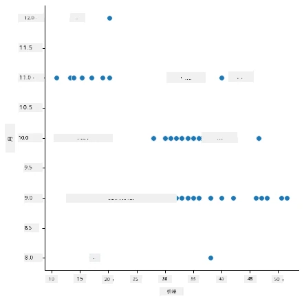
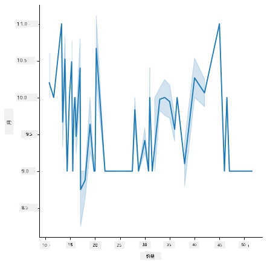
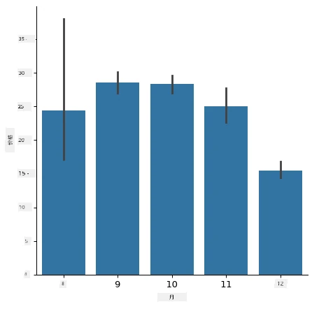
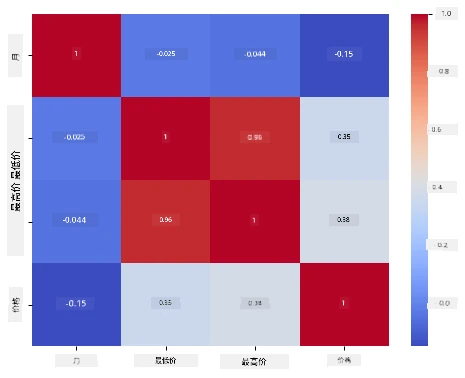

# 使用 Scikit-learn 构建回归模型：准备和可视化数据


信息图由 [Dasani Madipalli](https://twitter.com/dasani_decoded) 制作

## [课前测验](https://ff-quizzes.netlify.app/en/ml/)

> ### [本课程也提供 R 语言版本！](../../../../2-Regression/2-Data/solution/R/lesson_2.html)

## 简介

现在你已经准备好使用 Scikit-learn 进行机器学习模型构建的工具，能够开始对数据提出问题了。在处理数据并应用机器学习解决方案时，理解如何提出正确的问题以充分发挥数据集潜力非常重要。

本课你将学习：

- 如何为模型构建准备数据。
- 如何使用 Matplotlib 进行数据可视化。
- 如何使用 Seaborn 进行更具表现力的数据可视化。

## 向数据提出正确的问题

你需要回答的问题将决定你采用哪种类型的机器学习算法。而你得到答案的质量很大程度上取决于数据的性质。

看看本课提供的[数据](https://github.com/microsoft/ML-For-Beginners/blob/main/2-Regression/data/US-pumpkins.csv)。你可以在 VS Code 中打开这个 .csv 文件。快速浏览发现有空白项和字符串与数字混杂的数据。还有一个奇怪的名为“Package”的列，它的数据混杂着“sacks”、“bins”和其它值。实际上这些数据有点乱。

[](https://youtu.be/5qGjczWTrDQ "初学者机器学习 - 如何分析和清洗数据集")

> 🎥 点击上图观看本课数据准备过程的简短视频。

实际上，开箱即用且完全准备好的数据集进行机器学习建模并不常见。在本课中，你将学习如何使用标准 Python 库来准备原始数据集，也会学习多种数据可视化技术。

## 案例研究：“南瓜市场”

在本文件夹的根目录 `data` 目录下，有一个名为 [US-pumpkins.csv](https://github.com/microsoft/ML-For-Beginners/blob/main/2-Regression/data/US-pumpkins.csv) 的 .csv 文件，包含了关于南瓜市场的 1757 行数据，按城市分组排序。这是从美国农业部发布的[特色农产品终端市场标准报告](https://www.marketnews.usda.gov/mnp/fv-report-config-step1?type=termPrice)中提取的原始数据。

### 准备数据

这些数据属于公共领域，可以从 USDA 网站按城市下载多个单独文件。为避免过多文件，我们已将所有城市数据合并为一个表格，因此已经对数据做了一些_准备_。接下来，仔细看看数据。

### 南瓜数据 —— 初步结论

你注意到这数据有什么吗？你已经看到字符串、数字、空白和奇怪的值混杂，需要理清。

使用回归技术，你能针对这数据提出什么问题？比如“预测某个月份中南瓜的售价”。再看数据，需要做一些改动以创建任务所需的数据结构。
## 练习 —— 分析南瓜数据

我们采用 [Pandas](https://pandas.pydata.org/)（意为“Python 数据分析”）这款对数据整形非常有用的工具，来分析并准备这份南瓜数据。

### 首先，检查缺失日期

你首先需要做的步骤是检查是否有缺失日期：

1. 将日期转换为月份格式（这是美国日期格式，格式为 `MM/DD/YYYY`）。
2. 将月份提取到新列。

在 Visual Studio Code 中打开 _notebook.ipynb_ 文件，并导入电子表格到新的 Pandas 数据框。

1. 使用 `head()` 函数查看前五行。

    ```python
    import pandas as pd
    pumpkins = pd.read_csv('../data/US-pumpkins.csv')
    pumpkins.head()
    ```

    ✅ 你会用什么函数查看最后五行？

1. 检查当前数据框中是否有缺失数据：

    ```python
    pumpkins.isnull().sum()
    ```

    有缺失数据，但可能对当前任务影响不大。

1. 为简化操作，只选取需要的列，使用 `loc` 函数从原始数据框中提取一组行（作为第一个参数）和列（作为第二个参数）。下面表达式中的 `:` 表示“所有行”。

    ```python
    columns_to_select = ['Package', 'Low Price', 'High Price', 'Date']
    pumpkins = pumpkins.loc[:, columns_to_select]
    ```

### 其次，确定南瓜的平均价格

思考如何确定某月份南瓜的平均价格。为此你会选取哪些列？提示：你需要三列。

解决方案：取 `Low Price` 和 `High Price` 两列的平均数填充新建的 Price 列，并将 Date 列只显示月份。幸运的是，根据上面的检查，日期和价格数据中没有缺失项。

1. 计算平均值，添加如下代码：

    ```python
    price = (pumpkins['Low Price'] + pumpkins['High Price']) / 2

    month = pd.DatetimeIndex(pumpkins['Date']).month

    ```

   ✅ 你可以随意用 `print(month)` 打印数据检查。

2. 现在，将转换后的数据复制到一个新的 Pandas 数据框中：

    ```python
    new_pumpkins = pd.DataFrame({'Month': month, 'Package': pumpkins['Package'], 'Low Price': pumpkins['Low Price'],'High Price': pumpkins['High Price'], 'Price': price})
    ```

    打印数据框会显示一个干净、整齐的数据集，可用来构建你的新回归模型。

### 但等等！这里有点奇怪

查看 `Package` 列发现，南瓜以多种方式出售。有的以“1 1/9 斗”计量，有的以“1/2 斗”计量，有的是按个，有的按磅，还有的装在大小不一的箱子中。

> 南瓜似乎很难做到统一称重

深入分析原始数据发现，所有 `Unit of Sale` 为 'EACH' 或 'PER BIN' 的数据，其 `Package` 类型为每英寸、每箱或“每个”。南瓜的标准称重相当复杂，因此我们通过筛选，仅选择 `Package` 列中包含 'bushel' 字符串的南瓜。

1. 在文件顶部原始 .csv 导入后添加筛选：

    ```python
    pumpkins = pumpkins[pumpkins['Package'].str.contains('bushel', case=True, regex=True)]
    ```

    如果现在打印数据，就只看到大约 415 行以“bushel”计量的南瓜数据了。

### 还有一件事要做

你注意到“bushel”数量各行不同吗？需要将价格标准化，使价格表示为每 “bushel” 价格，因此需要做一些数学计算来标准化。

1. 在创建 new_pumpkins 数据框代码块后添加如下行：

    ```python
    new_pumpkins.loc[new_pumpkins['Package'].str.contains('1 1/9'), 'Price'] = price/(1 + 1/9)

    new_pumpkins.loc[new_pumpkins['Package'].str.contains('1/2'), 'Price'] = price/(1/2)
    ```

✅ 根据 [The Spruce Eats](https://www.thespruceeats.com/how-much-is-a-bushel-1389308)，“bushel”的重量取决于农产品种类，因为它是体积单位。“例如，一斗西红柿大约重 56 磅……叶菜占据的空间多但重量轻，所以一斗菠菜只有 20 磅。”这都相当复杂！我们不必将“bushel”转换为磅，而是按“bushel”计价。对南瓜以“bushel”计价的研究说明，了解数据性质非常重要！

现在你可以基于“bushel”计量分析单价。如果再次打印数据，你会看到已标准化的结果。

✅ 你注意到按半斗计价的南瓜非常贵吗？能猜出原因吗？提示：小南瓜比大南瓜贵得多，可能是因为每斗内的小南瓜数量远多于一个大的空心南瓜，空隙占用空间大。

## 可视化策略

数据科学家的职责之一是展示他们所处理数据的质量和特性。为此，他们通常创建有趣的可视化图——包括图形、图表和表格，显示数据的不同方面。通过可视化，他们能够直观展示难以发现的关系和空白。

[](https://youtu.be/SbUkxH6IJo0 "初学者机器学习 - 如何使用 Matplotlib 可视化数据")

> 🎥 点击上图观看本课数据可视化的简短视频。

可视化还帮助确定最适合数据的机器学习技术。例如，散点图呈线性趋势则表明该数据适合线性回归。

一个在 Jupyter notebook 中表现良好的数据可视化库是 [Matplotlib](https://matplotlib.org/)（你在上一课也见过）。

> 想获得更多数据可视化经验，请参阅[这些教程](https://docs.microsoft.com/learn/modules/explore-analyze-data-with-python?WT.mc_id=academic-77952-leestott)。

## 练习 —— 试验 Matplotlib

尝试创建一些基本图表以展示你刚创建的数据框。基本线图会展示什么？

1. 在文件顶部的 Pandas 导入下方导入 Matplotlib：

    ```python
    import matplotlib.pyplot as plt
    ```

1. 重新运行整个 notebook 以刷新。
1. 在 notebook 底部添加一个单元格，以箱线图形式绘制数据：

    ```python
    price = new_pumpkins.Price
    month = new_pumpkins.Month
    plt.scatter(price, month)
    plt.show()
    ```

    

    这是个有用的图吗？图中有什么让你感到意外吗？

    其实，它没多大用处，图中数据仅以点的形式在各月散布。

### 让它有用起来

想让图表展示有用信息，通常需要对数据进行分组。让我们尝试创建一个图，y 轴显示月份，图中显示数据分布情况。

1. 添加单元格创建分组柱状图：

    ```python
    new_pumpkins.groupby(['Month'])['Price'].mean().plot(kind='bar')
    plt.ylabel("Pumpkin Price")
    ```

    

    这是更有用的数据可视化！看似表明南瓜最高价出现在9月和10月。你认同吗？为什么？

## 练习 —— 试验 Seaborn

Matplotlib 功能强大，但绘制精美图表往往需要较多代码。 [Seaborn](https://seaborn.pydata.org/) 是建立在 Matplotlib 之上的库，专为统计数据可视化设计。它直接支持 Pandas 数据框，应用美观默认样式，让你用更少代码创建信息丰富的图表。由于 Seaborn 返回的是 Matplotlib 对象，你仍可运用已有的 Matplotlib 知识精细调整结果。

> 如果还没安装 Seaborn，使用 `pip install seaborn` 安装。

1. 在 notebook 顶部其他导入语句下面导入 Seaborn，惯例用 `sns` 作为别名：

    ```python
    import seaborn as sns
    ```

### 散点图展示关系

构建模型前重要部分是寻找变量间的_关系_。[散点图](https://en.wikipedia.org/wiki/Scatter_plot) 是很好工具：如果点呈线性排列，两变量可能相关，这是线性回归模型有效的好迹象。

1. 重新绘制之前的价格与月份散点图，改用 Seaborn 的 [`relplot()`](https://seaborn.pydata.org/generated/seaborn.relplot.html)（关系图），它直接使用数据框的列：

    ```python
    sns.relplot(x="Price", y="Month", data=new_pumpkins)
    ```

    

    注意这里你传入的是_列名_和数据框，由 Seaborn 自动处理轴标签。

2. 通过传入 `kind="line"` 可切换为折线图。Seaborn 甚至会绘制带有置信区间的阴影带：

    ```python
    sns.relplot(x="Price", y="Month", kind="line", data=new_pumpkins)
    ```

    

    这组数据较为嘈杂，所以折线图不是最清晰的选择——但展示了如何轻松切换 Seaborn 图类型。

### 柱状图展示分布


之前你用手动分组数据来创建了一个 Matplotlib 条形图。Seaborn 的 [`catplot()`](https://seaborn.pydata.org/generated/seaborn.catplot.html)（类别图）可以帮你完成分组和聚合。默认情况下，`kind="bar"` 会显示每个类别的平均值，并用一条黑线表示置信区间。

1. 创建一个按月平均价格的条形图：

    ```python
    sns.catplot(x="Month", y="Price", data=new_pumpkins, kind="bar")
    ```

    

    这验证了你用 Matplotlib 看到的结果——价格在九月和十月达到峰值——但 Seaborn 还可视化了每个月价格的 _变化_ 情况。

### 显示相关性的热力图

散点图一次比较两个变量。当你有多个数值列时，[热力图](https://en.wikipedia.org/wiki/Heat_map)可以一次显示_每对_列之间的关系强度。这是选择输入模型的特征之前，常见的发现哪些特征最相关的方法（同样类型的图表后来也用于显示分类中的混淆矩阵）。

1. 用 Pandas 构建相关矩阵，然后用 Seaborn 的 [`heatmap()`](https://seaborn.pydata.org/generated/seaborn.heatmap.html) 绘制它。`annot=True` 选项会在每个单元格上打印相关系数数值：

    ```python
    correlations = new_pumpkins[['Month', 'Low Price', 'High Price', 'Price']].corr()
    sns.heatmap(correlations, annot=True, cmap="coolwarm")
    ```

    

    接近 `1`（或 `-1`）的值意味着列的 _线性_ 相关性很强。注意 `Low Price` 和 `High Price` 几乎完美相关。另一方面，`Month` 与价格只有较弱的线性相关性——尽管上面的条形图显示了九月和十月明显的季节峰值。这是个重要的教训：相关系数只测量 _直线_ 关系，所以它可能忽略季节性或其他非线性模式。✅ 为什么在决定使用哪些列之前，同时查看热力图<em>和</em>条形图这类图表很有用？

### Matplotlib 还是 Seaborn？

两个库都值得了解：

- **Matplotlib** 让你可以细致控制图表的每个元素，是几乎所有其他 Python 绘图库的基础。
- **Seaborn** 提供更高级的函数和漂亮的默认统计图表样式，直接支持 DataFrame，通常更适合快速进行探索性数据分析。

一个常见的工作流是先用 Seaborn 快速探索数据，之后需要定制细节时切回 Matplotlib。

---

## 🚀挑战

探索 Matplotlib 和 Seaborn 提供的不同类型可视化。哪些类型更适合回归问题？

## [课后测验](https://ff-quizzes.netlify.app/en/ml/)

## 复习与自学

看看各种不同的数据可视化方法。列出各种可用的库，并注明哪些库适合处理特定类型的任务，例如二维可视化 vs. 三维可视化。你的发现是什么？

## 任务

[探索可视化](assignment.md)

---

<!-- CO-OP TRANSLATOR DISCLAIMER START -->
**免责声明**：
本文件由 AI 翻译服务 [Co-op Translator](https://github.com/Azure/co-op-translator) 翻译完成。尽管我们力求准确，但请注意，自动翻译可能包含错误或不准确之处。原始语言版文件应视为权威来源。对于重要信息，建议使用专业人工翻译。我们对因使用本翻译而产生的任何误解或误释不承担责任。
<!-- CO-OP TRANSLATOR DISCLAIMER END -->