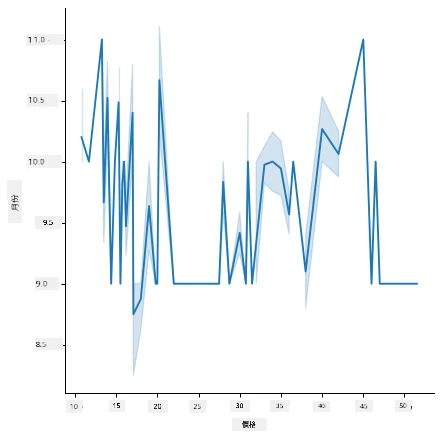
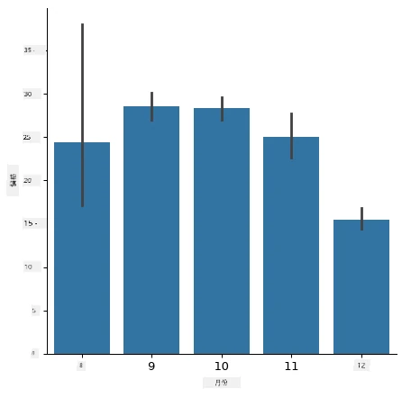

# 使用 Scikit-learn 建立迴歸模型：準備與視覺化數據


資訊圖由 [Dasani Madipalli](https://twitter.com/dasani_decoded) 製作

## [課前測驗](https://ff-quizzes.netlify.app/en/ml/)

> ### [此課程有 R 語言版本！](../../../../2-Regression/2-Data/solution/R/lesson_2.html)

## 介紹

現在你已經準備好所需工具，可以開始使用 Scikit-learn 進行機器學習模型的建立，準備好向你的數據提問。當你處理數據並應用機器學習解決方案時，非常重要的是要了解如何提出正確的問題，才能恰當地發掘數據集的潛力。

在本課程中，你將學習：

- 如何準備數據以建立模型。
- 如何使用 Matplotlib 進行數據視覺化。
- 如何使用 Seaborn 進行更具表現力的數據視覺化。

## 向數據提出正確的問題

你需要回答的問題將決定你會使用哪種類型的機器學習算法。你得到的答案品質，也會很大程度取決於你的數據本質。

看看這課程提供的 [數據](https://github.com/microsoft/ML-For-Beginners/blob/main/2-Regression/data/US-pumpkins.csv)，你可以在 VS Code 中打開這個 .csv 檔案。快速瀏覽會立即發現有空白欄位和字串與數字的混合資料。還有一個奇怪的欄位叫「Package」，裡面混合了「sacks」、「bins」和其他值。事實上，資料狀況有點混亂。

[](https://youtu.be/5qGjczWTrDQ "機器學習入門 - 如何分析與清理資料集")

> 🎥 點擊上圖觀看本課程準備數據的短片教學。

事實上，很少會拿到一個完全準備好可直接用來建立機器學習模型的數據集。在本課中，你將學習如何使用標準 Python 函式庫來準備原始數據集，同時學習多種數據視覺化技巧。

## 個案研究：「南瓜市場」

在此資料夾的根目錄 `data` 裡，有一個名為 [US-pumpkins.csv](https://github.com/microsoft/ML-For-Beginners/blob/main/2-Regression/data/US-pumpkins.csv) 的 .csv 檔案，包含 1757 行關於南瓜市場的數據，依城市分組。這是從美國農業部發布的 [特產作物終端市場標準報告](https://www.marketnews.usda.gov/mnp/fv-report-config-step1?type=termPrice) 中提取的原始資料。

### 數據準備

這些資料屬於公共領域。從 USDA 網站可分城市下載多個獨立檔案。為避免過多分檔，我們已將所有城市數據合併到一份試算表中，因此資料已經做了一點「準備」。接下來，我們深入查看數據本身。

### 南瓜數據：初步結論

你對這些數據有什麼觀察？你已經看到，裡面混合了字串、數字、空白和奇怪的值，需要你去理解。

使用迴歸技術，你可以問數據什麼問題？例如「預測給定月份內南瓜的售價」。再看數據，你需要對結構做一些調整來完成這個任務所需的數據架構。
## 練習 - 分析南瓜數據

我們用 [Pandas](https://pandas.pydata.org/)（意指「Python 數據分析」）這個非常適合整理數據的工具，來分析並準備這份南瓜數據。

### 首先，檢查缺少日期

你需要先進行以下步驟檢查缺少的日期：

1. 將日期轉為月份格式（這裡為美式日期格式，`MM/DD/YYYY`）。
2. 將月份擷取到一個新欄位。

在 Visual Studio Code 中開啟 _notebook.ipynb_ 檔案，並將試算表匯入新的 Pandas 資料框架（dataframe）。

1. 使用 `head()` 函式查看前五行數據。

    ```python
    import pandas as pd
    pumpkins = pd.read_csv('../data/US-pumpkins.csv')
    pumpkins.head()
    ```

    ✅ 你會用什麼函式來查看最後五行？

1. 檢查目前 dataframe 中是否有遺失資料：

    ```python
    pumpkins.isnull().sum()
    ```

    有遺失資料，但可能對當前任務影響不大。

1. 為使 dataframe 更方便操作，使用 `loc` 函式選擇你需要的欄位。此函式從原 dataframe 中擷取列（第一個參數）與欄（第二個參數）。範例中 `:` 表示「所有列」。

    ```python
    columns_to_select = ['Package', 'Low Price', 'High Price', 'Date']
    pumpkins = pumpkins.loc[:, columns_to_select]
    ```

### 第二步，計算南瓜平均價格

思考如何求得某月南瓜的平均價格。你會選哪些欄位？提示：需要 3 個欄位。

解法：將 `Low Price` 與 `High Price` 欄位取平均，填入新的 Price 欄；同時將日期欄位轉換為月份。幸運的是，前面檢查結果顯示日期與價格欄無遺失資料。

1. 計算平均價格，添加以下程式碼：

    ```python
    price = (pumpkins['Low Price'] + pumpkins['High Price']) / 2

    month = pd.DatetimeIndex(pumpkins['Date']).month

    ```

   ✅ 如果想確認數據，可以用 `print(month)` 列印出來檢查。

2. 現在，將轉換後資料複製到新的 Pandas dataframe：

    ```python
    new_pumpkins = pd.DataFrame({'Month': month, 'Package': pumpkins['Package'], 'Low Price': pumpkins['Low Price'],'High Price': pumpkins['High Price'], 'Price': price})
    ```

    列印你的 dataframe，可看到一份乾淨整齊的數據，用於建立迴歸新模型。

### 等等！這裡有點奇怪

看看 `Package` 這欄，南瓜販售方式多樣。有些依「1 1/9 公頃桶」計量，有些是「1/2 公頃桶」，有些按南瓜顆數賣，有些按磅賣，還有用不同寬度的大箱子裝。

> 南瓜似乎很難以統一標準來秤重

深入看原始數據，`Unit of Sale` 欄為 'EACH' 或 'PER BIN' 的記錄裡，`Package` 欄的值往往是按英寸、箱或「個」數量記錄。南瓜很難秤重一致，因此我們先只挑選 `Package` 欄包含「bushel」字串的南瓜篩選出來。

1. 在檔案開頭、csv 匯入後添加過濾器：

    ```python
    pumpkins = pumpkins[pumpkins['Package'].str.contains('bushel', case=True, regex=True)]
    ```

    列印資料可看到僅剩約 415 行以公頃桶銷售的南瓜數據。

### 等等！還有一件事要做

注意公頃桶份數會因列不同而異。你需將價格標準化為每公頃桶價格，做些計算來標準化。

1. 在建立 new_pumpkins dataframe 之後添加這段程式碼：

    ```python
    new_pumpkins.loc[new_pumpkins['Package'].str.contains('1 1/9'), 'Price'] = price/(1 + 1/9)

    new_pumpkins.loc[new_pumpkins['Package'].str.contains('1/2'), 'Price'] = price/(1/2)
    ```

✅ 根據 [The Spruce Eats](https://www.thespruceeats.com/how-much-is-a-bushel-1389308) 的說法，公頃桶的重量依作物種類不同而有差異，因為它是體積單位。例如，一公頃桶番茄重 56 磅……葉菜類空間大但重量輕，所以菠菜一公頃桶約 20 磅。相當複雜！我們不做公頃桶到磅的換算，改按公頃桶計價。但這說明理解數據性質有多重要！

現在可以分析以公頃桶為單位的價格。再列印一次資料，你會看到價格已標準化。

✅ 你注意到按半公頃桶賣的南瓜非常貴嗎？能猜出原因嗎？提示：小南瓜比大南瓜每公頃桶貴許多，可能是因為小南瓜數量多，大南瓜佔據了許多未利用的空間。

## 視覺化策略

資料科學家的部分工作，是展示所處理資料的品質與狀況。他們常利用有趣的視覺化圖像、圖表和曲線圖，呈現資料的不同面向。如此就可以直觀地顯示資料之間的關係與空白，這些往往是難以直接察覺的。

[](https://youtu.be/SbUkxH6IJo0 "機器學習入門 - 如何用 Matplotlib 視覺化數據")

> 🎥 點擊上圖觀看本課程數據視覺化的短片教學。

視覺化也有助於判斷哪種機器學習技術最適合該數據。例如，散佈圖若呈線狀分布，代表資料適合進行線性迴歸。

Jupyter notebook 中常用的數據視覺化函式庫之一是 [Matplotlib](https://matplotlib.org/)（你在上一課也看過）。

> 想獲得更多視覺化經驗，請參考[這些教學](https://docs.microsoft.com/learn/modules/explore-analyze-data-with-python?WT.mc_id=academic-77952-leestott)。

## 練習 - 嘗試 Matplotlib

嘗試創建一些基本圖表來顯示你新建立的 dataframe。基本的線形圖會顯示什麼？

1. 在檔案開頭，Pandas 匯入後，匯入 Matplotlib：

    ```python
    import matplotlib.pyplot as plt
    ```

1. 重新運行整個 notebook 以刷新數據。
1. 在 notebook 底部新增一個儲存格，繪製箱型圖：

    ```python
    price = new_pumpkins.Price
    month = new_pumpkins.Month
    plt.scatter(price, month)
    plt.show()
    ```

    

    這個圖有用嗎？有何驚喜？

    它其實用處不大，因為僅呈現出資料在每月內的分散點。

### 讓它有用一些

要做出有用的圖表，一般要對數據進行分組。試著製作一個圖，y 軸為月份，顯示資料分佈情形。

1. 加一個儲存格，創建分組長條圖：

    ```python
    new_pumpkins.groupby(['Month'])['Price'].mean().plot(kind='bar')
    plt.ylabel("Pumpkin Price")
    ```

    

    這是較有用的視覺化！它顯示南瓜價格九月、十月最高。你的預期符合嗎？為什麼？

## 練習 - 嘗試 Seaborn

Matplotlib 功能強大，但生成精美圖表可能需寫較多代碼。[Seaborn](https://seaborn.pydata.org/) 是建立在 Matplotlib 之上的函式庫，專為統計數據視覺化設計。它直接配合 Pandas dataframe，提供美觀預設樣式，且能用較少代碼創建資訊豐富的圖表。因為 Seaborn 傳回 Matplotlib 物件，你仍可用已有的 Matplotlib 經驗微調結果。

> 如果你還沒有安裝 Seaborn，請用 `pip install seaborn` 安裝。

1. 在 notebook 頂部其他匯入後加入 Seaborn 匯入，習慣用別名 `sns`：

    ```python
    import seaborn as sns
    ```

### 散佈圖展示變數關係

建模前重要的資料探索之一，是尋找變數間的 _關聯性_。[散佈圖](https://en.wikipedia.org/wiki/Scatter_plot) 是最佳工具之一：如果點趨近於一條直線，兩變數可能相關，意味線性迴歸模型可能有效。

1. 使用 Seaborn 的 [`relplot()`](https://seaborn.pydata.org/generated/seaborn.relplot.html)（關係圖）重現先前的價格對月份散佈圖，該函式能直接使用 dataframe 欄位：

    ```python
    sns.relplot(x="Price", y="Month", data=new_pumpkins)
    ```

    

    注意你只傳入 _欄位名稱_ 和 dataframe，Seaborn 能自動處理軸標籤。

2. 可以傳入 `kind="line"` 參數切換成線圖。Seaborn 還會畫出反映線周置信區間的藍色陰影帶：

    ```python
    sns.relplot(x="Price", y="Month", kind="line", data=new_pumpkins)
    ```

    

    該數據較嘈雜，線圖不算最清楚，但示範了如何輕鬆切換 Seaborn 的圖表種類。

### 長條圖顯示分布


早前你親手將數據分組，以 Matplotlib 創建條形圖。Seaborn 的 [`catplot()`](https://seaborn.pydata.org/generated/seaborn.catplot.html)（類別圖）可以為你進行分組和聚合。預設情況下，`kind="bar"` 顯示每個類別的平均值，並帶有一條黑線標示信賴區間。

1. 創建每月平均價格的條形圖：

    ```python
    sns.catplot(x="Month", y="Price", data=new_pumpkins, kind="bar")
    ```

    

    這證實了你用 Matplotlib 看到的情況 — 價格在九月和十月達到高峰 — 但 Seaborn 亦可視化每個月份內價格的 _變異_ 程度。

### 顯示相關性的熱力圖

散點圖一次比較兩個變量。當你有多個數值欄時，[熱力圖](https://en.wikipedia.org/wiki/Heat_map) 能讓你一口氣觀察 _所有_ 欄位對的關係強度。這是選擇用於模型輸入的特徵前，一種常見的識別最相關欄位的方法（而同一類型的圖表稍後會用於顯示分類的混淆矩陣）。

1. 用 Pandas 建立相關矩陣，然後用 Seaborn 的 [`heatmap()`](https://seaborn.pydata.org/generated/seaborn.heatmap.html) 畫出來。`annot=True` 選項會在每個格子裡顯示相關係數：

    ```python
    correlations = new_pumpkins[['Month', 'Low Price', 'High Price', 'Price']].corr()
    sns.heatmap(correlations, annot=True, cmap="coolwarm")
    ```

    

    接近 `1`（或 `-1`）的值意味著欄位間具有強烈的 _線性_ 相關性。注意 `Low Price` 和 `High Price` 幾乎完全相關。另一方面，`Month` 與價格的線性相關性很弱 — 儘管上面的條形圖展現了九月和十月明顯的季節高峰。這是一個重要的教訓：相關係數只衡量 _直線_ 關係，因此可能忽略季節性或其它非線性模式。✅ 為什麼在決定使用哪些欄位前，既看熱力圖 <em>又</em> 看像條形圖這樣的圖表很有用？

### Matplotlib 還是 Seaborn？

兩個庫都值得了解：

- **Matplotlib** 讓你精細控制圖表的每個元素，是幾乎所有其他 Python 繪圖庫的基礎。
- **Seaborn** 提供更高階的函數和吸引人的預設統計圖表樣式，直接支持資料框，且在探索性資料分析時通常更快。

常見工作流程是先用 Seaborn 快速探索數據，再在需要自訂細節時退回 Matplotlib。

---

## 🚀挑戰

探索 Matplotlib 和 Seaborn 提供的不同視覺化類型。哪些類型最適合迴歸問題？

## [課後小測驗](https://ff-quizzes.netlify.app/en/ml/)

## 複習與自學

查看多種資料視覺化方式。列出可用的各種庫，並註明哪些最適合特定任務，如 2D 視覺化與 3D 視覺化。你發現了什麼？

## 作業

[探索視覺化](assignment.md)

---

<!-- CO-OP TRANSLATOR DISCLAIMER START -->
**免責聲明**：
本文件由 AI 翻譯服務 [Co-op Translator](https://github.com/Azure/co-op-translator) 翻譯而成。雖然我們致力於確保準確性，但請注意，機器自動翻譯可能包含錯誤或不準確之處。原始文件的母語版本應被視為權威來源。對於重要資訊，建議進行專業人工翻譯。我們不對因使用本翻譯而產生的任何誤解或誤釋承擔責任。
<!-- CO-OP TRANSLATOR DISCLAIMER END -->