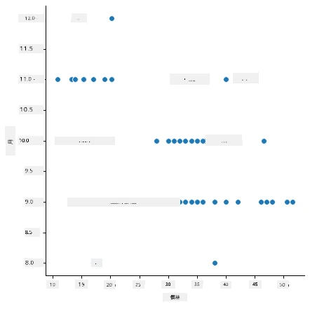
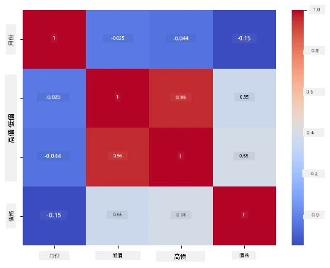

# 使用 Scikit-learn 建立迴歸模型：準備與視覺化數據


資訊圖由 [Dasani Madipalli](https://twitter.com/dasani_decoded) 提供

## [課前小測](https://ff-quizzes.netlify.app/en/ml/)

> ### [本課程也提供 R 版本！](../../../../2-Regression/2-Data/solution/R/lesson_2.html)

## 簡介

現在你已經準備好了開始使用 Scikit-learn 進行機器學習模型構建所需的工具，可以開始對你的數據提出問題。在處理數據並應用機器學習解決方案時，了解如何提出正確的問題以充分發掘資料潛力是非常重要的。

在本課程中，你將學習：

- 如何準備數據以用於模型建構。
- 如何使用 Matplotlib 進行數據視覺化。
- 如何使用 Seaborn 進行更具表現力的數據視覺化。

## 對數據提出正確的問題

你需要回答的問題會決定你將使用哪種類型的機器學習算法。且你得到的答案品質很大程度上取決於數據的特性。

請看看本課程所提供的 [數據](https://github.com/microsoft/ML-For-Beginners/blob/main/2-Regression/data/US-pumpkins.csv)。你可以在 VS Code 中打開這個 .csv 檔案。快速瀏覽會發現有空白，以及字串和數字資料混合。還有一個奇怪的欄位叫做 'Package'，裡面的資料混雜了 'sacks'、'bins' 和其他值。這些資料實際上有些混亂。

[](https://youtu.be/5qGjczWTrDQ "機器學習入門-如何分析與清理數據集")

> 🎥 點擊上方圖片觀看簡短影片，講解本課程數據準備過程。

事實上，直接拿到一個完全準備好用於建立機器學習模型的數據集並不常見。在本課程中，你將學習如何使用標準 Python 函式庫準備原始數據集，並學習各種視覺化數據的技巧。

## 案例研究：“南瓜市場”

在此資料夾的根目錄 `data` 中，你會找到一個名為 [US-pumpkins.csv](https://github.com/microsoft/ML-For-Beginners/blob/main/2-Regression/data/US-pumpkins.csv) 的 .csv 檔，包含 1757 行關於南瓜市場的數據，依城市分組。這是從美國農業部發布的 [Specialty Crops Terminal Markets Standard Reports](https://www.marketnews.usda.gov/mnp/fv-report-config-step1?type=termPrice) 中提取的原始資料。

### 準備數據

此數據位於公共領域。可從 USDA 網站依城市分別下載多個檔案。為避免過多分檔，我們已將所有城市數據合併成一個試算表，因此已稍微 _準備_ 過數據。接下來，讓我們更細緻地檢視數據。

### 南瓜數據 - 初步結論

你注意到什麼？你已看到字串、數字、空白和奇怪值混雜，需要去理解它們。

你可以用迴歸技術對這組資料提出什麼問題？例如「預測特定月份南瓜的銷售價格」？再看看資料，有些變動必須做才能建立任務所需的數據結構。
## 練習 - 分析南瓜數據

讓我們使用 [Pandas](https://pandas.pydata.org/)（意指 `Python Data Analysis`）—一個非常適合塑形數據的工具—來分析與準備這份南瓜數據。

### 首先，檢查缺少的日期

你需要先進行以下步驟檢查缺少的日期：

1. 將日期轉換為月份格式（這是美國日期格式，為 `MM/DD/YYYY`）。
2. 將月份提取到新的欄位。

在 Visual Studio Code 中開啟 _notebook.ipynb_ 檔案，並將試算表導入新的 Pandas dataframe。

1. 使用 `head()` 函式查看前五行。

    ```python
    import pandas as pd
    pumpkins = pd.read_csv('../data/US-pumpkins.csv')
    pumpkins.head()
    ```

    ✅ 你會用什麼函式來查看最後五行？

1. 檢查目前 dataframe 是否有缺資料：

    ```python
    pumpkins.isnull().sum()
    ```

    有缺資料，但可能對目前任務無大礙。

1. 為了讓 dataframe 更易於操作，使用 `loc` 函式選擇你需要的欄位。該函式會從原始 dataframe 中依參數抽取一組列（第一參數）和欄（第二參數）。“:” 表示「所有列」。

    ```python
    columns_to_select = ['Package', 'Low Price', 'High Price', 'Date']
    pumpkins = pumpkins.loc[:, columns_to_select]
    ```

### 其次，計算南瓜平均價格

想想如何計算特定月份南瓜的平均價格。你會挑選哪些欄位？提示：你會需要三個欄位。

解法：取 `Low Price` 和 `High Price` 欄的平均值填入新 `Price` 欄，再將 `Date` 欄只顯示月份。幸好根據先前檢查，日期與價格無缺失資料。

1. 計算平均值時，加入下列程式碼：

    ```python
    price = (pumpkins['Low Price'] + pumpkins['High Price']) / 2

    month = pd.DatetimeIndex(pumpkins['Date']).month

    ```

   ✅ 你也可以用 `print(month)` 印出來檢查想看的資料。

2. 現在，將轉換後的資料複製到新的 Pandas dataframe：

    ```python
    new_pumpkins = pd.DataFrame({'Month': month, 'Package': pumpkins['Package'], 'Low Price': pumpkins['Low Price'],'High Price': pumpkins['High Price'], 'Price': price})
    ```

    印出你的 dataframe，你會看到一個乾淨、整齊的數據集，可以用來建立新的迴歸模型。

### 稍等！這兒有點奇怪

看 `Package` 欄，南瓜有許多不同包裝。有些是以「1 1/9蒲式耳」計算，有些是「1/2蒲式耳」，有些是按南瓜顆數，有些是按磅計，有些裝在寬度不同的大箱子中。

> 南瓜似乎很難一致地稱重

仔細研究原始資料，`Unit of Sale` 為 'EACH' 或 'PER BIN' 的數據，`Package` 一欄也是按英寸、箱或顆計量。南瓜很難一致稱重，因此我們用篩選條件，僅選出 `Package` 欄含有 "bushel" 描述的南瓜。

1. 在檔案頂端（初次導入 .csv 之下）加入篩選：

    ```python
    pumpkins = pumpkins[pumpkins['Package'].str.contains('bushel', case=True, regex=True)]
    ```

    現在印出數據，你會看到大約只有 415 行包含蒲式耳計價的南瓜。

### 稍候！還有一件事

你注意到蒲式耳數量是逐行變化的嗎？你需要將價格標準化，統一以蒲式耳為單位，因此要做些計算來標準化價格。

1. 在建立 new_pumpkins dataframe 區塊後加入這些程式碼：

    ```python
    new_pumpkins.loc[new_pumpkins['Package'].str.contains('1 1/9'), 'Price'] = price/(1 + 1/9)

    new_pumpkins.loc[new_pumpkins['Package'].str.contains('1/2'), 'Price'] = price/(1/2)
    ```

✅ 根據 [The Spruce Eats](https://www.thespruceeats.com/how-much-is-a-bushel-1389308) 的說法，蒲式耳重量依農產類型而異，因為那是體積單位。「例如，一蒲式耳蕃茄重 56 磅……葉菜類因佔空間多而重量輕，例如一蒲式耳菠菜僅 20 磅。」這很複雜！我們不考慮蒲式耳和磅的轉換，而直接以蒲式耳定價。這樣對南瓜蒲式耳的研究，就是要提醒你理解數據本質的重要性！

現在你能按照蒲式耳單位分析價格。若再印出資料，你會看到已被標準化。

✅ 你有注意到半蒲式耳販售的南瓜非常昂貴嗎？能猜出原因嗎？提示：小南瓜比大南瓜貴很多，可能因為一蒲式耳內裝小南瓜數量多，而大中空派南瓜佔用未利用空間。

## 視覺化策略

數據科學家的一部分工作就是展示他們處理資料的質量與特性。為此，他們常會製作有趣的視覺化圖表，如圖形、圖表和圖形，展現數據各面向。如此能讓人視覺化呈現關聯與空白，這些通常難以發現。

[](https://youtu.be/SbUkxH6IJo0 "機器學習入門-如何用 Matplotlib 視覺化數據")

> 🎥 點擊圖片觀看簡短影片，示範本課程中數據視覺化。

視覺化也有助於判斷最適合資料的機器學習技術。例如若散佈圖看似線性，表示資料適合線性迴歸。

一個在 Jupyter 筆記本中適用的數據視覺化函式庫是 [Matplotlib](https://matplotlib.org/)（你在上一堂課也見過）。

> 在 [這些教學](https://docs.microsoft.com/learn/modules/explore-analyze-data-with-python?WT.mc_id=academic-77952-leestott) 中可獲得更多數據視覺化經驗。

## 練習 - 嘗試使用 Matplotlib

嘗試建立一些基本圖表來顯示你剛建立的新 dataframe。基本折線圖顯示什麼？

1. 在檔案頂端於 Pandas 導入下方加入 Matplotlib：

    ```python
    import matplotlib.pyplot as plt
    ```

1. 重新執行整個筆記本來刷新。
1. 在筆記本底部新增一個程式碼區塊，畫出箱型圖：

    ```python
    price = new_pumpkins.Price
    month = new_pumpkins.Month
    plt.scatter(price, month)
    plt.show()
    ```

    

    這是有用的圖表嗎？有什麼讓你驚訝嗎？

    它並不特別有用，因為它只是將你資料以點的形式散佈在月份中。

### 讓它更有用

要讓圖表呈現有用的數據，通常需要以某種方式對數據分組。讓我們試著建立以月份為 y 軸，顯示數據分布的圖表。

1. 新增程式碼區建立分組條形圖：

    ```python
    new_pumpkins.groupby(['Month'])['Price'].mean().plot(kind='bar')
    plt.ylabel("Pumpkin Price")
    ```

    

    這是更有用的資料視覺化！它似乎表示九月和十月的南瓜價格最高。符合你的預期嗎？為什麼或為什麼不？

## 練習 - 嘗試使用 Seaborn

Matplotlib 很強大，但可能要寫很多程式碼才能產出精美圖表。[Seaborn](https://seaborn.pydata.org/) 是建立在 Matplotlib 之上的專為統計數據視覺化設計的函式庫。它直接使用 Pandas dataframe，採用吸引人的預設樣式，並能用更少的程式碼創建信息豐富的圖表。因為 Seaborn 回傳 Matplotlib 物件，故你仍可用已掌握的 Matplotlib 知識調整結果。

> 如果你還沒安裝 Seaborn，請用 `pip install seaborn` 安裝。

1. 在筆記本頂端於其他導入下方加入 Seaborn，慣例名稱為 `sns`：

    ```python
    import seaborn as sns
    ```

### 散佈圖顯示關係

在建立模型前探索資料的一大重要步驟是尋找變數之間的 _關聯_。散佈圖是最佳工具之一：若點集看似沿線排列，表示兩變數可能相關，是使用線性迴歸模型的好跡象。

1. 重新利用 Seaborn 的 [`relplot()`](https://seaborn.pydata.org/generated/seaborn.relplot.html)（關係圖）重繪價格與月份的散佈圖，此函式直接操作你的 dataframe 欄位：

    ```python
    sns.relplot(x="Price", y="Month", data=new_pumpkins)
    ```

    

    注意你傳入的是 _欄位名稱_ 及 dataframe，Seaborn 幫你標示軸標籤。

2. 傳入 `kind="line"` 可改成折線圖。Seaborn 還會繪製一個顯示信賴區間的陰影帶：

    ```python
    sns.relplot(x="Price", y="Month", kind="line", data=new_pumpkins)
    ```

    

    這組資料雜訊較多，因此折線圖不是最清晰的選擇 — 但它展示了如何輕鬆更換 Seaborn 的圖表類型。

### 條形圖顯示分布


之前你用手動分組的方式，利用 Matplotlib 製作了一個長條圖。Seaborn 的 [`catplot()`](https://seaborn.pydata.org/generated/seaborn.catplot.html)（分類圖）可以幫你處理分組和聚合。預設 `kind="bar"` 會顯示每個類別的平均值，並以黑線標示信賴區間。

1. 建立一個每月平均價格的長條圖：

    ```python
    sns.catplot(x="Month", y="Price", data=new_pumpkins, kind="bar")
    ```

    

    這確認了你用 Matplotlib 時看到的結果──價格在九月和十月達到高峰──但 Seaborn 也展示了每個月價格的_變異_情況。

### 熱力圖顯示相關性

散點圖是比較兩個變數。但當你有多個數值欄時，[熱力圖](https://en.wikipedia.org/wiki/Heat_map)可以同時顯示_每一組_欄位間的關聯強度。這是在選擇要輸入模型的特徵前，找出最相關欄位的常見方式（之後在分類中也會用類似圖表呈現混淆矩陣）。

1. 用 Pandas 建立相關矩陣，然後用 Seaborn 的 [`heatmap()`](https://seaborn.pydata.org/generated/seaborn.heatmap.html) 繪製。`annot=True` 選項會在每格中印出相關數值：

    ```python
    correlations = new_pumpkins[['Month', 'Low Price', 'High Price', 'Price']].corr()
    sns.heatmap(correlations, annot=True, cmap="coolwarm")
    ```

    

    數值接近 `1`（或 `-1`）代表欄位間是強烈的_線性_相關。注意 `Low Price` 和 `High Price` 幾乎完美相關。另一方面，`Month` 和價格呈現的線性相關性很弱──即使上述長條圖顯示了九月和十月有明顯的季節性高峰。這是個重要的教訓：相關係數只衡量_直線_關係，因此會忽略季節性或其他非線性模式。✅ 為什麼在決定使用哪些欄前，同時查看熱力圖<em>和</em>像長條圖這種圖形是有用的？

### Matplotlib 或 Seaborn？

兩個函式庫都值得學習：

- **Matplotlib** 讓你能精細控制圖表每個元素，是幾乎所有其他 Python 繪圖函式庫的基礎。
- **Seaborn** 提供較高階的函式和吸引人的預設統計圖表，能直接操作資料框，且通常更快速用於探索性資料分析。

一般工作流程是先用 Seaborn 快速探索資料，當需要細部自訂時再使用 Matplotlib。

---

## 🚀挑戰

探索 Matplotlib 和 Seaborn 提供的不同視覺化類型。哪些類型最適合回歸問題？

## [課後測驗](https://ff-quizzes.netlify.app/en/ml/)

## 複習與自修

認識各種視覺化資料的方法，列出不同的函式庫，並註明它們各自在任務類型上的最佳用途，例如 2D 視覺化與 3D 視覺化。你有什麼發現？

## 作業

[探索視覺化](assignment.md)

---

<!-- CO-OP TRANSLATOR DISCLAIMER START -->
**免責聲明**：
本文件使用 AI 翻譯服務 [Co-op Translator](https://github.com/Azure/co-op-translator) 進行翻譯。雖然我們力求準確，但請注意，自動翻譯可能包含錯誤或不準確之處。原始文件的母語版本應被視為權威來源。對於重要資訊，建議尋求專業人工翻譯。我們不對因使用本翻譯而引起的任何誤解或曲解承擔責任。
<!-- CO-OP TRANSLATOR DISCLAIMER END -->