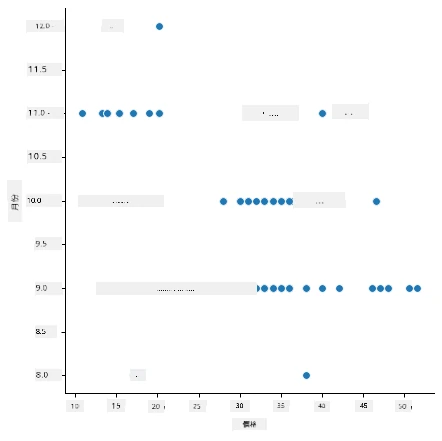
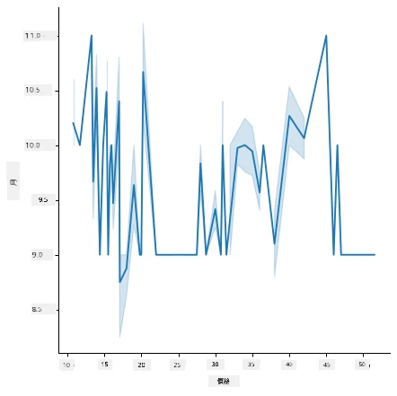
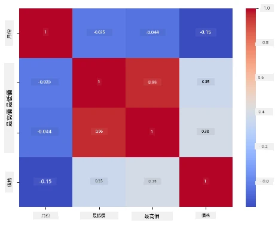

# 使用 Scikit-learn 建立迴歸模型：準備及視覺化資料


資訊圖表由 [Dasani Madipalli](https://twitter.com/dasani_decoded) 製作

## [課前測驗](https://ff-quizzes.netlify.app/en/ml/)

> ### [本課程版本亦有提供 R 語言！](../../../../2-Regression/2-Data/solution/R/lesson_2.html)

## 課程介紹

現在你已經安裝好開始使用 Scikit-learn 建置機器學習模型所需的工具，便可以開始探究資料中的問題了。當你操作資料並應用 ML 解決方案時，理解如何提出正確的問題以妥善開發資料潛力，是非常重要的。

在本課程中，你將學到：

- 如何準備你的資料以用於模型建立。
- 如何使用 Matplotlib 進行資料視覺化。
- 如何使用 Seaborn 進行更具表現力的資料視覺化。

## 對資料提出正確的問題

你需要解決的問題將決定你會採用哪種類型的機器學習演算法。而你得到答案的品質很大程度取決於你的資料性質。

請看本課使用的 [資料](https://github.com/microsoft/ML-For-Beginners/blob/main/2-Regression/data/US-pumpkins.csv)。你可以在 VS Code 中開啟此 .csv 檔。快速瀏覽後，會發現裡面有空白欄位，以及字串與數字資料混合。此外還有一欄奇怪的「Package」欄位，裡面的資料是「sacks」、「bins」及其他值混雜。事實上，這資料有點亂。

[](https://youtu.be/5qGjczWTrDQ "ML 新手 - 如何分析與清理資料集")

> 🎥 點擊上方圖片觀看短片，示範本課如何準備資料。

事實上，通常不會直接拿到一組完全就緒可用來建立 ML 模型的資料集。在本課，你將學習如何使用標準 Python 函式庫準備原始資料。也會了解多種資料視覺化技巧。

## 案例研究：「南瓜市場」

在本資料夾的根目錄 `data` 裡，有一個名為 [US-pumpkins.csv](https://github.com/microsoft/ML-For-Beginners/blob/main/2-Regression/data/US-pumpkins.csv) 的 .csv 檔案，包含 1757 行關於美國南瓜市場的資料，依城市分組排序。這是從美國農業部發布的 [Specialty Crops Terminal Markets Standard Reports](https://www.marketnews.usda.gov/mnp/fv-report-config-step1?type=termPrice) 取得的原始資料。

### 資料準備

這些資料屬於公有領域，能從美國農業部網站分城市以多個檔案下載。為避免太多分散檔案，我們已將所有城市的資料合併到一個活頁簿中，換句話說，我們已稍作「預備」。接著，我們仔細檢視這些資料。

### 南瓜資料 - 初步結論

你對這些資料有什麼觀察？你已看到它混合了字串、數字、空值及怪異的資料，需要分析清楚。

你能用迴歸方法，對此資料提出什麼問題？試想「預測某月份南瓜的售價」。再看資料，你需要先做幾個調整，製作出適合此任務的資料結構。
## 練習 - 分析南瓜資料

我們來用 [Pandas](https://pandas.pydata.org/)（名稱代表 `Python Data Analysis`）這個相當實用的資料整理工具，分析並準備這份南瓜資料。

### 首先，檢查是否有缺少的日期

你需要先採取以下步驟檢查資料中是否缺少日期：

1. 將日期轉換成月份格式（這是美國日期，格式為 `MM/DD/YYYY`）。
2. 從中擷取月份並存到新欄位。

在 Visual Studio Code 中開啟 _notebook.ipynb_ 檔，並將活頁簿導入新 Pandas dataframe。

1. 使用 `head()` 函數查看前五列。

    ```python
    import pandas as pd
    pumpkins = pd.read_csv('../data/US-pumpkins.csv')
    pumpkins.head()
    ```

    ✅ 若想看最後五列資料，應用什麼函數？

1. 檢查目前 dataframe 中是否有缺少資料：

    ```python
    pumpkins.isnull().sum()
    ```

    資料中有缺值，但或許對這任務不造成影響。

1. 為讓 dataframe 使用更方便，使用 `loc` 函數選取所需欄位，該函數從原始 dataframe 選出一群列（作為第一參數）與欄（第二參數）。範例中 `:` 表示「所有列」。

    ```python
    columns_to_select = ['Package', 'Low Price', 'High Price', 'Date']
    pumpkins = pumpkins.loc[:, columns_to_select]
    ```

### 第二步，計算南瓜平均價格

思考如何算出某月份南瓜的平均價格。你會選哪幾個欄位？提示：需要三個欄位。

解法：用 `Low Price` 與 `High Price` 欄位平均數填入新欄 Price，並將 Date 欄只保留月份。幸運的是，前述檢查結果顯示日期和價格欄位無缺值。

1. 計算平均價格，加入以下程式碼：

    ```python
    price = (pumpkins['Low Price'] + pumpkins['High Price']) / 2

    month = pd.DatetimeIndex(pumpkins['Date']).month

    ```

   ✅ 你可以用 `print(month)` 印出資料以檢查。

2. 接著，把轉換後的資料複製到一個新的 Pandas dataframe：

    ```python
    new_pumpkins = pd.DataFrame({'Month': month, 'Package': pumpkins['Package'], 'Low Price': pumpkins['Low Price'],'High Price': pumpkins['High Price'], 'Price': price})
    ```

    印出 dataframe 就會見到整齊清爽的資料集，可以用來建立你的迴歸模型。

### 等等！這裡有點怪異

若你查看 `Package` 欄位，南瓜的銷售形式有許多不同。部分以「1 1/9 公升」計量，部分是「1/2 公升」，有些是每顆販售，有些按磅計價，還有些放在寬度不一的大箱裡販售。

> 南瓜似乎很難有一致的計重方式

深入查看原始資料，凡 `Unit of Sale` 值為「EACH」或「PER BIN」者，`Package` 欄位都會以每英寸、每箱或「each」計。不過南瓜很難有固定的磅重，因此我們以「bushel」字串篩選，只挑選出以「bushel」售賣的南瓜。

1. 在檔案起始，csv 導入後，加入篩選條件：

    ```python
    pumpkins = pumpkins[pumpkins['Package'].str.contains('bushel', case=True, regex=True)]
    ```

    若你此時印出資料，可看到剩余約 415 筆以 bushel 計價的南瓜資料。

### 等等！還有一件事

你有注意到不同列的 bushel 數量有差異嗎？你需要標準化價格，算出每 bushel 的價格，必須做些運算讓資料統一。

1. 在建立 new_pumpkins dataframe 的程式碼塊後，加入這些程式碼：

    ```python
    new_pumpkins.loc[new_pumpkins['Package'].str.contains('1 1/9'), 'Price'] = price/(1 + 1/9)

    new_pumpkins.loc[new_pumpkins['Package'].str.contains('1/2'), 'Price'] = price/(1/2)
    ```

✅ 根據 [The Spruce Eats](https://www.thespruceeats.com/how-much-is-a-bushel-1389308) 的說明，bushel 是一種體積單位，重量依作物不同而有差異。舉例而言，「一 bushel 西紅柿大約重 56 磅……青葉類體積大但重量少，因此一 bushel 菠菜約 20 磅。」這相當複雜！我們不打算作 bushel 與磅的轉換，改以每 bushel 價格計算。對南瓜的這些研究，也凸顯理解資料本質的重要性！

現在，你可以根據 bushel 這個單位分析南瓜價格。再印出一次資料，即可看到標準化後的結果。

✅ 你注意到半 bushel 售價特別高嗎？你能猜出原因嗎？提示：小南瓜單價較高，因為半 bushel 中小顆數量較多，而大顆中間有空洞，使用空間較浪費。

## 資料視覺化策略

資料科學家的工作之一是展現所處理資料的品質與性質。為此，他們會製作有趣的圖表、繪圖、圖形和圖表，展示資料的不同面貌。透過視覺化，他們能以直觀方式呈現關聯與缺口，這些關聯否則難以發現。

[](https://youtu.be/SbUkxH6IJo0 "ML 新手 - 如何使用 Matplotlib 視覺化資料")

> 🎥 點擊上方圖片觀看短片，示範本課如何視覺化資料。

視覺化也有助於辨別最適合資料的機器學習方法。舉例來說，一個看來呈線狀分布的散點圖，表明資料較適合用線性迴歸。

一款在 Jupyter notebook 中表現良好的資料視覺化函式庫是 [Matplotlib](https://matplotlib.org/)（你在上一課也見過）。

> 想深入體驗資料視覺化，請參閱[這些教程](https://docs.microsoft.com/learn/modules/explore-analyze-data-with-python?WT.mc_id=academic-77952-leestott)。

## 練習 - 試試 Matplotlib

嘗試製作一些基本圖形，顯示你剛建立的新 dataframe。簡單的折線圖會呈現什麼結果？

1. 在檔案頂部，在 Pandas 導入後面，導入 Matplotlib：

    ```python
    import matplotlib.pyplot as plt
    ```

1. 重新執行整個 notebook 以更新。
1. 在 notebook 底部新增儲存格，以箱形圖來繪製資料：

    ```python
    price = new_pumpkins.Price
    month = new_pumpkins.Month
    plt.scatter(price, month)
    plt.show()
    ```

    

    這圖有用嗎？你覺得有什麼令人驚訝的地方嗎？

    其實用途有限，因為它只把資料以點狀分布表現在某月份。

### 讓它有用起來

通常，為了讓圖表呈現有用資訊，你需要對資料做某種分組。讓我們嘗試做一張 y 軸表示月份，並展示資料分布的圖表。

1. 新增儲存格，建立分組長條圖：

    ```python
    new_pumpkins.groupby(['Month'])['Price'].mean().plot(kind='bar')
    plt.ylabel("Pumpkin Price")
    ```

    

    這是比較有用的資料視覺化！貌似最高南瓜價格出現在九月與十月。和你的預期吻合嗎？為什麼？

## 練習 - 嘗試 Seaborn

Matplotlib 很厲害，但繪製精美圖表程式碼量通常不少。[Seaborn](https://seaborn.pydata.org/) 是構建在 Matplotlib 之上的函式庫，專為統計資料視覺化而設計。它可直接與 Pandas dataframe 配合，提供漂亮的預設樣式，使你能用更少程式碼創建資訊豐富的圖表。而且因為 Seaborn 回傳的是 Matplotlib 物件，你仍可以用 Matplotlib 的方法微調結果。

> 若你尚未安裝 Seaborn，請用 `pip install seaborn` 安裝。

1. 在 notebook 頂部，其他導入後，導入 Seaborn。習慣以 `sns` 為代號：

    ```python
    import seaborn as sns
    ```

### 散點圖示變數間關係

建模型前，探索資料一大部分是尋找變數的 _關聯_。散點圖是最佳工具之一。如果點狀分布有線狀趨勢，兩項變數可能相關，說明線性迴歸模型有望適用。

1. 使用 Seaborn 的 [`relplot()`](https://seaborn.pydata.org/generated/seaborn.relplot.html)（關係圖）重製之前的月價散點圖。它直接使用 dataframe 欄位：

    ```python
    sns.relplot(x="Price", y="Month", data=new_pumpkins)
    ```

    

    注意你只要傳入 _欄位名稱_ 與 dataframe，Seaborn 會自動處理軸標籤。

2. 傳入 `kind="line"` 參數即可切換成折線圖。Seaborn 甚至會繪製一條代表信賴區間的陰影帶：

    ```python
    sns.relplot(x="Price", y="Month", kind="line", data=new_pumpkins)
    ```

    

    這組資料干擾比較大，所以折線圖不一定是最佳選擇──但也說明你用 Seaborn 改變圖表類型的方便性。

### 長條圖示分布情形


之前你用手動分組的方式，利用 Matplotlib 製作長條圖。Seaborn 的 [`catplot()`](https://seaborn.pydata.org/generated/seaborn.catplot.html)（分類圖）可以幫你完成分組與匯總。預設的 `kind="bar"` 顯示每個類別的平均值，並用黑線標示信賴區間。

1. 建立每月平均價格的長條圖：

    ```python
    sns.catplot(x="Month", y="Price", data=new_pumpkins, kind="bar")
    ```

    

    這與你用 Matplotlib 看到的結果相符 — 價格在九月和十月飆升 — 同時 Seaborn 也將每個月內價格的 _變異_ 可視化。

### 熱圖顯示相關性

散點圖是比較兩個變數的方式。當你有多個數值欄位時，[熱圖](https://en.wikipedia.org/wiki/Heat_map) 讓你能一次查看 _每一對_ 欄位間關係的強度。這常用於挑選要餵進模型的特徵前的相關性探查（分類時同樣的圖也用於顯示混淆矩陣）。

1. 用 Pandas 建立相關係數矩陣，然後用 Seaborn 的 [`heatmap()`](https://seaborn.pydata.org/generated/seaborn.heatmap.html) 繪製。`annot=True` 選項會在每個儲存格印出相關值：

    ```python
    correlations = new_pumpkins[['Month', 'Low Price', 'High Price', 'Price']].corr()
    sns.heatmap(correlations, annot=True, cmap="coolwarm")
    ```

    

    接近 `1`（或 `-1`）的值代表欄位間有強烈 _線性_ 相關。注意 `Low Price` 和 `High Price` 幾乎完美相關。另一方面，`Month` 與價格的線性相關較弱 — 儘管前面長條圖清楚顯示九月和十月有明顯季節高峰。這是一個重要的教訓：相關係數只衡量 _直線_ 關係，因此可能漏掉季節性或其他非線性模式。✅ 為什麼決定用哪些欄位前，同時看熱圖 <em>和</em> 長條圖很有用？

### Matplotlib 還是 Seaborn？

兩個函式庫都值得了解：

- **Matplotlib** 提供對圖表每個元素的細緻控制，且幾乎所有 Python 繪圖庫都建立於其基礎上。
- **Seaborn** 提供更高階的統計圖函式及吸睛的預設值，能直接操作資料框，常用於快速探索性資料分析。

一個常見工作流程是先用 Seaborn 快速探索資料，需求細節自定義時再切回 Matplotlib。

---

## 🚀 挑戰

探索 Matplotlib 和 Seaborn 所提供的各種類型視覺化。哪幾種視覺化類型最適合用於回歸問題？

## [課後小測驗](https://ff-quizzes.netlify.app/en/ml/)

## 複習與自學

多看看可視化資料的各種方法，列出不同的函式庫並標示它們最適合哪類任務，例如 2D 視覺化 vs. 3D 視覺化。你發現了什麼？

## 作業

[探索可視化](assignment.md)

---

<!-- CO-OP TRANSLATOR DISCLAIMER START -->
**免責聲明**：
此文件已使用 AI 翻譯服務 [Co-op Translator](https://github.com/Azure/co-op-translator) 進行翻譯。雖然我們努力追求準確性，但請注意自動翻譯可能包含錯誤或不準確之處。原始文件的母語版本應視為權威來源。對於關鍵資訊，建議採用專業人工翻譯。我們不對因使用此翻譯所產生的任何誤解或誤譯承擔責任。
<!-- CO-OP TRANSLATOR DISCLAIMER END -->