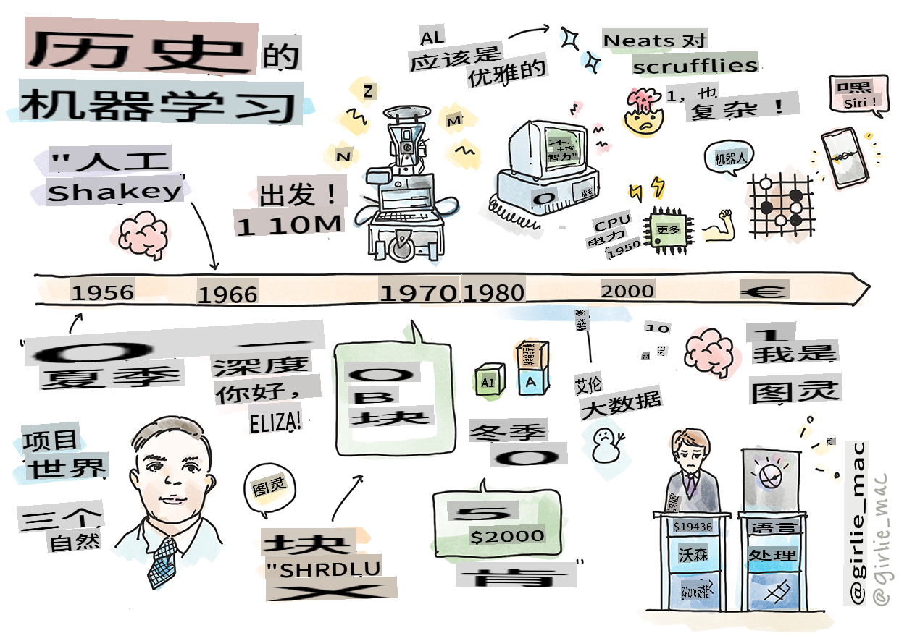
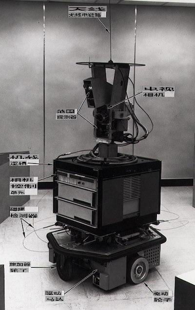
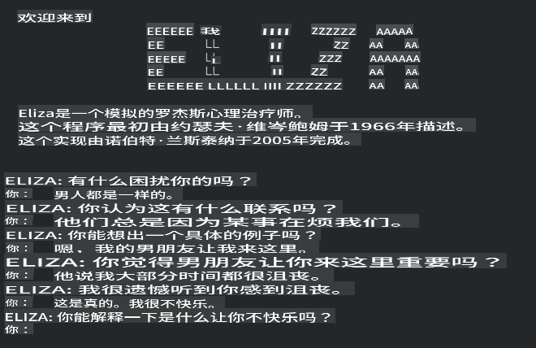

# 机器学习的历史

> 由 [Tomomi Imura](https://www.twitter.com/girlie_mac) 绘制的速写笔记

## [课前测验](https://gray-sand-07a10f403.1.azurestaticapps.net/quiz/3/)

---

> 🎥 点击上方图片观看本课的简短视频。

在本课中，我们将回顾机器学习和人工智能历史上的重要里程碑。

人工智能（AI）作为一个领域的历史与机器学习的历史紧密相连，因为支撑机器学习的算法和计算进步推动了人工智能的发展。值得注意的是，虽然这些领域作为独立的研究领域在20世纪50年代开始成型，但重要的[算法、统计、数学、计算和技术发现](https://wikipedia.org/wiki/Timeline_of_machine_learning)早在这一时期之前就已经出现并且有所重叠。实际上，人们已经思考这些问题[数百年](https://wikipedia.org/wiki/History_of_artificial_intelligence)了：这篇文章讨论了“思考机器”这一概念的历史智力基础。

---
## 著名发现

- 1763年, 1812年 [贝叶斯定理](https://wikipedia.org/wiki/Bayes%27_theorem)及其前身。这个定理及其应用在推理中起着重要作用，描述了基于先验知识发生事件的概率。
- 1805年 [最小二乘法](https://wikipedia.org/wiki/Least_squares) 由法国数学家Adrien-Marie Legendre提出。这个理论，你将在我们的回归单元中学习，帮助进行数据拟合。
- 1913年 [马尔可夫链](https://wikipedia.org/wiki/Markov_chain)，由俄罗斯数学家Andrey Markov命名，用于描述基于前一个状态的一系列可能事件。
- 1957年 [感知器](https://wikipedia.org/wiki/Perceptron) 是一种由美国心理学家Frank Rosenblatt发明的线性分类器，支撑了深度学习的进步。

---

- 1967年 [最近邻](https://wikipedia.org/wiki/Nearest_neighbor) 是一种最初设计用于绘制路线的算法。在机器学习背景下，它用于检测模式。
- 1970年 [反向传播](https://wikipedia.org/wiki/Backpropagation) 用于训练[前馈神经网络](https://wikipedia.org/wiki/Feedforward_neural_network)。
- 1982年 [递归神经网络](https://wikipedia.org/wiki/Recurrent_neural_network) 是从前馈神经网络派生的人工神经网络，创建时间图。

✅ 做一些研究。还有哪些日期在机器学习和人工智能历史上是关键的？

---
## 1950年：会思考的机器

Alan Turing，一个真正了不起的人物，被[公众在2019年](https://wikipedia.org/wiki/Icons:_The_Greatest_Person_of_the_20th_Century)投票选为20世纪最伟大的科学家，被认为帮助奠定了“会思考的机器”这一概念的基础。他通过创建[图灵测试](https://www.bbc.com/news/technology-18475646)部分解决了反对者和他自己对这一概念的经验证据的需求，你将在我们的自然语言处理课程中探讨这一点。

---
## 1956年：达特茅斯夏季研究项目

“达特茅斯夏季人工智能研究项目是人工智能作为一个领域的奠基性事件”，在这里“人工智能”一词被创造出来了（[来源](https://250.dartmouth.edu/highlights/artificial-intelligence-ai-coined-dartmouth)）。

> 学习或任何其他智能特征的每一个方面原则上都可以如此精确地描述，以至于可以制造出模拟它的机器。

---

首席研究员、数学教授John McCarthy希望“基于这样一种假设进行研究，即学习或任何其他智能特征的每一个方面原则上都可以如此精确地描述，以至于可以制造出模拟它的机器。” 参与者中还包括该领域的另一位著名人物Marvin Minsky。

该研讨会被认为启动并鼓励了几次讨论，包括“符号方法的兴起、专注于有限领域的系统（早期专家系统）以及演绎系统与归纳系统的对立。”（[来源](https://wikipedia.org/wiki/Dartmouth_workshop)）。

---
## 1956 - 1974年：“黄金时代”

从1950年代到70年代中期，人们对AI能够解决许多问题充满乐观。1967年，Marvin Minsky自信地表示，“在一代人之内……创造‘人工智能’的问题将基本解决。”（Minsky, Marvin (1967), Computation: Finite and Infinite Machines, Englewood Cliffs, N.J.: Prentice-Hall）

自然语言处理研究蓬勃发展，搜索得到改进并变得更强大，“微观世界”的概念被创造出来，在那里可以使用简单的语言指令完成简单的任务。

---

政府机构提供了充足的资金，计算和算法方面取得了进展，智能机器的原型被建造出来。这些机器包括：

* [Shakey机器人](https://wikipedia.org/wiki/Shakey_the_robot)，能够智能地操纵和决定如何执行任务。

    
    > 1972年的Shakey

---

* Eliza，一个早期的“聊天机器人”，可以与人对话并充当原始的“治疗师”。你将在自然语言处理课程中了解更多关于Eliza的信息。

    
    > Eliza，一个聊天机器人的版本

---

* “积木世界”是一个微观世界的例子，在那里可以堆叠和分类积木，并可以测试教机器做决定的实验。使用诸如[SHRDLU](https://wikipedia.org/wiki/SHRDLU)之类的库构建的进步推动了语言处理的发展。

    

    > 🎥 点击上方图片观看视频：积木世界与SHRDLU

---
## 1974 - 1980年：“AI寒冬”

到70年代中期，制造“智能机器”的复杂性被低估的事实变得显而易见，而其承诺在现有的计算能力下被夸大了。资金枯竭，对该领域的信心减弱。一些影响信心的问题包括：
---
- **限制**。计算能力太有限。
- **组合爆炸**。随着对计算机要求的增加，需要训练的参数数量呈指数增长，而计算能力和能力没有相应地进化。
- **数据稀缺**。数据稀缺，阻碍了测试、开发和改进算法的过程。
- **我们在问正确的问题吗？**。提出的问题本身开始受到质疑。研究人员开始面对对其方法的批评：
  - 图灵测试受到质疑，其中包括“中文房间理论”这一观点，该理论认为，“编程一个数字计算机可能会使其看起来理解语言，但不能产生真正的理解。”（[来源](https://plato.stanford.edu/entries/chinese-room/)）
  - 将像“治疗师”ELIZA这样的人工智能引入社会的伦理问题受到挑战。

---

同时，各种人工智能思想流派开始形成。“[简洁AI与凌乱AI](https://wikipedia.org/wiki/Neats_and_scruffies)”的二分法被确立。_凌乱_实验室通过长时间调整程序来获得期望的结果。_简洁_实验室“专注于逻辑和正式问题解决”。ELIZA和SHRDLU是著名的_凌乱_系统。到了80年代，随着对机器学习系统可重复性需求的出现，_简洁_方法逐渐占据了主导地位，因为其结果更具解释性。

---
## 1980年代 专家系统

随着该领域的发展，其对商业的好处变得更加明显，到了80年代，“专家系统”也开始普及。“专家系统是最早真正成功的人工智能（AI）软件形式之一。”（[来源](https://wikipedia.org/wiki/Expert_system)）。

这种类型的系统实际上是_混合_的，部分由定义业务需求的规则引擎组成，部分由利用规则系统推导新事实的推理引擎组成。

这个时代也越来越关注神经网络。

---
## 1987 - 1993年：AI‘寒潮’

专门的专家系统硬件的普及产生了不幸的后果，即变得过于专业化。个人计算机的兴起也与这些大型、专门、集中化的系统竞争。计算的民主化已经开始，并最终为现代大数据的爆发铺平了道路。

---
## 1993 - 2011年

这一时期标志着机器学习和人工智能能够解决早期由于数据和计算能力不足而导致的一些问题。数据量开始迅速增加并变得更广泛可用，无论是好是坏，尤其是在2007年左右智能手机的出现。计算能力成倍增长，算法也随之发展。随着过去自由放任的日子开始凝聚成一个真正的学科，该领域开始走向成熟。

---
## 现在

今天，机器学习和人工智能几乎触及我们生活的每个部分。这个时代需要对这些算法对人类生活的风险和潜在影响有仔细的理解。正如微软的Brad Smith所说，“信息技术提出了涉及基本人权保护的核心问题，如隐私和言论自由。这些问题加剧了创造这些产品的科技公司的责任。在我们看来，这也呼吁政府进行深思熟虑的监管，并制定关于可接受用途的规范”（[来源](https://www.technologyreview.com/2019/12/18/102365/the-future-of-ais-impact-on-society/)）。

---

未来将如何发展尚未可知，但理解这些计算机系统以及它们运行的软件和算法是很重要的。我们希望这门课程能帮助你更好地理解，以便你自己做出决定。

> 🎥 点击上方图片观看视频：Yann LeCun在这次讲座中讨论了深度学习的历史

---
## 🚀挑战

深入了解这些历史时刻之一，了解背后的人物。这些人物非常有趣，没有任何科学发现是在文化真空中产生的。你发现了什么？

## [课后测验](https://gray-sand-07a10f403.1.azurestaticapps.net/quiz/4/)

---
## 复习与自学

这里有一些可以观看和聆听的内容：

[这个播客中，Amy Boyd讨论了AI的演变](http://runasradio.com/Shows/Show/739)

---

## 作业

[创建时间线](assignment.md)

**免责声明**：
本文档使用基于机器的人工智能翻译服务进行翻译。尽管我们努力确保准确性，但请注意，自动翻译可能包含错误或不准确之处。应将原始文档的本国语言版本视为权威来源。对于关键信息，建议进行专业的人类翻译。对于因使用此翻译而引起的任何误解或误读，我们不承担任何责任。