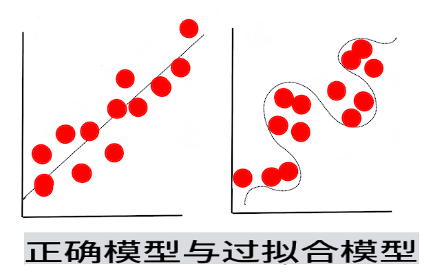

# 机器学习技术

构建、使用和维护机器学习模型及其使用的数据的过程，与许多其他开发工作流非常不同。在本课中，我们将揭开这个过程的神秘面纱，并概述您需要了解的主要技术。您将：

- 从高层次上理解机器学习的基本过程。
- 探索基本概念，如“模型”、“预测”和“训练数据”。

## [课前测验](https://gray-sand-07a10f403.1.azurestaticapps.net/quiz/7/)

> 🎥 点击上方图片观看本课的简短视频。

## 介绍

从高层次来看，创建机器学习（ML）过程的工艺包含若干步骤：

1. **确定问题**。大多数ML过程都是从提出一个不能通过简单的条件程序或基于规则的引擎回答的问题开始。这些问题通常围绕基于数据集合的预测展开。
2. **收集和准备数据**。为了能够回答您的问题，您需要数据。数据的质量和数量有时会决定您能多好地回答最初的问题。数据可视化是这一阶段的重要方面。此阶段还包括将数据分为训练组和测试组以构建模型。
3. **选择训练方法**。根据您的问题和数据的性质，您需要选择如何训练模型以最好地反映您的数据并对其进行准确预测。这是您的ML过程需要特定专业知识并且通常需要大量实验的部分。
4. **训练模型**。使用您的训练数据，您将使用各种算法训练模型以识别数据中的模式。模型可能利用内部权重，可以调整这些权重以优先考虑数据的某些部分，从而构建更好的模型。
5. **评估模型**。您使用从未见过的数据（您的测试数据）来查看模型的表现。
6. **参数调整**。根据模型的表现，您可以使用不同的参数或变量重新进行该过程，这些参数或变量控制用于训练模型的算法的行为。
7. **预测**。使用新输入来测试模型的准确性。

## 提出什么问题

计算机特别擅长发现数据中的隐藏模式。这一功能对于研究人员来说非常有用，他们在某个领域有一些问题，这些问题不能通过创建基于条件的规则引擎轻松回答。举例来说，给定一个精算任务，数据科学家可能能够构建关于吸烟者与非吸烟者死亡率的手工规则。

然而，当许多其他变量被引入时，基于过去的健康历史，ML模型可能更有效地预测未来的死亡率。一个更愉快的例子可能是根据包括纬度、经度、气候变化、海洋的接近度、喷流模式等数据，预测某个地点四月份的天气。

✅ 这份关于天气模型的[幻灯片](https://www2.cisl.ucar.edu/sites/default/files/2021-10/0900%20June%2024%20Haupt_0.pdf)提供了使用ML进行天气分析的历史视角。

## 构建前的任务

在开始构建模型之前，您需要完成几个任务。为了测试您的问题并根据模型的预测形成假设，您需要识别和配置几个元素。

### 数据

为了能够以任何确定性回答您的问题，您需要大量合适类型的数据。在这一点上，您需要做两件事：

- **收集数据**。牢记上一课关于数据分析公平性的内容，谨慎收集您的数据。了解这些数据的来源、它可能具有的任何内在偏见，并记录其来源。
- **准备数据**。数据准备过程有几个步骤。如果数据来自不同的来源，您可能需要整理数据并使其规范化。您可以通过各种方法提高数据的质量和数量，例如将字符串转换为数字（如我们在[聚类](../../5-Clustering/1-Visualize/README.md)中所做的）。您还可以基于原始数据生成新数据（如我们在[分类](../../4-Classification/1-Introduction/README.md)中所做的）。您可以清理和编辑数据（如我们在[Web应用](../../3-Web-App/README.md)课程之前所做的）。最后，根据您的训练技术，您可能还需要对其进行随机化和打乱。

✅ 收集和处理数据后，花点时间看看它的形状是否能让您解决预期的问题。正如我们在[聚类](../../5-Clustering/1-Visualize/README.md)课程中发现的那样，数据可能无法在您的任务中表现良好！

### 特征和目标

一个[特征](https://www.datasciencecentral.com/profiles/blogs/an-introduction-to-variable-and-feature-selection)是数据的可测量属性。在许多数据集中，它表现为列标题，如“日期”、“大小”或“颜色”。您的特征变量，通常在代码中表示为`X`，代表用于训练模型的输入变量。

目标是您试图预测的事物。目标通常在代码中表示为`y`，代表您试图从数据中询问的问题的答案：在十二月，哪种**颜色**的南瓜最便宜？在旧金山，哪个社区的房地产**价格**最好？有时目标也称为标签属性。

### 选择您的特征变量

🎓 **特征选择和特征提取** 如何在构建模型时知道选择哪个变量？您可能会通过特征选择或特征提取的过程来选择最合适的变量以构建性能最佳的模型。然而，它们并不是一回事：“特征提取从原始特征的函数中创建新特征，而特征选择返回特征的子集。”（[来源](https://wikipedia.org/wiki/Feature_selection)）

### 可视化您的数据

数据科学家工具包的重要方面是使用Seaborn或MatPlotLib等出色库来可视化数据的能力。以可视化方式表示您的数据可能会让您发现可以利用的隐藏关联。您的可视化还可能帮助您发现偏见或不平衡的数据（正如我们在[分类](../../4-Classification/2-Classifiers-1/README.md)中发现的那样）。

### 分割您的数据集

在训练之前，您需要将数据集分割成两个或多个不等大小的部分，这些部分仍能很好地代表数据。

- **训练**。数据集的这一部分用于训练模型。这部分数据构成了原始数据集的大部分。
- **测试**。测试数据集是一个独立的数据组，通常从原始数据中收集，用于确认构建模型的性能。
- **验证**。验证集是一个较小的独立数据组，您用它来调整模型的超参数或架构以改进模型。根据您的数据大小和您提出的问题，您可能不需要构建这个第三组（正如我们在[时间序列预测](../../7-TimeSeries/1-Introduction/README.md)中所指出的那样）。

## 构建模型

使用您的训练数据，您的目标是使用各种算法构建一个模型或数据的统计表示来**训练**它。训练模型使其暴露于数据，并允许其对发现、验证和接受或拒绝的感知模式做出假设。

### 决定训练方法

根据您的问题和数据的性质，您将选择一种方法来训练它。通过[Scikit-learn的文档](https://scikit-learn.org/stable/user_guide.html)——我们在本课程中使用的库，您可以探索许多训练模型的方法。根据您的经验，您可能需要尝试几种不同的方法来构建最佳模型。您可能会经历一个过程，即数据科学家通过向模型提供未见过的数据来评估模型的性能，检查其准确性、偏差和其他质量降低问题，并选择最适合手头任务的训练方法。

### 训练模型

有了您的训练数据，您就可以“拟合”它来创建一个模型。您会注意到，在许多ML库中，您会发现代码“model.fit”——此时，您将以值数组（通常是“X”）的形式发送您的特征变量和目标变量（通常是“y”）。

### 评估模型

一旦训练过程完成（训练大型模型可能需要多次迭代或“周期”），您将能够使用测试数据来评估模型的质量，以衡量其性能。这些数据是模型之前未分析过的原始数据的一个子集。您可以打印出一张关于模型质量的指标表。

🎓 **模型拟合**

在机器学习的背景下，模型拟合是指模型的基础函数在尝试分析不熟悉的数据时的准确性。

🎓 **欠拟合**和**过拟合**是降低模型质量的常见问题，因为模型要么拟合得不够好，要么拟合得太好。这导致模型的预测要么与训练数据过于紧密对齐，要么与训练数据对齐过于松散。过拟合的模型因为过于了解数据的细节和噪音而预测训练数据太好。欠拟合的模型不准确，因为它既不能准确分析其训练数据，也不能准确分析尚未“见过”的数据。

> 信息图由[Jen Looper](https://twitter.com/jenlooper)制作

## 参数调整

初步训练完成后，观察模型的质量并考虑通过调整其“超参数”来改进它。阅读更多关于这一过程的内容[在文档中](https://docs.microsoft.com/en-us/azure/machine-learning/how-to-tune-hyperparameters?WT.mc_id=academic-77952-leestott)。

## 预测

这是您可以使用全新数据测试模型准确性的时刻。在“应用”ML设置中，当您构建Web资产以在生产中使用模型时，这个过程可能涉及收集用户输入（例如按钮按下），以设置变量并将其发送到模型进行推断或评估。

在这些课程中，您将发现如何使用这些步骤来准备、构建、测试、评估和预测——所有数据科学家的操作以及更多内容，随着您在成为“全栈”ML工程师的旅程中不断前进。

---

## 🚀挑战

绘制一个反映ML实践者步骤的流程图。您现在在这个过程中看到自己处于哪个阶段？您预测您会在哪个阶段遇到困难？对您来说什么看起来很容易？

## [课后测验](https://gray-sand-07a10f403.1.azurestaticapps.net/quiz/8/)

## 回顾与自学

在网上搜索与数据科学家讨论他们日常工作的采访。这里有一个[采访](https://www.youtube.com/watch?v=Z3IjgbbCEfs)。

## 作业

[采访数据科学家](assignment.md)

**免责声明**：
本文档使用基于机器的AI翻译服务进行翻译。尽管我们力求准确，但请注意，自动翻译可能包含错误或不准确之处。应将原始语言的文档视为权威来源。对于关键信息，建议进行专业的人类翻译。对于因使用此翻译而引起的任何误解或误读，我们不承担任何责任。