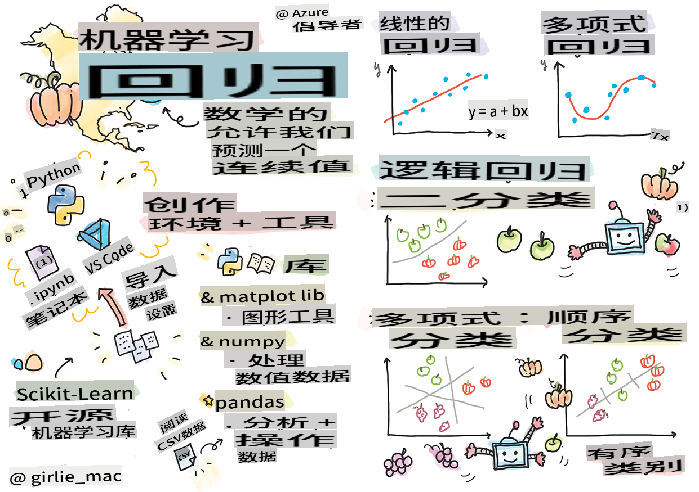
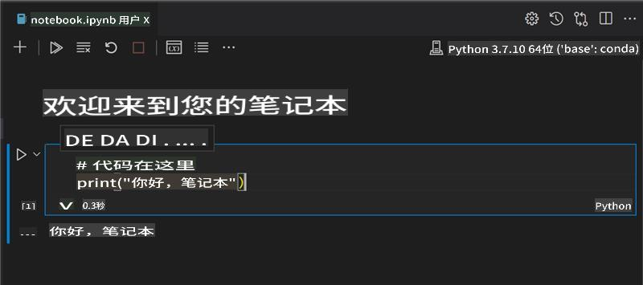
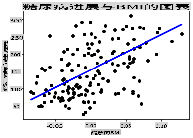

# 使用 Python 和 Scikit-learn 构建回归模型入门



> 由 [Tomomi Imura](https://www.twitter.com/girlie_mac) 绘制的手绘笔记

## [课前测验](https://gray-sand-07a10f403.1.azurestaticapps.net/quiz/9/)

> ### [本课程提供 R 语言版本！](../../../../2-Regression/1-Tools/solution/R/lesson_1.html)

## 简介

在这四节课中，你将学习如何构建回归模型。我们将很快讨论这些模型的用途。但在开始之前，请确保你已经准备好了合适的工具！

在本课中，你将学到：

- 配置你的电脑以进行本地机器学习任务。
- 使用 Jupyter 笔记本。
- 安装和使用 Scikit-learn。
- 通过动手练习探索线性回归。

## 安装和配置

[](https://youtu.be/-DfeD2k2Kj0 "机器学习初学者 - 设置工具以构建机器学习模型")

> 🎥 点击上面的图片观看一个简短的视频，了解如何配置你的电脑以进行机器学习。

1. **安装 Python**。确保你的电脑上安装了 [Python](https://www.python.org/downloads/)。你将使用 Python 进行许多数据科学和机器学习任务。大多数计算机系统已经包含了 Python 安装。也有一些有用的 [Python 编码包](https://code.visualstudio.com/learn/educators/installers?WT.mc_id=academic-77952-leestott)，可以简化某些用户的设置过程。

   然而，有些 Python 的使用需要一个版本的软件，而其他使用则需要不同的版本。因此，在 [虚拟环境](https://docs.python.org/3/library/venv.html) 中工作是很有用的。

2. **安装 Visual Studio Code**。确保你的电脑上安装了 Visual Studio Code。按照这些说明进行 [安装 Visual Studio Code](https://code.visualstudio.com/) 的基本安装。在本课程中，你将使用 Visual Studio Code 中的 Python，因此你可能需要了解如何 [配置 Visual Studio Code](https://docs.microsoft.com/learn/modules/python-install-vscode?WT.mc_id=academic-77952-leestott) 以进行 Python 开发。

   > 通过学习这组 [Learn 模块](https://docs.microsoft.com/users/jenlooper-2911/collections/mp1pagggd5qrq7?WT.mc_id=academic-77952-leestott) 来熟悉 Python
   >
   > [](https://youtu.be/yyQM70vi7V8 "使用 Visual Studio Code 设置 Python")
   >
   > 🎥 点击上面的图片观看视频：在 VS Code 中使用 Python。

3. **安装 Scikit-learn**，按照 [这些说明](https://scikit-learn.org/stable/install.html)。由于你需要确保使用 Python 3，建议你使用虚拟环境。请注意，如果你在 M1 Mac 上安装此库，请参阅上述链接页面中的特别说明。

1. **安装 Jupyter Notebook**。你需要 [安装 Jupyter 包](https://pypi.org/project/jupyter/)。

## 你的机器学习编写环境

你将使用 **notebooks** 来开发你的 Python 代码并创建机器学习模型。这种类型的文件是数据科学家的常用工具，可以通过其后缀或扩展名 `.ipynb` 识别。

笔记本是一种交互式环境，允许开发者编写代码并添加注释和文档，这对于实验或研究导向的项目非常有帮助。

[](https://youtu.be/7E-jC8FLA2E "机器学习初学者 - 设置 Jupyter 笔记本以开始构建回归模型")

> 🎥 点击上面的图片观看一个简短的视频，了解如何进行此练习。

### 练习 - 使用笔记本

在这个文件夹中，你会找到 _notebook.ipynb_ 文件。

1. 在 Visual Studio Code 中打开 _notebook.ipynb_。

   一个 Jupyter 服务器将会启动，并启动 Python 3+。你会发现笔记本中有一些区域可以 `run`，即代码片段。你可以通过选择一个看起来像播放按钮的图标来运行一个代码块。

1. 选择 `md` 图标并添加一些 markdown，以及以下文本 **# 欢迎来到你的笔记本**。

   接下来，添加一些 Python 代码。

1. 在代码块中输入 **print('hello notebook')**。
1. 选择箭头来运行代码。

   你应该会看到打印的语句：

    ```output
    hello notebook
    ```



你可以在代码中插入注释，以自我记录笔记本。

✅ 想一想，网页开发者的工作环境与数据科学家的工作环境有何不同。

## 使用 Scikit-learn 入门

现在 Python 已经在你的本地环境中设置完毕，并且你已经熟悉了 Jupyter 笔记本，让我们同样熟悉一下 Scikit-learn（发音为 `sci` as in `science`）。Scikit-learn 提供了一个 [广泛的 API](https://scikit-learn.org/stable/modules/classes.html#api-ref)，帮助你执行机器学习任务。

根据他们的 [网站](https://scikit-learn.org/stable/getting_started.html)，"Scikit-learn 是一个开源机器学习库，支持监督学习和非监督学习。它还提供了各种工具用于模型拟合、数据预处理、模型选择和评估，以及许多其他实用工具。"

在本课程中，你将使用 Scikit-learn 和其他工具来构建机器学习模型，以执行我们称之为“传统机器学习”的任务。我们故意避开了神经网络和深度学习，因为它们将在我们即将推出的“AI for Beginners”课程中更好地覆盖。

Scikit-learn 使构建模型和评估它们的使用变得简单。它主要专注于使用数值数据，并包含几个现成的数据集供学习使用。它还包括预构建的模型供学生尝试。让我们探索一下加载预打包数据和使用内置估算器来构建第一个机器学习模型的过程。

## 练习 - 你的第一个 Scikit-learn 笔记本

> 本教程的灵感来自 Scikit-learn 网站上的 [线性回归示例](https://scikit-learn.org/stable/auto_examples/linear_model/plot_ols.html#sphx-glr-auto-examples-linear-model-plot-ols-py)。

[](https://youtu.be/2xkXL5EUpS0 "机器学习初学者 - 你的第一个 Python 线性回归项目")

> 🎥 点击上面的图片观看一个简短的视频，了解如何进行此练习。

在与本课相关的 _notebook.ipynb_ 文件中，按下“垃圾桶”图标清除所有单元格。

在本节中，你将使用一个内置于 Scikit-learn 中的小数据集，关于糖尿病。假设你想测试一种糖尿病患者的治疗方法。机器学习模型可以帮助你确定哪些患者在不同变量组合下对治疗反应更好。即使是一个非常基本的回归模型，当可视化时，也可能显示出关于变量的信息，这些信息可以帮助你组织理论上的临床试验。

✅ 回归方法有很多种，选择哪一种取决于你要回答的问题。如果你想预测一个特定年龄的人的可能身高，你会使用线性回归，因为你在寻找一个**数值值**。如果你想知道某种菜肴是否应该被认为是素食，你在寻找一个**类别分配**，因此你会使用逻辑回归。你稍后会学习更多关于逻辑回归的内容。想一想你可以向数据提出的一些问题，以及哪种方法更合适。

让我们开始这个任务。

### 导入库

对于这个任务，我们将导入一些库：

- **matplotlib**。这是一个有用的 [绘图工具](https://matplotlib.org/)，我们将使用它来创建折线图。
- **numpy**。 [numpy](https://numpy.org/doc/stable/user/whatisnumpy.html) 是一个处理 Python 数值数据的有用库。
- **sklearn**。这是 [Scikit-learn](https://scikit-learn.org/stable/user_guide.html) 库。

导入一些库来帮助你完成任务。

1. 通过输入以下代码添加导入：

   ```python
   import matplotlib.pyplot as plt
   import numpy as np
   from sklearn import datasets, linear_model, model_selection
   ```

   上面你正在导入 `matplotlib`, `numpy` and you are importing `datasets`, `linear_model` and `model_selection` from `sklearn`. `model_selection` is used for splitting data into training and test sets.

### The diabetes dataset

The built-in [diabetes dataset](https://scikit-learn.org/stable/datasets/toy_dataset.html#diabetes-dataset) includes 442 samples of data around diabetes, with 10 feature variables, some of which include:

- age: age in years
- bmi: body mass index
- bp: average blood pressure
- s1 tc: T-Cells (a type of white blood cells)

✅ This dataset includes the concept of 'sex' as a feature variable important to research around diabetes. Many medical datasets include this type of binary classification. Think a bit about how categorizations such as this might exclude certain parts of a population from treatments.

Now, load up the X and y data.

> 🎓 Remember, this is supervised learning, and we need a named 'y' target.

In a new code cell, load the diabetes dataset by calling `load_diabetes()`. The input `return_X_y=True` signals that `X` will be a data matrix, and `y` 将是回归目标。

1. 添加一些打印命令以显示数据矩阵的形状及其第一个元素：

    ```python
    X, y = datasets.load_diabetes(return_X_y=True)
    print(X.shape)
    print(X[0])
    ```

    你得到的响应是一个元组。你所做的是将元组的前两个值分别分配给 `X` and `y`。了解更多 [关于元组](https://wikipedia.org/wiki/Tuple)。

    你可以看到这个数据有 442 个项目，形状为 10 个元素的数组：

    ```text
    (442, 10)
    [ 0.03807591  0.05068012  0.06169621  0.02187235 -0.0442235  -0.03482076
    -0.04340085 -0.00259226  0.01990842 -0.01764613]
    ```

    ✅ 想一想数据和回归目标之间的关系。线性回归预测特征 X 和目标变量 y 之间的关系。你能在文档中找到糖尿病数据集的 [目标](https://scikit-learn.org/stable/datasets/toy_dataset.html#diabetes-dataset) 吗？考虑到目标，这个数据集在展示什么？

2. 接下来，通过选择数据集的第 3 列来绘制一部分数据。你可以通过使用 `:` operator to select all rows, and then selecting the 3rd column using the index (2). You can also reshape the data to be a 2D array - as required for plotting - by using `reshape(n_rows, n_columns)` 来实现。如果其中一个参数为 -1，则自动计算相应的维度。

   ```python
   X = X[:, 2]
   X = X.reshape((-1,1))
   ```

   ✅ 随时打印出数据以检查其形状。

3. 现在你已经准备好要绘制的数据，可以看看机器是否能帮助确定此数据集中数字之间的逻辑分割。为此，你需要将数据（X）和目标（y）分成测试集和训练集。Scikit-learn 有一个简单的方法来做到这一点；你可以在给定点分割测试数据。

   ```python
   X_train, X_test, y_train, y_test = model_selection.train_test_split(X, y, test_size=0.33)
   ```

4. 现在你准备好训练你的模型了！加载线性回归模型，并使用 `model.fit()` 训练你的 X 和 y 训练集：

    ```python
    model = linear_model.LinearRegression()
    model.fit(X_train, y_train)
    ```

    ✅ `model.fit()` is a function you'll see in many ML libraries such as TensorFlow

5. Then, create a prediction using test data, using the function `predict()`。这将用于在数据组之间画线

    ```python
    y_pred = model.predict(X_test)
    ```

6. 现在是时候在图中显示数据了。Matplotlib 是完成此任务的非常有用的工具。创建所有 X 和 y 测试数据的散点图，并使用预测在模型的数据组之间的最合适位置画一条线。

    ```python
    plt.scatter(X_test, y_test,  color='black')
    plt.plot(X_test, y_pred, color='blue', linewidth=3)
    plt.xlabel('Scaled BMIs')
    plt.ylabel('Disease Progression')
    plt.title('A Graph Plot Showing Diabetes Progression Against BMI')
    plt.show()
    ```

   

   ✅ 想一想这里发生了什么。一条直线穿过许多小数据点，但它到底在做什么？你能看到如何使用这条线来预测一个新的、未见过的数据点在图的 y 轴上的位置吗？试着用语言描述这个模型的实际用途。

恭喜你，你构建了你的第一个线性回归模型，用它进行了预测，并在图中显示了它！

---
## 🚀挑战

绘制此数据集的不同变量。提示：编辑这行：`X = X[:,2]`。考虑到这个数据集的目标，你能发现糖尿病作为一种疾病的进展情况吗？
## [课后测验](https://gray-sand-07a10f403.1.azurestaticapps.net/quiz/10/)

## 复习与自学

在本教程中，你使用了简单线性回归，而不是单变量或多变量线性回归。阅读一下这些方法之间的区别，或者看看 [这个视频](https://www.coursera.org/lecture/quantifying-relationships-regression-models/linear-vs-nonlinear-categorical-variables-ai2Ef)。

阅读更多关于回归概念的内容，并思考可以用这种技术回答哪些问题。参加这个 [教程](https://docs.microsoft.com/learn/modules/train-evaluate-regression-models?WT.mc_id=academic-77952-leestott) 以加深理解。

## 作业

[不同的数据集](assignment.md)

**免责声明**:
本文档是使用机器翻译服务翻译的。尽管我们努力确保准确性，但请注意，自动翻译可能包含错误或不准确之处。应将原始语言的文档视为权威来源。对于关键信息，建议使用专业人工翻译。对于因使用此翻译而引起的任何误解或误读，我们不承担责任。