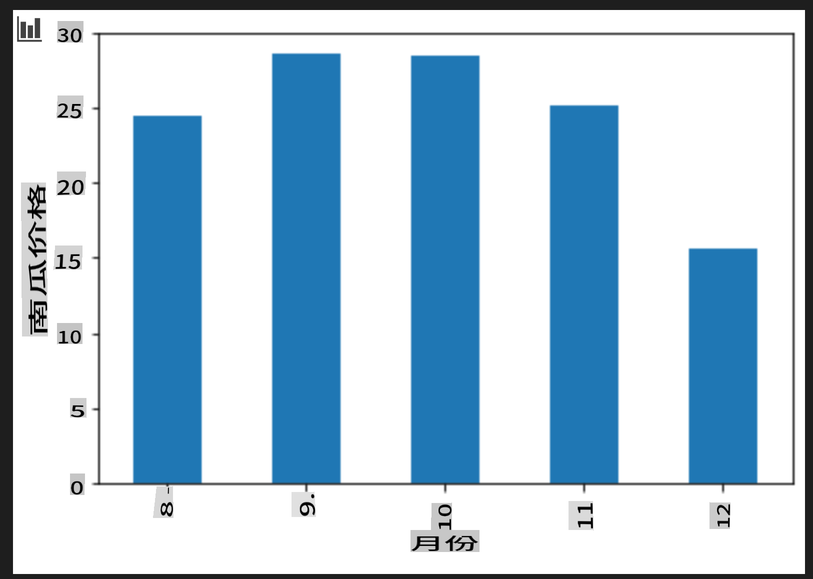

# 使用 Scikit-learn 构建回归模型：准备和可视化数据


信息图由 [Dasani Madipalli](https://twitter.com/dasani_decoded) 提供

## [课前测验](https://gray-sand-07a10f403.1.azurestaticapps.net/quiz/11/)

> ### [本课程有 R 版本！](../../../../2-Regression/2-Data/solution/R/lesson_2.html)

## 介绍

现在你已经准备好了使用 Scikit-learn 构建机器学习模型的工具，你可以开始向你的数据提出问题了。在处理数据和应用机器学习解决方案时，理解如何提出正确的问题以正确地释放数据集的潜力是非常重要的。

在本课中，你将学习：

- 如何为模型构建准备数据。
- 如何使用 Matplotlib 进行数据可视化。

## 向数据提出正确的问题

你需要回答的问题将决定你将使用哪种类型的机器学习算法。而你得到的答案的质量将在很大程度上取决于你的数据的性质。

看看为本课提供的[数据](https://github.com/microsoft/ML-For-Beginners/blob/main/2-Regression/data/US-pumpkins.csv)。你可以在 VS Code 中打开这个 .csv 文件。快速浏览一下，你会发现有空白和混合的字符串和数字数据。还有一个奇怪的列叫做 'Package'，其中的数据是 'sacks'、'bins' 和其他值的混合。实际上，这些数据有点乱。

[](https://youtu.be/5qGjczWTrDQ "初学者的机器学习 - 如何分析和清理数据集")

> 🎥 点击上方图片观看准备本课数据的短视频。

实际上，很少有数据集是完全准备好直接用于创建机器学习模型的。在本课中，你将学习如何使用标准 Python 库准备原始数据集。你还将学习各种数据可视化技术。

## 案例研究：'南瓜市场'

在这个文件夹中，你会在根 `data` 文件夹中找到一个名为 [US-pumpkins.csv](https://github.com/microsoft/ML-For-Beginners/blob/main/2-Regression/data/US-pumpkins.csv) 的 .csv 文件，其中包含关于南瓜市场的 1757 行数据，按城市分组。这是从美国农业部分发的[特色作物终端市场标准报告](https://www.marketnews.usda.gov/mnp/fv-report-config-step1?type=termPrice)中提取的原始数据。

### 准备数据

这些数据是公共领域的数据。可以从 USDA 网站按城市下载多个单独的文件。为了避免太多单独的文件，我们将所有城市的数据合并到一个电子表格中，因此我们已经_准备_了一些数据。接下来，让我们仔细看看这些数据。

### 南瓜数据 - 初步结论

你注意到这些数据有什么特点？你已经看到有字符串、数字、空白和奇怪的值混合在一起，需要你理解。

你可以用回归技术向这些数据提出什么问题？比如“预测某个月份出售的南瓜价格”。再看看数据，你需要做一些更改来创建所需的任务数据结构。

## 练习 - 分析南瓜数据

让我们使用 [Pandas](https://pandas.pydata.org/)，（名称代表 `Python Data Analysis`）这是一个非常有用的数据处理工具，来分析和准备这些南瓜数据。

### 首先，检查缺失日期

你首先需要采取措施检查缺失日期：

1. 将日期转换为月份格式（这些是美国日期，所以格式是 `MM/DD/YYYY`）。
2. 提取月份到新列。

在 Visual Studio Code 中打开 _notebook.ipynb_ 文件，并将电子表格导入到新的 Pandas 数据框中。

1. 使用 `head()` 函数查看前五行。

    ```python
    import pandas as pd
    pumpkins = pd.read_csv('../data/US-pumpkins.csv')
    pumpkins.head()
    ```

    ✅ 你会使用什么函数来查看最后五行？

1. 检查当前数据框中是否有缺失数据：

    ```python
    pumpkins.isnull().sum()
    ```

    有缺失数据，但可能对当前任务没有影响。

1. 为了使数据框更容易处理，仅选择需要的列，使用 `loc` function which extracts from the original dataframe a group of rows (passed as first parameter) and columns (passed as second parameter). The expression `:`，下面的例子中表示“所有行”。

    ```python
    columns_to_select = ['Package', 'Low Price', 'High Price', 'Date']
    pumpkins = pumpkins.loc[:, columns_to_select]
    ```

### 其次，确定南瓜的平均价格

思考如何确定某个月份南瓜的平均价格。你会选择哪些列来完成这个任务？提示：你需要 3 列。

解决方案：取 `Low Price` and `High Price` 列的平均值填充新的 Price 列，并将 Date 列转换为仅显示月份。幸运的是，根据上面的检查，日期或价格没有缺失数据。

1. 要计算平均值，添加以下代码：

    ```python
    price = (pumpkins['Low Price'] + pumpkins['High Price']) / 2

    month = pd.DatetimeIndex(pumpkins['Date']).month

    ```

   ✅ 随时使用 `print(month)` 打印任何你想检查的数据。

2. 现在，将转换后的数据复制到新的 Pandas 数据框中：

    ```python
    new_pumpkins = pd.DataFrame({'Month': month, 'Package': pumpkins['Package'], 'Low Price': pumpkins['Low Price'],'High Price': pumpkins['High Price'], 'Price': price})
    ```

    打印出你的数据框，你会看到一个干净、整洁的数据集，你可以在其上构建新的回归模型。

### 但是等等！这里有些奇怪的东西

如果你看看 `Package` column, pumpkins are sold in many different configurations. Some are sold in '1 1/9 bushel' measures, and some in '1/2 bushel' measures, some per pumpkin, some per pound, and some in big boxes with varying widths.

> Pumpkins seem very hard to weigh consistently

Digging into the original data, it's interesting that anything with `Unit of Sale` equalling 'EACH' or 'PER BIN' also have the `Package` type per inch, per bin, or 'each'. Pumpkins seem to be very hard to weigh consistently, so let's filter them by selecting only pumpkins with the string 'bushel' in their `Package` 列。

1. 在文件顶部的初始 .csv 导入下添加一个过滤器：

    ```python
    pumpkins = pumpkins[pumpkins['Package'].str.contains('bushel', case=True, regex=True)]
    ```

    如果你现在打印数据，你会看到你只得到了大约 415 行包含蒲式耳单位的南瓜数据。

### 但是等等！还有一件事要做

你注意到每行的蒲式耳量不同吗？你需要标准化定价以显示每蒲式耳的价格，所以做一些数学运算来标准化它。

1. 在创建 new_pumpkins 数据框的代码块后添加这些行：

    ```python
    new_pumpkins.loc[new_pumpkins['Package'].str.contains('1 1/9'), 'Price'] = price/(1 + 1/9)

    new_pumpkins.loc[new_pumpkins['Package'].str.contains('1/2'), 'Price'] = price/(1/2)
    ```

✅ 根据 [The Spruce Eats](https://www.thespruceeats.com/how-much-is-a-bushel-1389308)，蒲式耳的重量取决于产品的类型，因为它是一个体积测量单位。“例如，一蒲式耳的西红柿应该重 56 磅……叶类蔬菜占据更多空间但重量较轻，所以一蒲式耳的菠菜只有 20 磅。”这都相当复杂！我们不必进行蒲式耳到磅的转换，而是按蒲式耳定价。所有这些对南瓜蒲式耳的研究，表明了解数据的性质是多么重要！

现在，你可以根据蒲式耳测量分析每单位的定价。如果你再打印一次数据，你会看到它是如何标准化的。

✅ 你注意到按半蒲式耳出售的南瓜非常贵吗？你能找出原因吗？提示：小南瓜比大南瓜贵得多，可能是因为每蒲式耳有更多的小南瓜，而一个大南瓜占用了很多空间。

## 可视化策略

数据科学家的职责之一是展示他们所处理的数据的质量和性质。为此，他们经常创建有趣的可视化，例如图表、图形和图表，展示数据的不同方面。通过这种方式，他们能够直观地展示关系和难以发现的差距。

[](https://youtu.be/SbUkxH6IJo0 "初学者的机器学习 - 如何使用 Matplotlib 进行数据可视化")

> 🎥 点击上方图片观看本课数据可视化的短视频。

可视化还可以帮助确定最适合数据的机器学习技术。例如，似乎遵循一条线的散点图表明该数据是线性回归练习的良好候选数据。

一个在 Jupyter 笔记本中效果很好的数据可视化库是 [Matplotlib](https://matplotlib.org/)（你在上一课中也看到了它）。

> 在[这些教程](https://docs.microsoft.com/learn/modules/explore-analyze-data-with-python?WT.mc_id=academic-77952-leestott)中获得更多数据可视化经验。

## 练习 - 试验 Matplotlib

尝试创建一些基本图表来显示你刚创建的新数据框。基本折线图会显示什么？

1. 在文件顶部，Pandas 导入下方导入 Matplotlib：

    ```python
    import matplotlib.pyplot as plt
    ```

1. 重新运行整个笔记本以刷新。
1. 在笔记本底部添加一个单元格，将数据绘制为箱形图：

    ```python
    price = new_pumpkins.Price
    month = new_pumpkins.Month
    plt.scatter(price, month)
    plt.show()
    ```

    

    这是一个有用的图表吗？它有什么让你惊讶的地方吗？

    这并不是特别有用，因为它只是在给定月份中显示你的数据点的分布。

### 使其有用

为了让图表显示有用的数据，你通常需要以某种方式对数据进行分组。让我们尝试创建一个图表，其中 y 轴显示月份，数据展示数据的分布。

1. 添加一个单元格以创建分组条形图：

    ```python
    new_pumpkins.groupby(['Month'])['Price'].mean().plot(kind='bar')
    plt.ylabel("Pumpkin Price")
    ```

    

    这是一个更有用的数据可视化！它似乎表明南瓜的最高价格出现在九月和十月。这个符合你的预期吗？为什么或为什么不？

---

## 🚀挑战

探索 Matplotlib 提供的不同类型的可视化。哪些类型最适合回归问题？

## [课后测验](https://gray-sand-07a10f403.1.azurestaticapps.net/quiz/12/)

## 回顾与自学

看看数据可视化的多种方式。列出各种可用的库，并注明哪些库最适合特定类型的任务，例如 2D 可视化与 3D 可视化。你发现了什么？

## 作业

[探索可视化](assignment.md)

**免责声明**:
本文件是使用机器翻译服务翻译的。尽管我们努力确保准确性，但请注意，自动翻译可能包含错误或不准确之处。应将原文档视为权威来源。对于关键信息，建议使用专业人工翻译。我们不对使用此翻译引起的任何误解或曲解承担责任。