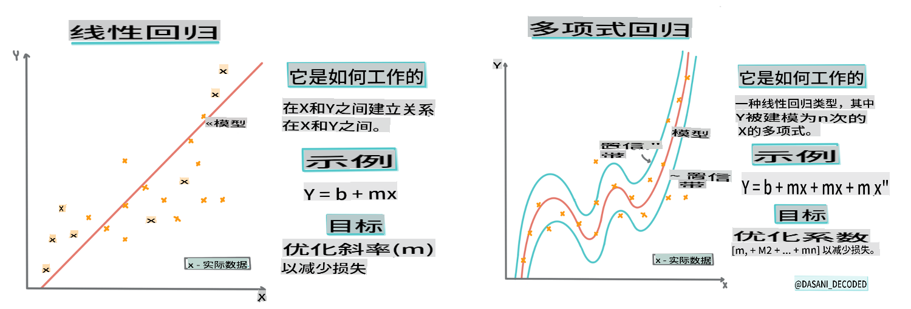
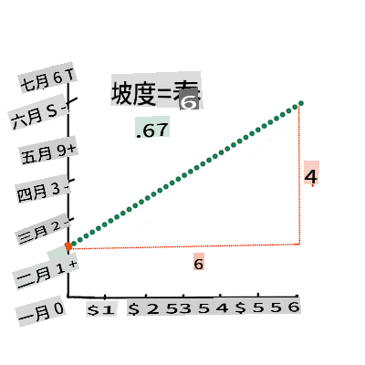
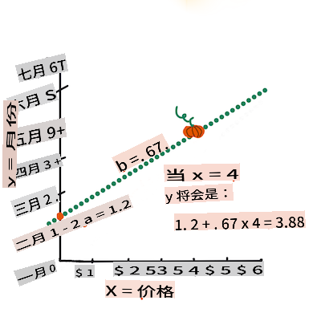

# 使用 Scikit-learn 构建回归模型：四种回归方法


> 信息图作者 [Dasani Madipalli](https://twitter.com/dasani_decoded)
## [课前测验](https://gray-sand-07a10f403.1.azurestaticapps.net/quiz/13/)

> ### [这节课也有 R 版本！](../../../../2-Regression/3-Linear/solution/R/lesson_3.html)
### 介绍

到目前为止，你已经用南瓜定价数据集的示例数据探索了什么是回归，并用 Matplotlib 对其进行了可视化。

现在你已经准备好深入了解机器学习中的回归。虽然可视化可以帮助你理解数据，但机器学习的真正力量在于_训练模型_。模型在历史数据上进行训练，以自动捕捉数据依赖关系，并允许你预测模型从未见过的新数据的结果。

在本课中，你将学习两种类型的回归：_基本线性回归_和_多项式回归_，以及这些技术背后的一些数学原理。这些模型将允许我们根据不同的输入数据预测南瓜价格。

[](https://youtu.be/CRxFT8oTDMg "初学者的机器学习 - 理解线性回归")

> 🎥 点击上面的图片观看关于线性回归的简短视频概述。

> 在整个课程中，我们假设数学知识最低，并努力使其对来自其他领域的学生可访问，因此请注意笔记、🧮 标注、图表和其他学习工具以帮助理解。

### 前提条件

到现在为止，你应该熟悉我们正在检查的南瓜数据的结构。你可以在本课的_notebook.ipynb_文件中找到预加载和预清理的数据。在文件中，南瓜价格按蒲式耳显示在一个新的数据框中。确保你可以在 Visual Studio Code 的内核中运行这些笔记本。

### 准备工作

提醒一下，你正在加载这些数据以便提出问题。

- 什么时候是购买南瓜的最佳时间？
- 我可以期待一个迷你南瓜盒的价格是多少？
- 我应该购买半蒲式耳的篮子还是1 1/9蒲式耳的盒子？
让我们继续深入挖掘这些数据。

在上一课中，你创建了一个 Pandas 数据框，并用部分原始数据集填充它，按蒲式耳标准化价格。然而，通过这样做，你只能收集到约400个数据点，而且只是在秋季月份。

看看我们在本课配套笔记本中预加载的数据。数据已预加载，并绘制了初始散点图以显示月份数据。也许我们可以通过进一步清理数据来了解更多关于数据的性质。

## 线性回归线

正如你在第一课中所学，线性回归练习的目标是能够绘制一条线来：

- **显示变量关系**。显示变量之间的关系
- **做出预测**。准确预测新数据点在该线上的位置。

这种类型的线通常是通过**最小二乘回归**绘制的。术语“最小二乘”意味着所有围绕回归线的数据点都被平方然后相加。理想情况下，最终的总和尽可能小，因为我们希望错误数量低，即`least-squares`。

我们这样做是因为我们希望建模一条线，使其与所有数据点的累计距离最小。我们在相加之前将项平方，因为我们关心的是它的大小而不是方向。

> **🧮 给我展示数学**
>
> 这条线，称为_最佳拟合线_，可以通过[一个方程](https://en.wikipedia.org/wiki/Simple_linear_regression)来表示：
>
> ```
> Y = a + bX
> ```
>
> `X` is the 'explanatory variable'. `Y` is the 'dependent variable'. The slope of the line is `b` and `a` is the y-intercept, which refers to the value of `Y` when `X = 0`. 
>
>
>
> First, calculate the slope `b`. Infographic by [Jen Looper](https://twitter.com/jenlooper)
>
> In other words, and referring to our pumpkin data's original question: "predict the price of a pumpkin per bushel by month", `X` would refer to the price and `Y` would refer to the month of sale. 
>
>
>
> Calculate the value of Y. If you're paying around $4, it must be April! Infographic by [Jen Looper](https://twitter.com/jenlooper)
>
> The math that calculates the line must demonstrate the slope of the line, which is also dependent on the intercept, or where `Y` is situated when `X = 0`.
>
> You can observe the method of calculation for these values on the [Math is Fun](https://www.mathsisfun.com/data/least-squares-regression.html) web site. Also visit [this Least-squares calculator](https://www.mathsisfun.com/data/least-squares-calculator.html) to watch how the numbers' values impact the line.

## Correlation

One more term to understand is the **Correlation Coefficient** between given X and Y variables. Using a scatterplot, you can quickly visualize this coefficient. A plot with datapoints scattered in a neat line have high correlation, but a plot with datapoints scattered everywhere between X and Y have a low correlation.

A good linear regression model will be one that has a high (nearer to 1 than 0) Correlation Coefficient using the Least-Squares Regression method with a line of regression.

✅ Run the notebook accompanying this lesson and look at the Month to Price scatterplot. Does the data associating Month to Price for pumpkin sales seem to have high or low correlation, according to your visual interpretation of the scatterplot? Does that change if you use more fine-grained measure instead of `Month`, eg. *day of the year* (i.e. number of days since the beginning of the year)?

In the code below, we will assume that we have cleaned up the data, and obtained a data frame called `new_pumpkins`, similar to the following:

ID | Month | DayOfYear | Variety | City | Package | Low Price | High Price | Price
---|-------|-----------|---------|------|---------|-----------|------------|-------
70 | 9 | 267 | PIE TYPE | BALTIMORE | 1 1/9 bushel cartons | 15.0 | 15.0 | 13.636364
71 | 9 | 267 | PIE TYPE | BALTIMORE | 1 1/9 bushel cartons | 18.0 | 18.0 | 16.363636
72 | 10 | 274 | PIE TYPE | BALTIMORE | 1 1/9 bushel cartons | 18.0 | 18.0 | 16.363636
73 | 10 | 274 | PIE TYPE | BALTIMORE | 1 1/9 bushel cartons | 17.0 | 17.0 | 15.454545
74 | 10 | 281 | PIE TYPE | BALTIMORE | 1 1/9 bushel cartons | 15.0 | 15.0 | 13.636364

> The code to clean the data is available in [`notebook.ipynb`](../../../../2-Regression/3-Linear/notebook.ipynb). We have performed the same cleaning steps as in the previous lesson, and have calculated `DayOfYear` 列使用以下表达式：

```python
day_of_year = pd.to_datetime(pumpkins['Date']).apply(lambda dt: (dt-datetime(dt.year,1,1)).days)
```

现在你已经了解了线性回归背后的数学原理，让我们创建一个回归模型，看看我们是否可以预测哪种南瓜包装的价格最好。有人为节日南瓜田购买南瓜可能需要这些信息，以优化他们的南瓜包购买。

## 寻找相关性

[](https://youtu.be/uoRq-lW2eQo "初学者的机器学习 - 寻找相关性：线性回归的关键")

> 🎥 点击上面的图片观看关于相关性的简短视频概述。

从上一课中你可能已经看到，不同月份的平均价格如下所示：


这表明应该有一些相关性，我们可以尝试训练线性回归模型来预测`Month` and `Price`, or between `DayOfYear` and `Price`. Here is the scatter plot that shows the latter relationship:

 

Let's see if there is a correlation using the `corr`函数之间的关系：

```python
print(new_pumpkins['Month'].corr(new_pumpkins['Price']))
print(new_pumpkins['DayOfYear'].corr(new_pumpkins['Price']))
```

看起来相关性很小，-0.15 通过`Month` and -0.17 by the `DayOfMonth`, but there could be another important relationship. It looks like there are different clusters of prices corresponding to different pumpkin varieties. To confirm this hypothesis, let's plot each pumpkin category using a different color. By passing an `ax` parameter to the `scatter`绘图函数我们可以在同一张图上绘制所有点：

```python
ax=None
colors = ['red','blue','green','yellow']
for i,var in enumerate(new_pumpkins['Variety'].unique()):
    df = new_pumpkins[new_pumpkins['Variety']==var]
    ax = df.plot.scatter('DayOfYear','Price',ax=ax,c=colors[i],label=var)
```


我们的调查表明，品种对总体价格的影响比实际销售日期更大。我们可以通过柱状图看到这一点：

```python
new_pumpkins.groupby('Variety')['Price'].mean().plot(kind='bar')
```


让我们暂时只关注一种南瓜品种，“派型”，看看日期对价格的影响：

```python
pie_pumpkins = new_pumpkins[new_pumpkins['Variety']=='PIE TYPE']
pie_pumpkins.plot.scatter('DayOfYear','Price') 
```


如果我们现在计算`Price` and `DayOfYear` using `corr` function, we will get something like `-0.27`之间的相关性 - 这意味着训练预测模型是有意义的。

> 在训练线性回归模型之前，确保数据干净是很重要的。线性回归不适用于缺失值，因此清除所有空单元格是有意义的：

```python
pie_pumpkins.dropna(inplace=True)
pie_pumpkins.info()
```

另一种方法是用相应列的平均值填充这些空值。

## 简单线性回归

[](https://youtu.be/e4c_UP2fSjg "初学者的机器学习 - 使用 Scikit-learn 的线性和多项式回归")

> 🎥 点击上面的图片观看关于线性和多项式回归的简短视频概述。

为了训练我们的线性回归模型，我们将使用**Scikit-learn**库。

```python
from sklearn.linear_model import LinearRegression
from sklearn.metrics import mean_squared_error
from sklearn.model_selection import train_test_split
```

我们首先将输入值（特征）和预期输出（标签）分离到单独的 numpy 数组中：

```python
X = pie_pumpkins['DayOfYear'].to_numpy().reshape(-1,1)
y = pie_pumpkins['Price']
```

> 请注意，我们必须对输入数据执行`reshape`操作，以便线性回归包能够正确理解它。线性回归期望输入为二维数组，其中数组的每一行对应一个输入特征向量。在我们的例子中，由于我们只有一个输入 - 我们需要一个形状为 N×1 的数组，其中 N 是数据集大小。

然后，我们需要将数据分成训练和测试数据集，以便在训练后验证我们的模型：

```python
X_train, X_test, y_train, y_test = train_test_split(X, y, test_size=0.2, random_state=0)
```

最后，训练实际的线性回归模型只需要两行代码。我们定义`LinearRegression` object, and fit it to our data using the `fit`方法：

```python
lin_reg = LinearRegression()
lin_reg.fit(X_train,y_train)
```

`LinearRegression` object after `fit`-ting contains all the coefficients of the regression, which can be accessed using `.coef_` property. In our case, there is just one coefficient, which should be around `-0.017`. It means that prices seem to drop a bit with time, but not too much, around 2 cents per day. We can also access the intersection point of the regression with Y-axis using `lin_reg.intercept_` - it will be around `21`在我们的例子中，表示年初的价格。

为了查看我们的模型有多准确，我们可以在测试数据集上预测价格，然后测量我们的预测与预期值的接近程度。这可以使用均方误差（MSE）指标来完成，这是所有预期值和预测值之间的平方差的平均值。

```python
pred = lin_reg.predict(X_test)

mse = np.sqrt(mean_squared_error(y_test,pred))
print(f'Mean error: {mse:3.3} ({mse/np.mean(pred)*100:3.3}%)')
```

我们的误差似乎在2点左右，大约是17%。另一个模型质量的指标是**决定系数**，可以这样获得：

```python
score = lin_reg.score(X_train,y_train)
print('Model determination: ', score)
```
如果值为0，则意味着模型不考虑输入数据，并作为*最差线性预测器*，即结果的简单平均值。值为1意味着我们可以完美预测所有预期输出。在我们的例子中，系数约为0.06，这相当低。

我们还可以将测试数据与回归线一起绘制，以更好地了解回归在我们的案例中是如何工作的：

```python
plt.scatter(X_test,y_test)
plt.plot(X_test,pred)
```


## 多项式回归

另一种线性回归是多项式回归。有时变量之间存在线性关系 - 南瓜体积越大，价格越高 - 有时这些关系不能绘制为平面或直线。

✅ 这里有[更多示例](https://online.stat.psu.edu/stat501/lesson/9/9.8)说明可以使用多项式回归的数据

再看看日期与价格之间的关系。这个散点图看起来是否一定要用直线来分析？价格不能波动吗？在这种情况下，你可以尝试多项式回归。

✅ 多项式是可能包含一个或多个变量和系数的数学表达式

多项式回归创建一条曲线以更好地拟合非线性数据。在我们的例子中，如果我们在输入数据中包含一个平方的`DayOfYear`变量，我们应该能够用一条抛物线来拟合我们的数据，该抛物线将在一年中的某一点达到最低点。

Scikit-learn 包含一个有用的[pipeline API](https://scikit-learn.org/stable/modules/generated/sklearn.pipeline.make_pipeline.html?highlight=pipeline#sklearn.pipeline.make_pipeline)，可以将不同的数据处理步骤组合在一起。**管道**是**估计器**的链。在我们的例子中，我们将创建一个管道，首先将多项式特征添加到我们的模型中，然后训练回归：

```python
from sklearn.preprocessing import PolynomialFeatures
from sklearn.pipeline import make_pipeline

pipeline = make_pipeline(PolynomialFeatures(2), LinearRegression())

pipeline.fit(X_train,y_train)
```

使用`PolynomialFeatures(2)` means that we will include all second-degree polynomials from the input data. In our case it will just mean `DayOfYear`<sup>2</sup>, but given two input variables X and Y, this will add X<sup>2</sup>, XY and Y<sup>2</sup>. We may also use higher degree polynomials if we want.

Pipelines can be used in the same manner as the original `LinearRegression` object, i.e. we can `fit` the pipeline, and then use `predict` to get the prediction results. Here is the graph showing test data, and the approximation curve:


Using Polynomial Regression, we can get slightly lower MSE and higher determination, but not significantly. We need to take into account other features!

> You can see that the minimal pumpkin prices are observed somewhere around Halloween. How can you explain this? 

🎃 Congratulations, you just created a model that can help predict the price of pie pumpkins. You can probably repeat the same procedure for all pumpkin types, but that would be tedious. Let's learn now how to take pumpkin variety into account in our model!

## Categorical Features

In the ideal world, we want to be able to predict prices for different pumpkin varieties using the same model. However, the `Variety` column is somewhat different from columns like `Month`, because it contains non-numeric values. Such columns are called **categorical**.

[](https://youtu.be/DYGliioIAE0 "ML for beginners - Categorical Feature Predictions with Linear Regression")

> 🎥 Click the image above for a short video overview of using categorical features.

Here you can see how average price depends on variety:


To take variety into account, we first need to convert it to numeric form, or **encode** it. There are several way we can do it:

* Simple **numeric encoding** will build a table of different varieties, and then replace the variety name by an index in that table. This is not the best idea for linear regression, because linear regression takes the actual numeric value of the index, and adds it to the result, multiplying by some coefficient. In our case, the relationship between the index number and the price is clearly non-linear, even if we make sure that indices are ordered in some specific way.
* **One-hot encoding** will replace the `Variety` column by 4 different columns, one for each variety. Each column will contain `1` if the corresponding row is of a given variety, and `0` 否则。这意味着线性回归中将有四个系数，每个南瓜品种一个，负责该特定品种的“起始价格”（或“附加价格”）。

下面的代码显示了我们如何对一个品种进行独热编码：

```python
pd.get_dummies(new_pumpkins['Variety'])
```

 ID | FAIRYTALE | MINIATURE | MIXED HEIRLOOM VARIETIES | PIE TYPE
----|-----------|-----------|--------------------------|----------
70 | 0 | 0 | 0 | 1
71 | 0 | 0 | 0 | 1
... | ... | ... | ... | ...
1738 | 0 | 1 | 0 | 0
1739 | 0 | 1 | 0 | 0
1740 | 0 | 1 | 0 | 0
1741 | 0 | 1 | 0 | 0
1742 | 0 | 1 | 0 | 0

要使用独热编码品种作为输入训练线性回归，我们只需要正确初始化`X` and `y`数据：

```python
X = pd.get_dummies(new_pumpkins['Variety'])
y = new_pumpkins['Price']
```

其余代码与我们上面用于训练线性回归的代码相同。如果你尝试一下，你会发现均方误差大致相同，但我们得到了更高的决定系数（约77%）。为了获得更准确的预测，我们可以考虑更多的分类特征，以及数值特征，如`Month` or `DayOfYear`. To get one large array of features, we can use `join`：

```python
X = pd.get_dummies(new_pumpkins['Variety']) \
        .join(new_pumpkins['Month']) \
        .join(pd.get_dummies(new_pumpkins['City'])) \
        .join(pd.get_dummies(new_pumpkins['Package']))
y = new_pumpkins['Price']
```

在这里我们还考虑了`City` and `Package`类型，这给我们带来了MSE 2.84（10%）和决定系数0.94！

## 综合起来

为了制作最佳模型，我们可以使用上述示例中的组合（独热编码分类 + 数值）数据与多项式回归。以下是完整代码，供你参考：

```python
# set up training data
X = pd.get_dummies(new_pumpkins['Variety']) \
        .join(new_pumpkins['Month']) \
        .join(pd.get_dummies(new_pumpkins['City'])) \
        .join(pd.get_dummies(new_pumpkins['Package']))
y = new_pumpkins['Price']

# make train-test split
X_train, X_test, y_train, y_test = train_test_split(X, y, test_size=0.2, random_state=0)

# setup and train the pipeline
pipeline = make_pipeline(PolynomialFeatures(2), LinearRegression())
pipeline.fit(X_train,y_train)

# predict results for test data
pred = pipeline.predict(X_test)

# calculate MSE and determination
mse = np.sqrt(mean_squared_error(y_test,pred))
print(f'Mean error: {mse:3.3} ({mse/np.mean(pred)*100:3.3}%)')

score = pipeline.score(X_train,y_train)
print('Model determination: ', score)
```

这应该给我们几乎97%的最佳决定系数，MSE=2.23（~8%的预测误差）。

| 模型 | MSE | 决定系数 |
|-------|-----|-----------|
| `DayOfYear` Linear | 2.77 (17.2%) | 0.07 |
| `DayOfYear` Polynomial | 2.73 (17.0%) | 0.08 |
| `Variety` 线性 | 5.24 (19.7%) | 0.77 |
| 所有特征线性 | 2.84 (10.5%) | 0.94 |
| 所有特征多项式 | 2.23 (8.25%) | 0.97 |

🏆 做得好！你在一节课中创建了四个回归模型，并将模型质量提高到97%。在回归的最后一部分中，你将学习逻辑回归以确定类别。

---
## 🚀挑战

在这个笔记本中测试几个不同的变量，看看相关性如何对应于模型的准确性。

## [课后测验](https://gray-sand-07a10f403.1.azurestaticapps.net/quiz/14/)

## 复习与自学

在本课中我们学习了线性回归。还有其他重要的回归类型。阅读逐步回归、岭回归、套索回归和弹性网回归技术。一个很好的课程是[斯坦福统计学习课程](https://online.stanford.edu/courses/sohs-ystatslearning-statistical-learning)

## 作业

[构建一个模型](assignment.md)

**免责声明**:
本文件使用机器翻译服务进行翻译。虽然我们努力确保准确性，但请注意，自动翻译可能包含错误或不准确之处。应将原文档的母语版本视为权威来源。对于关键信息，建议使用专业人工翻译。对于因使用本翻译而产生的任何误解或误读，我们不承担责任。