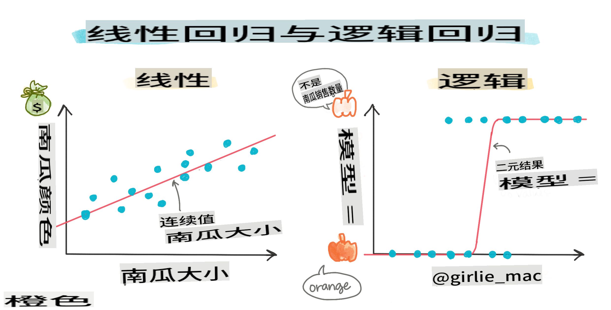
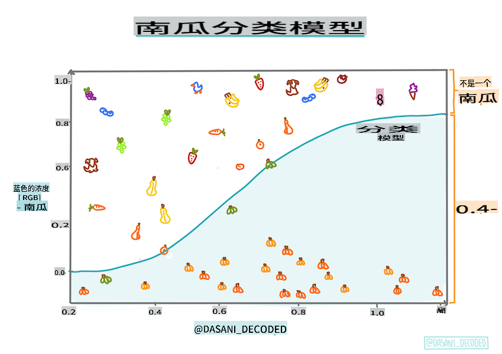
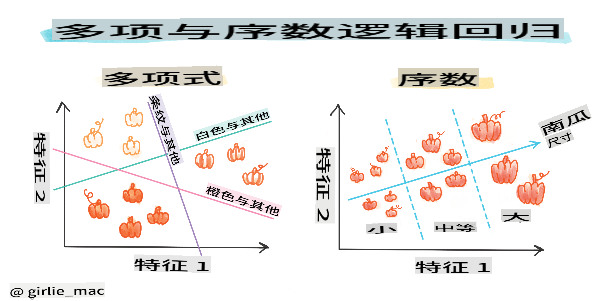
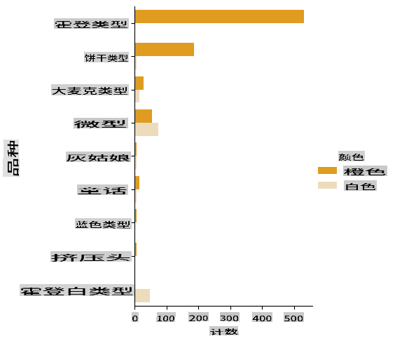
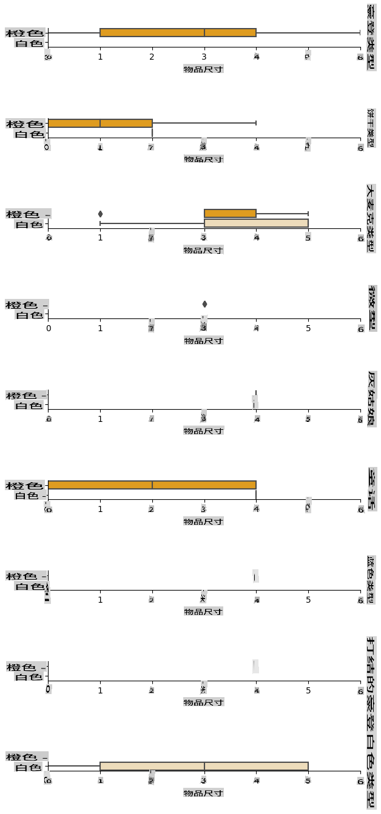
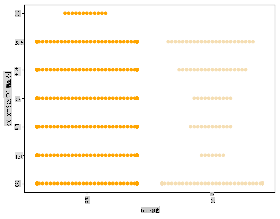
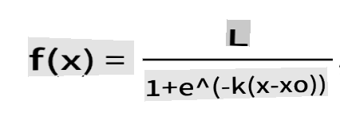
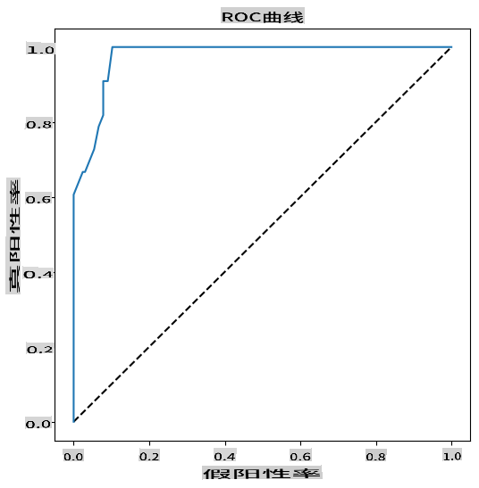

# 使用逻辑回归预测分类



## [课前测验](https://gray-sand-07a10f403.1.azurestaticapps.net/quiz/15/)

> ### [本课程也有 R 版本！](../../../../2-Regression/4-Logistic/solution/R/lesson_4.html)

## 简介

在这最后一节关于回归的课程中，我们将介绍逻辑回归，这是一种经典的机器学习技术。你可以使用这种技术来发现模式并预测二元分类。这颗糖果是巧克力吗？这种疾病是否具有传染性？这个顾客会选择这个产品吗？

在本课中，你将学习：

- 一个新的数据可视化库
- 逻辑回归的技巧

✅ 在这个 [学习模块](https://docs.microsoft.com/learn/modules/train-evaluate-classification-models?WT.mc_id=academic-77952-leestott) 中深入了解如何使用这种回归方法

## 前提条件

在处理南瓜数据的过程中，我们已经足够熟悉这个数据集，意识到有一个二元分类可以使用：`Color`。

让我们构建一个逻辑回归模型来预测，给定一些变量，_某个南瓜的颜色可能是什么_（橙色 🎃 或白色 👻）。

> 为什么在回归课程中讨论二元分类？只是为了语言上的方便，因为逻辑回归实际上是 [一种分类方法](https://scikit-learn.org/stable/modules/linear_model.html#logistic-regression)，虽然它基于线性。了解其他分类数据的方法将在下一个课程组中讨论。

## 定义问题

对于我们的目的，我们将其表达为二元分类：“白色”或“非白色”。我们的数据集中还有一个“条纹”类别，但实例很少，所以我们不会使用它。无论如何，一旦我们从数据集中移除空值，它就会消失。

> 🎃 有趣的事实，我们有时称白色南瓜为“幽灵”南瓜。它们不太容易雕刻，所以不像橙色南瓜那么受欢迎，但它们看起来很酷！所以我们也可以将问题重新表述为：“幽灵”或“非幽灵”。👻

## 关于逻辑回归

逻辑回归与之前学过的线性回归在几个重要方面有所不同。

[](https://youtu.be/KpeCT6nEpBY "机器学习初学者 - 了解用于分类的逻辑回归")

> 🎥 点击上方图片观看关于逻辑回归的简短视频概述。

### 二元分类

逻辑回归不提供与线性回归相同的功能。前者提供关于二元分类（“白色或非白色”）的预测，而后者能够预测连续值，例如给定南瓜的产地和收获时间，_其价格将上涨多少_。


> 信息图由 [Dasani Madipalli](https://twitter.com/dasani_decoded) 提供

### 其他分类

还有其他类型的逻辑回归，包括多项和序数：

- **多项式**，涉及多个类别 - “橙色、白色和条纹”。
- **序数**，涉及有序类别，如果我们想根据有限数量的尺寸（迷你、小、中、大、超大、特大）对南瓜进行逻辑排序，这种方法很有用。



### 变量不需要相关

还记得线性回归在变量相关性更高时效果更好吗？逻辑回归正好相反 - 变量不需要对齐。这适用于相关性较弱的数据。

### 你需要大量干净的数据

如果使用更多数据，逻辑回归会给出更准确的结果；我们的小数据集对于这个任务来说并不理想，所以请记住这一点。

[](https://youtu.be/B2X4H9vcXTs "机器学习初学者 - 数据分析与准备")

✅ 思考哪些类型的数据适合逻辑回归

## 练习 - 整理数据

首先，稍微清理一下数据，删除空值并选择一些列：

1. 添加以下代码：

    ```python
  
    columns_to_select = ['City Name','Package','Variety', 'Origin','Item Size', 'Color']
    pumpkins = full_pumpkins.loc[:, columns_to_select]

    pumpkins.dropna(inplace=True)
    ```

    你可以随时查看新的数据框：

    ```python
    pumpkins.info
    ```

### 可视化 - 分类图

到现在你已经加载了 [starter notebook](../../../../2-Regression/4-Logistic/notebook.ipynb) 再次使用南瓜数据并清理它，以保留包含一些变量的数据集，包括 `Color`。让我们使用不同的库来可视化数据框：[Seaborn](https://seaborn.pydata.org/index.html)，它基于我们之前使用的 Matplotlib。

Seaborn 提供了一些很好的方法来可视化你的数据。例如，你可以在分类图中比较每个 `Variety` 和 `Color` 的数据分布。

1. 使用 `catplot` function, using our pumpkin data `pumpkins` 创建这样的图，并为每个南瓜类别（橙色或白色）指定颜色映射：

    ```python
    import seaborn as sns
    
    palette = {
    'ORANGE': 'orange',
    'WHITE': 'wheat',
    }

    sns.catplot(
    data=pumpkins, y="Variety", hue="Color", kind="count",
    palette=palette, 
    )
    ```

    

    通过观察数据，你可以看到颜色数据与品种的关系。

    ✅ 根据这个分类图，你可以设想哪些有趣的探索？

### 数据预处理：特征和标签编码
我们的南瓜数据集的所有列都包含字符串值。处理分类数据对人类来说很直观，但对机器来说却不是。机器学习算法在处理数字时效果更好。这就是为什么编码是数据预处理阶段非常重要的一步，因为它使我们能够将分类数据转换为数值数据，而不会丢失任何信息。良好的编码有助于构建一个好的模型。

对于特征编码，主要有两种编码器：

1. 序数编码器：适用于序数变量，即其数据具有逻辑顺序的分类变量，如数据集中的 `Item Size` 列。它创建一个映射，使每个类别由一个数字表示，该数字是列中类别的顺序。

    ```python
    from sklearn.preprocessing import OrdinalEncoder

    item_size_categories = [['sml', 'med', 'med-lge', 'lge', 'xlge', 'jbo', 'exjbo']]
    ordinal_features = ['Item Size']
    ordinal_encoder = OrdinalEncoder(categories=item_size_categories)
    ```

2. 分类编码器：适用于名义变量，即其数据没有逻辑顺序的分类变量，如数据集中除 `Item Size` 之外的所有特征。它是一种独热编码，这意味着每个类别由一个二进制列表示：如果南瓜属于该品种，则编码变量等于1，否则为0。

    ```python
    from sklearn.preprocessing import OneHotEncoder

    categorical_features = ['City Name', 'Package', 'Variety', 'Origin']
    categorical_encoder = OneHotEncoder(sparse_output=False)
    ```
然后，使用 `ColumnTransformer` 将多个编码器组合成一个步骤并将其应用于适当的列。

```python
    from sklearn.compose import ColumnTransformer
    
    ct = ColumnTransformer(transformers=[
        ('ord', ordinal_encoder, ordinal_features),
        ('cat', categorical_encoder, categorical_features)
        ])
    
    ct.set_output(transform='pandas')
    encoded_features = ct.fit_transform(pumpkins)
```
另一方面，为了编码标签，我们使用 scikit-learn 的 `LabelEncoder` 类，这是一个实用类，帮助规范化标签，使它们只包含0到 n_classes-1（这里是0和1）之间的值。

```python
    from sklearn.preprocessing import LabelEncoder

    label_encoder = LabelEncoder()
    encoded_label = label_encoder.fit_transform(pumpkins['Color'])
```
一旦我们对特征和标签进行编码，我们可以将它们合并到一个新的数据框 `encoded_pumpkins` 中。

```python
    encoded_pumpkins = encoded_features.assign(Color=encoded_label)
```
✅ 使用序数编码器对 `Item Size` column?

### Analyse relationships between variables

Now that we have pre-processed our data, we can analyse the relationships between the features and the label to grasp an idea of how well the model will be able to predict the label given the features.
The best way to perform this kind of analysis is plotting the data. We'll be using again the Seaborn `catplot` function, to visualize the relationships between `Item Size`,  `Variety` 和 `Color` 在分类图中的优势是什么？为了更好地绘制数据，我们将使用编码后的 `Item Size` column and the unencoded `Variety` 列。

```python
    palette = {
    'ORANGE': 'orange',
    'WHITE': 'wheat',
    }
    pumpkins['Item Size'] = encoded_pumpkins['ord__Item Size']

    g = sns.catplot(
        data=pumpkins,
        x="Item Size", y="Color", row='Variety',
        kind="box", orient="h",
        sharex=False, margin_titles=True,
        height=1.8, aspect=4, palette=palette,
    )
    g.set(xlabel="Item Size", ylabel="").set(xlim=(0,6))
    g.set_titles(row_template="{row_name}")
```


### 使用群图

由于颜色是一个二元类别（白色或非白色），它需要“[专门的可视化方法](https://seaborn.pydata.org/tutorial/categorical.html?highlight=bar)”。还有其他方法可以可视化这个类别与其他变量的关系。

你可以使用 Seaborn 图表并排可视化变量。

1. 尝试使用“群图”来显示值的分布：

    ```python
    palette = {
    0: 'orange',
    1: 'wheat'
    }
    sns.swarmplot(x="Color", y="ord__Item Size", data=encoded_pumpkins, palette=palette)
    ```

    

**注意**：上述代码可能会生成警告，因为 seaborn 无法在群图中表示如此多的数据点。一个可能的解决方案是减小标记的大小，使用 'size' 参数。然而，请注意这会影响图的可读性。

> **🧮 展示数学**
>
> 逻辑回归依赖于使用 [Sigmoid 函数](https://wikipedia.org/wiki/Sigmoid_function) 的“最大似然”概念。Sigmoid 函数在图上看起来像一个“S”形。它取一个值并将其映射到0到1之间的某个位置。它的曲线也被称为“逻辑曲线”。其公式如下：
>
> 
>
> 其中 Sigmoid 的中点位于 x 的0点，L 是曲线的最大值，k 是曲线的陡度。如果函数的结果大于0.5，则该标签将被赋予二元选择的“1”类。如果不是，则将其分类为“0”。

## 构建你的模型

在 Scikit-learn 中构建一个二元分类模型非常简单。

[](https://youtu.be/MmZS2otPrQ8 "机器学习初学者 - 用于数据分类的逻辑回归")

> 🎥 点击上方图片观看关于构建线性回归模型的简短视频概述。

1. 选择要在分类模型中使用的变量，并调用 `train_test_split()` 来拆分训练和测试集：

    ```python
    from sklearn.model_selection import train_test_split
    
    X = encoded_pumpkins[encoded_pumpkins.columns.difference(['Color'])]
    y = encoded_pumpkins['Color']

    X_train, X_test, y_train, y_test = train_test_split(X, y, test_size=0.2, random_state=0)
    
    ```

2. 现在你可以通过调用 `fit()` 使用训练数据训练你的模型，并打印出其结果：

    ```python
    from sklearn.metrics import f1_score, classification_report 
    from sklearn.linear_model import LogisticRegression

    model = LogisticRegression()
    model.fit(X_train, y_train)
    predictions = model.predict(X_test)

    print(classification_report(y_test, predictions))
    print('Predicted labels: ', predictions)
    print('F1-score: ', f1_score(y_test, predictions))
    ```

    看一下你模型的评分板。考虑到你只有大约1000行数据，这还不错：

    ```output
                       precision    recall  f1-score   support
    
                    0       0.94      0.98      0.96       166
                    1       0.85      0.67      0.75        33
    
        accuracy                                0.92       199
        macro avg           0.89      0.82      0.85       199
        weighted avg        0.92      0.92      0.92       199
    
        Predicted labels:  [0 0 0 0 0 0 0 0 0 0 0 0 0 0 0 0 0 0 0 0 1 0 0 1 0 0 0 0 0 0 0 0 1 0 0 0 0
        0 0 0 0 0 1 0 1 0 0 1 0 0 0 0 0 1 0 1 0 1 0 1 0 0 0 0 0 0 0 0 0 0 0 0 0 0
        1 0 0 0 0 0 0 0 1 0 0 0 0 0 0 0 1 0 0 0 0 0 0 0 0 1 0 1 0 0 0 0 0 0 0 1 0
        0 0 0 0 0 0 0 0 0 0 0 0 0 0 0 0 0 0 0 0 0 1 0 0 0 0 0 0 0 0 1 0 0 0 1 1 0
        0 0 0 0 1 0 0 0 0 0 1 0 0 0 0 0 0 0 0 0 0 0 0 0 0 0 0 0 0 0 0 0 0 0 0 0 1
        0 0 0 1 0 0 0 0 0 0 0 0 1 1]
        F1-score:  0.7457627118644068
    ```

## 通过混淆矩阵更好地理解

虽然你可以通过打印上面的项目来获得评分报告 [terms](https://scikit-learn.org/stable/modules/generated/sklearn.metrics.classification_report.html?highlight=classification_report#sklearn.metrics.classification_report)，但你可能能够通过使用 [混淆矩阵](https://scikit-learn.org/stable/modules/model_evaluation.html#confusion-matrix) 更容易地理解你的模型，以帮助我们了解模型的表现。

> 🎓 “[混淆矩阵](https://wikipedia.org/wiki/Confusion_matrix)”（或“错误矩阵”）是一个表，表达了模型的真 vs. 假阳性和阴性，从而评估预测的准确性。

1. 要使用混淆矩阵，请调用 `confusion_matrix()`：

    ```python
    from sklearn.metrics import confusion_matrix
    confusion_matrix(y_test, predictions)
    ```

    看一下你模型的混淆矩阵：

    ```output
    array([[162,   4],
           [ 11,  22]])
    ```

在 Scikit-learn 中，混淆矩阵的行（轴0）是实际标签，列（轴1）是预测标签。

|       |   0   |   1   |
| :---: | :---: | :---: |
|   0   |  TN   |  FP   |
|   1   |  FN   |  TP   |

这里发生了什么？假设我们的模型被要求在两个二元类别之间分类南瓜，即“白色”和“非白色”。

- 如果你的模型预测南瓜为非白色，实际上属于“非白色”类别，我们称之为真阴性，显示在左上角。
- 如果你的模型预测南瓜为白色，实际上属于“非白色”类别，我们称之为假阴性，显示在左下角。
- 如果你的模型预测南瓜为非白色，实际上属于“白色”类别，我们称之为假阳性，显示在右上角。
- 如果你的模型预测南瓜为白色，实际上属于“白色”类别，我们称之为真阳性，显示在右下角。

你可能已经猜到，真阳性和真阴性的数量越多，假阳性和假阴性的数量越少，模型的表现就越好。

混淆矩阵如何与精度和召回率相关？请记住，上面打印的分类报告显示了精度（0.85）和召回率（0.67）。

精度 = tp / (tp + fp) = 22 / (22 + 4) = 0.8461538461538461

召回率 = tp / (tp + fn) = 22 / (22 + 11) = 0.6666666666666666

✅ 问：根据混淆矩阵，模型表现如何？答：还不错，有很多真阴性，但也有一些假阴性。

让我们借助混淆矩阵的 TP/TN 和 FP/FN 映射，重新审视之前看到的术语：

🎓 精度：TP/(TP + FP) 在检索到的实例中相关实例的比例（例如，哪些标签被正确标记）

🎓 召回率：TP/(TP + FN) 检索到的相关实例的比例，无论是否标记正确

🎓 f1-score：（2 * 精度 * 召回率）/（精度 + 召回率）精度和召回率的加权平均值，最好为1，最差为0

🎓 支持：每个标签检索到的实例的数量

🎓 准确率：（TP + TN）/（TP + TN + FP + FN）样本中准确预测的标签的百分比。

🎓 宏平均：每个标签的未加权平均指标的计算，不考虑标签不平衡。

🎓 加权平均：每个标签的平均指标的计算，考虑标签不平衡，通过其支持（每个标签的真实实例数量）加权。

✅ 如果你希望模型减少假阴性的数量，你应该关注哪个指标？

## 可视化此模型的 ROC 曲线

[](https://youtu.be/GApO575jTA0 "机器学习初学者 - 使用 ROC 曲线分析逻辑回归性能")

> 🎥 点击上方图片观看关于 ROC 曲线的简短视频概述

让我们做一个可视化，看看所谓的“ROC”曲线：

```python
from sklearn.metrics import roc_curve, roc_auc_score
import matplotlib
import matplotlib.pyplot as plt
%matplotlib inline

y_scores = model.predict_proba(X_test)
fpr, tpr, thresholds = roc_curve(y_test, y_scores[:,1])

fig = plt.figure(figsize=(6, 6))
plt.plot([0, 1], [0, 1], 'k--')
plt.plot(fpr, tpr)
plt.xlabel('False Positive Rate')
plt.ylabel('True Positive Rate')
plt.title('ROC Curve')
plt.show()
```

使用 Matplotlib 绘制模型的 [接收者操作特性](https://scikit-learn.org/stable/auto_examples/model_selection/plot_roc.html?highlight=roc) 或 ROC。ROC 曲线通常用于查看分类器的输出在真实和假阳性方面的表现。“ROC 曲线通常在 Y 轴上显示真实阳性率，在 X 轴上显示假阳性率。”因此，曲线的陡度和曲线与中点线之间的空间很重要：你希望曲线迅速向上并越过线。在我们的情况下，一开始有假阳性，然后线条正确地向上并越过：



最后，使用 Scikit-learn 的 [`roc_auc_score` API](https://scikit-learn.org/stable/modules/generated/sklearn.metrics.roc_auc_score.html?highlight=roc_auc#sklearn.metrics.roc_auc_score) 计算实际的“曲线下面积”（AUC）：

```python
auc = roc_auc_score(y_test,y_scores[:,1])
print(auc)
```
结果是 `0.9749908725812341`。由于 AUC 范围从0到1，你希望分数越大越好，因为预测100%正确的模型的 AUC 为1；在这种情况下，模型_非常好_。

在未来的分类课程中，你将学习如何迭代以提高模型的分数。但现在，恭喜你！你已经完成了这些回归课程！

---
## 🚀挑战

关于逻辑回归还有很多内容需要解读！但学习的最佳方式是实验。找到一个适合这种分析的数据集，并用它构建一个模型。你学到了什么？提示：试试 [Kaggle](https://www.kaggle.com/search?q=logistic+regression+datasets) 找有趣的数据集。

## [课后测验](https://gray-sand-07a10f403.1.azurestaticapps.net/quiz/16/)

## 复习与自学

阅读 [斯坦福大学的这篇论文](https://web.stanford.edu/~jurafsky/slp3/5.pdf) 的前几页，了解逻辑回归的一些实际用途。思考哪些任务更适合我们到目前为止学习的回归任务。哪种方法最适合？

## 作业

[重试这个回归](assignment.md)

**免责声明**:
本文件已使用基于机器的人工智能翻译服务进行翻译。尽管我们努力确保准确性，但请注意，自动翻译可能包含错误或不准确之处。应将原始语言的文件视为权威来源。对于关键信息，建议进行专业的人类翻译。我们不对使用此翻译引起的任何误解或误读负责。