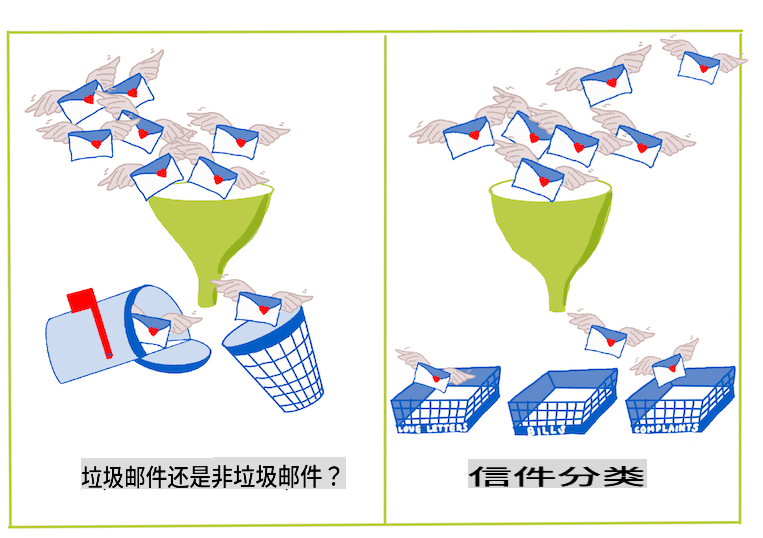
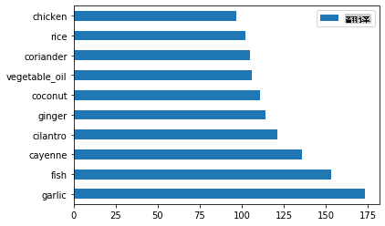
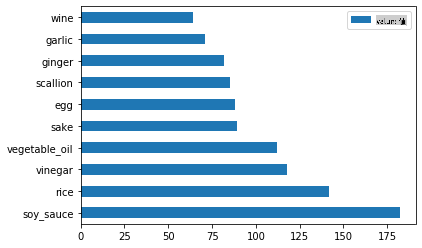
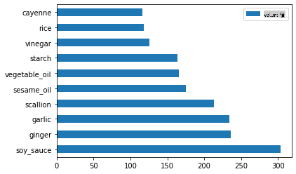
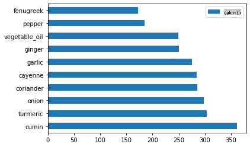
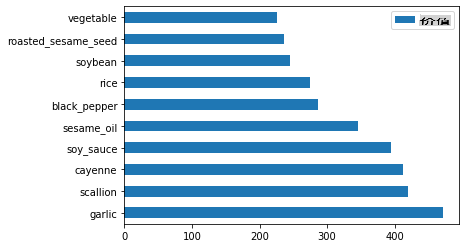

<!--
CO_OP_TRANSLATOR_METADATA:
{
  "original_hash": "76438ce4e5d48982d48f1b55c981caac",
  "translation_date": "2025-09-03T18:14:06+00:00",
  "source_file": "4-Classification/1-Introduction/README.md",
  "language_code": "zh"
}
-->
# 分类简介

在这四节课中，你将探索经典机器学习的一个核心主题——_分类_。我们将使用一个关于亚洲和印度美食的数据集，尝试各种分类算法。希望你已经准备好大快朵颐了！


> 在这些课程中庆祝泛亚洲美食！图片由 [Jen Looper](https://twitter.com/jenlooper) 提供

分类是一种[监督学习](https://wikipedia.org/wiki/Supervised_learning)形式，与回归技术有许多相似之处。如果机器学习的核心是通过数据集预测值或事物的名称，那么分类通常分为两类：_二元分类_和_多类分类_。

[](https://youtu.be/eg8DJYwdMyg "分类简介")

> 🎥 点击上方图片观看视频：MIT的John Guttag介绍分类

记住：

- **线性回归**帮助你预测变量之间的关系，并准确预测新数据点在该线性关系中的位置。例如，你可以预测_南瓜在九月和十二月的价格_。
- **逻辑回归**帮助你发现“二元类别”：在这个价格点，_这个南瓜是橙色还是非橙色_？

分类使用各种算法来确定数据点的标签或类别。让我们使用这个美食数据集，看看通过观察一组食材，是否可以确定它的美食来源。

## [课前测验](https://gray-sand-07a10f403.1.azurestaticapps.net/quiz/19/)

> ### [本课程提供R语言版本！](../../../../4-Classification/1-Introduction/solution/R/lesson_10.html)

### 简介

分类是机器学习研究人员和数据科学家的基本活动之一。从简单的二元值分类（“这封邮件是垃圾邮件还是不是？”），到使用计算机视觉进行复杂的图像分类和分割，能够将数据分类并提出问题总是非常有用。

用更科学的方式来说，你的分类方法会创建一个预测模型，使你能够将输入变量与输出变量之间的关系进行映射。



> 分类算法处理二元问题与多类问题。信息图由 [Jen Looper](https://twitter.com/jenlooper) 提供

在开始清理数据、可视化数据以及为机器学习任务准备数据之前，让我们先了解一下机器学习分类数据的各种方式。

分类源于[统计学](https://wikipedia.org/wiki/Statistical_classification)，使用经典机器学习技术通过特征（如`smoker`、`weight`和`age`）来确定_患某种疾病的可能性_。作为一种类似于你之前进行的回归练习的监督学习技术，你的数据是带标签的，机器学习算法使用这些标签来分类和预测数据集的类别（或“特征”），并将其分配到某个组或结果中。

✅ 想象一下一个关于美食的数据集。多类模型可以回答什么问题？二元模型可以回答什么问题？如果你想确定某种美食是否可能使用葫芦巴叶呢？如果你想知道，给你一袋包含八角、洋蓟、花椰菜和辣根的杂货，你是否可以制作一道典型的印度菜呢？

[](https://youtu.be/GuTeDbaNoEU "疯狂的神秘篮子")

> 🎥 点击上方图片观看视频。节目《Chopped》的核心理念是“神秘篮子”，厨师需要用随机选择的食材制作一道菜。机器学习模型肯定能帮上忙！

## 你好，分类器

我们想要从这个美食数据集中提出的问题实际上是一个**多类问题**，因为我们有多个潜在的国家美食可以选择。给定一组食材，这些数据会属于哪一个类别？

Scikit-learn提供了几种不同的算法来分类数据，具体取决于你想解决的问题类型。在接下来的两节课中，你将学习其中几种算法。

## 练习 - 清理并平衡数据

在开始这个项目之前，第一步是清理并**平衡**数据，以获得更好的结果。从本文件夹根目录中的空白_notebook.ipynb_文件开始。

首先需要安装 [imblearn](https://imbalanced-learn.org/stable/)。这是一个Scikit-learn的包，可以帮助你更好地平衡数据（稍后你会了解更多关于这个任务的内容）。

1. 安装`imblearn`，运行`pip install`，如下所示：

    ```python
    pip install imblearn
    ```

1. 导入所需的包以导入数据并进行可视化，同时从`imblearn`中导入`SMOTE`。

    ```python
    import pandas as pd
    import matplotlib.pyplot as plt
    import matplotlib as mpl
    import numpy as np
    from imblearn.over_sampling import SMOTE
    ```

    现在你已经准备好导入数据了。

1. 下一步是导入数据：

    ```python
    df  = pd.read_csv('../data/cuisines.csv')
    ```

   使用`read_csv()`将读取_csv文件_cusines.csv_的内容，并将其放入变量`df`中。

1. 检查数据的形状：

    ```python
    df.head()
    ```

   前五行看起来如下：

    ```output
    |     | Unnamed: 0 | cuisine | almond | angelica | anise | anise_seed | apple | apple_brandy | apricot | armagnac | ... | whiskey | white_bread | white_wine | whole_grain_wheat_flour | wine | wood | yam | yeast | yogurt | zucchini |
    | --- | ---------- | ------- | ------ | -------- | ----- | ---------- | ----- | ------------ | ------- | -------- | --- | ------- | ----------- | ---------- | ----------------------- | ---- | ---- | --- | ----- | ------ | -------- |
    | 0   | 65         | indian  | 0      | 0        | 0     | 0          | 0     | 0            | 0       | 0        | ... | 0       | 0           | 0          | 0                       | 0    | 0    | 0   | 0     | 0      | 0        |
    | 1   | 66         | indian  | 1      | 0        | 0     | 0          | 0     | 0            | 0       | 0        | ... | 0       | 0           | 0          | 0                       | 0    | 0    | 0   | 0     | 0      | 0        |
    | 2   | 67         | indian  | 0      | 0        | 0     | 0          | 0     | 0            | 0       | 0        | ... | 0       | 0           | 0          | 0                       | 0    | 0    | 0   | 0     | 0      | 0        |
    | 3   | 68         | indian  | 0      | 0        | 0     | 0          | 0     | 0            | 0       | 0        | ... | 0       | 0           | 0          | 0                       | 0    | 0    | 0   | 0     | 0      | 0        |
    | 4   | 69         | indian  | 0      | 0        | 0     | 0          | 0     | 0            | 0       | 0        | ... | 0       | 0           | 0          | 0                       | 0    | 0    | 0   | 0     | 1      | 0        |
    ```

1. 通过调用`info()`获取数据的信息：

    ```python
    df.info()
    ```

    输出类似于：

    ```output
    <class 'pandas.core.frame.DataFrame'>
    RangeIndex: 2448 entries, 0 to 2447
    Columns: 385 entries, Unnamed: 0 to zucchini
    dtypes: int64(384), object(1)
    memory usage: 7.2+ MB
    ```

## 练习 - 了解美食

现在工作开始变得有趣了。让我们发现每种美食的数据分布情况。

1. 通过调用`barh()`将数据绘制为条形图：

    ```python
    df.cuisine.value_counts().plot.barh()
    ```

    

    美食的种类是有限的，但数据分布不均。你可以解决这个问题！在解决之前，先多探索一下。

1. 找出每种美食的数据量并打印出来：

    ```python
    thai_df = df[(df.cuisine == "thai")]
    japanese_df = df[(df.cuisine == "japanese")]
    chinese_df = df[(df.cuisine == "chinese")]
    indian_df = df[(df.cuisine == "indian")]
    korean_df = df[(df.cuisine == "korean")]
    
    print(f'thai df: {thai_df.shape}')
    print(f'japanese df: {japanese_df.shape}')
    print(f'chinese df: {chinese_df.shape}')
    print(f'indian df: {indian_df.shape}')
    print(f'korean df: {korean_df.shape}')
    ```

    输出如下所示：

    ```output
    thai df: (289, 385)
    japanese df: (320, 385)
    chinese df: (442, 385)
    indian df: (598, 385)
    korean df: (799, 385)
    ```

## 探索食材

现在你可以深入研究数据，了解每种美食的典型食材。你应该清理掉那些在不同美食之间造成混淆的重复数据，因此让我们了解这个问题。

1. 在Python中创建一个函数`create_ingredient()`，用于创建一个食材数据框。这个函数将首先删除一个无用的列，并按计数对食材进行排序：

    ```python
    def create_ingredient_df(df):
        ingredient_df = df.T.drop(['cuisine','Unnamed: 0']).sum(axis=1).to_frame('value')
        ingredient_df = ingredient_df[(ingredient_df.T != 0).any()]
        ingredient_df = ingredient_df.sort_values(by='value', ascending=False,
        inplace=False)
        return ingredient_df
    ```

   现在你可以使用这个函数来了解每种美食中最受欢迎的前十种食材。

1. 调用`create_ingredient()`并通过调用`barh()`绘制图表：

    ```python
    thai_ingredient_df = create_ingredient_df(thai_df)
    thai_ingredient_df.head(10).plot.barh()
    ```

    

1. 对日本美食数据执行相同操作：

    ```python
    japanese_ingredient_df = create_ingredient_df(japanese_df)
    japanese_ingredient_df.head(10).plot.barh()
    ```

    

1. 接下来是中国美食的食材：

    ```python
    chinese_ingredient_df = create_ingredient_df(chinese_df)
    chinese_ingredient_df.head(10).plot.barh()
    ```

    

1. 绘制印度美食的食材：

    ```python
    indian_ingredient_df = create_ingredient_df(indian_df)
    indian_ingredient_df.head(10).plot.barh()
    ```

    

1. 最后，绘制韩国美食的食材：

    ```python
    korean_ingredient_df = create_ingredient_df(korean_df)
    korean_ingredient_df.head(10).plot.barh()
    ```

    

1. 现在，通过调用`drop()`删除那些在不同美食之间造成混淆的最常见食材：

   每个人都喜欢米饭、大蒜和姜！

    ```python
    feature_df= df.drop(['cuisine','Unnamed: 0','rice','garlic','ginger'], axis=1)
    labels_df = df.cuisine #.unique()
    feature_df.head()
    ```

## 平衡数据集

现在你已经清理了数据，使用[SMOTE](https://imbalanced-learn.org/dev/references/generated/imblearn.over_sampling.SMOTE.html)——“合成少数类过采样技术”——来平衡数据。

1. 调用`fit_resample()`，这种策略通过插值生成新的样本。

    ```python
    oversample = SMOTE()
    transformed_feature_df, transformed_label_df = oversample.fit_resample(feature_df, labels_df)
    ```

    通过平衡数据，你在分类时会获得更好的结果。想象一个二元分类。如果你的大部分数据属于一个类别，机器学习模型会更频繁地预测该类别，仅仅因为它的数据更多。平衡数据可以消除这种不平衡。

1. 现在你可以检查每种食材的标签数量：

    ```python
    print(f'new label count: {transformed_label_df.value_counts()}')
    print(f'old label count: {df.cuisine.value_counts()}')
    ```

    输出如下所示：

    ```output
    new label count: korean      799
    chinese     799
    indian      799
    japanese    799
    thai        799
    Name: cuisine, dtype: int64
    old label count: korean      799
    indian      598
    chinese     442
    japanese    320
    thai        289
    Name: cuisine, dtype: int64
    ```

    数据现在干净、平衡，而且非常美味！

1. 最后一步是将平衡后的数据，包括标签和特征，保存到一个新的数据框中，并导出到一个文件中：

    ```python
    transformed_df = pd.concat([transformed_label_df,transformed_feature_df],axis=1, join='outer')
    ```

1. 你可以通过`transformed_df.head()`和`transformed_df.info()`再看一眼数据。保存一份数据副本以供后续课程使用：

    ```python
    transformed_df.head()
    transformed_df.info()
    transformed_df.to_csv("../data/cleaned_cuisines.csv")
    ```

    这个新的CSV文件现在可以在根数据文件夹中找到。

---

## 🚀挑战

本课程包含几个有趣的数据集。浏览`data`文件夹，看看是否有适合二元或多类分类的数据集？你会对这个数据集提出什么问题？

## [课后测验](https://gray-sand-07a10f403.1.azurestaticapps.net/quiz/20/)

## 复习与自学

探索SMOTE的API。它最适合哪些用例？它解决了哪些问题？

## 作业 

[探索分类方法](assignment.md)

---

**免责声明**：  
本文档使用AI翻译服务[Co-op Translator](https://github.com/Azure/co-op-translator)进行翻译。尽管我们努力确保翻译的准确性，但请注意，自动翻译可能包含错误或不准确之处。原始语言的文档应被视为权威来源。对于关键信息，建议使用专业人工翻译。我们不对因使用此翻译而产生的任何误解或误读承担责任。