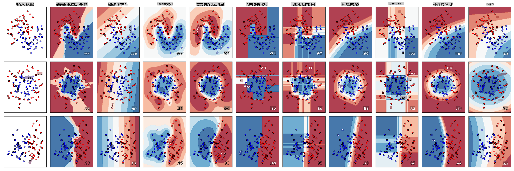
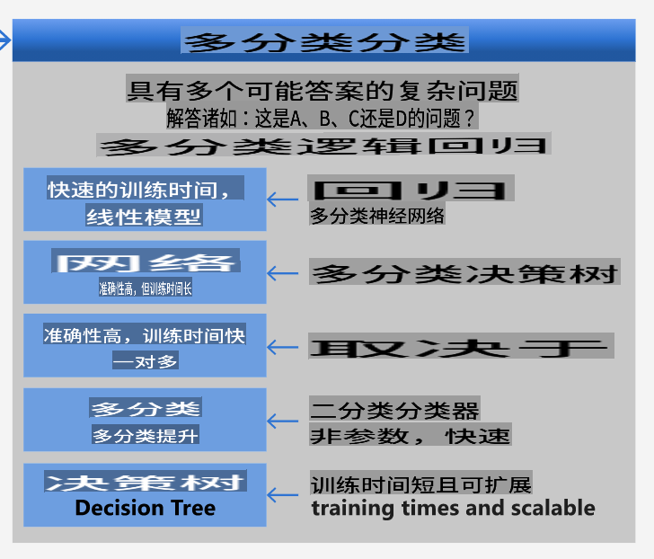
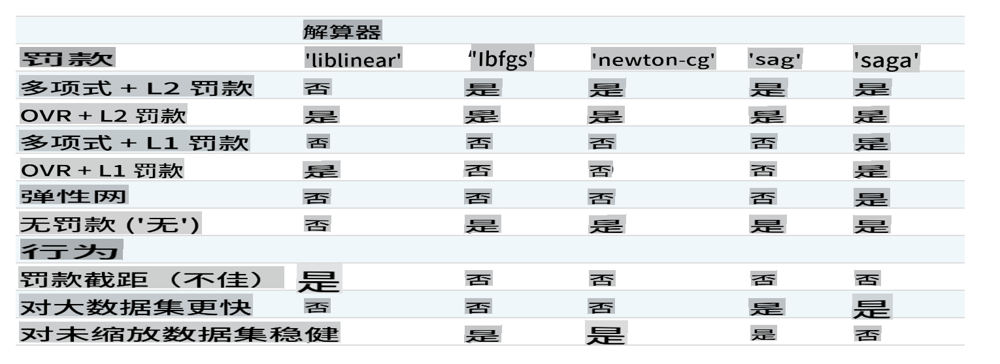

# 美食分类器 1

在本课中，你将使用上节课保存的数据集，这些数据是关于美食的平衡、干净的数据。

你将使用这个数据集与各种分类器一起工作，_根据一组食材预测给定的国家美食_。在此过程中，你将了解一些算法如何被用来完成分类任务。

## [课前测验](https://gray-sand-07a10f403.1.azurestaticapps.net/quiz/21/)
# 准备工作

假设你已经完成了[第一课](../1-Introduction/README.md)，确保在根目录 `/data` 文件夹中存在一个 _cleaned_cuisines.csv_ 文件，以供这四节课使用。

## 练习 - 预测国家美食

1. 在本课的 _notebook.ipynb_ 文件夹中，导入该文件和 Pandas 库：

    ```python
    import pandas as pd
    cuisines_df = pd.read_csv("../data/cleaned_cuisines.csv")
    cuisines_df.head()
    ```

    数据看起来是这样的：

|     | Unnamed: 0 | cuisine | almond | angelica | anise | anise_seed | apple | apple_brandy | apricot | armagnac | ... | whiskey | white_bread | white_wine | whole_grain_wheat_flour | wine | wood | yam | yeast | yogurt | zucchini |
| --- | ---------- | ------- | ------ | -------- | ----- | ---------- | ----- | ------------ | ------- | -------- | --- | ------- | ----------- | ---------- | ----------------------- | ---- | ---- | --- | ----- | ------ | -------- |
| 0   | 0          | indian  | 0      | 0        | 0     | 0          | 0     | 0            | 0       | 0        | ... | 0       | 0           | 0          | 0                       | 0    | 0    | 0   | 0     | 0      | 0        |
| 1   | 1          | indian  | 1      | 0        | 0     | 0          | 0     | 0            | 0       | 0        | ... | 0       | 0           | 0          | 0                       | 0    | 0    | 0   | 0     | 0      | 0        |
| 2   | 2          | indian  | 0      | 0        | 0     | 0          | 0     | 0            | 0       | 0        | ... | 0       | 0           | 0          | 0                       | 0    | 0    | 0   | 0     | 0      | 0        |
| 3   | 3          | indian  | 0      | 0        | 0     | 0          | 0     | 0            | 0       | 0        | ... | 0       | 0           | 0          | 0                       | 0    | 0    | 0   | 0     | 0      | 0        |
| 4   | 4          | indian  | 0      | 0        | 0     | 0          | 0     | 0            | 0       | 0        | ... | 0       | 0           | 0          | 0                       | 0    | 0    | 0   | 0     | 1      | 0        |
  

1. 现在，导入更多的库：

    ```python
    from sklearn.linear_model import LogisticRegression
    from sklearn.model_selection import train_test_split, cross_val_score
    from sklearn.metrics import accuracy_score,precision_score,confusion_matrix,classification_report, precision_recall_curve
    from sklearn.svm import SVC
    import numpy as np
    ```

1. 将 X 和 y 坐标分成两个用于训练的数据框架。`cuisine` 可以作为标签数据框：

    ```python
    cuisines_label_df = cuisines_df['cuisine']
    cuisines_label_df.head()
    ```

    它看起来是这样的：

    ```output
    0    indian
    1    indian
    2    indian
    3    indian
    4    indian
    Name: cuisine, dtype: object
    ```

1. 删除 `Unnamed: 0` column and the `cuisine` column, calling `drop()` 列。将剩余的数据保存为可训练的特征：

    ```python
    cuisines_feature_df = cuisines_df.drop(['Unnamed: 0', 'cuisine'], axis=1)
    cuisines_feature_df.head()
    ```

    你的特征看起来是这样的：

|      | almond | angelica | anise | anise_seed | apple | apple_brandy | apricot | armagnac | artemisia | artichoke |  ... | whiskey | white_bread | white_wine | whole_grain_wheat_flour | wine | wood |  yam | yeast | yogurt | zucchini |
| ---: | -----: | -------: | ----: | ---------: | ----: | -----------: | ------: | -------: | --------: | --------: | ---: | ------: | ----------: | ---------: | ----------------------: | ---: | ---: | ---: | ----: | -----: | -------: |
|    0 |      0 |        0 |     0 |          0 |     0 |            0 |       0 |        0 |         0 |         0 |  ... |       0 |           0 |          0 |                       0 |    0 |    0 |    0 |     0 |      0 |        0 | 0 |
|    1 |      1 |        0 |     0 |          0 |     0 |            0 |       0 |        0 |         0 |         0 |  ... |       0 |           0 |          0 |                       0 |    0 |    0 |    0 |     0 |      0 |        0 | 0 |
|    2 |      0 |        0 |     0 |          0 |     0 |            0 |       0 |        0 |         0 |         0 |  ... |       0 |           0 |          0 |                       0 |    0 |    0 |    0 |     0 |      0 |        0 | 0 |
|    3 |      0 |        0 |     0 |          0 |     0 |            0 |       0 |        0 |         0 |         0 |  ... |       0 |           0 |          0 |                       0 |    0 |    0 |    0 |     0 |      0 |        0 | 0 |
|    4 |      0 |        0 |     0 |          0 |     0 |            0 |       0 |        0 |         0 |         0 |  ... |       0 |           0 |          0 |                       0 |    0 |    0 |    0 |     0 |      1 |        0 | 0 |

现在你已经准备好训练你的模型了！

## 选择你的分类器

现在你的数据已经清理干净并准备好进行训练，你需要决定使用哪种算法来完成这项任务。

Scikit-learn 将分类归为监督学习，在这个类别中你会发现很多分类方法。 [种类繁多](https://scikit-learn.org/stable/supervised_learning.html)，乍一看可能会让人眼花缭乱。以下方法都包含分类技术：

- 线性模型
- 支持向量机
- 随机梯度下降
- 最近邻
- 高斯过程
- 决策树
- 集成方法（投票分类器）
- 多类和多输出算法（多类和多标签分类，多类-多输出分类）

> 你也可以使用[神经网络来分类数据](https://scikit-learn.org/stable/modules/neural_networks_supervised.html#classification)，但这超出了本课的范围。

### 选择哪个分类器？

那么，你应该选择哪个分类器呢？通常，运行多个分类器并寻找一个好的结果是一种测试方法。Scikit-learn 提供了一个[并排比较](https://scikit-learn.org/stable/auto_examples/classification/plot_classifier_comparison.html)的创建数据集，比较了 KNeighbors、SVC 两种方式、GaussianProcessClassifier、DecisionTreeClassifier、RandomForestClassifier、MLPClassifier、AdaBoostClassifier、GaussianNB 和 QuadraticDiscrinationAnalysis，展示了结果的可视化：


> 图表来自 Scikit-learn 的文档

> AutoML 通过在云中运行这些比较，允许你选择最适合你数据的算法，巧妙地解决了这个问题。试试[这里](https://docs.microsoft.com/learn/modules/automate-model-selection-with-azure-automl/?WT.mc_id=academic-77952-leestott)

### 更好的方法

比盲目猜测更好的方法是遵循这个可下载的[机器学习速查表](https://docs.microsoft.com/azure/machine-learning/algorithm-cheat-sheet?WT.mc_id=academic-77952-leestott)上的想法。在这里，我们发现，对于我们的多类问题，我们有一些选择：


> 微软算法速查表的一部分，详细介绍了多类分类选项

✅ 下载这个速查表，打印出来，挂在墙上！

### 推理

让我们看看能否根据我们面临的限制推理出不同的方法：

- **神经网络太重了**。考虑到我们的数据集干净但很少，并且我们是通过笔记本本地运行训练，神经网络对于这个任务来说太重了。
- **没有两类分类器**。我们不使用两类分类器，因此排除了 one-vs-all。
- **决策树或逻辑回归可能有效**。决策树可能有效，或者多类数据的逻辑回归。
- **多类增强决策树解决不同的问题**。多类增强决策树最适合非参数任务，例如设计用于构建排名的任务，因此对我们没有用。

### 使用 Scikit-learn 

我们将使用 Scikit-learn 来分析我们的数据。然而，在 Scikit-learn 中有许多方法可以使用逻辑回归。看看[需要传递的参数](https://scikit-learn.org/stable/modules/generated/sklearn.linear_model.LogisticRegression.html?highlight=logistic%20regressio#sklearn.linear_model.LogisticRegression)。

本质上有两个重要参数 - `multi_class` and `solver` - that we need to specify, when we ask Scikit-learn to perform a logistic regression. The `multi_class` value applies a certain behavior. The value of the solver is what algorithm to use. Not all solvers can be paired with all `multi_class` values.

According to the docs, in the multiclass case, the training algorithm:

- **Uses the one-vs-rest (OvR) scheme**, if the `multi_class` option is set to `ovr`
- **Uses the cross-entropy loss**, if the `multi_class` option is set to `multinomial`. (Currently the `multinomial` option is supported only by the ‘lbfgs’, ‘sag’, ‘saga’ and ‘newton-cg’ solvers.)"

> 🎓 The 'scheme' here can either be 'ovr' (one-vs-rest) or 'multinomial'. Since logistic regression is really designed to support binary classification, these schemes allow it to better handle multiclass classification tasks. [source](https://machinelearningmastery.com/one-vs-rest-and-one-vs-one-for-multi-class-classification/)

> 🎓 The 'solver' is defined as "the algorithm to use in the optimization problem". [source](https://scikit-learn.org/stable/modules/generated/sklearn.linear_model.LogisticRegression.html?highlight=logistic%20regressio#sklearn.linear_model.LogisticRegression).

Scikit-learn offers this table to explain how solvers handle different challenges presented by different kinds of data structures:



## Exercise - split the data

We can focus on logistic regression for our first training trial since you recently learned about the latter in a previous lesson.
Split your data into training and testing groups by calling `train_test_split()`：

```python
X_train, X_test, y_train, y_test = train_test_split(cuisines_feature_df, cuisines_label_df, test_size=0.3)
```

## 练习 - 应用逻辑回归

由于你使用的是多类情况，你需要选择什么 _方案_ 和设置什么 _求解器_。使用 LogisticRegression 的多类设置和 **liblinear** 求解器进行训练。

1. 创建一个多类设置为 `ovr` and the solver set to `liblinear` 的逻辑回归：

    ```python
    lr = LogisticRegression(multi_class='ovr',solver='liblinear')
    model = lr.fit(X_train, np.ravel(y_train))
    
    accuracy = model.score(X_test, y_test)
    print ("Accuracy is {}".format(accuracy))
    ```

    ✅ 尝试一个不同的求解器，例如 `lbfgs`, which is often set as default

    > Note, use Pandas [`ravel`](https://pandas.pydata.org/pandas-docs/stable/reference/api/pandas.Series.ravel.html) 函数在需要时展平你的数据。

    准确率超过 **80%**，效果很好！

1. 你可以通过测试一行数据（#50）来看到这个模型的实际效果：

    ```python
    print(f'ingredients: {X_test.iloc[50][X_test.iloc[50]!=0].keys()}')
    print(f'cuisine: {y_test.iloc[50]}')
    ```

    结果打印出来：

   ```output
   ingredients: Index(['cilantro', 'onion', 'pea', 'potato', 'tomato', 'vegetable_oil'], dtype='object')
   cuisine: indian
   ```

   ✅ 尝试一个不同的行号并检查结果

1. 更深入地了解，你可以检查这个预测的准确性：

    ```python
    test= X_test.iloc[50].values.reshape(-1, 1).T
    proba = model.predict_proba(test)
    classes = model.classes_
    resultdf = pd.DataFrame(data=proba, columns=classes)
    
    topPrediction = resultdf.T.sort_values(by=[0], ascending = [False])
    topPrediction.head()
    ```

    结果打印出来 - 印度菜是最好的猜测，概率很高：

    |          |        0 |
    | -------: | -------: |
    |   indian | 0.715851 |
    |  chinese | 0.229475 |
    | japanese | 0.029763 |
    |   korean | 0.017277 |
    |     thai | 0.007634 |

    ✅ 你能解释为什么模型非常确定这是印度菜吗？

1. 通过打印分类报告，获取更多细节，就像在回归课程中所做的那样：

    ```python
    y_pred = model.predict(X_test)
    print(classification_report(y_test,y_pred))
    ```

    |              | precision | recall | f1-score | support |
    | ------------ | --------- | ------ | -------- | ------- |
    | chinese      | 0.73      | 0.71   | 0.72     | 229     |
    | indian       | 0.91      | 0.93   | 0.92     | 254     |
    | japanese     | 0.70      | 0.75   | 0.72     | 220     |
    | korean       | 0.86      | 0.76   | 0.81     | 242     |
    | thai         | 0.79      | 0.85   | 0.82     | 254     |
    | accuracy     | 0.80      | 1199   |          |         |
    | macro avg    | 0.80      | 0.80   | 0.80     | 1199    |
    | weighted avg | 0.80      | 0.80   | 0.80     | 1199    |

## 🚀挑战

在本课中，你使用清理后的数据构建了一个机器学习模型，可以根据一系列食材预测国家美食。花点时间阅读 Scikit-learn 提供的许多分类数据的选项。深入了解“求解器”的概念，了解幕后发生了什么。

## [课后测验](https://gray-sand-07a10f403.1.azurestaticapps.net/quiz/22/)

## 回顾与自学

深入了解逻辑回归背后的数学原理，在[这节课](https://people.eecs.berkeley.edu/~russell/classes/cs194/f11/lectures/CS194%20Fall%202011%20Lecture%2006.pdf)
## 作业 

[研究求解器](assignment.md)

**免责声明**：
本文档已使用基于机器的人工智能翻译服务进行翻译。虽然我们努力确保准确性，但请注意，自动翻译可能包含错误或不准确之处。应将原文档的母语版本视为权威来源。对于关键信息，建议使用专业人工翻译。我们对使用本翻译可能引起的任何误解或误读不承担责任。