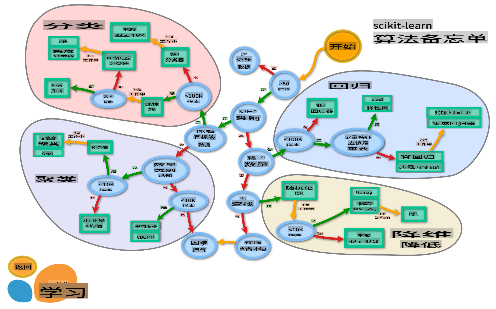

# 美食分类器 2

在第二节分类课程中，您将探索更多分类数值数据的方法。您还将了解选择不同分类器的后果。

## [课前测验](https://gray-sand-07a10f403.1.azurestaticapps.net/quiz/23/)

### 前提条件

我们假设您已经完成了前面的课程，并在您的 `data` 文件夹中有一个名为 _cleaned_cuisines.csv_ 的已清理数据集，该文件位于这四节课的根目录中。

### 准备

我们已经加载了您的 _notebook.ipynb_ 文件，并将已清理的数据集划分为 X 和 y 数据框，准备进行模型构建过程。

## 分类图

之前，您通过微软的速查表了解了分类数据的各种选项。Scikit-learn 提供了一个类似但更细致的速查表，可以进一步帮助您缩小估算器（分类器的另一种说法）的选择范围：


> 提示：[在线访问此图](https://scikit-learn.org/stable/tutorial/machine_learning_map/)并点击路径以阅读文档。

### 计划

一旦您对数据有了清晰的理解，这张图就非常有帮助，因为您可以沿着路径“走”到一个决策：

- 我们有超过50个样本
- 我们想预测一个类别
- 我们有标记的数据
- 我们有少于100K个样本
- ✨ 我们可以选择一个线性SVC
- 如果这不起作用，因为我们有数值数据
    - 我们可以尝试一个 ✨ KNeighbors 分类器 
      - 如果这不起作用，尝试 ✨ SVC 和 ✨ 集成分类器

这是一个非常有用的路径。

## 练习 - 划分数据

按照这条路径，我们应该从导入一些需要的库开始。

1. 导入所需的库：

    ```python
    from sklearn.neighbors import KNeighborsClassifier
    from sklearn.linear_model import LogisticRegression
    from sklearn.svm import SVC
    from sklearn.ensemble import RandomForestClassifier, AdaBoostClassifier
    from sklearn.model_selection import train_test_split, cross_val_score
    from sklearn.metrics import accuracy_score,precision_score,confusion_matrix,classification_report, precision_recall_curve
    import numpy as np
    ```

1. 划分您的训练和测试数据：

    ```python
    X_train, X_test, y_train, y_test = train_test_split(cuisines_feature_df, cuisines_label_df, test_size=0.3)
    ```

## 线性 SVC 分类器

支持向量聚类（SVC）是支持向量机家族中的一种机器学习技术（下面会详细介绍）。在这种方法中，您可以选择一个“核”来决定如何聚类标签。参数 'C' 指的是“正则化”，它调节参数的影响。核可以是[几种](https://scikit-learn.org/stable/modules/generated/sklearn.svm.SVC.html#sklearn.svm.SVC)中的一种；这里我们将其设置为“线性”，以确保我们利用线性 SVC。概率默认为“false”；在这里我们将其设置为“true”以收集概率估计。我们将随机状态设置为“0”以打乱数据以获得概率。

### 练习 - 应用线性 SVC

首先创建一个分类器数组。我们将在测试时逐步添加到这个数组中。

1. 从线性 SVC 开始：

    ```python
    C = 10
    # Create different classifiers.
    classifiers = {
        'Linear SVC': SVC(kernel='linear', C=C, probability=True,random_state=0)
    }
    ```

2. 使用线性 SVC 训练您的模型并打印出报告：

    ```python
    n_classifiers = len(classifiers)
    
    for index, (name, classifier) in enumerate(classifiers.items()):
        classifier.fit(X_train, np.ravel(y_train))
    
        y_pred = classifier.predict(X_test)
        accuracy = accuracy_score(y_test, y_pred)
        print("Accuracy (train) for %s: %0.1f%% " % (name, accuracy * 100))
        print(classification_report(y_test,y_pred))
    ```

    结果相当不错：

    ```output
    Accuracy (train) for Linear SVC: 78.6% 
                  precision    recall  f1-score   support
    
         chinese       0.71      0.67      0.69       242
          indian       0.88      0.86      0.87       234
        japanese       0.79      0.74      0.76       254
          korean       0.85      0.81      0.83       242
            thai       0.71      0.86      0.78       227
    
        accuracy                           0.79      1199
       macro avg       0.79      0.79      0.79      1199
    weighted avg       0.79      0.79      0.79      1199
    ```

## K-Neighbors 分类器

K-Neighbors 是“邻居”家族的机器学习方法的一部分，可以用于监督和非监督学习。在这种方法中，会创建预定义数量的点，并围绕这些点收集数据，以便为数据预测通用标签。

### 练习 - 应用 K-Neighbors 分类器

之前的分类器效果不错，并且与数据配合良好，但也许我们可以获得更好的准确性。试试 K-Neighbors 分类器。

1. 在分类器数组中添加一行（在线性 SVC 项目后添加一个逗号）：

    ```python
    'KNN classifier': KNeighborsClassifier(C),
    ```

    结果稍差一些：

    ```output
    Accuracy (train) for KNN classifier: 73.8% 
                  precision    recall  f1-score   support
    
         chinese       0.64      0.67      0.66       242
          indian       0.86      0.78      0.82       234
        japanese       0.66      0.83      0.74       254
          korean       0.94      0.58      0.72       242
            thai       0.71      0.82      0.76       227
    
        accuracy                           0.74      1199
       macro avg       0.76      0.74      0.74      1199
    weighted avg       0.76      0.74      0.74      1199
    ```

    ✅ 了解 [K-Neighbors](https://scikit-learn.org/stable/modules/neighbors.html#neighbors)

## 支持向量分类器

支持向量分类器是 [支持向量机](https://wikipedia.org/wiki/Support-vector_machine) 家族的一部分，这些机器学习方法用于分类和回归任务。SVMs 将“训练示例映射到空间中的点”以最大化两个类别之间的距离。随后将数据映射到此空间，以便预测它们的类别。

### 练习 - 应用支持向量分类器

让我们尝试用支持向量分类器获得更好的准确性。

1. 在 K-Neighbors 项目后添加一个逗号，然后添加这一行：

    ```python
    'SVC': SVC(),
    ```

    结果相当好！

    ```output
    Accuracy (train) for SVC: 83.2% 
                  precision    recall  f1-score   support
    
         chinese       0.79      0.74      0.76       242
          indian       0.88      0.90      0.89       234
        japanese       0.87      0.81      0.84       254
          korean       0.91      0.82      0.86       242
            thai       0.74      0.90      0.81       227
    
        accuracy                           0.83      1199
       macro avg       0.84      0.83      0.83      1199
    weighted avg       0.84      0.83      0.83      1199
    ```

    ✅ 了解 [支持向量](https://scikit-learn.org/stable/modules/svm.html#svm)

## 集成分类器

让我们走到这条路径的尽头，尽管前面的测试结果已经相当好。让我们尝试一些“集成分类器”，特别是随机森林和 AdaBoost：

```python
  'RFST': RandomForestClassifier(n_estimators=100),
  'ADA': AdaBoostClassifier(n_estimators=100)
```

结果非常好，尤其是随机森林：

```output
Accuracy (train) for RFST: 84.5% 
              precision    recall  f1-score   support

     chinese       0.80      0.77      0.78       242
      indian       0.89      0.92      0.90       234
    japanese       0.86      0.84      0.85       254
      korean       0.88      0.83      0.85       242
        thai       0.80      0.87      0.83       227

    accuracy                           0.84      1199
   macro avg       0.85      0.85      0.84      1199
weighted avg       0.85      0.84      0.84      1199

Accuracy (train) for ADA: 72.4% 
              precision    recall  f1-score   support

     chinese       0.64      0.49      0.56       242
      indian       0.91      0.83      0.87       234
    japanese       0.68      0.69      0.69       254
      korean       0.73      0.79      0.76       242
        thai       0.67      0.83      0.74       227

    accuracy                           0.72      1199
   macro avg       0.73      0.73      0.72      1199
weighted avg       0.73      0.72      0.72      1199
```

✅ 了解 [集成分类器](https://scikit-learn.org/stable/modules/ensemble.html)

这种机器学习方法“结合了几个基础估算器的预测”以提高模型的质量。在我们的示例中，我们使用了随机森林和 AdaBoost。

- [随机森林](https://scikit-learn.org/stable/modules/ensemble.html#forest)，一种平均方法，构建一个充满随机性的“决策树”森林，以避免过拟合。参数 n_estimators 设置为树的数量。

- [AdaBoost](https://scikit-learn.org/stable/modules/generated/sklearn.ensemble.AdaBoostClassifier.html) 将分类器拟合到数据集，然后将该分类器的副本拟合到同一数据集。它关注错误分类项的权重，并调整下一个分类器的拟合以进行修正。

---

## 🚀挑战

这些技术中的每一个都有大量参数可以调整。研究每个技术的默认参数，并思考调整这些参数对模型质量的影响。

## [课后测验](https://gray-sand-07a10f403.1.azurestaticapps.net/quiz/24/)

## 复习与自学

这些课程中有很多术语，所以花点时间复习一下[这个列表](https://docs.microsoft.com/dotnet/machine-learning/resources/glossary?WT.mc_id=academic-77952-leestott)中的有用术语！

## 作业 

[参数调试](assignment.md)

**免责声明**:
本文档是使用机器翻译服务翻译的。尽管我们努力确保准确性，但请注意，自动翻译可能包含错误或不准确之处。应以原文档的母语版本为权威来源。对于关键信息，建议使用专业的人类翻译。对于因使用本翻译而产生的任何误解或误读，我们概不负责。