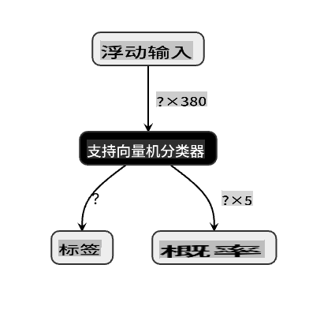

# 构建一个美食推荐 Web 应用

在本课中，你将使用之前课程中学到的一些技术，结合贯穿本系列课程使用的美食数据集，构建一个分类模型。此外，你还将构建一个小型 Web 应用来使用保存的模型，并利用 Onnx 的 Web 运行时。

机器学习最有用的实际应用之一是构建推荐系统，你今天可以迈出这一方向的第一步！

[](https://youtu.be/17wdM9AHMfg "应用机器学习")

> 🎥 点击上面的图片观看视频：Jen Looper 使用分类美食数据构建 Web 应用

## [课前小测验](https://gray-sand-07a10f403.1.azurestaticapps.net/quiz/25/)

在本课中你将学习：

- 如何构建模型并将其保存为 Onnx 模型
- 如何使用 Netron 检查模型
- 如何在 Web 应用中使用你的模型进行推断

## 构建你的模型

构建应用机器学习系统是利用这些技术为你的业务系统服务的重要部分。你可以使用 Onnx 在 Web 应用中使用模型（如果需要，也可以在离线环境中使用它们）。

在[之前的课程](../../3-Web-App/1-Web-App/README.md)中，你构建了一个关于 UFO 目击事件的回归模型，将其“腌制”并在 Flask 应用中使用。虽然这种架构非常有用，但它是一个全栈的 Python 应用，而你的需求可能包括使用 JavaScript 应用。

在本课中，你可以构建一个基于 JavaScript 的基本推断系统。但首先，你需要训练一个模型并将其转换为 Onnx 格式。

## 练习 - 训练分类模型

首先，使用我们之前使用的清理后的美食数据集训练一个分类模型。

1. 首先导入有用的库：

    ```python
    !pip install skl2onnx
    import pandas as pd 
    ```

    你需要 '[skl2onnx](https://onnx.ai/sklearn-onnx/)' 来帮助将你的 Scikit-learn 模型转换为 Onnx 格式。

1. 然后，以与之前课程相同的方式处理你的数据，通过 `read_csv()` 读取 CSV 文件：

    ```python
    data = pd.read_csv('../data/cleaned_cuisines.csv')
    data.head()
    ```

1. 移除前两个不必要的列，并将剩余的数据保存为 'X'：

    ```python
    X = data.iloc[:,2:]
    X.head()
    ```

1. 将标签保存为 'y'：

    ```python
    y = data[['cuisine']]
    y.head()
    
    ```

### 开始训练流程

我们将使用具有良好准确性的 'SVC' 库。

1. 从 Scikit-learn 导入适当的库：

    ```python
    from sklearn.model_selection import train_test_split
    from sklearn.svm import SVC
    from sklearn.model_selection import cross_val_score
    from sklearn.metrics import accuracy_score,precision_score,confusion_matrix,classification_report
    ```

1. 分离训练集和测试集：

    ```python
    X_train, X_test, y_train, y_test = train_test_split(X,y,test_size=0.3)
    ```

1. 构建一个 SVC 分类模型，如你在之前的课程中所做的那样：

    ```python
    model = SVC(kernel='linear', C=10, probability=True,random_state=0)
    model.fit(X_train,y_train.values.ravel())
    ```

1. 现在，测试你的模型，调用 `predict()`：

    ```python
    y_pred = model.predict(X_test)
    ```

1. 打印分类报告以检查模型的质量：

    ```python
    print(classification_report(y_test,y_pred))
    ```

    如我们之前所见，准确性很好：

    ```output
                    precision    recall  f1-score   support
    
         chinese       0.72      0.69      0.70       257
          indian       0.91      0.87      0.89       243
        japanese       0.79      0.77      0.78       239
          korean       0.83      0.79      0.81       236
            thai       0.72      0.84      0.78       224
    
        accuracy                           0.79      1199
       macro avg       0.79      0.79      0.79      1199
    weighted avg       0.79      0.79      0.79      1199
    ```

### 将你的模型转换为 Onnx

确保使用正确的 Tensor 数进行转换。此数据集中列出了 380 种成分，因此你需要在 `FloatTensorType` 中标注该数字：

1. 使用 380 的 tensor 数进行转换。

    ```python
    from skl2onnx import convert_sklearn
    from skl2onnx.common.data_types import FloatTensorType
    
    initial_type = [('float_input', FloatTensorType([None, 380]))]
    options = {id(model): {'nocl': True, 'zipmap': False}}
    ```

1. 创建 onx 文件并保存为 **model.onnx**：

    ```python
    onx = convert_sklearn(model, initial_types=initial_type, options=options)
    with open("./model.onnx", "wb") as f:
        f.write(onx.SerializeToString())
    ```

    > 注意，你可以在转换脚本中传递[选项](https://onnx.ai/sklearn-onnx/parameterized.html)。在本例中，我们将 'nocl' 设置为 True，并将 'zipmap' 设置为 False。由于这是一个分类模型，你可以选择移除 ZipMap，它会生成一个字典列表（不必要）。 `nocl` refers to class information being included in the model. Reduce your model's size by setting `nocl` to 'True'. 

Running the entire notebook will now build an Onnx model and save it to this folder.

## View your model

Onnx models are not very visible in Visual Studio code, but there's a very good free software that many researchers use to visualize the model to ensure that it is properly built. Download [Netron](https://github.com/lutzroeder/Netron) and  open your model.onnx file. You can see your simple model visualized, with its 380 inputs and classifier listed:



Netron is a helpful tool to view your models.

Now you are ready to use this neat model in a web app. Let's build an app that will come in handy when you look in your refrigerator and try to figure out which combination of your leftover ingredients you can use to cook a given cuisine, as determined by your model.

## Build a recommender web application

You can use your model directly in a web app. This architecture also allows you to run it locally and even offline if needed. Start by creating an `index.html` file in the same folder where you stored your `model.onnx` 文件。

1. 在这个文件 _index.html_ 中，添加以下标记：

    ```html
    <!DOCTYPE html>
    <html>
        <header>
            <title>Cuisine Matcher</title>
        </header>
        <body>
            ...
        </body>
    </html>
    ```

1. 现在，在 `body` 标签内工作，添加一些标记以显示反映某些成分的复选框列表：

    ```html
    <h1>Check your refrigerator. What can you create?</h1>
            <div id="wrapper">
                <div class="boxCont">
                    <input type="checkbox" value="4" class="checkbox">
                    <label>apple</label>
                </div>
            
                <div class="boxCont">
                    <input type="checkbox" value="247" class="checkbox">
                    <label>pear</label>
                </div>
            
                <div class="boxCont">
                    <input type="checkbox" value="77" class="checkbox">
                    <label>cherry</label>
                </div>
    
                <div class="boxCont">
                    <input type="checkbox" value="126" class="checkbox">
                    <label>fenugreek</label>
                </div>
    
                <div class="boxCont">
                    <input type="checkbox" value="302" class="checkbox">
                    <label>sake</label>
                </div>
    
                <div class="boxCont">
                    <input type="checkbox" value="327" class="checkbox">
                    <label>soy sauce</label>
                </div>
    
                <div class="boxCont">
                    <input type="checkbox" value="112" class="checkbox">
                    <label>cumin</label>
                </div>
            </div>
            <div style="padding-top:10px">
                <button onClick="startInference()">What kind of cuisine can you make?</button>
            </div> 
    ```

    注意，每个复选框都有一个值。这反映了成分在数据集中的索引位置。例如，苹果在这个按字母顺序排列的列表中占据第五列，所以它的值是 '4'，因为我们从 0 开始计数。你可以查阅[成分电子表格](../../../../4-Classification/data/ingredient_indexes.csv)来发现给定成分的索引。

    继续在 index.html 文件中工作，在最后一个关闭的 `</div>` 后添加一个脚本块，其中调用模型。

1. 首先，导入 [Onnx Runtime](https://www.onnxruntime.ai/)：

    ```html
    <script src="https://cdn.jsdelivr.net/npm/onnxruntime-web@1.9.0/dist/ort.min.js"></script> 
    ```

    > Onnx Runtime 用于在广泛的硬件平台上运行你的 Onnx 模型，包括优化和使用的 API。

1. 一旦 Runtime 就位，你可以调用它：

    ```html
    <script>
        const ingredients = Array(380).fill(0);
        
        const checks = [...document.querySelectorAll('.checkbox')];
        
        checks.forEach(check => {
            check.addEventListener('change', function() {
                // toggle the state of the ingredient
                // based on the checkbox's value (1 or 0)
                ingredients[check.value] = check.checked ? 1 : 0;
            });
        });

        function testCheckboxes() {
            // validate if at least one checkbox is checked
            return checks.some(check => check.checked);
        }

        async function startInference() {

            let atLeastOneChecked = testCheckboxes()

            if (!atLeastOneChecked) {
                alert('Please select at least one ingredient.');
                return;
            }
            try {
                // create a new session and load the model.
                
                const session = await ort.InferenceSession.create('./model.onnx');

                const input = new ort.Tensor(new Float32Array(ingredients), [1, 380]);
                const feeds = { float_input: input };

                // feed inputs and run
                const results = await session.run(feeds);

                // read from results
                alert('You can enjoy ' + results.label.data[0] + ' cuisine today!')

            } catch (e) {
                console.log(`failed to inference ONNX model`);
                console.error(e);
            }
        }
               
    </script>
    ```

在这段代码中，发生了几件事：

1. 你创建了一个包含 380 个可能值（1 或 0）的数组，这些值将根据成分复选框是否被选中而设置并发送到模型进行推断。
2. 你创建了一个复选框数组，并提供了一种确定它们是否被选中的方法，在 `init` function that is called when the application starts. When a checkbox is checked, the `ingredients` array is altered to reflect the chosen ingredient.
3. You created a `testCheckboxes` function that checks whether any checkbox was checked.
4. You use `startInference` function when the button is pressed and, if any checkbox is checked, you start inference.
5. The inference routine includes:
   1. Setting up an asynchronous load of the model
   2. Creating a Tensor structure to send to the model
   3. Creating 'feeds' that reflects the `float_input` input that you created when training your model (you can use Netron to verify that name)
   4. Sending these 'feeds' to the model and waiting for a response

## Test your application

Open a terminal session in Visual Studio Code in the folder where your index.html file resides. Ensure that you have [http-server](https://www.npmjs.com/package/http-server) installed globally, and type `http-server` 提示符下。一个本地主机应该会打开，你可以查看你的 Web 应用。检查根据各种成分推荐的美食：


恭喜，你已经创建了一个带有几个字段的“推荐” Web 应用。花点时间来完善这个系统吧！
## 🚀挑战

你的 Web 应用非常简单，因此继续使用[ingredient_indexes](../../../../4-Classification/data/ingredient_indexes.csv) 数据中的成分及其索引来完善它。哪些口味组合可以创造出特定的国家菜肴？

## [课后小测验](https://gray-sand-07a10f403.1.azurestaticapps.net/quiz/26/)

## 复习与自学

虽然本课只是触及了创建食材推荐系统的实用性，但这个机器学习应用领域有很多丰富的例子。阅读更多关于这些系统如何构建的内容：

- https://www.sciencedirect.com/topics/computer-science/recommendation-engine
- https://www.technologyreview.com/2014/08/25/171547/the-ultimate-challenge-for-recommendation-engines/
- https://www.technologyreview.com/2015/03/23/168831/everything-is-a-recommendation/

## 作业

[构建一个新的推荐系统](assignment.md)

**免责声明**:
本文档使用基于机器的人工智能翻译服务进行翻译。尽管我们力求准确，但请注意，自动翻译可能包含错误或不准确之处。应将原始语言的文档视为权威来源。对于关键信息，建议进行专业人工翻译。我们对因使用此翻译而引起的任何误解或误读不承担责任。