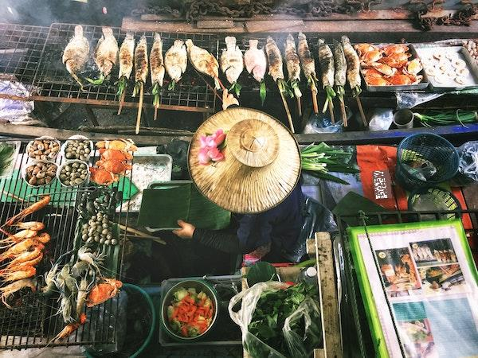

# 分类入门

## 区域话题：美味的亚洲和印度美食 🍜

在亚洲和印度，饮食传统极其多样化，而且非常美味！让我们看看有关区域美食的数据，试着了解它们的成分。

> 照片由 <a href="https://unsplash.com/@changlisheng?utm_source=unsplash&utm_medium=referral&utm_content=creditCopyText">Lisheng Chang</a> 提供，来自 <a href="https://unsplash.com/s/photos/asian-food?utm_source=unsplash&utm_medium=referral&utm_content=creditCopyText">Unsplash</a>
  
## 你将学到什么

在本节中，你将基于之前对回归的学习，了解其他分类器，以便更好地理解数据。

> 有一些有用的低代码工具可以帮助你学习如何使用分类模型。试试 [Azure ML 来完成这个任务](https://docs.microsoft.com/learn/modules/create-classification-model-azure-machine-learning-designer/?WT.mc_id=academic-77952-leestott)

## 课程

1. [分类简介](1-Introduction/README.md)
2. [更多分类器](2-Classifiers-1/README.md)
3. [其他分类器](3-Classifiers-2/README.md)
4. [应用机器学习：构建一个 web 应用](4-Applied/README.md)

## 致谢

"分类入门" 由 [Cassie Breviu](https://www.twitter.com/cassiebreviu) 和 [Jen Looper](https://www.twitter.com/jenlooper) 用 ♥️ 编写

美味的美食数据集来源于 [Kaggle](https://www.kaggle.com/hoandan/asian-and-indian-cuisines)。

**免责声明**：
本文档使用基于机器的人工智能翻译服务进行翻译。尽管我们努力确保准确性，但请注意，自动翻译可能包含错误或不准确之处。应将原始语言的文档视为权威来源。对于关键信息，建议使用专业人工翻译。我们不对因使用此翻译而引起的任何误解或误释承担责任。