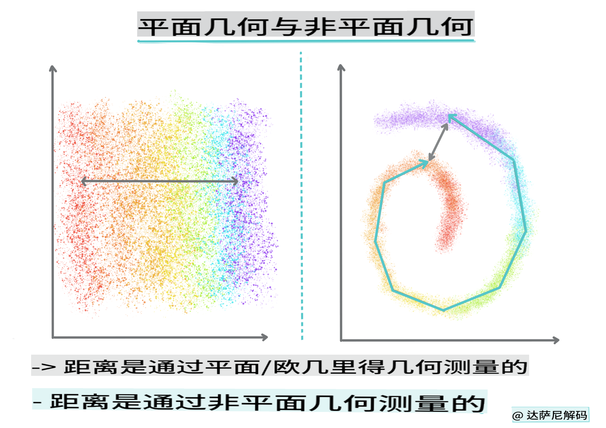
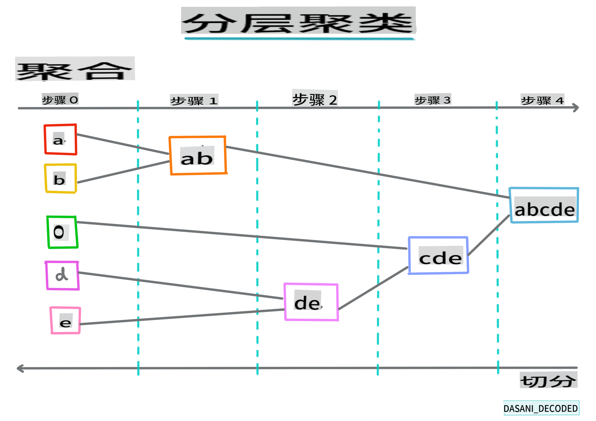

# 聚类简介

聚类是一种[无监督学习](https://wikipedia.org/wiki/Unsupervised_learning)方法，假设数据集是未标记的，或者其输入未与预定义的输出匹配。它使用各种算法对未标记的数据进行分类，并根据数据中识别出的模式提供分组。

[](https://youtu.be/ty2advRiWJM "PSquare的No One Like You")

> 🎥 点击上面的图片观看视频。在学习聚类机器学习的同时，享受一些尼日利亚舞厅音乐——这是PSquare在2014年发布的一首备受好评的歌曲。
## [课前测验](https://gray-sand-07a10f403.1.azurestaticapps.net/quiz/27/)
### 简介

[聚类](https://link.springer.com/referenceworkentry/10.1007%2F978-0-387-30164-8_124)对于数据探索非常有用。让我们看看它是否可以帮助发现尼日利亚观众消费音乐的趋势和模式。

✅ 花一分钟时间思考聚类的用途。在现实生活中，每当你有一堆洗好的衣服需要分类到家庭成员的衣物中时，就会发生聚类🧦👕👖🩲。在数据科学中，聚类发生在尝试分析用户的偏好或确定任何未标记数据集的特征时。聚类在某种程度上帮助我们理解混乱，比如一个袜子抽屉。

[](https://youtu.be/esmzYhuFnds "聚类简介")

> 🎥 点击上面的图片观看视频：MIT的John Guttag介绍聚类

在专业环境中，聚类可以用来确定市场细分，例如确定哪个年龄段购买哪些物品。另一个用途是异常检测，可能用于从信用卡交易数据集中检测欺诈行为。或者你可能会使用聚类来确定一批医学扫描中的肿瘤。

✅ 想一分钟，你可能在银行、电子商务或商业环境中如何遇到过聚类。

> 🎓 有趣的是，聚类分析起源于20世纪30年代的人类学和心理学领域。你能想象它可能是如何使用的吗？

或者，你可以用它来对搜索结果进行分组——例如购物链接、图片或评论。当你有一个大型数据集需要缩小并进行更细粒度的分析时，聚类是非常有用的，因此这种技术可以在构建其他模型之前了解数据。

✅ 一旦你的数据被组织成聚类，你可以为其分配一个聚类ID，这种技术在保护数据集隐私时非常有用；你可以通过其聚类ID而不是更具揭示性的可识别数据来引用数据点。你能想到其他为什么你会用聚类ID而不是聚类的其他元素来识别它的原因吗？

在这个[学习模块](https://docs.microsoft.com/learn/modules/train-evaluate-cluster-models?WT.mc_id=academic-77952-leestott)中深入了解聚类技术
## 聚类入门

[Scikit-learn提供了大量](https://scikit-learn.org/stable/modules/clustering.html)的聚类方法。你选择的类型将取决于你的用例。根据文档，每种方法都有不同的优点。以下是Scikit-learn支持的方法及其适用用例的简化表：

| 方法名称                     | 用例                                                                 |
| :--------------------------- | :--------------------------------------------------------------------- |
| K-Means                      | 通用，归纳式                                                         |
| Affinity propagation         | 许多，不均匀的聚类，归纳式                                           |
| Mean-shift                   | 许多，不均匀的聚类，归纳式                                           |
| Spectral clustering          | 少数，均匀的聚类，传导式                                             |
| Ward hierarchical clustering | 许多，受约束的聚类，传导式                                           |
| Agglomerative clustering     | 许多，受约束的，非欧几里得距离，传导式                               |
| DBSCAN                       | 非平面几何，不均匀的聚类，传导式                                     |
| OPTICS                       | 非平面几何，不均匀的聚类，密度可变，传导式                           |
| Gaussian mixtures            | 平面几何，归纳式                                                     |
| BIRCH                        | 带有离群值的大型数据集，归纳式                                       |

> 🎓 我们如何创建聚类与我们如何将数据点聚集成组有很大关系。让我们解开一些词汇：
>
> 🎓 ['传导式' vs. '归纳式'](https://wikipedia.org/wiki/Transduction_(machine_learning))
> 
> 传导推理是从观察到的训练案例中推导出来的，这些案例映射到特定的测试案例。归纳推理是从训练案例中推导出来的，这些案例映射到一般规则，然后才应用于测试案例。
> 
> 举个例子：假设你有一个部分标记的数据集。有些东西是'唱片'，有些是'CD'，有些是空白的。你的任务是为空白部分提供标签。如果你选择归纳方法，你会训练一个模型寻找'唱片'和'CD'，并将这些标签应用于未标记的数据。这种方法在分类实际上是'磁带'的东西时会遇到麻烦。另一方面，传导方法更有效地处理这种未知数据，因为它会将相似的项目分组，然后将标签应用于一个组。在这种情况下，聚类可能反映'圆形音乐物品'和'方形音乐物品'。
> 
> 🎓 ['非平面' vs. '平面'几何](https://datascience.stackexchange.com/questions/52260/terminology-flat-geometry-in-the-context-of-clustering)
> 
> 源自数学术语，非平面与平面几何指的是通过'平面'（[欧几里得](https://wikipedia.org/wiki/Euclidean_geometry)）或'非平面'（非欧几里得）几何方法测量点之间的距离。
>
>'平面'在此上下文中指的是欧几里得几何（其中的一部分被教授为'平面'几何），而非平面指的是非欧几里得几何。几何与机器学习有什么关系？好吧，作为两个根植于数学的领域，必须有一种常见的方法来测量聚类中点之间的距离，这可以通过'平面'或'非平面'方式完成，具体取决于数据的性质。[欧几里得距离](https://wikipedia.org/wiki/Euclidean_distance)被测量为两点之间线段的长度。[非欧几里得距离](https://wikipedia.org/wiki/Non-Euclidean_geometry)沿曲线测量。如果你的数据在可视化时似乎不存在于平面上，你可能需要使用专门的算法来处理它。
>

> 信息图由[Dasani Madipalli](https://twitter.com/dasani_decoded)制作
> 
> 🎓 ['距离'](https://web.stanford.edu/class/cs345a/slides/12-clustering.pdf)
> 
> 聚类由其距离矩阵定义，例如点之间的距离。这种距离可以通过几种方式测量。欧几里得聚类由点值的平均值定义，并包含一个'质心'或中心点。因此距离通过到质心的距离来测量。非欧几里得距离指的是'聚类中心点'，即最接近其他点的点。聚类中心点反过来可以通过各种方式定义。
> 
> 🎓 ['受约束'](https://wikipedia.org/wiki/Constrained_clustering)
> 
> [受约束聚类](https://web.cs.ucdavis.edu/~davidson/Publications/ICDMTutorial.pdf)将'半监督'学习引入这种无监督方法。点之间的关系被标记为'不能链接'或'必须链接'，因此在数据集上强加了一些规则。
>
> 举个例子：如果一个算法在一批未标记或半标记的数据上自由运行，它产生的聚类可能质量很差。在上面的例子中，聚类可能会将'圆形音乐物品'、'方形音乐物品'、'三角形物品'和'饼干'分组。如果给出一些约束或规则（“项目必须是塑料制成的”，“项目需要能够产生音乐”），这可以帮助'约束'算法做出更好的选择。
> 
> 🎓 '密度'
> 
> 被认为是'噪声'的数据被认为是'密集'的。通过检查，每个聚类中点之间的距离可能证明是更密集或更稀疏的，因此需要使用适当的聚类方法来分析这种数据。[这篇文章](https://www.kdnuggets.com/2020/02/understanding-density-based-clustering.html)展示了使用K-Means聚类与HDBSCAN算法探索具有不均匀聚类密度的噪声数据集的区别。

## 聚类算法

有超过100种聚类算法，它们的使用取决于手头数据的性质。让我们讨论一些主要的：

- **层次聚类**。如果一个对象是通过其与附近对象的接近程度来分类的，而不是与远离的对象分类，则聚类是基于其成员与其他对象的距离形成的。Scikit-learn的凝聚聚类是层次聚类。

   
   > 信息图由[Dasani Madipalli](https://twitter.com/dasani_decoded)制作

- **质心聚类**。这种流行的算法需要选择'k'，即要形成的聚类数量，然后算法确定聚类的中心点并围绕该点收集数据。[K-means聚类](https://wikipedia.org/wiki/K-means_clustering)是质心聚类的流行版本。中心由最近的均值确定，因此得名。聚类的平方距离被最小化。

   
   > 信息图由[Dasani Madipalli](https://twitter.com/dasani_decoded)制作

- **基于分布的聚类**。基于统计建模，基于分布的聚类中心在确定数据点属于某个聚类的概率，并相应地分配它。高斯混合方法属于这种类型。

- **基于密度的聚类**。数据点根据其密度或围绕彼此的分组被分配到聚类。远离组的数据点被视为离群点或噪声。DBSCAN、Mean-shift和OPTICS属于这种类型的聚类。

- **基于网格的聚类**。对于多维数据集，创建一个网格并将数据分配到网格的单元中，从而创建聚类。

## 练习 - 聚类你的数据

聚类作为一种技术大大受益于适当的可视化，所以让我们开始可视化我们的音乐数据。这个练习将帮助我们决定哪种聚类方法最有效地用于这种数据的性质。

1. 打开此文件夹中的[_notebook.ipynb_](https://github.com/microsoft/ML-For-Beginners/blob/main/5-Clustering/1-Visualize/notebook.ipynb)文件。

1. 导入`Seaborn`包以获得良好的数据可视化效果。

    ```python
    !pip install seaborn
    ```

1. 从[_nigerian-songs.csv_](https://github.com/microsoft/ML-For-Beginners/blob/main/5-Clustering/data/nigerian-songs.csv)中追加歌曲数据。加载一个包含一些关于歌曲数据的数据框架。通过导入库并导出数据来准备探索此数据：

    ```python
    import matplotlib.pyplot as plt
    import pandas as pd
    
    df = pd.read_csv("../data/nigerian-songs.csv")
    df.head()
    ```

    检查前几行数据：

    |     | name                     | album                        | artist              | artist_top_genre | release_date | length | popularity | danceability | acousticness | energy | instrumentalness | liveness | loudness | speechiness | tempo   | time_signature |
    | --- | ------------------------ | ---------------------------- | ------------------- | ---------------- | ------------ | ------ | ---------- | ------------ | ------------ | ------ | ---------------- | -------- | -------- | ----------- | ------- | -------------- |
    | 0   | Sparky                   | Mandy & The Jungle           | Cruel Santino       | alternative r&b  | 2019         | 144000 | 48         | 0.666        | 0.851        | 0.42   | 0.534            | 0.11     | -6.699   | 0.0829      | 133.015 | 5              |
    | 1   | shuga rush               | EVERYTHING YOU HEARD IS TRUE | Odunsi (The Engine) | afropop          | 2020         | 89488  | 30         | 0.71         | 0.0822       | 0.683  | 0.000169         | 0.101    | -5.64    | 0.36        | 129.993 | 3              |
    | 2   | LITT!                    | LITT!                        | AYLØ                | indie r&b        | 2018         | 207758 | 40         | 0.836        | 0.272        | 0.564  | 0.000537         | 0.11     | -7.127   | 0.0424      | 130.005 | 4              |
    | 3   | Confident / Feeling Cool | Enjoy Your Life              | Lady Donli          | nigerian pop     | 2019         | 175135 | 14         | 0.894        | 0.798        | 0.611  | 0.000187         | 0.0964   | -4.961   | 0.113       | 111.087 | 4              |
    | 4   | wanted you               | rare.                        | Odunsi (The Engine) | afropop          | 2018         | 152049 | 25         | 0.702        | 0.116        | 0.833  | 0.91             | 0.348    | -6.044   | 0.0447      | 105.115 | 4              |

1. 获取有关数据框架的信息，调用`info()`：

    ```python
    df.info()
    ```

   输出如下所示：

    ```output
    <class 'pandas.core.frame.DataFrame'>
    RangeIndex: 530 entries, 0 to 529
    Data columns (total 16 columns):
     #   Column            Non-Null Count  Dtype  
    ---  ------            --------------  -----  
     0   name              530 non-null    object 
     1   album             530 non-null    object 
     2   artist            530 non-null    object 
     3   artist_top_genre  530 non-null    object 
     4   release_date      530 non-null    int64  
     5   length            530 non-null    int64  
     6   popularity        530 non-null    int64  
     7   danceability      530 non-null    float64
     8   acousticness      530 non-null    float64
     9   energy            530 non-null    float64
     10  instrumentalness  530 non-null    float64
     11  liveness          530 non-null    float64
     12  loudness          530 non-null    float64
     13  speechiness       530 non-null    float64
     14  tempo             530 non-null    float64
     15  time_signature    530 non-null    int64  
    dtypes: float64(8), int64(4), object(4)
    memory usage: 66.4+ KB
    ```

1. 通过调用`isnull()`并验证总和为0来仔细检查是否有空值：

    ```python
    df.isnull().sum()
    ```

    看起来不错：

    ```output
    name                0
    album               0
    artist              0
    artist_top_genre    0
    release_date        0
    length              0
    popularity          0
    danceability        0
    acousticness        0
    energy              0
    instrumentalness    0
    liveness            0
    loudness            0
    speechiness         0
    tempo               0
    time_signature      0
    dtype: int64
    ```

1. 描述数据：

    ```python
    df.describe()
    ```

    |       | release_date | length      | popularity | danceability | acousticness | energy   | instrumentalness | liveness | loudness  | speechiness | tempo      | time_signature |
    | ----- | ------------ | ----------- | ---------- | ------------ | ------------ | -------- | ---------------- | -------- | --------- | ----------- | ---------- | -------------- |
    | count | 530          | 530         | 530        | 530          | 530          | 530      | 530              | 530      | 530       | 530         | 530        | 530            |
    | mean  | 2015.390566  | 222298.1698 | 17.507547  | 0.741619     | 0.265412     | 0.760623 | 0.016305         | 0.147308 | -4.953011 | 0.130748    | 116.487864 | 3.986792       |
    | std   | 3.131688     | 39696.82226 | 18.992212  | 0.117522     | 0.208342     | 0.148533 | 0.090321         | 0.123588 | 2.464186  | 0.092939    | 23.518601  | 0.333701       |
    | min   | 1998         | 89488       | 0          | 0.255        | 0.000665     | 0.111    | 0                | 0.0283   | -19.362   | 0.0278      | 61.695     | 3              |
    | 25%   | 2014         | 199305      | 0          | 0.681        | 0.089525     | 0.669    | 0                | 0.07565  | -6.29875  | 0.0591      | 102.96125  | 4              |
    | 50%   | 2016         | 218509      | 13         | 0.761        | 0.2205       | 0.7845   | 0.000004         | 0.1035   | -4.5585   | 0.09795     | 112.7145   | 4              |
    | 75%   | 2017         | 242098.5    | 31         | 0.8295       | 0.403        | 0.87575  | 0.000234         | 0.164    | -3.331    | 0.177       | 125.03925  | 4              |
    | max   | 2020         | 511738      | 73         | 0.966        | 0.954        | 0.995    | 0.91             | 0.811    | 0.582     | 0.514       | 206.007    |
## [课后测验](https://gray-sand-07a10f403.1.azurestaticapps.net/quiz/28/)

## 复习与自学

在应用聚类算法之前，正如我们所学，了解数据集的性质是一个好主意。可以在[这里](https://www.kdnuggets.com/2019/10/right-clustering-algorithm.html)阅读更多相关内容。

[这篇有用的文章](https://www.freecodecamp.org/news/8-clustering-algorithms-in-machine-learning-that-all-data-scientists-should-know/)会带你了解在不同数据形状下，各种聚类算法的不同表现方式。

## 作业

[研究其他聚类的可视化方式](assignment.md)

**免责声明**：
本文档是使用机器翻译服务翻译的。尽管我们努力确保准确性，但请注意，自动翻译可能包含错误或不准确之处。应将原文档的本国语言版本视为权威来源。对于关键信息，建议进行专业人工翻译。对于因使用此翻译而引起的任何误解或误读，我们概不负责。