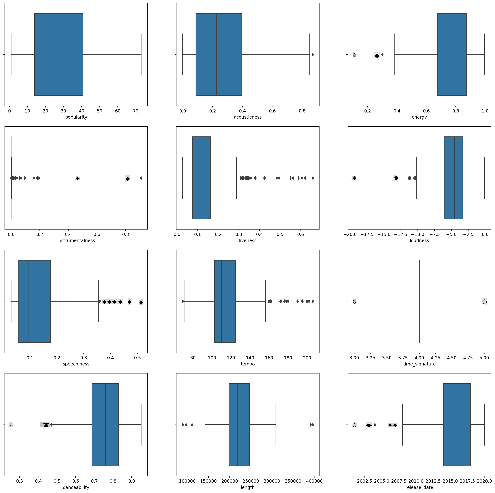
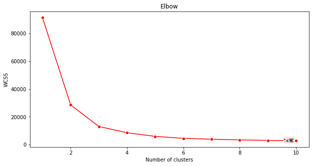
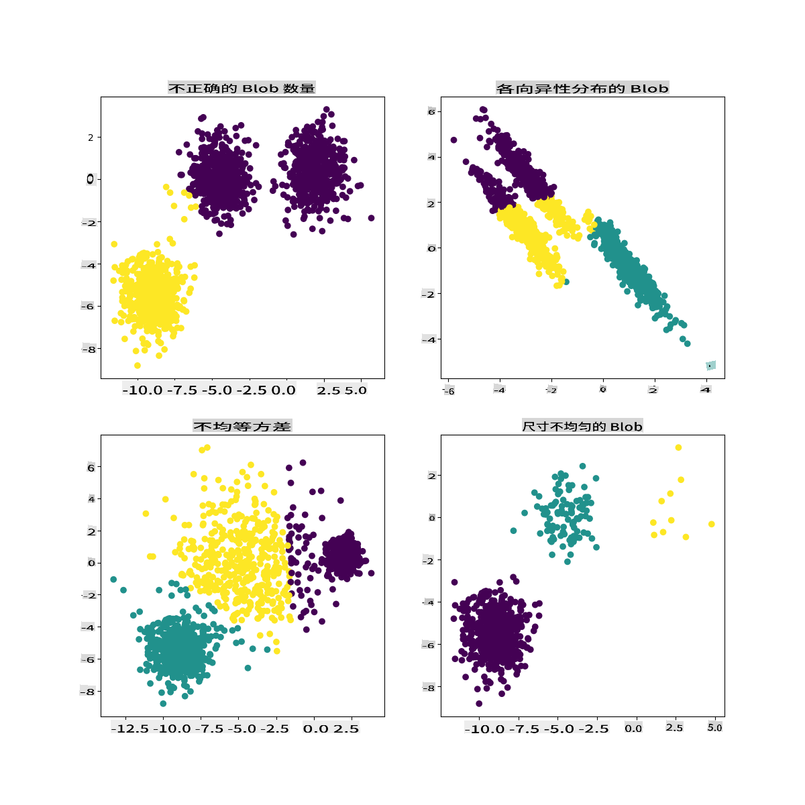

# K-Means 聚类

## [课前测验](https://gray-sand-07a10f403.1.azurestaticapps.net/quiz/29/)

在本课中，你将学习如何使用 Scikit-learn 和之前导入的尼日利亚音乐数据集创建聚类。我们将介绍 K-Means 聚类的基础知识。请记住，正如你在之前的课程中所学，有很多方法可以处理聚类，使用的方法取决于你的数据。我们将尝试 K-Means，因为它是最常见的聚类技术。让我们开始吧！

你将学习的术语：

- Silhouette 评分
- 肘部法
- 惯性
- 方差

## 介绍

[K-Means 聚类](https://wikipedia.org/wiki/K-means_clustering) 是一种源自信号处理领域的方法。它用于通过一系列观察将数据分成 'k' 个聚类。每个观察都试图将一个给定的数据点分配到离它最近的 '均值'，即聚类的中心点。

这些聚类可以可视化为 [Voronoi 图](https://wikipedia.org/wiki/Voronoi_diagram)，其中包括一个点（或 '种子'）及其对应的区域。


> 信息图由 [Jen Looper](https://twitter.com/jenlooper) 提供

K-Means 聚类过程 [分三步执行](https://scikit-learn.org/stable/modules/clustering.html#k-means)：

1. 算法通过从数据集中采样选择 k 个中心点。之后，它循环执行以下步骤：
    1. 将每个样本分配到最近的质心。
    2. 通过取分配给前一个质心的所有样本的平均值来创建新的质心。
    3. 然后计算新旧质心之间的差异，并重复直到质心稳定。

使用 K-Means 的一个缺点是你需要确定 'k'，即质心的数量。幸运的是，'肘部法'可以帮助估计一个好的起始值。你将在稍后尝试它。

## 先决条件

你将在本课的 [_notebook.ipynb_](https://github.com/microsoft/ML-For-Beginners/blob/main/5-Clustering/2-K-Means/notebook.ipynb) 文件中工作，该文件包含你在上一课中完成的数据导入和初步清理。

## 练习 - 准备工作

首先，再次查看歌曲数据。

1. 为每列创建一个箱线图，调用 `boxplot()`：

    ```python
    plt.figure(figsize=(20,20), dpi=200)
    
    plt.subplot(4,3,1)
    sns.boxplot(x = 'popularity', data = df)
    
    plt.subplot(4,3,2)
    sns.boxplot(x = 'acousticness', data = df)
    
    plt.subplot(4,3,3)
    sns.boxplot(x = 'energy', data = df)
    
    plt.subplot(4,3,4)
    sns.boxplot(x = 'instrumentalness', data = df)
    
    plt.subplot(4,3,5)
    sns.boxplot(x = 'liveness', data = df)
    
    plt.subplot(4,3,6)
    sns.boxplot(x = 'loudness', data = df)
    
    plt.subplot(4,3,7)
    sns.boxplot(x = 'speechiness', data = df)
    
    plt.subplot(4,3,8)
    sns.boxplot(x = 'tempo', data = df)
    
    plt.subplot(4,3,9)
    sns.boxplot(x = 'time_signature', data = df)
    
    plt.subplot(4,3,10)
    sns.boxplot(x = 'danceability', data = df)
    
    plt.subplot(4,3,11)
    sns.boxplot(x = 'length', data = df)
    
    plt.subplot(4,3,12)
    sns.boxplot(x = 'release_date', data = df)
    ```

    这些数据有点嘈杂：通过观察每列的箱线图，你可以看到异常值。

    

你可以遍历数据集并删除这些异常值，但这会使数据变得非常少。

1. 现在，选择你将在聚类练习中使用的列。选择具有相似范围的列，并将 `artist_top_genre` 列编码为数值数据：

    ```python
    from sklearn.preprocessing import LabelEncoder
    le = LabelEncoder()
    
    X = df.loc[:, ('artist_top_genre','popularity','danceability','acousticness','loudness','energy')]
    
    y = df['artist_top_genre']
    
    X['artist_top_genre'] = le.fit_transform(X['artist_top_genre'])
    
    y = le.transform(y)
    ```

1. 现在你需要选择目标聚类的数量。你知道从数据集中提取了 3 种歌曲类型，所以我们试试 3 个聚类：

    ```python
    from sklearn.cluster import KMeans
    
    nclusters = 3 
    seed = 0
    
    km = KMeans(n_clusters=nclusters, random_state=seed)
    km.fit(X)
    
    # Predict the cluster for each data point
    
    y_cluster_kmeans = km.predict(X)
    y_cluster_kmeans
    ```

你会看到一个数组，打印出每行数据框的预测聚类（0、1 或 2）。

1. 使用此数组计算 'silhouette score'：

    ```python
    from sklearn import metrics
    score = metrics.silhouette_score(X, y_cluster_kmeans)
    score
    ```

## Silhouette 评分

寻找接近 1 的 silhouette 评分。此评分范围从 -1 到 1，如果评分为 1，聚类密集且与其他聚类分离良好。接近 0 的值表示聚类重叠，样本非常接近相邻聚类的决策边界。[(来源)](https://dzone.com/articles/kmeans-silhouette-score-explained-with-python-exam)

我们的评分是 **0.53**，所以在中间。这表明我们的数据不太适合这种聚类，但让我们继续。

### 练习 - 构建模型

1. 导入 `KMeans` 并开始聚类过程。

    ```python
    from sklearn.cluster import KMeans
    wcss = []
    
    for i in range(1, 11):
        kmeans = KMeans(n_clusters = i, init = 'k-means++', random_state = 42)
        kmeans.fit(X)
        wcss.append(kmeans.inertia_)
    
    ```

    这里有几个部分值得解释。

    > 🎓 range: 这些是聚类过程的迭代次数

    > 🎓 random_state: "确定质心初始化的随机数生成。" [来源](https://scikit-learn.org/stable/modules/generated/sklearn.cluster.KMeans.html#sklearn.cluster.KMeans)

    > 🎓 WCSS: "组内平方和" 测量聚类内所有点到聚类质心的平方平均距离。 [来源](https://medium.com/@ODSC/unsupervised-learning-evaluating-clusters-bd47eed175ce)

    > 🎓 惯性: K-Means 算法试图选择质心以最小化 '惯性'，"衡量聚类内部的一致性。" [来源](https://scikit-learn.org/stable/modules/clustering.html)。该值在每次迭代时附加到 wcss 变量上。

    > 🎓 k-means++: 在 [Scikit-learn](https://scikit-learn.org/stable/modules/clustering.html#k-means) 中，你可以使用 'k-means++' 优化，它 "将质心初始化为（通常）彼此相距较远，从而可能比随机初始化产生更好的结果。

### 肘部法

之前，你推测因为你目标是 3 种歌曲类型，所以你应该选择 3 个聚类。但真的是这样吗？

1. 使用 '肘部法' 来确认。

    ```python
    plt.figure(figsize=(10,5))
    sns.lineplot(x=range(1, 11), y=wcss, marker='o', color='red')
    plt.title('Elbow')
    plt.xlabel('Number of clusters')
    plt.ylabel('WCSS')
    plt.show()
    ```

    使用你在上一步中构建的 `wcss` 变量创建一个图表，显示肘部的 '弯曲' 位置，指示最佳的聚类数量。也许确实是 3！

    

## 练习 - 显示聚类

1. 再次尝试此过程，这次设置三个聚类，并将聚类显示为散点图：

    ```python
    from sklearn.cluster import KMeans
    kmeans = KMeans(n_clusters = 3)
    kmeans.fit(X)
    labels = kmeans.predict(X)
    plt.scatter(df['popularity'],df['danceability'],c = labels)
    plt.xlabel('popularity')
    plt.ylabel('danceability')
    plt.show()
    ```

1. 检查模型的准确性：

    ```python
    labels = kmeans.labels_
    
    correct_labels = sum(y == labels)
    
    print("Result: %d out of %d samples were correctly labeled." % (correct_labels, y.size))
    
    print('Accuracy score: {0:0.2f}'. format(correct_labels/float(y.size)))
    ```

    该模型的准确性不是很好，聚类的形状也给你一个提示。

    

    这些数据太不平衡，相关性太小，各列值之间的方差太大，无法很好地聚类。事实上，形成的聚类可能受到我们上面定义的三种类型类别的严重影响或偏斜。这是一个学习过程！

    在 Scikit-learn 的文档中，你可以看到像这样的模型，聚类没有很好地划分，有 '方差' 问题：

    
    > 信息图来自 Scikit-learn

## 方差

方差定义为 "平均平方差" [(来源)](https://www.mathsisfun.com/data/standard-deviation.html)。在这个聚类问题的背景下，它指的是我们数据集的数字倾向于从均值中偏离太多。

✅ 这是一个很好的时机来思考你可以用哪些方法来解决这个问题。稍微调整数据？使用不同的列？使用不同的算法？提示：尝试[缩放数据](https://www.mygreatlearning.com/blog/learning-data-science-with-k-means-clustering/)以标准化它并测试其他列。

> 试试这个 '[方差计算器](https://www.calculatorsoup.com/calculators/statistics/variance-calculator.php)' 来更好地理解这个概念。

---

## 🚀挑战

花一些时间在这个 notebook 上，调整参数。你能通过进一步清理数据（例如删除异常值）来提高模型的准确性吗？你可以使用权重来给某些数据样本更多的权重。你还能做些什么来创建更好的聚类？

提示：尝试缩放你的数据。notebook 中有注释代码，添加标准缩放以使数据列在范围上更相似。你会发现，虽然 silhouette 评分下降了，但肘部图的 '弯曲' 更加平滑。这是因为让数据不缩放会使方差较小的数据权重更大。阅读更多关于这个问题的信息 [这里](https://stats.stackexchange.com/questions/21222/are-mean-normalization-and-feature-scaling-needed-for-k-means-clustering/21226#21226)。

## [课后测验](https://gray-sand-07a10f403.1.azurestaticapps.net/quiz/30/)

## 回顾与自学

看看一个 K-Means 模拟器 [比如这个](https://user.ceng.metu.edu.tr/~akifakkus/courses/ceng574/k-means/)。你可以使用这个工具来可视化样本数据点并确定其质心。你可以编辑数据的随机性、聚类数量和质心数量。这是否有助于你了解数据如何分组？

另外，看看斯坦福大学的 [K-Means 讲义](https://stanford.edu/~cpiech/cs221/handouts/kmeans.html)。

## 作业

[尝试不同的聚类方法](assignment.md)

**免责声明**：
本文档使用基于机器的人工智能翻译服务进行翻译。尽管我们努力确保准确性，但请注意，自动翻译可能包含错误或不准确之处。应将原文档的母语版本视为权威来源。对于关键信息，建议进行专业的人类翻译。对于因使用本翻译而引起的任何误解或误读，我们不承担任何责任。