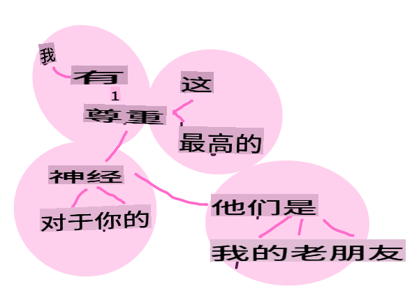

# 常见的自然语言处理任务和技术

对于大多数*自然语言处理*任务，需要将要处理的文本分解、检查，并将结果存储或与规则和数据集进行交叉引用。这些任务使程序员能够推导出文本中的_意义_或_意图_，或仅仅是术语和单词的_频率_。

## [课前测验](https://gray-sand-07a10f403.1.azurestaticapps.net/quiz/33/)

让我们来了解一些常见的文本处理技术。结合机器学习，这些技术可以帮助你高效地分析大量文本。然而，在将机器学习应用于这些任务之前，我们先来了解一下NLP专家所遇到的问题。

## NLP常见任务

分析文本有不同的方法。你可以执行一些任务，通过这些任务你能够理解文本并得出结论。通常你会按顺序执行这些任务。

### 分词

大多数NLP算法首先要做的可能是将文本分割成标记或单词。虽然这听起来很简单，但考虑到标点符号和不同语言的单词和句子分隔符会使其变得复杂。你可能需要使用各种方法来确定分界线。


> 分词一个来自**傲慢与偏见**的句子。信息图由 [Jen Looper](https://twitter.com/jenlooper) 提供

### 嵌入

[词嵌入](https://wikipedia.org/wiki/Word_embedding)是一种将文本数据数值化的方法。嵌入的方式是使具有相似意义或经常一起使用的单词聚集在一起。


> “我对你的神经非常尊重，它们是我的老朋友。” - 来自**傲慢与偏见**的一句话的词嵌入。信息图由 [Jen Looper](https://twitter.com/jenlooper) 提供

✅ 尝试[这个有趣的工具](https://projector.tensorflow.org/)来实验词嵌入。点击一个单词会显示相似单词的聚类：'toy'与'disney'、'lego'、'playstation'和'console'聚在一起。

### 解析和词性标注

每个被分词的单词都可以被标注为词性 - 名词、动词或形容词。句子 `the quick red fox jumped over the lazy brown dog` 可能被词性标注为 fox = 名词, jumped = 动词。


> 解析一个来自**傲慢与偏见**的句子。信息图由 [Jen Looper](https://twitter.com/jenlooper) 提供

解析是识别句子中哪些单词是相关的 - 例如 `the quick red fox jumped` 是一个形容词-名词-动词序列，与 `lazy brown dog` 序列分开。

### 词和短语频率

分析大量文本时，一个有用的过程是建立一个感兴趣的每个单词或短语的词典，并记录其出现频率。短语 `the quick red fox jumped over the lazy brown dog` 中 the 的词频为2。

让我们看一个例子文本，我们数一下单词的频率。鲁德亚德·吉卜林的诗《胜利者》中包含以下诗句：

```output
What the moral? Who rides may read.
When the night is thick and the tracks are blind
A friend at a pinch is a friend, indeed,
But a fool to wait for the laggard behind.
Down to Gehenna or up to the Throne,
He travels the fastest who travels alone.
```

由于短语频率可以根据需要区分大小写或不区分大小写，短语 `a friend` has a frequency of 2 and `the` has a frequency of 6, and `travels` 的频率是2。

### N-grams

文本可以被分割成固定长度的单词序列，一个单词（unigram）、两个单词（bigrams）、三个单词（trigrams）或任意数量的单词（n-grams）。

例如 `the quick red fox jumped over the lazy brown dog` 以2的n-gram得分产生以下n-grams：

1. the quick 
2. quick red 
3. red fox
4. fox jumped 
5. jumped over 
6. over the 
7. the lazy 
8. lazy brown 
9. brown dog

可以将其想象为一个滑动框在句子上。以下是3个单词的n-grams，每个句子中的n-gram用粗体表示：

1.   <u>**the quick red**</u> fox jumped over the lazy brown dog
2.   the **<u>quick red fox</u>** jumped over the lazy brown dog
3.   the quick **<u>red fox jumped</u>** over the lazy brown dog
4.   the quick red **<u>fox jumped over</u>** the lazy brown dog
5.   the quick red fox **<u>jumped over the</u>** lazy brown dog
6.   the quick red fox jumped **<u>over the lazy</u>** brown dog
7.   the quick red fox jumped over <u>**the lazy brown**</u> dog
8.   the quick red fox jumped over the **<u>lazy brown dog</u>**


> N-gram值为3：信息图由 [Jen Looper](https://twitter.com/jenlooper) 提供

### 名词短语提取

在大多数句子中，有一个名词是主语或宾语。在英语中，它通常可以通过前面有'a'、'an'或'the'来识别。通过'提取名词短语'来识别句子的主语或宾语是NLP中试图理解句子意义时的常见任务。

✅ 在句子 "I cannot fix on the hour, or the spot, or the look or the words, which laid the foundation. It is too long ago. I was in the middle before I knew that I had begun." 中，你能识别出名词短语吗？

在句子 `the quick red fox jumped over the lazy brown dog` 中有2个名词短语：**quick red fox** 和 **lazy brown dog**。

### 情感分析

一个句子或文本可以被分析其情感，或者它有多*积极*或*消极*。情感通过*极性*和*客观性/主观性*来衡量。极性从-1.0到1.0（消极到积极）和0.0到1.0（最客观到最主观）。

✅ 你将会学到有不同的方法使用机器学习来确定情感，但一种方法是有一个由人类专家分类为积极或消极的单词和短语列表，并将该模型应用于文本以计算极性得分。你能看到这在某些情况下如何工作，而在其他情况下效果较差吗？

### 词形变化

词形变化使你可以获取一个单词并得到该单词的单数或复数形式。

### 词干提取

*词干*是一个词组的根或词头，例如 *flew*、*flies*、*flying* 的词干是动词 *fly*。

对于NLP研究人员，还有一些有用的数据库，尤其是：

### WordNet

[WordNet](https://wordnet.princeton.edu/) 是一个包含许多语言中每个单词的同义词、反义词及其他许多细节的数据库。在构建翻译、拼写检查器或任何类型的语言工具时，它非常有用。

## NLP库

幸运的是，你不需要自己构建所有这些技术，因为有一些优秀的Python库可以使其对非自然语言处理或机器学习专业的开发人员更易于使用。接下来的课程中会有更多这些库的示例，但在这里你会学到一些有用的例子来帮助你完成下一个任务。

### 练习 - 使用 `TextBlob` library

Let's use a library called TextBlob as it contains helpful APIs for tackling these types of tasks. TextBlob "stands on the giant shoulders of [NLTK](https://nltk.org) and [pattern](https://github.com/clips/pattern), and plays nicely with both." It has a considerable amount of ML embedded in its API.

> Note: A useful [Quick Start](https://textblob.readthedocs.io/en/dev/quickstart.html#quickstart) guide is available for TextBlob that is recommended for experienced Python developers 

When attempting to identify *noun phrases*, TextBlob offers several options of extractors to find noun phrases. 

1. Take a look at `ConllExtractor`

    ```python
    from textblob import TextBlob
    from textblob.np_extractors import ConllExtractor
    # import and create a Conll extractor to use later 
    extractor = ConllExtractor()
    
    # later when you need a noun phrase extractor:
    user_input = input("> ")
    user_input_blob = TextBlob(user_input, np_extractor=extractor)  # note non-default extractor specified
    np = user_input_blob.noun_phrases                                    
    ```

    > 这里发生了什么？ [ConllExtractor](https://textblob.readthedocs.io/en/dev/api_reference.html?highlight=Conll#textblob.en.np_extractors.ConllExtractor) 是“一个使用ConLL-2000训练语料库进行块解析的名词短语提取器。” ConLL-2000 指的是2000年计算自然语言学习会议。每年会议都会举办一个研讨会来解决一个棘手的NLP问题，2000年的问题是名词块解析。模型是在《华尔街日报》上训练的，“第15-18节作为训练数据（211727个标记）和第20节作为测试数据（47377个标记）”。你可以在[这里](https://www.clips.uantwerpen.be/conll2000/chunking/)查看使用的程序和[结果](https://ifarm.nl/erikt/research/np-chunking.html)。

### 挑战 - 使用NLP改进你的机器人

在上一课中，你构建了一个非常简单的问答机器人。现在，你将通过分析输入的情感并打印出相应的回应，使Marvin更具同情心。你还需要识别一个 `noun_phrase` 并询问相关内容。

构建更好的对话机器人的步骤：

1. 打印指示，指导用户如何与机器人互动
2. 开始循环 
   1. 接受用户输入
   2. 如果用户要求退出，则退出
   3. 处理用户输入并确定适当的情感回应
   4. 如果在情感中检测到名词短语，将其复数化并要求更多相关输入
   5. 打印回应
3. 返回步骤2

以下是使用TextBlob确定情感的代码片段。注意只有四个情感回应的*梯度*（如果你愿意，可以有更多）：

```python
if user_input_blob.polarity <= -0.5:
  response = "Oh dear, that sounds bad. "
elif user_input_blob.polarity <= 0:
  response = "Hmm, that's not great. "
elif user_input_blob.polarity <= 0.5:
  response = "Well, that sounds positive. "
elif user_input_blob.polarity <= 1:
  response = "Wow, that sounds great. "
```

以下是一些示例输出以供参考（用户输入以>开头的行）：

```output
Hello, I am Marvin, the friendly robot.
You can end this conversation at any time by typing 'bye'
After typing each answer, press 'enter'
How are you today?
> I am ok
Well, that sounds positive. Can you tell me more?
> I went for a walk and saw a lovely cat
Well, that sounds positive. Can you tell me more about lovely cats?
> cats are the best. But I also have a cool dog
Wow, that sounds great. Can you tell me more about cool dogs?
> I have an old hounddog but he is sick
Hmm, that's not great. Can you tell me more about old hounddogs?
> bye
It was nice talking to you, goodbye!
```

任务的一个可能解决方案在[这里](https://github.com/microsoft/ML-For-Beginners/blob/main/6-NLP/2-Tasks/solution/bot.py)

✅ 知识检查

1. 你认为同情回应会“欺骗”某人认为机器人真的理解他们吗？
2. 识别名词短语是否使机器人更“可信”？
3. 为什么从句子中提取“名词短语”是一件有用的事情？

---

实现之前知识检查中的机器人，并在朋友身上测试。它能欺骗他们吗？你能让你的机器人更“可信”吗？

## 🚀挑战

尝试实现之前知识检查中的一个任务。在朋友身上测试机器人。它能欺骗他们吗？你能让你的机器人更“可信”吗？

## [课后测验](https://gray-sand-07a10f403.1.azurestaticapps.net/quiz/34/)

## 复习与自学

在接下来的几节课中，你将学习更多关于情感分析的内容。研究这种有趣的技术，例如在[KDNuggets](https://www.kdnuggets.com/tag/nlp)上的文章。

## 作业

[让机器人对话](assignment.md)

**免责声明**：
本文档是使用机器翻译服务翻译的。尽管我们努力确保准确性，但请注意，自动翻译可能包含错误或不准确之处。应将原始文档的母语版本视为权威来源。对于关键信息，建议使用专业人工翻译。对于因使用本翻译而产生的任何误解或误读，我们不承担任何责任。