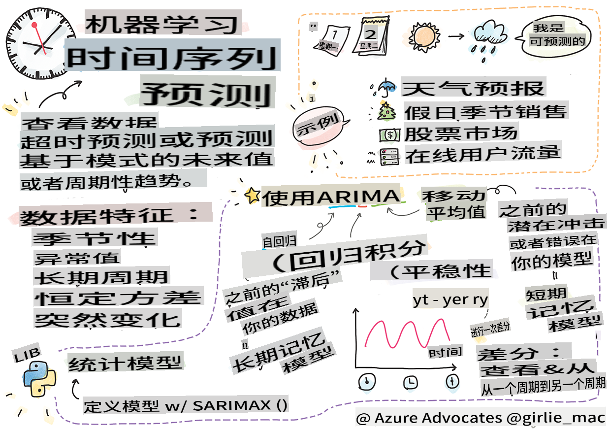

# 时间序列预测简介



> 由 [Tomomi Imura](https://www.twitter.com/girlie_mac) 绘制的速写图

在本课及接下来的课程中，你将学习一些关于时间序列预测的知识，这是机器学习科学家工具库中一个有趣且有价值的部分，虽然它不像其他主题那么广为人知。时间序列预测就像一种“水晶球”：基于某个变量（如价格）的过去表现，你可以预测其未来的潜在价值。

[](https://youtu.be/cBojo1hsHiI "时间序列预测简介")

> 🎥 点击上方图片观看关于时间序列预测的视频

## [课前测验](https://gray-sand-07a10f403.1.azurestaticapps.net/quiz/41/)

这是一个有用且有趣的领域，对商业具有实际价值，因为它直接应用于定价、库存和供应链问题。虽然深度学习技术已经开始用于获得更多见解以更好地预测未来表现，但时间序列预测仍然是一个主要由经典机器学习技术所主导的领域。

> 宾夕法尼亚州立大学的实用时间序列课程可以在[这里](https://online.stat.psu.edu/stat510/lesson/1)找到

## 介绍

假设你维护一系列智能停车计时器，这些计时器提供关于它们在一段时间内使用频率和时长的数据。

> 如果你可以根据计时器的过去表现，预测其未来价值会怎样呢？这可以根据供需法则进行预测。

准确预测何时采取行动以实现目标是一个挑战，可以通过时间序列预测来解决。在寻找停车位的繁忙时段被收取更多费用可能不会让人们高兴，但这肯定是产生收入来清洁街道的一种方法！

让我们探讨一些时间序列算法类型，并开始一个笔记本来清理和准备一些数据。你将分析的数据来自GEFCom2014预测竞赛。它包括2012年至2014年之间的3年每小时电力负载和温度值。根据电力负载和温度的历史模式，你可以预测电力负载的未来值。

在这个例子中，你将学习如何仅使用历史负载数据来预测一个时间步长。开始之前，了解幕后发生的事情是有用的。

## 一些定义

当遇到“时间序列”这个术语时，你需要理解它在几个不同上下文中的使用。

🎓 **时间序列**

在数学中，“时间序列是一系列按时间顺序索引（或列出或绘图）的数据点。最常见的是，时间序列是在连续的等间隔时间点上获取的一系列。”时间序列的一个例子是[道琼斯工业平均指数](https://wikipedia.org/wiki/Time_series)的每日收盘值。时间序列绘图和统计建模的使用在信号处理、天气预报、地震预测和其他事件发生并且数据点可以随时间绘制的领域中经常遇到。

🎓 **时间序列分析**

时间序列分析是对上述时间序列数据的分析。时间序列数据可以采取不同的形式，包括“中断时间序列”，它检测时间序列在中断事件前后的演变模式。所需的时间序列分析类型取决于数据的性质。时间序列数据本身可以采取一系列数字或字符的形式。

要执行的分析使用各种方法，包括频域和时域、线性和非线性等。[了解更多](https://www.itl.nist.gov/div898/handbook/pmc/section4/pmc4.htm)关于分析此类数据的多种方法。

🎓 **时间序列预测**

时间序列预测是使用模型根据过去收集的数据展示的模式来预测未来值。虽然可以使用回归模型来探索时间序列数据，并在图上将时间索引作为x变量，但此类数据最好使用特殊类型的模型进行分析。

时间序列数据是一组有序的观察值，不像可以通过线性回归分析的数据。最常见的一种是ARIMA，它是“自回归积分滑动平均”的缩写。

[ARIMA模型](https://online.stat.psu.edu/stat510/lesson/1/1.1)“将一系列的当前值与过去的值和过去的预测误差相关联。”它们最适合分析时域数据，即随时间排序的数据。

> 有几种类型的ARIMA模型，你可以在[这里](https://people.duke.edu/~rnau/411arim.htm)了解更多，你将在下一课中涉及这些内容。

在下一课中，你将使用[单变量时间序列](https://itl.nist.gov/div898/handbook/pmc/section4/pmc44.htm)构建一个ARIMA模型，该模型关注随时间变化的一个变量。这类数据的一个例子是[这个数据集](https://itl.nist.gov/div898/handbook/pmc/section4/pmc4411.htm)，记录了Mauna Loa天文台的每月CO2浓度：

|   CO2   | YearMonth | Year  | Month |
| :-----: | :-------: | :---: | :---: |
| 330.62  |  1975.04  | 1975  |   1   |
| 331.40  |  1975.13  | 1975  |   2   |
| 331.87  |  1975.21  | 1975  |   3   |
| 333.18  |  1975.29  | 1975  |   4   |
| 333.92  |  1975.38  | 1975  |   5   |
| 333.43  |  1975.46  | 1975  |   6   |
| 331.85  |  1975.54  | 1975  |   7   |
| 330.01  |  1975.63  | 1975  |   8   |
| 328.51  |  1975.71  | 1975  |   9   |
| 328.41  |  1975.79  | 1975  |  10   |
| 329.25  |  1975.88  | 1975  |  11   |
| 330.97  |  1975.96  | 1975  |  12   |

✅ 识别这个数据集中随时间变化的变量

## 时间序列数据需要考虑的特性

在查看时间序列数据时，你可能会注意到它具有[某些特性](https://online.stat.psu.edu/stat510/lesson/1/1.1)，你需要考虑并减轻这些特性以更好地理解其模式。如果你将时间序列数据视为可能提供“信号”的数据，这些特性可以被视为“噪声”。你通常需要通过使用一些统计技术来减少这些“噪声”。

以下是一些你应该了解的概念，以便能够处理时间序列：

🎓 **趋势**

趋势被定义为随时间的可测量的增加和减少。[阅读更多](https://machinelearningmastery.com/time-series-trends-in-python)。在时间序列的上下文中，这涉及如何使用并在必要时从你的时间序列中移除趋势。

🎓 **[季节性](https://machinelearningmastery.com/time-series-seasonality-with-python/)**

季节性被定义为周期性的波动，例如可能影响销售的假日高峰。[看看](https://itl.nist.gov/div898/handbook/pmc/section4/pmc443.htm)不同类型的图表如何显示数据中的季节性。

🎓 **异常值**

异常值远离标准数据方差。

🎓 **长期周期**

独立于季节性，数据可能显示出长期周期，例如持续超过一年的经济衰退。

🎓 **恒定方差**

随时间推移，一些数据显示出恒定的波动，例如每天和夜间的能量使用。

🎓 **突然变化**

数据可能显示出需要进一步分析的突然变化。例如，由于COVID导致企业突然关闭，导致数据发生变化。

✅ 这里有一个[示例时间序列图](https://www.kaggle.com/kashnitsky/topic-9-part-1-time-series-analysis-in-python)，显示了几年来每日的游戏内货币花费。你能在这个数据中识别出上面列出的任何特性吗？


## 练习 - 开始使用电力使用数据

让我们开始创建一个时间序列模型，以预测给定过去使用情况的未来电力使用情况。

> 本示例中的数据来自GEFCom2014预测竞赛。它包括2012年至2014年之间的3年每小时电力负载和温度值。
>
> Tao Hong, Pierre Pinson, Shu Fan, Hamidreza Zareipour, Alberto Troccoli 和 Rob J. Hyndman, "Probabilistic energy forecasting: Global Energy Forecasting Competition 2014 and beyond", International Journal of Forecasting, vol.32, no.3, pp 896-913, July-September, 2016.

1. 在本课的 `working` 文件夹中，打开 _notebook.ipynb_ 文件。首先添加将帮助你加载和可视化数据的库

    ```python
    import os
    import matplotlib.pyplot as plt
    from common.utils import load_data
    %matplotlib inline
    ```

    请注意，你正在使用包含的文件中的 `common` folder which set up your environment and handle downloading the data.

2. Next, examine the data as a dataframe calling `load_data()` and `head()`：

    ```python
    data_dir = './data'
    energy = load_data(data_dir)[['load']]
    energy.head()
    ```

    你可以看到有两列表示日期和负载：

    |                     |  load  |
    | :-----------------: | :----: |
    | 2012-01-01 00:00:00 | 2698.0 |
    | 2012-01-01 01:00:00 | 2558.0 |
    | 2012-01-01 02:00:00 | 2444.0 |
    | 2012-01-01 03:00:00 | 2402.0 |
    | 2012-01-01 04:00:00 | 2403.0 |

3. 现在，通过调用 `plot()` 绘制数据：

    ```python
    energy.plot(y='load', subplots=True, figsize=(15, 8), fontsize=12)
    plt.xlabel('timestamp', fontsize=12)
    plt.ylabel('load', fontsize=12)
    plt.show()
    ```

    

4. 现在，通过提供输入 `energy` in `[from date]: [to date]` 模式，绘制2014年7月的第一周：

    ```python
    energy['2014-07-01':'2014-07-07'].plot(y='load', subplots=True, figsize=(15, 8), fontsize=12)
    plt.xlabel('timestamp', fontsize=12)
    plt.ylabel('load', fontsize=12)
    plt.show()
    ```

    

    一个美丽的图！看看这些图表，看看你是否能确定上面列出的任何特性。通过可视化数据，我们可以推测什么？

在下一课中，你将创建一个ARIMA模型来进行一些预测。

---

## 🚀挑战

列出你能想到的所有可以从时间序列预测中受益的行业和研究领域。你能想到这些技术在艺术中的应用吗？在计量经济学中？生态学？零售业？工业？金融？还有哪里？

## [课后测验](https://gray-sand-07a10f403.1.azurestaticapps.net/quiz/42/)

## 复习与自学

虽然我们不会在这里讨论，但有时会使用神经网络来增强经典的时间序列预测方法。阅读更多关于它们的信息[在这篇文章中](https://medium.com/microsoftazure/neural-networks-for-forecasting-financial-and-economic-time-series-6aca370ff412)

## 作业

[可视化更多时间序列](assignment.md)

**免责声明**：
本文件使用基于机器的AI翻译服务进行翻译。尽管我们力求准确，但请注意，自动翻译可能包含错误或不准确之处。应将原始语言的文件视为权威来源。对于重要信息，建议使用专业人工翻译。对于因使用本翻译而引起的任何误解或误读，我们不承担任何责任。