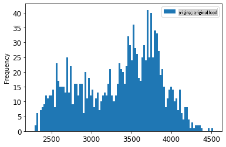
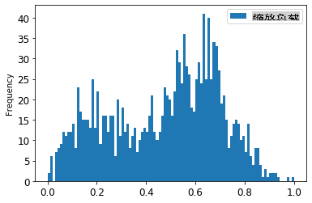
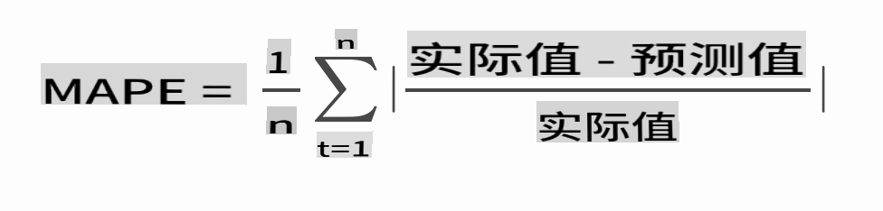

# ARIMA 时间序列预测

在上一节课中，你了解了一些时间序列预测的基础知识，并加载了一个显示某段时间内电力负载波动的数据集。

[](https://youtu.be/IUSk-YDau10 "Introduction to ARIMA")

> 🎥 点击上面的图片观看视频：ARIMA 模型的简要介绍。示例使用 R 语言，但概念是通用的。

## [课前小测验](https://gray-sand-07a10f403.1.azurestaticapps.net/quiz/43/)

## 简介

在本课中，你将了解一种特定的构建模型的方法，即 [ARIMA: *A*uto*R*egressive *I*ntegrated *M*oving *A*verage](https://wikipedia.org/wiki/Autoregressive_integrated_moving_average)。ARIMA 模型特别适合拟合显示 [非平稳性](https://wikipedia.org/wiki/Stationary_process)的数据。

## 基本概念

为了能够使用 ARIMA，有一些概念你需要了解：

- 🎓 **平稳性**。在统计学背景下，平稳性指的是数据的分布在时间上不变。非平稳数据则由于趋势而显示波动，必须通过转换来进行分析。例如，季节性可以引入数据波动，可以通过“季节性差分”过程来消除。

- 🎓 **[差分](https://wikipedia.org/wiki/Autoregressive_integrated_moving_average#Differencing)**。在统计学背景下，差分指的是通过移除非恒定趋势将非平稳数据转换为平稳数据的过程。“差分移除了时间序列中的水平变化，消除了趋势和季节性，从而稳定了时间序列的均值。” [Shixiong 等人的论文](https://arxiv.org/abs/1904.07632)

## ARIMA 在时间序列中的应用

让我们拆解 ARIMA 的各个部分，以便更好地理解它如何帮助我们建模时间序列并进行预测。

- **AR - 自回归**。自回归模型，顾名思义，是向“后”看，分析数据中的先前值并对其进行假设。这些先前值被称为“滞后”。例如，显示每月铅笔销售数据的数据集。每个月的销售总额将被视为数据集中的“演变变量”。该模型是“对其自身滞后（即先前）值进行回归”。[wikipedia](https://wikipedia.org/wiki/Autoregressive_integrated_moving_average)

- **I - 积分**。与类似的“ARMA”模型不同，ARIMA 中的“I”指的是其 *[积分](https://wikipedia.org/wiki/Order_of_integration)* 方面。通过应用差分步骤来消除非平稳性，数据被“积分”。

- **MA - 移动平均**。该模型的 [移动平均](https://wikipedia.org/wiki/Moving-average_model) 方面指的是通过观察当前和过去的滞后值来确定输出变量。

总而言之：ARIMA 被用来使模型尽可能紧密地拟合时间序列数据的特殊形式。

## 练习 - 构建 ARIMA 模型

打开本课中的 [_/working_](https://github.com/microsoft/ML-For-Beginners/tree/main/7-TimeSeries/2-ARIMA/working) 文件夹，并找到 [_notebook.ipynb_](https://github.com/microsoft/ML-For-Beginners/blob/main/7-TimeSeries/2-ARIMA/working/notebook.ipynb) 文件。

1. 运行 notebook 以加载 `statsmodels` Python 库；你将需要它来构建 ARIMA 模型。

1. 加载必要的库

1. 现在，加载一些对绘图有用的库：

    ```python
    import os
    import warnings
    import matplotlib.pyplot as plt
    import numpy as np
    import pandas as pd
    import datetime as dt
    import math

    from pandas.plotting import autocorrelation_plot
    from statsmodels.tsa.statespace.sarimax import SARIMAX
    from sklearn.preprocessing import MinMaxScaler
    from common.utils import load_data, mape
    from IPython.display import Image

    %matplotlib inline
    pd.options.display.float_format = '{:,.2f}'.format
    np.set_printoptions(precision=2)
    warnings.filterwarnings("ignore") # specify to ignore warning messages
    ```

1. 将 `/data/energy.csv` 文件中的数据加载到 Pandas 数据框中并查看：

    ```python
    energy = load_data('./data')[['load']]
    energy.head(10)
    ```

1. 绘制 2012 年 1 月至 2014 年 12 月的所有可用能源数据。应该没有意外，因为我们在上一节课中看到了这些数据：

    ```python
    energy.plot(y='load', subplots=True, figsize=(15, 8), fontsize=12)
    plt.xlabel('timestamp', fontsize=12)
    plt.ylabel('load', fontsize=12)
    plt.show()
    ```

    现在，让我们构建一个模型！

### 创建训练和测试数据集

现在你的数据已经加载，可以将其分成训练集和测试集。你将用训练集来训练你的模型。像往常一样，模型训练完成后，你将使用测试集评估其准确性。你需要确保测试集覆盖比训练集晚的时间段，以确保模型不会从未来时间段获取信息。

1. 将 2014 年 9 月 1 日至 10 月 31 日的两个月分配给训练集。测试集将包括 2014 年 11 月 1 日至 12 月 31 日的两个月：

    ```python
    train_start_dt = '2014-11-01 00:00:00'
    test_start_dt = '2014-12-30 00:00:00'
    ```

    由于这些数据反映了每日能源消耗，存在明显的季节性模式，但最近几天的消耗最为相似。

1. 可视化差异：

    ```python
    energy[(energy.index < test_start_dt) & (energy.index >= train_start_dt)][['load']].rename(columns={'load':'train'}) \
        .join(energy[test_start_dt:][['load']].rename(columns={'load':'test'}), how='outer') \
        .plot(y=['train', 'test'], figsize=(15, 8), fontsize=12)
    plt.xlabel('timestamp', fontsize=12)
    plt.ylabel('load', fontsize=12)
    plt.show()
    ```

    

    因此，使用相对较小的时间窗口来训练数据应该是足够的。

    > 注意：由于我们用来拟合 ARIMA 模型的函数在拟合过程中使用了样本内验证，我们将省略验证数据。

### 准备数据进行训练

现在，你需要通过对数据进行过滤和缩放来准备训练数据。过滤数据集以仅包括所需的时间段和列，并缩放以确保数据在 0 到 1 之间。

1. 过滤原始数据集以仅包括上述时间段和所需的“load”列及日期：

    ```python
    train = energy.copy()[(energy.index >= train_start_dt) & (energy.index < test_start_dt)][['load']]
    test = energy.copy()[energy.index >= test_start_dt][['load']]

    print('Training data shape: ', train.shape)
    print('Test data shape: ', test.shape)
    ```

    你可以看到数据的形状：

    ```output
    Training data shape:  (1416, 1)
    Test data shape:  (48, 1)
    ```

1. 将数据缩放到 0 到 1 的范围内。

    ```python
    scaler = MinMaxScaler()
    train['load'] = scaler.fit_transform(train)
    train.head(10)
    ```

1. 可视化原始数据与缩放后的数据：

    ```python
    energy[(energy.index >= train_start_dt) & (energy.index < test_start_dt)][['load']].rename(columns={'load':'original load'}).plot.hist(bins=100, fontsize=12)
    train.rename(columns={'load':'scaled load'}).plot.hist(bins=100, fontsize=12)
    plt.show()
    ```

    

    > 原始数据

    

    > 缩放后的数据

1. 现在你已经校准了缩放后的数据，可以缩放测试数据：

    ```python
    test['load'] = scaler.transform(test)
    test.head()
    ```

### 实现 ARIMA

现在是时候实现 ARIMA 了！你将使用之前安装的 `statsmodels` 库。

现在你需要按照几个步骤进行

   1. 通过调用 `SARIMAX()` and passing in the model parameters: p, d, and q parameters, and P, D, and Q parameters.
   2. Prepare the model for the training data by calling the fit() function.
   3. Make predictions calling the `forecast()` function and specifying the number of steps (the `horizon`) to forecast.

> 🎓 What are all these parameters for? In an ARIMA model there are 3 parameters that are used to help model the major aspects of a time series: seasonality, trend, and noise. These parameters are:

`p`: the parameter associated with the auto-regressive aspect of the model, which incorporates *past* values.
`d`: the parameter associated with the integrated part of the model, which affects the amount of *differencing* (🎓 remember differencing 👆?) to apply to a time series.
`q`: the parameter associated with the moving-average part of the model.

> Note: If your data has a seasonal aspect - which this one does - , we use a seasonal ARIMA model (SARIMA). In that case you need to use another set of parameters: `P`, `D`, and `Q` which describe the same associations as `p`, `d`, and `q` 来定义模型，但对应于模型的季节性组件。

1. 首先设置你首选的 horizon 值。让我们尝试 3 小时：

    ```python
    # Specify the number of steps to forecast ahead
    HORIZON = 3
    print('Forecasting horizon:', HORIZON, 'hours')
    ```

    为 ARIMA 模型选择最佳参数值可能具有挑战性，因为它在某种程度上是主观且耗时的。你可以考虑使用 `auto_arima()` function from the [`pyramid` 库](https://alkaline-ml.com/pmdarima/0.9.0/modules/generated/pyramid.arima.auto_arima.html)，

1. 现在尝试一些手动选择以找到一个好的模型。

    ```python
    order = (4, 1, 0)
    seasonal_order = (1, 1, 0, 24)

    model = SARIMAX(endog=train, order=order, seasonal_order=seasonal_order)
    results = model.fit()

    print(results.summary())
    ```

    打印出结果表格。

你已经构建了你的第一个模型！现在我们需要找到一种方法来评估它。

### 评估你的模型

为了评估你的模型，你可以进行所谓的 `walk forward` 验证。实际上，时间序列模型在每次新数据可用时都会重新训练。这允许模型在每个时间步长上做出最佳预测。

使用这种技术从时间序列的开头开始，在训练数据集上训练模型。然后对下一个时间步长进行预测。预测结果与已知值进行评估。然后扩展训练集以包括已知值，并重复该过程。

> 注意：你应该保持训练集窗口固定，以便每次将新观察值添加到训练集中时，都从集开始移除观察值。

此过程提供了模型在实际应用中的更稳健估计。然而，创建如此多的模型会带来计算成本。如果数据量小或模型简单，这是可以接受的，但在大规模应用中可能会成为问题。

步进验证是时间序列模型评估的黄金标准，推荐用于你自己的项目。

1. 首先，为每个 HORIZON 步长创建一个测试数据点。

    ```python
    test_shifted = test.copy()

    for t in range(1, HORIZON+1):
        test_shifted['load+'+str(t)] = test_shifted['load'].shift(-t, freq='H')

    test_shifted = test_shifted.dropna(how='any')
    test_shifted.head(5)
    ```

    |            |          | load | load+1 | load+2 |
    | ---------- | -------- | ---- | ------ | ------ |
    | 2014-12-30 | 00:00:00 | 0.33 | 0.29   | 0.27   |
    | 2014-12-30 | 01:00:00 | 0.29 | 0.27   | 0.27   |
    | 2014-12-30 | 02:00:00 | 0.27 | 0.27   | 0.30   |
    | 2014-12-30 | 03:00:00 | 0.27 | 0.30   | 0.41   |
    | 2014-12-30 | 04:00:00 | 0.30 | 0.41   | 0.57   |

    数据根据其 horizon 点水平移动。

1. 使用这种滑动窗口方法对测试数据进行预测，循环大小为测试数据长度：

    ```python
    %%time
    training_window = 720 # dedicate 30 days (720 hours) for training

    train_ts = train['load']
    test_ts = test_shifted

    history = [x for x in train_ts]
    history = history[(-training_window):]

    predictions = list()

    order = (2, 1, 0)
    seasonal_order = (1, 1, 0, 24)

    for t in range(test_ts.shape[0]):
        model = SARIMAX(endog=history, order=order, seasonal_order=seasonal_order)
        model_fit = model.fit()
        yhat = model_fit.forecast(steps = HORIZON)
        predictions.append(yhat)
        obs = list(test_ts.iloc[t])
        # move the training window
        history.append(obs[0])
        history.pop(0)
        print(test_ts.index[t])
        print(t+1, ': predicted =', yhat, 'expected =', obs)
    ```

    你可以观看训练过程：

    ```output
    2014-12-30 00:00:00
    1 : predicted = [0.32 0.29 0.28] expected = [0.32945389435989236, 0.2900626678603402, 0.2739480752014323]

    2014-12-30 01:00:00
    2 : predicted = [0.3  0.29 0.3 ] expected = [0.2900626678603402, 0.2739480752014323, 0.26812891674127126]

    2014-12-30 02:00:00
    3 : predicted = [0.27 0.28 0.32] expected = [0.2739480752014323, 0.26812891674127126, 0.3025962399283795]
    ```

1. 比较预测值和实际负载：

    ```python
    eval_df = pd.DataFrame(predictions, columns=['t+'+str(t) for t in range(1, HORIZON+1)])
    eval_df['timestamp'] = test.index[0:len(test.index)-HORIZON+1]
    eval_df = pd.melt(eval_df, id_vars='timestamp', value_name='prediction', var_name='h')
    eval_df['actual'] = np.array(np.transpose(test_ts)).ravel()
    eval_df[['prediction', 'actual']] = scaler.inverse_transform(eval_df[['prediction', 'actual']])
    eval_df.head()
    ```

    输出
    |     |            | timestamp | h   | prediction | actual   |
    | --- | ---------- | --------- | --- | ---------- | -------- |
    | 0   | 2014-12-30 | 00:00:00  | t+1 | 3,008.74   | 3,023.00 |
    | 1   | 2014-12-30 | 01:00:00  | t+1 | 2,955.53   | 2,935.00 |
    | 2   | 2014-12-30 | 02:00:00  | t+1 | 2,900.17   | 2,899.00 |
    | 3   | 2014-12-30 | 03:00:00  | t+1 | 2,917.69   | 2,886.00 |
    | 4   | 2014-12-30 | 04:00:00  | t+1 | 2,946.99   | 2,963.00 |

    观察每小时数据的预测值与实际负载。准确性如何？

### 检查模型准确性

通过测试所有预测的平均绝对百分比误差（MAPE）来检查模型的准确性。

> **🧮 展示数学公式**
>
> 
>
>  [MAPE](https://www.linkedin.com/pulse/what-mape-mad-msd-time-series-allameh-statistics/) 用于显示预测准确性，定义如上公式。实际值<sub>t</sub>和预测值<sub>t</sub>之差除以实际值<sub>t</sub>。“在此计算中，每个预测点的绝对值之和除以拟合点数 n。” [wikipedia](https://wikipedia.org/wiki/Mean_absolute_percentage_error)

1. 用代码表达公式：

    ```python
    if(HORIZON > 1):
        eval_df['APE'] = (eval_df['prediction'] - eval_df['actual']).abs() / eval_df['actual']
        print(eval_df.groupby('h')['APE'].mean())
    ```

1. 计算一步的 MAPE：

    ```python
    print('One step forecast MAPE: ', (mape(eval_df[eval_df['h'] == 't+1']['prediction'], eval_df[eval_df['h'] == 't+1']['actual']))*100, '%')
    ```

    一步预测 MAPE： 0.5570581332313952 %

1. 打印多步预测 MAPE：

    ```python
    print('Multi-step forecast MAPE: ', mape(eval_df['prediction'], eval_df['actual'])*100, '%')
    ```

    ```output
    Multi-step forecast MAPE:  1.1460048657704118 %
    ```

    一个较低的数值是最好的：考虑到一个预测 MAPE 为 10 的模型，误差为 10%。

1. 但正如往常，视觉化这种准确性测量更容易，所以让我们绘制它：

    ```python
     if(HORIZON == 1):
        ## Plotting single step forecast
        eval_df.plot(x='timestamp', y=['actual', 'prediction'], style=['r', 'b'], figsize=(15, 8))

    else:
        ## Plotting multi step forecast
        plot_df = eval_df[(eval_df.h=='t+1')][['timestamp', 'actual']]
        for t in range(1, HORIZON+1):
            plot_df['t+'+str(t)] = eval_df[(eval_df.h=='t+'+str(t))]['prediction'].values

        fig = plt.figure(figsize=(15, 8))
        ax = plt.plot(plot_df['timestamp'], plot_df['actual'], color='red', linewidth=4.0)
        ax = fig.add_subplot(111)
        for t in range(1, HORIZON+1):
            x = plot_df['timestamp'][(t-1):]
            y = plot_df['t+'+str(t)][0:len(x)]
            ax.plot(x, y, color='blue', linewidth=4*math.pow(.9,t), alpha=math.pow(0.8,t))

        ax.legend(loc='best')

    plt.xlabel('timestamp', fontsize=12)
    plt.ylabel('load', fontsize=12)
    plt.show()
    ```

    

🏆 一个非常漂亮的图表，显示了一个准确性良好的模型。做得好！

---

## 🚀挑战

深入研究测试时间序列模型准确性的方法。在本课中我们讨论了 MAPE，但还有其他方法可以使用吗？研究它们并注释。一份有用的文档可以在 [这里](https://otexts.com/fpp2/accuracy.html) 找到。

## [课后小测验](https://gray-sand-07a10f403.1.azurestaticapps.net/quiz/44/)

## 复习与自学

本课仅触及了使用 ARIMA 进行时间序列预测的基础知识。花些时间通过深入研究 [这个仓库](https://microsoft.github.io/forecasting/) 及其各种模型类型来加深你的知识，学习其他构建时间序列模型的方法。

## 作业

[一个新的 ARIMA 模型](assignment.md)

**免责声明**：
本文件使用基于机器的人工智能翻译服务进行翻译。尽管我们努力确保准确性，但请注意，自动翻译可能包含错误或不准确之处。应以原文档的母语版本为权威来源。对于关键信息，建议寻求专业人工翻译。对于因使用本翻译而引起的任何误解或误读，我们不承担任何责任。