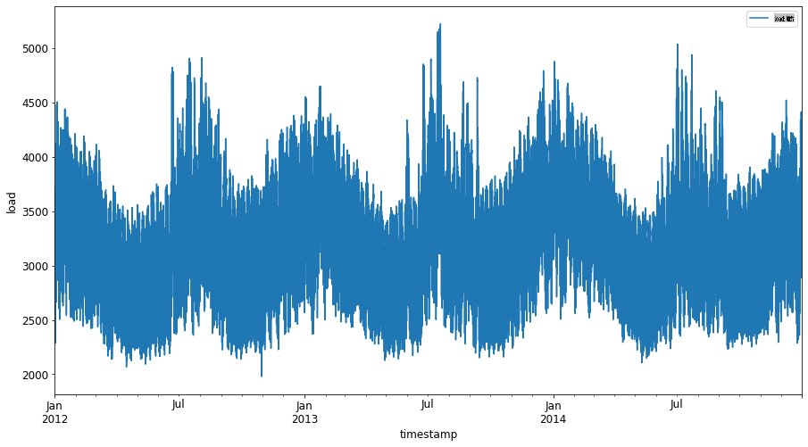
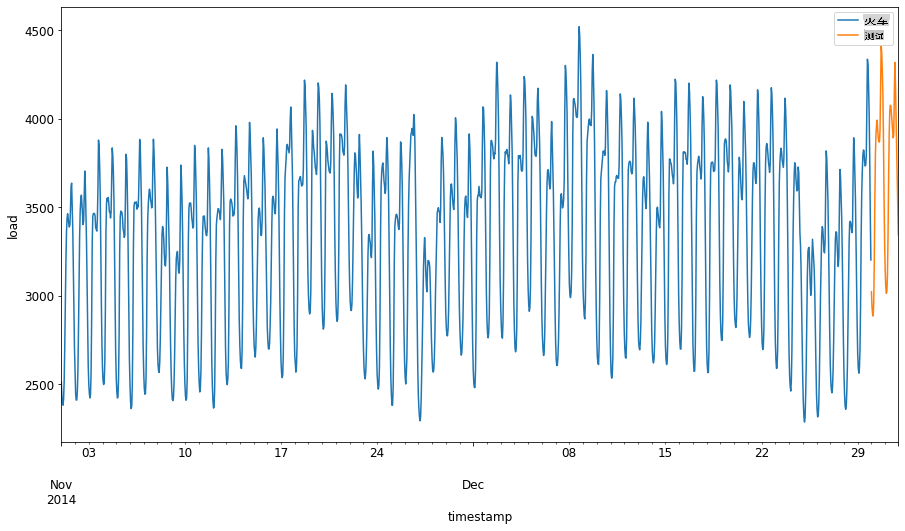
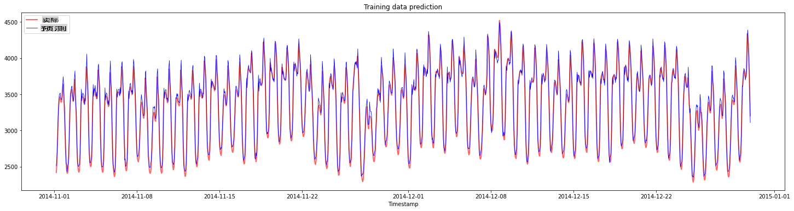
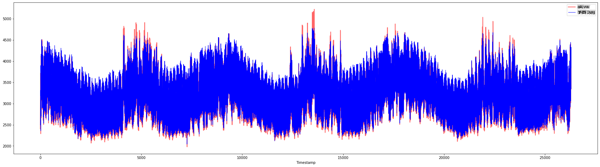

# 使用支持向量回归进行时间序列预测

在上一课中，你学习了如何使用ARIMA模型进行时间序列预测。现在你将学习使用支持向量回归模型，这是一种用于预测连续数据的回归模型。

## [课前测验](https://gray-sand-07a10f403.1.azurestaticapps.net/quiz/51/)

## 介绍

在本课中，你将了解如何使用[**SVM**: **支持向量机**](https://en.wikipedia.org/wiki/Support-vector_machine)进行回归，或**SVR: 支持向量回归**。

### 时间序列背景下的SVR [^1]

在理解SVR在时间序列预测中的重要性之前，这里有一些你需要了解的重要概念：

- **回归:** 一种监督学习技术，用于从给定的输入集预测连续值。其思想是在特征空间中拟合一条包含最多数据点的曲线（或直线）。[点击这里](https://en.wikipedia.org/wiki/Regression_analysis)了解更多信息。
- **支持向量机 (SVM):** 一种用于分类、回归和异常检测的监督学习模型。在分类中，该模型在特征空间中作为边界，在回归中作为最佳拟合线。SVM中通常使用核函数将数据集转换到更高维度的空间，使其更易于分离。[点击这里](https://en.wikipedia.org/wiki/Support-vector_machine)了解更多关于SVM的信息。
- **支持向量回归 (SVR):** 一种SVM，用于找到包含最多数据点的最佳拟合线（在SVM中是超平面）。

### 为什么选择SVR? [^1]

在上一课中，你学习了ARIMA，这是一种非常成功的统计线性方法，用于预测时间序列数据。然而，在许多情况下，时间序列数据具有*非线性*，这无法通过线性模型映射。在这种情况下，SVM在回归任务中考虑数据非线性的能力使得SVR在时间序列预测中非常成功。

## 练习 - 构建一个SVR模型

数据准备的前几步与上一课的[ARIMA](https://github.com/microsoft/ML-For-Beginners/tree/main/7-TimeSeries/2-ARIMA)相同。

打开本课的[_/working_](https://github.com/microsoft/ML-For-Beginners/tree/main/7-TimeSeries/3-SVR/working)文件夹，找到[_notebook.ipynb_](https://github.com/microsoft/ML-For-Beginners/blob/main/7-TimeSeries/3-SVR/working/notebook.ipynb)文件。[ ^2 ]

1. 运行笔记本并导入必要的库: [^2]

   ```python
   import sys
   sys.path.append('../../')
   ```

   ```python
   import os
   import warnings
   import matplotlib.pyplot as plt
   import numpy as np
   import pandas as pd
   import datetime as dt
   import math
   
   from sklearn.svm import SVR
   from sklearn.preprocessing import MinMaxScaler
   from common.utils import load_data, mape
   ```

2. 从`/data/energy.csv`文件中加载数据到Pandas数据框并查看: [^2]

   ```python
   energy = load_data('../../data')[['load']]
   ```

3. 绘制2012年1月至2014年12月的所有可用能源数据: [^2]

   ```python
   energy.plot(y='load', subplots=True, figsize=(15, 8), fontsize=12)
   plt.xlabel('timestamp', fontsize=12)
   plt.ylabel('load', fontsize=12)
   plt.show()
   ```

   

   现在，让我们构建我们的SVR模型。

### 创建训练和测试数据集

现在数据已经加载，你可以将其分为训练集和测试集。然后你将重塑数据以创建基于时间步长的数据集，这对于SVR是必要的。你将在训练集上训练你的模型。模型训练完成后，你将评估其在训练集、测试集和整个数据集上的准确性，以查看整体性能。你需要确保测试集覆盖训练集之后的时间段，以确保模型不会从未来时间段获取信息[^2]（这种情况称为*过拟合*）。

1. 将2014年9月1日至10月31日的两个月分配给训练集。测试集将包括2014年11月1日至12月31日的两个月: [^2]

   ```python
   train_start_dt = '2014-11-01 00:00:00'
   test_start_dt = '2014-12-30 00:00:00'
   ```

2. 可视化差异: [^2]

   ```python
   energy[(energy.index < test_start_dt) & (energy.index >= train_start_dt)][['load']].rename(columns={'load':'train'}) \
       .join(energy[test_start_dt:][['load']].rename(columns={'load':'test'}), how='outer') \
       .plot(y=['train', 'test'], figsize=(15, 8), fontsize=12)
   plt.xlabel('timestamp', fontsize=12)
   plt.ylabel('load', fontsize=12)
   plt.show()
   ```

   

### 准备训练数据

现在，你需要通过对数据进行过滤和缩放来准备训练数据。过滤数据集以仅包括所需的时间段和列，并缩放以确保数据在0到1的范围内。

1. 过滤原始数据集，仅包括每个集合的上述时间段，并仅包括所需的'load'列和日期: [^2]

   ```python
   train = energy.copy()[(energy.index >= train_start_dt) & (energy.index < test_start_dt)][['load']]
   test = energy.copy()[energy.index >= test_start_dt][['load']]
   
   print('Training data shape: ', train.shape)
   print('Test data shape: ', test.shape)
   ```

   ```output
   Training data shape:  (1416, 1)
   Test data shape:  (48, 1)
   ```

2. 将训练数据缩放到（0，1）范围: [^2]

   ```python
   scaler = MinMaxScaler()
   train['load'] = scaler.fit_transform(train)
   ```

4. 现在，缩放测试数据: [^2]

   ```python
   test['load'] = scaler.transform(test)
   ```

### 创建带有时间步长的数据 [^1]

对于SVR，你需要将输入数据转换为`[batch, timesteps]`. So, you reshape the existing `train_data` and `test_data`的形式，使得有一个新的维度表示时间步长。

```python
# Converting to numpy arrays
train_data = train.values
test_data = test.values
```

对于这个例子，我们取`timesteps = 5`。因此，模型的输入是前4个时间步长的数据，输出是第5个时间步长的数据。

```python
timesteps=5
```

使用嵌套列表推导将训练数据转换为2D张量:

```python
train_data_timesteps=np.array([[j for j in train_data[i:i+timesteps]] for i in range(0,len(train_data)-timesteps+1)])[:,:,0]
train_data_timesteps.shape
```

```output
(1412, 5)
```

将测试数据转换为2D张量:

```python
test_data_timesteps=np.array([[j for j in test_data[i:i+timesteps]] for i in range(0,len(test_data)-timesteps+1)])[:,:,0]
test_data_timesteps.shape
```

```output
(44, 5)
```

选择训练和测试数据的输入和输出:

```python
x_train, y_train = train_data_timesteps[:,:timesteps-1],train_data_timesteps[:,[timesteps-1]]
x_test, y_test = test_data_timesteps[:,:timesteps-1],test_data_timesteps[:,[timesteps-1]]

print(x_train.shape, y_train.shape)
print(x_test.shape, y_test.shape)
```

```output
(1412, 4) (1412, 1)
(44, 4) (44, 1)
```

### 实现SVR [^1]

现在，是时候实现SVR了。要了解更多关于此实现的信息，你可以参考[此文档](https://scikit-learn.org/stable/modules/generated/sklearn.svm.SVR.html)。对于我们的实现，我们遵循以下步骤:

  1. 通过调用`SVR()` and passing in the model hyperparameters: kernel, gamma, c and epsilon
  2. Prepare the model for the training data by calling the `fit()` function
  3. Make predictions calling the `predict()`函数定义模型

现在我们创建一个SVR模型。这里我们使用[RBF核](https://scikit-learn.org/stable/modules/svm.html#parameters-of-the-rbf-kernel)，并将超参数gamma、C和epsilon分别设置为0.5、10和0.05。

```python
model = SVR(kernel='rbf',gamma=0.5, C=10, epsilon = 0.05)
```

#### 在训练数据上拟合模型 [^1]

```python
model.fit(x_train, y_train[:,0])
```

```output
SVR(C=10, cache_size=200, coef0=0.0, degree=3, epsilon=0.05, gamma=0.5,
    kernel='rbf', max_iter=-1, shrinking=True, tol=0.001, verbose=False)
```

#### 进行模型预测 [^1]

```python
y_train_pred = model.predict(x_train).reshape(-1,1)
y_test_pred = model.predict(x_test).reshape(-1,1)

print(y_train_pred.shape, y_test_pred.shape)
```

```output
(1412, 1) (44, 1)
```

你已经构建了你的SVR！现在我们需要评估它。

### 评估你的模型 [^1]

为了评估，首先我们将数据缩放回原始比例。然后，为了检查性能，我们将绘制原始和预测的时间序列图，并打印MAPE结果。

缩放预测和原始输出:

```python
# Scaling the predictions
y_train_pred = scaler.inverse_transform(y_train_pred)
y_test_pred = scaler.inverse_transform(y_test_pred)

print(len(y_train_pred), len(y_test_pred))
```

```python
# Scaling the original values
y_train = scaler.inverse_transform(y_train)
y_test = scaler.inverse_transform(y_test)

print(len(y_train), len(y_test))
```

#### 检查模型在训练和测试数据上的表现 [^1]

我们从数据集中提取时间戳以显示在图表的x轴上。注意，我们使用第一个```timesteps-1```值作为第一个输出的输入，因此输出的时间戳将从那之后开始。

```python
train_timestamps = energy[(energy.index < test_start_dt) & (energy.index >= train_start_dt)].index[timesteps-1:]
test_timestamps = energy[test_start_dt:].index[timesteps-1:]

print(len(train_timestamps), len(test_timestamps))
```

```output
1412 44
```

绘制训练数据的预测:

```python
plt.figure(figsize=(25,6))
plt.plot(train_timestamps, y_train, color = 'red', linewidth=2.0, alpha = 0.6)
plt.plot(train_timestamps, y_train_pred, color = 'blue', linewidth=0.8)
plt.legend(['Actual','Predicted'])
plt.xlabel('Timestamp')
plt.title("Training data prediction")
plt.show()
```



打印训练数据的MAPE

```python
print('MAPE for training data: ', mape(y_train_pred, y_train)*100, '%')
```

```output
MAPE for training data: 1.7195710200875551 %
```

绘制测试数据的预测

```python
plt.figure(figsize=(10,3))
plt.plot(test_timestamps, y_test, color = 'red', linewidth=2.0, alpha = 0.6)
plt.plot(test_timestamps, y_test_pred, color = 'blue', linewidth=0.8)
plt.legend(['Actual','Predicted'])
plt.xlabel('Timestamp')
plt.show()
```


打印测试数据的MAPE

```python
print('MAPE for testing data: ', mape(y_test_pred, y_test)*100, '%')
```

```output
MAPE for testing data:  1.2623790187854018 %
```

🏆 你在测试数据集上得到了非常好的结果！

### 检查模型在完整数据集上的表现 [^1]

```python
# Extracting load values as numpy array
data = energy.copy().values

# Scaling
data = scaler.transform(data)

# Transforming to 2D tensor as per model input requirement
data_timesteps=np.array([[j for j in data[i:i+timesteps]] for i in range(0,len(data)-timesteps+1)])[:,:,0]
print("Tensor shape: ", data_timesteps.shape)

# Selecting inputs and outputs from data
X, Y = data_timesteps[:,:timesteps-1],data_timesteps[:,[timesteps-1]]
print("X shape: ", X.shape,"\nY shape: ", Y.shape)
```

```output
Tensor shape:  (26300, 5)
X shape:  (26300, 4) 
Y shape:  (26300, 1)
```

```python
# Make model predictions
Y_pred = model.predict(X).reshape(-1,1)

# Inverse scale and reshape
Y_pred = scaler.inverse_transform(Y_pred)
Y = scaler.inverse_transform(Y)
```

```python
plt.figure(figsize=(30,8))
plt.plot(Y, color = 'red', linewidth=2.0, alpha = 0.6)
plt.plot(Y_pred, color = 'blue', linewidth=0.8)
plt.legend(['Actual','Predicted'])
plt.xlabel('Timestamp')
plt.show()
```



```python
print('MAPE: ', mape(Y_pred, Y)*100, '%')
```

```output
MAPE:  2.0572089029888656 %
```

🏆 非常好的图表，显示了一个具有良好准确性的模型。做得好！

---

## 🚀挑战

- 尝试在创建模型时调整超参数（gamma、C、epsilon），并在数据上进行评估，看看哪组超参数在测试数据上给出最佳结果。要了解更多关于这些超参数的信息，你可以参考[此文档](https://scikit-learn.org/stable/modules/svm.html#parameters-of-the-rbf-kernel)。
- 尝试为模型使用不同的核函数，并分析它们在数据集上的表现。可以参考[此文档](https://scikit-learn.org/stable/modules/svm.html#kernel-functions)。
- 尝试使用不同的`timesteps`值来让模型回顾以进行预测。

## [课后测验](https://gray-sand-07a10f403.1.azurestaticapps.net/quiz/52/)

## 复习与自学

本课旨在介绍SVR在时间序列预测中的应用。要了解更多关于SVR的信息，你可以参考[这篇博客](https://www.analyticsvidhya.com/blog/2020/03/support-vector-regression-tutorial-for-machine-learning/)。这篇[scikit-learn文档](https://scikit-learn.org/stable/modules/svm.html)提供了关于SVM的一般解释，[SVR](https://scikit-learn.org/stable/modules/svm.html#regression)以及其他实现细节，如可以使用的不同[核函数](https://scikit-learn.org/stable/modules/svm.html#kernel-functions)及其参数。

## 作业

[一个新的SVR模型](assignment.md)

## 致谢

[^1]: 本节中的文字、代码和输出由[@AnirbanMukherjeeXD](https://github.com/AnirbanMukherjeeXD)贡献
[^2]: 本节中的文字、代码和输出取自[ARIMA](https://github.com/microsoft/ML-For-Beginners/tree/main/7-TimeSeries/2-ARIMA)

**免责声明**：
本文档使用基于机器的人工智能翻译服务进行翻译。尽管我们力求准确，但请注意，自动翻译可能包含错误或不准确之处。应将原始语言的文档视为权威来源。对于关键信息，建议使用专业人工翻译。对于因使用此翻译而产生的任何误解或误释，我们不承担任何责任。