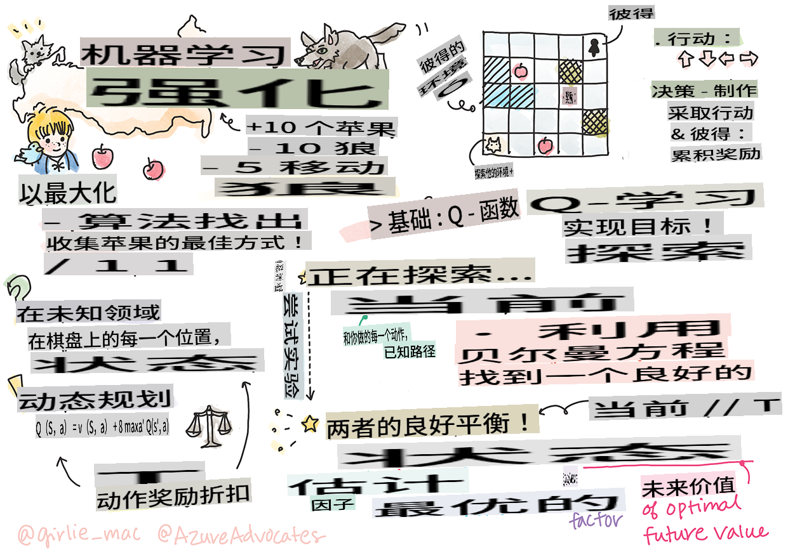

## 强化学习和Q-Learning简介


> [Tomomi Imura](https://www.twitter.com/girlie_mac) 的手绘笔记

强化学习涉及三个重要概念：智能体、状态和每个状态的一组动作。通过在指定状态下执行一个动作，智能体会获得奖励。再次想象一下电脑游戏超级马里奥。你是马里奥，你在游戏关卡中，站在悬崖边。你上方有一个硬币。你是马里奥，在游戏关卡中，处于一个特定位置……这就是你的状态。向右移动一步（一个动作）会让你掉下悬崖，这会给你一个低分。然而，按下跳跃按钮会让你得分并且你会活下来。这是一个正面的结果，应该给你一个正的分数。

通过使用强化学习和模拟器（游戏），你可以学习如何玩游戏以最大化奖励，即尽可能多地得分和保持存活。

[](https://www.youtube.com/watch?v=lDq_en8RNOo)

> 🎥 点击上面的图片听 Dmitry 讨论强化学习

## [课前测验](https://gray-sand-07a10f403.1.azurestaticapps.net/quiz/45/)

## 先决条件和设置

在本课中，我们将用Python实验一些代码。你应该能够在你的电脑或云端运行本课的Jupyter Notebook代码。

你可以打开[课程笔记本](https://github.com/microsoft/ML-For-Beginners/blob/main/8-Reinforcement/1-QLearning/notebook.ipynb)并通过本课构建。

> **注意:** 如果你从云端打开此代码，你还需要获取 [`rlboard.py`](https://github.com/microsoft/ML-For-Beginners/blob/main/8-Reinforcement/1-QLearning/rlboard.py) 文件，它在笔记本代码中使用。将其添加到与笔记本相同的目录中。

## 简介

在本课中，我们将探索**[彼得与狼](https://en.wikipedia.org/wiki/Peter_and_the_Wolf)**的世界，这个故事灵感来自俄罗斯作曲家[谢尔盖·普罗科菲耶夫](https://en.wikipedia.org/wiki/Sergei_Prokofiev)创作的音乐童话。我们将使用**强化学习**让彼得探索他的环境，收集美味的苹果并避免遇到狼。

**强化学习**（RL）是一种学习技术，它允许我们通过运行许多实验来学习**智能体**在某些**环境**中的最佳行为。在这种环境中，智能体应该有某种**目标**，由**奖励函数**定义。

## 环境

为了简单起见，让我们将彼得的世界看作一个大小为 `width` x `height` 的正方形棋盘，如下所示：


这个棋盘上的每个格子可以是：

* **地面**，彼得和其他生物可以在上面行走。
* **水**，显然你不能在上面行走。
* **树**或**草地**，可以休息的地方。
* **苹果**，彼得会很高兴找到它来喂饱自己。
* **狼**，很危险，应该避免。

有一个单独的Python模块 [`rlboard.py`](https://github.com/microsoft/ML-For-Beginners/blob/main/8-Reinforcement/1-QLearning/rlboard.py)，包含处理这个环境的代码。因为这些代码对于理解我们的概念并不重要，所以我们将导入该模块并用它来创建示例棋盘（代码块1）：

```python
from rlboard import *

width, height = 8,8
m = Board(width,height)
m.randomize(seed=13)
m.plot()
```

这段代码应该打印出类似上图的环境。

## 动作和策略

在我们的例子中，彼得的目标是找到一个苹果，同时避免狼和其他障碍。为此，他可以四处走动，直到找到一个苹果。

因此，在任何位置，他可以选择以下动作之一：向上、向下、向左和向右。

我们将这些动作定义为一个字典，并将它们映射到相应的坐标变化对。例如，向右移动 (`R`) would correspond to a pair `(1,0)`。(代码块2)：

```python
actions = { "U" : (0,-1), "D" : (0,1), "L" : (-1,0), "R" : (1,0) }
action_idx = { a : i for i,a in enumerate(actions.keys()) }
```

总结一下，这个场景的策略和目标如下：

- **策略**，我们的智能体（彼得）的策略由一个所谓的**策略函数**定义。策略是一个函数，在任何给定状态下返回动作。在我们的例子中，问题的状态由棋盘表示，包括玩家的当前位置。

- **目标**，强化学习的目标是最终学习一个好的策略，能够有效地解决问题。然而，作为基线，我们考虑最简单的策略，称为**随机行走**。

## 随机行走

让我们首先通过实现随机行走策略来解决我们的问题。通过随机行走，我们将从允许的动作中随机选择下一个动作，直到我们到达苹果（代码块3）。

1. 使用下面的代码实现随机行走：

    ```python
    def random_policy(m):
        return random.choice(list(actions))
    
    def walk(m,policy,start_position=None):
        n = 0 # number of steps
        # set initial position
        if start_position:
            m.human = start_position 
        else:
            m.random_start()
        while True:
            if m.at() == Board.Cell.apple:
                return n # success!
            if m.at() in [Board.Cell.wolf, Board.Cell.water]:
                return -1 # eaten by wolf or drowned
            while True:
                a = actions[policy(m)]
                new_pos = m.move_pos(m.human,a)
                if m.is_valid(new_pos) and m.at(new_pos)!=Board.Cell.water:
                    m.move(a) # do the actual move
                    break
            n+=1
    
    walk(m,random_policy)
    ```

    调用 `walk` 应该返回相应路径的长度，每次运行可能会有所不同。

1. 多次运行行走实验（例如100次），并打印结果统计数据（代码块4）：

    ```python
    def print_statistics(policy):
        s,w,n = 0,0,0
        for _ in range(100):
            z = walk(m,policy)
            if z<0:
                w+=1
            else:
                s += z
                n += 1
        print(f"Average path length = {s/n}, eaten by wolf: {w} times")
    
    print_statistics(random_policy)
    ```

    请注意，路径的平均长度大约是30-40步，这相当多，考虑到到最近苹果的平均距离大约是5-6步。

    你还可以看到彼得在随机行走期间的移动情况：

    

## 奖励函数

为了让我们的策略更智能，我们需要了解哪些移动比其他移动“更好”。为此，我们需要定义我们的目标。

目标可以用**奖励函数**来定义，它会为每个状态返回一些分数值。数值越高，奖励函数越好。（代码块5）

```python
move_reward = -0.1
goal_reward = 10
end_reward = -10

def reward(m,pos=None):
    pos = pos or m.human
    if not m.is_valid(pos):
        return end_reward
    x = m.at(pos)
    if x==Board.Cell.water or x == Board.Cell.wolf:
        return end_reward
    if x==Board.Cell.apple:
        return goal_reward
    return move_reward
```

关于奖励函数的一个有趣之处在于，在大多数情况下，*我们只有在游戏结束时才会得到实质性的奖励*。这意味着我们的算法应该以某种方式记住导致最终正面奖励的“好”步骤，并增加它们的重要性。同样，所有导致不良结果的移动应该被抑制。

## Q-Learning

我们将在这里讨论的算法称为**Q-Learning**。在这个算法中，策略由一个函数（或数据结构）定义，称为**Q-Table**。它记录了在给定状态下每个动作的“好坏”。

它被称为Q-Table，因为将其表示为表格或多维数组通常很方便。由于我们的棋盘尺寸为 `width` x `height`，我们可以使用形状为 `width` x `height` x `len(actions)` 的numpy数组来表示Q-Table：（代码块6）

```python
Q = np.ones((width,height,len(actions)),dtype=np.float)*1.0/len(actions)
```

请注意，我们用相等的值初始化Q-Table的所有值，在我们的例子中是0.25。这对应于“随机行走”策略，因为每个状态下的所有移动都同样好。我们可以将Q-Table传递给 `plot` function in order to visualize the table on the board: `m.plot(Q)`.


In the center of each cell there is an "arrow" that indicates the preferred direction of movement. Since all directions are equal, a dot is displayed.

Now we need to run the simulation, explore our environment, and learn a better distribution of Q-Table values, which will allow us to find the path to the apple much faster.

## Essence of Q-Learning: Bellman Equation

Once we start moving, each action will have a corresponding reward, i.e. we can theoretically select the next action based on the highest immediate reward. However, in most states, the move will not achieve our goal of reaching the apple, and thus we cannot immediately decide which direction is better.

> Remember that it is not the immediate result that matters, but rather the final result, which we will obtain at the end of the simulation.

In order to account for this delayed reward, we need to use the principles of **[dynamic programming](https://en.wikipedia.org/wiki/Dynamic_programming)**, which allow us to think about out problem recursively.

Suppose we are now at the state *s*, and we want to move to the next state *s'*. By doing so, we will receive the immediate reward *r(s,a)*, defined by the reward function, plus some future reward. If we suppose that our Q-Table correctly reflects the "attractiveness" of each action, then at state *s'* we will chose an action *a* that corresponds to maximum value of *Q(s',a')*. Thus, the best possible future reward we could get at state *s* will be defined as `max`<sub>a'</sub>*Q(s',a')* (maximum here is computed over all possible actions *a'* at state *s'*).

This gives the **Bellman formula** for calculating the value of the Q-Table at state *s*, given action *a*:


Here γ is the so-called **discount factor** that determines to which extent you should prefer the current reward over the future reward and vice versa.

## Learning Algorithm

Given the equation above, we can now write pseudo-code for our learning algorithm:

* Initialize Q-Table Q with equal numbers for all states and actions
* Set learning rate α ← 1
* Repeat simulation many times
   1. Start at random position
   1. Repeat
        1. Select an action *a* at state *s*
        2. Execute action by moving to a new state *s'*
        3. If we encounter end-of-game condition, or total reward is too small - exit simulation  
        4. Compute reward *r* at the new state
        5. Update Q-Function according to Bellman equation: *Q(s,a)* ← *(1-α)Q(s,a)+α(r+γ max<sub>a'</sub>Q(s',a'))*
        6. *s* ← *s'*
        7. Update the total reward and decrease α.

## Exploit vs. explore

In the algorithm above, we did not specify how exactly we should choose an action at step 2.1. If we are choosing the action randomly, we will randomly **explore** the environment, and we are quite likely to die often as well as explore areas where we would not normally go. An alternative approach would be to **exploit** the Q-Table values that we already know, and thus to choose the best action (with higher Q-Table value) at state *s*. This, however, will prevent us from exploring other states, and it's likely we might not find the optimal solution.

Thus, the best approach is to strike a balance between exploration and exploitation. This can be done by choosing the action at state *s* with probabilities proportional to values in the Q-Table. In the beginning, when Q-Table values are all the same, it would correspond to a random selection, but as we learn more about our environment, we would be more likely to follow the optimal route while allowing the agent to choose the unexplored path once in a while.

## Python implementation

We are now ready to implement the learning algorithm. Before we do that, we also need some function that will convert arbitrary numbers in the Q-Table into a vector of probabilities for corresponding actions.

1. Create a function `probs()`：

    ```python
    def probs(v,eps=1e-4):
        v = v-v.min()+eps
        v = v/v.sum()
        return v
    ```

    我们在原始向量中添加了一些 `eps`，以避免在初始情况下，向量的所有分量相同时发生除以0的情况。

通过5000次实验运行学习算法，也称为**epochs**：（代码块8）
```python
    for epoch in range(5000):
    
        # Pick initial point
        m.random_start()
        
        # Start travelling
        n=0
        cum_reward = 0
        while True:
            x,y = m.human
            v = probs(Q[x,y])
            a = random.choices(list(actions),weights=v)[0]
            dpos = actions[a]
            m.move(dpos,check_correctness=False) # we allow player to move outside the board, which terminates episode
            r = reward(m)
            cum_reward += r
            if r==end_reward or cum_reward < -1000:
                lpath.append(n)
                break
            alpha = np.exp(-n / 10e5)
            gamma = 0.5
            ai = action_idx[a]
            Q[x,y,ai] = (1 - alpha) * Q[x,y,ai] + alpha * (r + gamma * Q[x+dpos[0], y+dpos[1]].max())
            n+=1
```

执行此算法后，Q-Table 应该会更新每一步中不同动作的吸引力值。我们可以尝试通过在每个单元格绘制一个指向期望移动方向的向量来可视化Q-Table。为了简化，我们画一个小圆圈代替箭头。

## 检查策略

由于Q-Table列出了每个状态下每个动作的“吸引力”，因此很容易使用它来定义在我们的世界中的高效导航。在最简单的情况下，我们可以选择对应于最高Q-Table值的动作：（代码块9）

```python
def qpolicy_strict(m):
        x,y = m.human
        v = probs(Q[x,y])
        a = list(actions)[np.argmax(v)]
        return a

walk(m,qpolicy_strict)
```

> 如果你多次尝试上述代码，你可能会注意到有时它会“卡住”，你需要按下笔记本中的停止按钮来中断它。这是因为可能会出现两种状态在最优Q-Value方面“指向”彼此的情况，在这种情况下，智能体最终会在这些状态之间无限移动。

## 🚀挑战

> **任务1:** 修改 `walk` function to limit the maximum length of path by a certain number of steps (say, 100), and watch the code above return this value from time to time.

> **Task 2:** Modify the `walk` function so that it does not go back to the places where it has already been previously. This will prevent `walk` from looping, however, the agent can still end up being "trapped" in a location from which it is unable to escape.

## Navigation

A better navigation policy would be the one that we used during training, which combines exploitation and exploration. In this policy, we will select each action with a certain probability, proportional to the values in the Q-Table. This strategy may still result in the agent returning back to a position it has already explored, but, as you can see from the code below, it results in a very short average path to the desired location (remember that `print_statistics` 运行模拟100次：（代码块10）

```python
def qpolicy(m):
        x,y = m.human
        v = probs(Q[x,y])
        a = random.choices(list(actions),weights=v)[0]
        return a

print_statistics(qpolicy)
```

运行此代码后，你应该会得到比之前小得多的平均路径长度，大约在3-6之间。

## 调查学习过程

正如我们所提到的，学习过程是在探索和利用已获得的关于问题空间结构的知识之间的平衡。我们已经看到学习的结果（帮助智能体找到通向目标的短路径的能力）有所改善，但观察学习过程中平均路径长度的变化也很有趣：

学习总结如下：

- **平均路径长度增加**。我们看到的是，起初平均路径长度增加。这可能是因为当我们对环境一无所知时，我们可能会陷入不良状态，如水或狼。随着我们了解更多并开始使用这些知识，我们可以更长时间地探索环境，但我们仍然不知道苹果的位置。

- **路径长度减少，随着我们学到更多**。一旦我们学到足够多，智能体更容易实现目标，路径长度开始减少。然而，我们仍然开放探索，因此我们经常偏离最佳路径，探索新选项，使路径比最优路径更长。

- **长度突然增加**。我们在这个图表上还观察到某些时候，长度突然增加。这表明过程的随机性，并且我们可能会在某个时候通过用新值覆盖它们来“破坏”Q-Table系数。这理想情况下应该通过降低学习率来最小化（例如，在训练结束时，我们只调整Q-Table值一个小值）。

总的来说，重要的是要记住，学习过程的成功和质量在很大程度上取决于参数，如学习率、学习率衰减和折扣因子。这些通常称为**超参数**，以区别于**参数**，我们在训练过程中优化（例如Q-Table系数）。找到最佳超参数值的过程称为**超参数优化**，它值得单独讨论。

## [课后测验](https://gray-sand-07a10f403.1.azurestaticapps.net/quiz/46/)

## 作业
[一个更真实的世界](assignment.md)

**免责声明**：
本文档是使用基于机器的人工智能翻译服务翻译的。虽然我们努力确保准确性，但请注意，自动翻译可能包含错误或不准确之处。应将原文档的本国语言版本视为权威来源。对于重要信息，建议使用专业人工翻译。对于因使用此翻译而引起的任何误解或误读，我们不承担责任。