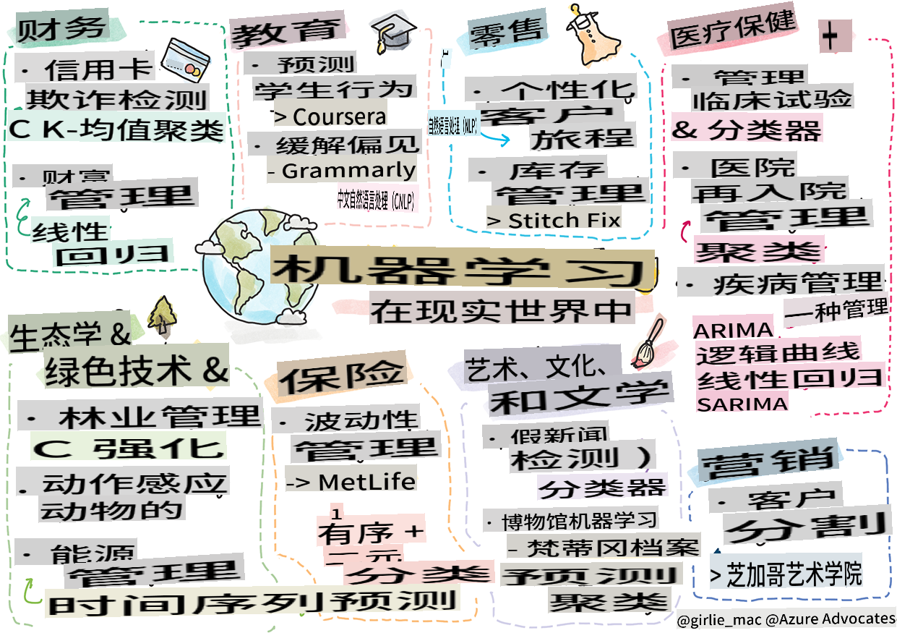

# 后记：现实世界中的机器学习

> Sketchnote 由 [Tomomi Imura](https://www.twitter.com/girlie_mac) 提供

在本课程中，你学到了许多准备数据进行训练和创建机器学习模型的方法。你构建了一系列经典的回归、聚类、分类、自然语言处理和时间序列模型。恭喜你！现在，你可能会想，这一切是为了什么……这些模型在现实世界中的应用是什么？

虽然深度学习的 AI 在工业界引起了很多关注，但经典机器学习模型仍然有许多有价值的应用。你今天甚至可能会使用其中的一些应用！在本课中，你将探索八个不同的行业和主题领域如何使用这些类型的模型来使他们的应用程序更高效、更可靠、更智能并为用户提供更多价值。

## [课前测验](https://gray-sand-07a10f403.1.azurestaticapps.net/quiz/49/)

## 💰 金融

金融领域为机器学习提供了许多机会。这个领域的许多问题都可以通过使用机器学习来建模和解决。

### 信用卡欺诈检测

我们在课程中学到了 [k-means 聚类](../../5-Clustering/2-K-Means/README.md)，但它如何用于解决与信用卡欺诈相关的问题呢？

k-means 聚类在一种称为 **异常检测** 的信用卡欺诈检测技术中非常有用。异常或一组数据观察中的偏差可以告诉我们信用卡是否在正常使用，或者是否有异常情况发生。正如下面链接的论文所示，你可以使用 k-means 聚类算法对信用卡数据进行分类，并根据每笔交易的异常程度将其分配到一个簇中。然后，你可以评估这些最具风险的簇，以区分欺诈交易和合法交易。
[参考](https://citeseerx.ist.psu.edu/viewdoc/download?doi=10.1.1.680.1195&rep=rep1&type=pdf)

### 财富管理

在财富管理中，个人或公司代表客户处理投资。他们的工作是长期维持和增长财富，因此选择表现良好的投资是至关重要的。

评估特定投资表现的一种方法是通过统计回归。[线性回归](../../2-Regression/1-Tools/README.md) 是理解基金相对于某个基准表现的有价值工具。我们还可以推断回归结果是否具有统计显著性，或者它们对客户投资的影响程度。你甚至可以进一步扩展你的分析，使用多重回归，将其他风险因素考虑在内。有关如何为特定基金进行此操作的示例，请参阅下面关于使用回归评估基金表现的论文。
[参考](http://www.brightwoodventures.com/evaluating-fund-performance-using-regression/)

## 🎓 教育

教育领域也是一个非常有趣的应用机器学习的领域。有许多有趣的问题需要解决，例如检测考试或论文中的作弊行为，或管理纠正过程中的偏见，无论是有意还是无意的。

### 预测学生行为

[Coursera](https://coursera.com)，一个在线开放课程提供商，有一个很棒的技术博客，他们在博客中讨论了许多工程决策。在这个案例研究中，他们绘制了一条回归线，试图探索低 NPS（净推荐值）评分与课程保留或退课之间的任何相关性。
[参考](https://medium.com/coursera-engineering/controlled-regression-quantifying-the-impact-of-course-quality-on-learner-retention-31f956bd592a)

### 缓解偏见

[Grammarly](https://grammarly.com)，一个检查拼写和语法错误的写作助手，在其产品中使用了复杂的 [自然语言处理系统](../../6-NLP/README.md)。他们在技术博客中发布了一篇有趣的案例研究，讨论了他们如何处理机器学习中的性别偏见问题，你在我们的[公平性介绍课程](../../1-Introduction/3-fairness/README.md)中学到了这一点。
[参考](https://www.grammarly.com/blog/engineering/mitigating-gender-bias-in-autocorrect/)

## 👜 零售

零售行业肯定可以从机器学习的使用中受益，从创建更好的客户旅程到以最佳方式库存。

### 个性化客户旅程

在销售家具等家居用品的公司 Wayfair，帮助客户找到符合他们品味和需求的产品至关重要。在这篇文章中，公司工程师描述了他们如何使用机器学习和自然语言处理来“为客户提供正确的结果”。特别是，他们的查询意图引擎使用了实体提取、分类器训练、资产和意见提取以及客户评论的情感标记。这是 NLP 在在线零售中的经典用例。
[参考](https://www.aboutwayfair.com/tech-innovation/how-we-use-machine-learning-and-natural-language-processing-to-empower-search)

### 库存管理

像 [StitchFix](https://stitchfix.com) 这样创新且灵活的公司，一个向消费者发送服装的盒子服务，严重依赖机器学习进行推荐和库存管理。他们的造型团队与商品团队密切合作：“我们的一个数据科学家尝试了一种遗传算法，并将其应用于服装，以预测今天不存在的成功服装。我们将其带给商品团队，现在他们可以将其作为一种工具使用。”
[参考](https://www.zdnet.com/article/how-stitch-fix-uses-machine-learning-to-master-the-science-of-styling/)

## 🏥 医疗保健

医疗保健领域可以利用机器学习来优化研究任务以及物流问题，例如重新接纳患者或阻止疾病传播。

### 管理临床试验

临床试验中的毒性是药物制造商的一个主要关注点。多少毒性是可以容忍的？在这项研究中，分析各种临床试验方法导致开发了一种新的方法来预测临床试验结果的概率。具体来说，他们能够使用随机森林来生成一个 [分类器](../../4-Classification/README.md)，该分类器能够区分药物组。
[参考](https://www.sciencedirect.com/science/article/pii/S2451945616302914)

### 医院再入院管理

医院护理成本高昂，尤其是当患者需要重新入院时。本文讨论了一家公司如何使用机器学习通过 [聚类](../../5-Clustering/README.md) 算法来预测再入院的可能性。这些聚类帮助分析师“发现可能有共同原因的再入院群体”。
[参考](https://healthmanagement.org/c/healthmanagement/issuearticle/hospital-readmissions-and-machine-learning)

### 疾病管理

最近的疫情使人们对机器学习如何帮助阻止疾病传播有了更深的认识。在这篇文章中，你会看到 ARIMA、逻辑曲线、线性回归和 SARIMA 的使用。“这项工作试图计算这种病毒的传播率，从而预测死亡、康复和确诊病例，以便我们能够更好地准备和生存。”
[参考](https://www.ncbi.nlm.nih.gov/pmc/articles/PMC7979218/)

## 🌲 生态与绿色科技

自然和生态由许多敏感的系统组成，动物和自然之间的相互作用成为焦点。准确测量这些系统并在发生情况时采取适当行动（例如森林火灾或动物数量下降）是非常重要的。

### 森林管理

你在之前的课程中学到了 [强化学习](../../8-Reinforcement/README.md)。它在预测自然模式时非常有用。特别是，它可以用于跟踪生态问题，例如森林火灾和入侵物种的传播。在加拿大，一组研究人员使用强化学习从卫星图像中构建了森林火灾动态模型。使用一种创新的“空间传播过程 (SSP)”，他们将森林火灾视为“景观中任何单元格的代理”。“火灾在任何时间点从某个位置采取的行动集合包括向北、向南、向东或向西传播或不传播。

这种方法颠倒了通常的 RL 设置，因为相应的马尔可夫决策过程 (MDP) 的动态是立即火灾传播的已知函数。”阅读更多关于该组使用的经典算法的链接如下。
[参考](https://www.frontiersin.org/articles/10.3389/fict.2018.00006/full)

### 动物运动传感

虽然深度学习在视觉跟踪动物运动方面引发了一场革命（你可以在这里构建自己的 [北极熊追踪器](https://docs.microsoft.com/learn/modules/build-ml-model-with-azure-stream-analytics/?WT.mc_id=academic-77952-leestott)），但经典机器学习在这个任务中仍然有一席之地。

用于跟踪农场动物运动的传感器和物联网利用了这种类型的视觉处理，但更基本的机器学习技术对于预处理数据非常有用。例如，在这篇论文中，使用各种分类器算法监测和分析了绵羊的姿势。你可能会在第 335 页看到 ROC 曲线。
[参考](https://druckhaus-hofmann.de/gallery/31-wj-feb-2020.pdf)

### ⚡️ 能源管理
  
在我们关于[时间序列预测](../../7-TimeSeries/README.md)的课程中，我们提到了通过了解供需关系来为一个小镇生成收入的智能停车计时器的概念。本文详细讨论了聚类、回归和时间序列预测如何结合起来，帮助预测爱尔兰未来的能源使用，基于智能计量。
[参考](https://www-cdn.knime.com/sites/default/files/inline-images/knime_bigdata_energy_timeseries_whitepaper.pdf)

## 💼 保险

保险行业是另一个使用机器学习来构建和优化可行的金融和精算模型的行业。

### 波动性管理

MetLife，一家人寿保险提供商，公开了他们分析和缓解财务模型波动性的方法。在这篇文章中，你会注意到二元和序数分类可视化。你还会发现预测可视化。
[参考](https://investments.metlife.com/content/dam/metlifecom/us/investments/insights/research-topics/macro-strategy/pdf/MetLifeInvestmentManagement_MachineLearnedRanking_070920.pdf)

## 🎨 艺术、文化与文学

在艺术领域，例如新闻业，有许多有趣的问题。检测假新闻是一个巨大的问题，因为它已被证明会影响人们的意见，甚至颠覆民主。博物馆也可以通过使用机器学习在从发现文物之间的联系到资源规划的各个方面受益。

### 假新闻检测

在当今的媒体中，检测假新闻已成为猫捉老鼠的游戏。在这篇文章中，研究人员建议测试结合我们学习的几种机器学习技术的系统，并部署最佳模型：“该系统基于自然语言处理从数据中提取特征，然后这些特征用于训练机器学习分类器，如朴素贝叶斯、支持向量机 (SVM)、随机森林 (RF)、随机梯度下降 (SGD) 和逻辑回归 (LR)。”
[参考](https://www.irjet.net/archives/V7/i6/IRJET-V7I6688.pdf)

这篇文章展示了如何结合不同的机器学习领域可以产生有趣的结果，帮助阻止假新闻传播并造成实际损害；在这种情况下，动机是关于 COVID 治疗的谣言传播引发了暴力。

### 博物馆机器学习

博物馆正处于 AI 革命的前沿，随着技术的进步，编目和数字化收藏以及发现文物之间的联系变得更加容易。像 [In Codice Ratio](https://www.sciencedirect.com/science/article/abs/pii/S0306457321001035#:~:text=1.,studies%20over%20large%20historical%20sources.) 这样的项目正在帮助揭开梵蒂冈档案馆等无法访问的收藏的神秘面纱。但是，博物馆的业务方面也受益于机器学习模型。

例如，芝加哥艺术博物馆建立了模型来预测观众的兴趣以及他们何时会参观展览。目标是每次用户访问博物馆时创建个性化和优化的访问体验。“在 2017 财年，模型预测的出席率和入场率的准确率在 1% 以内，”芝加哥艺术博物馆高级副总裁 Andrew Simnick 说。
[Reference](https://www.chicagobusiness.com/article/20180518/ISSUE01/180519840/art-institute-of-chicago-uses-data-to-make-exhibit-choices)

## 🏷 市场营销

### 客户细分

最有效的营销策略是根据不同的群体以不同的方式针对客户。在这篇文章中，讨论了聚类算法的使用，以支持差异化营销。差异化营销帮助公司提高品牌认知度，吸引更多客户，并赚取更多利润。
[Reference](https://ai.inqline.com/machine-learning-for-marketing-customer-segmentation/)

## 🚀 挑战

找出另一个受益于本课程中所学技术的行业，并了解它如何使用机器学习。

## [课后测验](https://gray-sand-07a10f403.1.azurestaticapps.net/quiz/50/)

## 复习与自学

Wayfair的数据科学团队有几个关于他们公司如何使用机器学习的有趣视频。值得[一看](https://www.youtube.com/channel/UCe2PjkQXqOuwkW1gw6Ameuw/videos)!

## 作业

[机器学习寻宝游戏](assignment.md)

**免责声明**:
本文档是使用基于机器的人工智能翻译服务翻译的。尽管我们努力确保准确性，但请注意，自动翻译可能包含错误或不准确之处。应将原文档的母语版本视为权威来源。对于关键信息，建议使用专业人工翻译。我们不对因使用本翻译而产生的任何误解或误读承担责任。