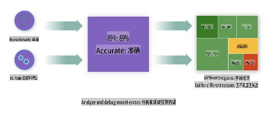
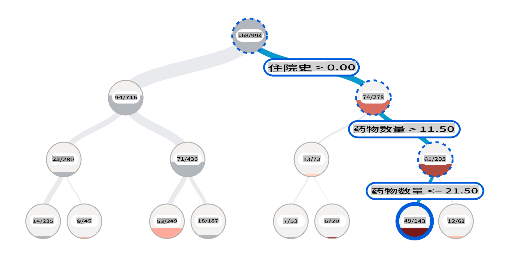
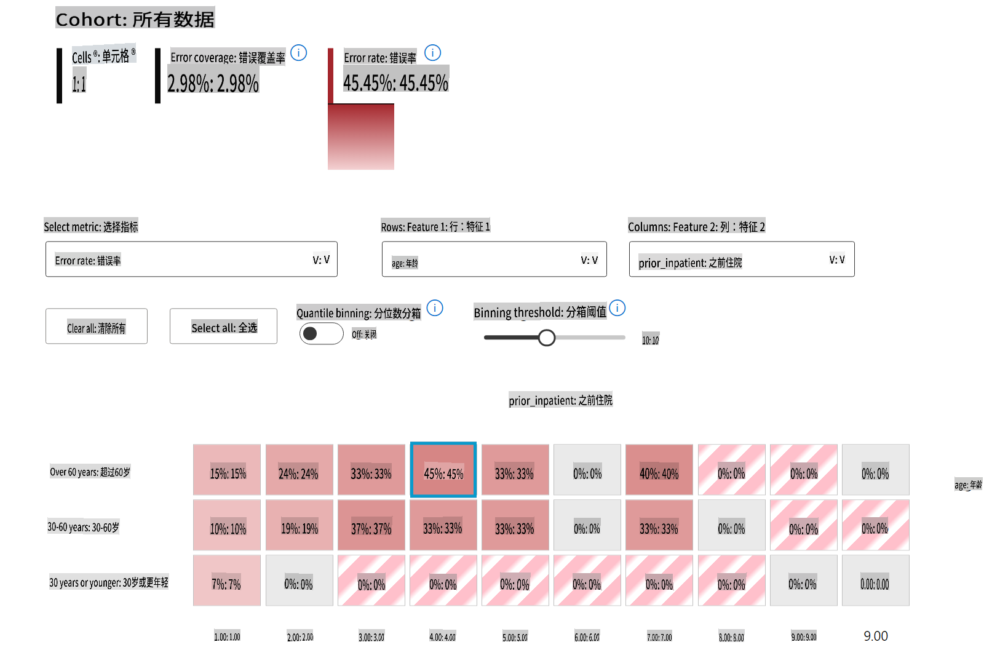
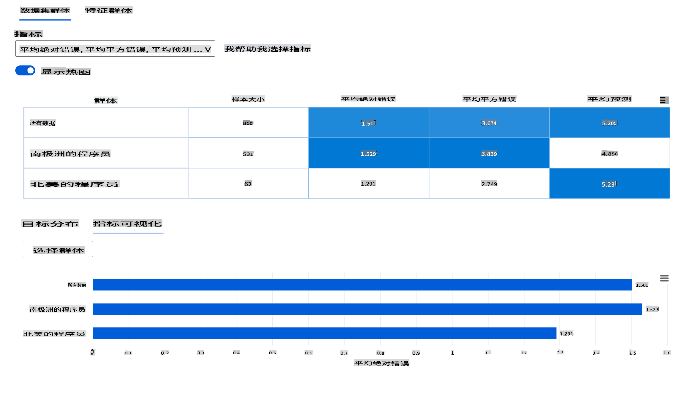
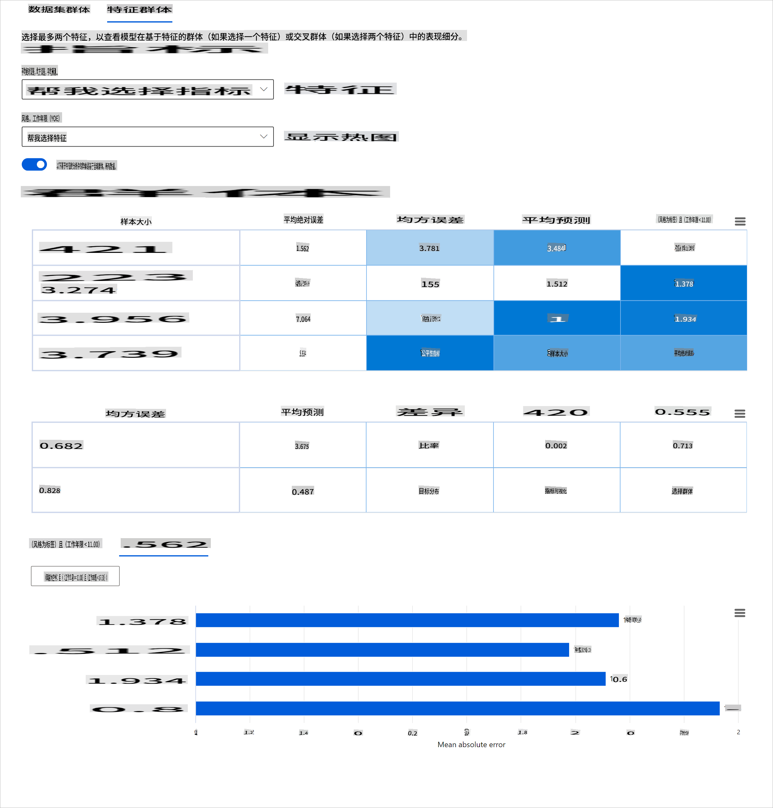
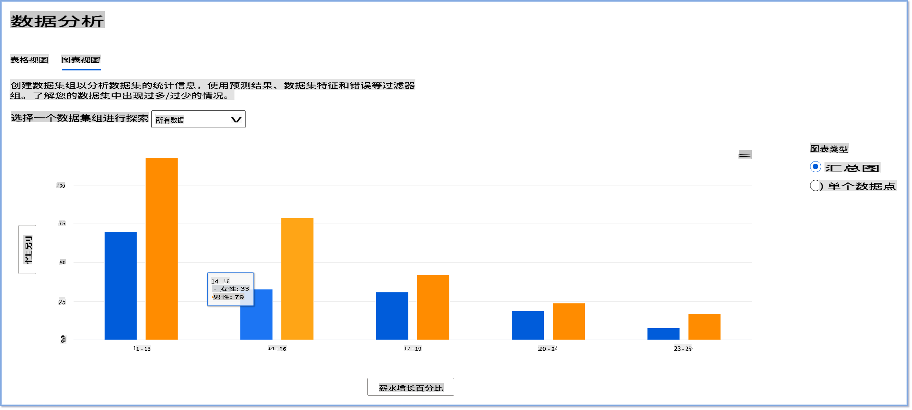
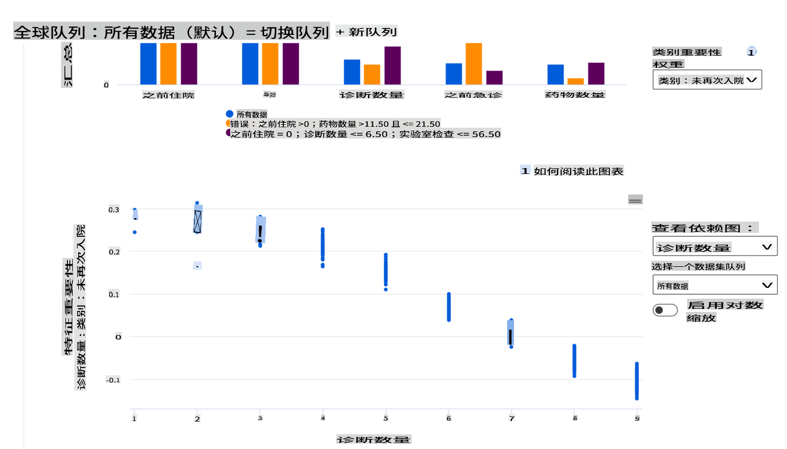

# 后记：使用负责任的AI仪表板组件进行机器学习模型调试
 

## [课前测验](https://gray-sand-07a10f403.1.azurestaticapps.net/quiz/5/)
 
## 介绍

机器学习影响着我们的日常生活。人工智能正在逐渐融入一些对个人和社会至关重要的系统，如医疗、金融、教育和就业。例如，系统和模型参与了日常决策任务，如医疗诊断或欺诈检测。因此，随着人工智能的进步和加速采用，社会期望也在不断演变，法规也在不断增加。我们经常看到人工智能系统未能达到预期的领域；它们暴露了新的挑战；政府也开始对人工智能解决方案进行监管。因此，分析这些模型以提供公平、可靠、包容、透明和负责任的结果对每个人都非常重要。

在本课程中，我们将探讨一些实际工具，用于评估模型是否存在负责任的人工智能问题。传统的机器学习调试技术往往基于定量计算，如聚合准确性或平均误差损失。想象一下，当你用来构建这些模型的数据缺乏某些人口统计信息，如种族、性别、政治观点、宗教，或者这些人口统计信息在数据中占比不均时会发生什么。又或者，当模型输出被解释为偏向某些人口统计时会发生什么？这可能导致对这些敏感特征组的过度或不足的代表，导致模型在公平性、包容性或可靠性方面出现问题。另一个因素是，机器学习模型被认为是黑箱，这使得理解和解释模型预测的驱动因素变得困难。当数据科学家和人工智能开发人员没有足够的工具来调试和评估模型的公平性或可信性时，这些都是他们面临的挑战。

在本课程中，您将学习如何使用以下方法调试您的模型：

- **错误分析**：识别模型在数据分布中错误率较高的地方。
- **模型概览**：在不同的数据群体中进行比较分析，发现模型性能指标的差异。
- **数据分析**：调查数据的过度或不足代表性，可能导致模型偏向某些数据人口统计。
- **特征重要性**：了解哪些特征在全局或局部层面驱动模型的预测。

## 前提条件

作为前提条件，请查看 [开发人员的负责任AI工具](https://www.microsoft.com/ai/ai-lab-responsible-ai-dashboard)

> 

## 错误分析

用于测量准确性的传统模型性能指标主要基于正确与错误预测的计算。例如，确定模型在89%的时间内准确且误差损失为0.001可以被认为是良好的性能。然而，错误往往在您的基础数据集中分布不均。您可能获得89%的模型准确性评分，但发现模型在数据的不同区域中有42%的时间会失败。这些特定数据组的失败模式可能导致公平性或可靠性问题。了解模型表现良好或不良的区域是至关重要的。在模型中有大量不准确的区域可能是重要的数据人口统计。

RAI仪表板上的错误分析组件通过树形可视化展示了模型失败在各个群体中的分布情况。这对于识别数据集中错误率较高的特征或区域非常有用。通过查看模型大部分不准确的来源，您可以开始调查根本原因。您还可以创建数据群体进行分析。这些数据群体有助于调试过程，以确定为什么模型在一个群体中表现良好，而在另一个群体中表现错误。

树形图上的视觉指示器有助于更快地定位问题区域。例如，树节点颜色越深红色，错误率越高。

热图是另一种可视化功能，用户可以使用一个或两个特征来调查错误率，以查找整个数据集或群体中导致模型错误的因素。

使用错误分析时，您需要：

* 深入了解模型失败在数据集和多个输入和特征维度中的分布情况。
* 分解聚合性能指标，以自动发现错误群体，以便采取有针对性的缓解措施。

## 模型概览

评估机器学习模型的性能需要全面了解其行为。这可以通过查看多个指标（如错误率、准确性、召回率、精度或MAE（平均绝对误差））来发现性能指标之间的差异来实现。一个性能指标可能看起来很好，但在另一个指标中可能会暴露不准确性。此外，比较整个数据集或群体中的指标差异有助于揭示模型表现良好或不良的地方。这在查看模型在敏感特征（如患者种族、性别或年龄）与非敏感特征之间的表现时尤为重要，以发现模型可能存在的潜在不公平。例如，发现模型在包含敏感特征的群体中更容易出错，可以揭示模型可能存在的潜在不公平。

RAI仪表板的模型概览组件不仅有助于分析数据表示在群体中的性能指标，还为用户提供了比较不同群体中模型行为的能力。

该组件的基于特征的分析功能允许用户缩小特定特征中的数据子组，以更细粒度地识别异常。例如，仪表板具有内置智能，自动为用户选择的特征生成群体（例如，*"time_in_hospital < 3"* 或 *"time_in_hospital >= 7"*）。这使用户能够从较大的数据组中隔离出特定特征，以查看其是否是模型错误结果的关键影响因素。

模型概览组件支持两类差异指标：

**模型性能差异**：这些指标集计算数据子组中所选性能指标值的差异（差距）。以下是一些示例：

* 准确率差异
* 错误率差异
* 精度差异
* 召回率差异
* 平均绝对误差（MAE）差异

**选择率差异**：该指标包含数据子组中选择率（有利预测）的差异。一个示例是贷款批准率的差异。选择率指的是每个类别中被分类为1的数据点的比例（在二分类中）或预测值的分布（在回归中）。

## 数据分析

> "如果你对数据进行足够长时间的折磨，它会承认任何事情" - 罗纳德·科斯

这句话听起来极端，但数据确实可以被操纵以支持任何结论。这种操纵有时可能是无意的。作为人类，我们都有偏见，通常很难有意识地知道何时在数据中引入偏见。确保人工智能和机器学习中的公平性仍然是一个复杂的挑战。

数据是传统模型性能指标的一个巨大盲点。您可能有很高的准确性评分，但这并不总是反映数据集中可能存在的潜在数据偏见。例如，如果一个公司高管职位的数据集中有27%的女性和73%的男性，一个基于此数据训练的职位广告AI模型可能主要面向男性观众发布高级职位。这种数据的不平衡使模型的预测偏向一个性别。这揭示了AI模型中的性别偏见问题。

RAI仪表板上的数据分析组件有助于识别数据集中过度和不足代表的区域。它帮助用户诊断由数据不平衡或缺乏特定数据组的代表性引起的错误和公平性问题的根本原因。这使用户能够根据预测和实际结果、错误组和特定特征可视化数据集。有时发现一个代表性不足的数据组还可以揭示模型学习不佳，从而导致高不准确性。具有数据偏见的模型不仅是一个公平性问题，还表明模型不具包容性或可靠性。

使用数据分析时，您需要：

* 通过选择不同的过滤器来探索数据集统计信息，将数据切分为不同的维度（也称为群体）。
* 了解数据集在不同群体和特征组中的分布情况。
* 确定与公平性、错误分析和因果关系相关的发现（由其他仪表板组件得出）是否是数据集分布的结果。
* 决定在哪些领域收集更多数据，以缓解由于代表性问题、标签噪声、特征噪声、标签偏见等因素导致的错误。

## 模型可解释性

机器学习模型往往是黑箱。了解哪些关键数据特征驱动模型的预测可能具有挑战性。提供模型为何做出某个预测的透明性非常重要。例如，如果一个AI系统预测某糖尿病患者在不到30天内有被重新入院的风险，它应该能够提供支持其预测的数据。具有支持数据指标可以带来透明性，帮助临床医生或医院做出明智的决策。此外，能够解释为什么模型对个别患者做出预测，有助于符合健康法规的问责制。当您使用机器学习模型影响人们的生活时，理解和解释模型行为的驱动因素至关重要。模型解释性和可解释性有助于回答以下场景中的问题：

* 模型调试：为什么我的模型会犯这个错误？如何改进我的模型？
* 人工智能协作：我如何理解和信任模型的决策？
* 法规合规：我的模型是否满足法律要求？

RAI仪表板的特征重要性组件有助于调试并全面了解模型如何做出预测。它也是机器学习专业人员和决策者的有用工具，用于解释和展示影响模型行为的特征，以满足法规要求。接下来，用户可以探索全局和局部解释，以验证哪些特征驱动模型的预测。全局解释列出了影响模型整体预测的主要特征。局部解释显示了导致模型对个别案例做出预测的特征。评估局部解释的能力在调试或审计特定案例时也很有帮助，以更好地理解和解释模型为什么做出准确或不准确的预测。

* 全局解释：例如，哪些特征影响糖尿病医院再入院模型的整体行为？
* 局部解释：例如，为什么一个超过60岁、曾有住院经历的糖尿病患者被预测为在30天内再次入院或不再次入院？

在检查模型在不同群体中的性能的调试过程中，特征重要性显示了特征在各个群体中的影响程度。它有助于在比较特征在驱动模型错误预测中的影响程度时揭示异常。特征重要性组件可以显示特征中的哪些值对模型的结果产生了正面或负面影响。例如，如果模型做出了不准确的预测，该组件使您能够深入了解并确定哪些特征或特征值驱动了预测。这种细节不仅有助于调试，还在审计情况下提供了透明性和问责制。最后，该组件可以帮助您识别公平性问题。举例来说，如果一个敏感特征如种族或性别在驱动模型预测中具有很高的影响力，这可能表明模型中存在种族或性别偏见。

使用解释性时，您需要：

* 通过了解哪些特征对预测最重要来确定您的AI系统预测的可信度。
* 通过首先理解模型并确定模型是否使用健康特征或仅仅是错误关联来进行模型调试。
* 通过了解模型是否基于敏感特征或与之高度相关的特征进行预测来发现潜在的公平性来源。
* 通过生成局部解释来展示模型决策的结果，从而建立用户对模型决策的信任。
* 完成AI系统的法规审计，以验证模型并监控模型决策对人类的影响。

## 结论

所有的RAI仪表板组件都是实用工具，帮助您构建对社会危害较小且更可信的机器学习模型。它提高了防止对人权的威胁；歧视或排除某些群体的生活机会；以及身体或心理伤害的风险。它还通过生成局部解释来展示模型决策的结果，从而建立用户对模型决策的信任。某些潜在的危害可以分类为：

- **分配**，例如，如果某个性别或种族被优待。
- **服务质量**。如果您为一个特定场景训练数据，但现实要复杂得多，这会导致服务表现不佳。
- **刻板印象**。将某个特定群体与预先分配的属性联系起来。
- **贬低**。不公平地批评和贴标签。
- **过度或不足代表性**。某个群体在某个职业中不被看到，任何继续推广这种情况的服务或功能都在助长危害。

### Azure RAI仪表板
 
[Azure RAI仪表板](https://learn.microsoft.com/en-us/azure/machine-learning/concept-responsible-ai-dashboard?WT.mc_id=aiml-90525-ruyakubu) 基于领先学术机构和组织（包括微软）开发的开源工具，为数据科学家和AI开发人员更好地理解模型行为、发现和缓解AI模型中的不良问题提供了重要帮助。

- 通过查看RAI仪表板 [文档](https://learn.microsoft.com/en-us/azure/machine-learning/how-to-responsible-ai-dashboard?WT.mc_id=aiml-90525-ruyakubu) 学习如何使用不同的组件。

- 查看一些RAI仪表板 [示例笔记本](https://github.com/Azure/RAI-vNext-Preview/tree/main/examples/notebooks) 以在Azure机器学习中调试更多负责任的AI场景。
  
---
## 🚀 挑战 
 
为了防止统计或数据偏见的引入，我们应该：

- 让从事系统工作的人员拥有多样的背景和观点
- 投资于反映我们社会多样性的数据集
- 发展更好的方法来检测和纠正偏见

思考在模型构建和使用中存在不公平的现实场景。我们还应该考虑什么？

## [课后测验](https://gray-sand-07a10f403.1.azurestaticapps.net/quiz/6/)
## 复习与自学 
 
在本课中，您学习了一些在机器学习中融入负责任AI的实际工具。

观看此工作坊以深入了解这些主题：

- 负责任AI仪表板：负责任AI实践的一站式解决方案，由Besmira Nushi和Mehrnoosh Sameki主讲

> 🎥 点击上方图片观看视频：负责任AI仪表板：负责任AI实践的一站式解决方案，由Besmira Nushi和Mehrnoosh Sameki主讲
 
参考以下材料以了解更多关于负责任AI以及如何构建更可信模型的信息：

- 微软的RAI仪表板工具用于调试ML模型：[负责任AI工具资源](https://aka.ms/rai-dashboard)

- 探索负责任AI工具包：[Github](https://github.com/microsoft/responsible-ai-toolbox)

- 微软的RAI资源中心：[负责任AI资源 – Microsoft AI](https://www.microsoft.com/ai/responsible-ai-resources?activetab=pivot1%3aprimaryr4) 

- 微软的FATE研究组：[FATE: Fairness, Accountability, Transparency, and Ethics in AI - Microsoft Research](https://www.microsoft.com/research/theme/fate/) 

## 作业

[探索RAI仪表板](assignment.md)

**免责声明**：
本文档是使用基于机器的人工智能翻译服务翻译的。虽然我们努力确保准确性，但请注意，自动翻译可能包含错误或不准确之处。应将原始语言的文档视为权威来源。对于关键信息，建议进行专业人工翻译。对于因使用此翻译而引起的任何误解或误读，我们不承担任何责任。