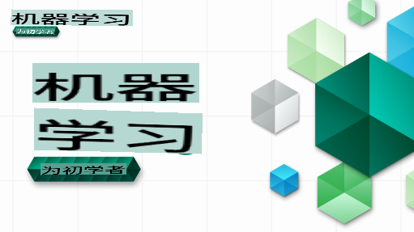

# 初学者的机器学习 - 课程

> 🌍 跟随我们一起环游世界，通过世界文化来探索机器学习 🌍

微软的云倡导者很高兴为大家提供一个为期12周、共26课的**机器学习**课程。在这个课程中，你将学习到有时被称为**经典机器学习**的内容，主要使用Scikit-learn库，并避免涉及深度学习（在我们的[AI初学者课程](https://aka.ms/ai4beginners)中有详细介绍）。你也可以将这些课程与我们的['数据科学初学者课程'](https://aka.ms/ds4beginners)结合起来学习！

跟随我们环游世界，将这些经典技术应用于世界各地的数据。每节课包括课前和课后测试、完成课程的书面指导、解决方案、作业等。我们的项目驱动教学法允许你在构建中学习，这是一种证明有效的新技能学习方法。

**✍️ 衷心感谢我们的作者** Jen Looper, Stephen Howell, Francesca Lazzeri, Tomomi Imura, Cassie Breviu, Dmitry Soshnikov, Chris Noring, Anirban Mukherjee, Ornella Altunyan, Ruth Yakubu 和 Amy Boyd

**🎨 同样感谢我们的插画师** Tomomi Imura, Dasani Madipalli 和 Jen Looper

**🙏 特别感谢 🙏 我们的微软学生大使作者、审阅者和内容贡献者**，尤其是 Rishit Dagli, Muhammad Sakib Khan Inan, Rohan Raj, Alexandru Petrescu, Abhishek Jaiswal, Nawrin Tabassum, Ioan Samuila 和 Snigdha Agarwal

**🤩 额外感谢微软学生大使 Eric Wanjau, Jasleen Sondhi 和 Vidushi Gupta 为我们的R课程提供帮助！**

# 开始

按照以下步骤操作：
1. **Fork 这个仓库**：点击页面右上角的"Fork"按钮。
2. **克隆这个仓库**：   `git clone https://github.com/microsoft/ML-For-Beginners.git`

> [在我们的Microsoft Learn合集里找到所有额外资源](https://learn.microsoft.com/en-us/collections/qrqzamz1nn2wx3?WT.mc_id=academic-77952-bethanycheum)

**[学生们](https://aka.ms/student-page)**，要使用这个课程，请将整个仓库fork到你自己的GitHub账户中，并独自或与小组一起完成练习：

- 从课前测试开始。
- 阅读课程并完成活动，在每次知识检查时暂停并反思。
- 尝试通过理解课程内容来创建项目，而不是直接运行解决方案代码；不过这些代码在每个项目导向的课程的`/solution`文件夹中都可以找到。
- 完成课后测试。
- 完成挑战。
- 完成作业。
- 完成一个课程组后，访问[讨论板](https://github.com/microsoft/ML-For-Beginners/discussions)并通过填写适当的PAT评分表来“公开学习”。PAT是一个进度评估工具，你可以通过填写评分表来进一步学习。你也可以对其他PAT做出反应，以便我们一起学习。

> 进一步学习，我们推荐你跟随这些[Microsoft Learn](https://docs.microsoft.com/en-us/users/jenlooper-2911/collections/k7o7tg1gp306q4?WT.mc_id=academic-77952-leestott)模块和学习路径。

**教师们**，我们[提供了一些建议](for-teachers.md)关于如何使用这个课程。

---

## 视频讲解

部分课程有短视频形式。你可以在课程中找到所有这些视频，或者点击下图在[微软开发者YouTube频道的初学者机器学习播放列表](https://aka.ms/ml-beginners-videos)中观看。

---

## 团队介绍

**Gif 制作** [Mohit Jaisal](https://linkedin.com/in/mohitjaisal)

> 🎥 点击上图观看关于项目和创建者的视频！

---

## 教学法

我们在设计这个课程时选择了两个教学原则：确保它是动手的**项目驱动**和包含**频繁的测验**。此外，这个课程有一个共同的**主题**，以确保连贯性。

通过确保内容与项目对齐，这个过程变得更有吸引力，学生对概念的记忆也会增强。此外，课前低风险测验可以让学生集中注意力学习一个主题，而课后测验可以进一步巩固记忆。这个课程设计灵活有趣，可以整体或部分完成。项目从小开始，到12周周期结束时逐渐变得复杂。这个课程还包括一个关于机器学习在现实世界应用的附录，可以作为额外学分或讨论的基础。

> 查找我们的[行为准则](CODE_OF_CONDUCT.md)，[贡献指南](CONTRIBUTING.md)和[翻译指南](TRANSLATIONS.md)。我们欢迎你的建设性反馈！

## 每节课包括

- 可选的草图笔记
- 可选的补充视频
- 视频讲解（部分课程）
- 课前热身测验
- 书面课程
- 对于项目导向的课程，提供逐步构建项目的指南
- 知识检查
- 挑战
- 补充阅读
- 作业
- 课后测验

> **关于语言的说明**：这些课程主要用Python编写，但许多课程也有R版本。要完成R课程，请转到`/solution`文件夹并查找R课程。它们包括一个.rmd扩展名，表示一个**R Markdown**文件，可以简单定义为`code chunks`（R或其他语言）和`YAML header`（指导如何格式化输出，如PDF）的嵌入。作为一个优秀的数据科学创作框架，它允许你结合代码、输出和你的想法，将它们写在Markdown中。此外，R Markdown文档可以渲染为PDF、HTML或Word等输出格式。

> **关于测验的说明**：所有测验都包含在[测验应用文件夹](../../quiz-app)中，共有52个测验，每个测验有三道题。它们在课程中链接，但测验应用可以本地运行；按照`quiz-app`文件夹中的说明进行本地托管或部署到Azure。

| 课程编号 |                             主题                              |                   课程分组                   | 学习目标                                                                                                             |                                                              链接课程                                                               |                        作者                        |
| :-----------: | :------------------------------------------------------------: | :-------------------------------------------------: | ------------------------------------------------------------------------------------------------------------------------------- | :--------------------------------------------------------------------------------------------------------------------------------------: | :--------------------------------------------------: |
|      01       |                机器学习介绍                |      [介绍](1-Introduction/README.md)       | 学习机器学习的基本概念                                                                                |                                             [课程](1-Introduction/1-intro-to-ML/README.md)                                             |                       Muhammad                       |
|      02       |                机器学习的历史                 |      [介绍](1-Introduction/README.md)       | 学习这一领域的历史                                                                                         |                                            [课程](1-Introduction/2-history-of-ML/README.md)                                            |                     Jen 和 Amy                      |
|      03       |                 机器学习中的公平性                  |      [介绍](1-Introduction/README.md)       | 学生在构建和应用机器学习模型时应该考虑哪些重要的哲学问题？ |                                              [课程](1-Introduction/3-fairness/README.md)                                               |                        Tomomi                        |
|      04       |                机器学习技术                 |      [Introduction](1-Introduction/README.md)       | 机器学习研究人员使用哪些技术来构建机器学习模型？                                                                       |                                          [Lesson](1-Introduction/4-techniques-of-ML/README.md)                                           |                    Chris 和 Jen                     |
|      05       |                   回归介绍                   |        [Regression](2-Regression/README.md)         | 开始使用Python和Scikit-learn进行回归模型构建                                                                  |         <ul><li>[Python](2-Regression/1-Tools/README.md)</li><li>[R](../../2-Regression/1-Tools/solution/R/lesson_1.html)</li></ul>         |      <ul><li>Jen</li><li>Eric Wanjau</li></ul>       |
|      06       |                北美南瓜价格 🎃                |        [Regression](2-Regression/README.md)         | 为机器学习做数据可视化和清理                                                                                  |          <ul><li>[Python](2-Regression/2-Data/README.md)</li><li>[R](../../2-Regression/2-Data/solution/R/lesson_2.html)</li></ul>          |      <ul><li>Jen</li><li>Eric Wanjau</li></ul>       |
|      07       |                北美南瓜价格 🎃                |        [Regression](2-Regression/README.md)         | 构建线性和多项式回归模型                                                                                   |        <ul><li>[Python](2-Regression/3-Linear/README.md)</li><li>[R](../../2-Regression/3-Linear/solution/R/lesson_3.html)</li></ul>        |      <ul><li>Jen 和 Dmitry</li><li>Eric Wanjau</li></ul>       |
|      08       |                北美南瓜价格 🎃                |        [Regression](2-Regression/README.md)         | 构建逻辑回归模型                                                                                               |     <ul><li>[Python](2-Regression/4-Logistic/README.md) </li><li>[R](../../2-Regression/4-Logistic/solution/R/lesson_4.html)</li></ul>      |      <ul><li>Jen</li><li>Eric Wanjau</li></ul>       |
|      09       |                          一个网络应用 🔌                          |           [Web App](3-Web-App/README.md)            | 构建一个使用已训练模型的网络应用                                                                                       |                                                 [Python](3-Web-App/1-Web-App/README.md)                                                  |                         Jen                          |
|      10       |                 分类介绍                 |    [Classification](4-Classification/README.md)     | 清理、准备和可视化数据；分类介绍                                                            | <ul><li> [Python](4-Classification/1-Introduction/README.md) </li><li>[R](../../4-Classification/1-Introduction/solution/R/lesson_10.html)  | <ul><li>Jen 和 Cassie</li><li>Eric Wanjau</li></ul> |
|      11       |             美味的亚洲和印度菜 🍜             |    [Classification](4-Classification/README.md)     | 分类器介绍                                                                                                     | <ul><li> [Python](4-Classification/2-Classifiers-1/README.md)</li><li>[R](../../4-Classification/2-Classifiers-1/solution/R/lesson_11.html) | <ul><li>Jen 和 Cassie</li><li>Eric Wanjau</li></ul> |
|      12       |             美味的亚洲和印度菜 🍜             |    [Classification](4-Classification/README.md)     | 更多分类器                                                                                                                | <ul><li> [Python](4-Classification/3-Classifiers-2/README.md)</li><li>[R](../../4-Classification/3-Classifiers-2/solution/R/lesson_12.html) | <ul><li>Jen 和 Cassie</li><li>Eric Wanjau</li></ul> |
|      13       |             美味的亚洲和印度菜 🍜             |    [Classification](4-Classification/README.md)     | 使用模型构建推荐系统网络应用                                                                                    |                                              [Python](4-Classification/4-Applied/README.md)                                              |                         Jen                          |
|      14       |                   聚类介绍                   |        [Clustering](5-Clustering/README.md)         | 清理、准备和可视化数据；聚类介绍                                                                |         <ul><li> [Python](5-Clustering/1-Visualize/README.md)</li><li>[R](../../5-Clustering/1-Visualize/solution/R/lesson_14.html)         |      <ul><li>Jen</li><li>Eric Wanjau</li></ul>       |
|      15       |              探索尼日利亚的音乐品味 🎧              |        [Clustering](5-Clustering/README.md)         | 探索 K-Means 聚类方法                                                                                           |           <ul><li> [Python](5-Clustering/2-K-Means/README.md)</li><li>[R](../../5-Clustering/2-K-Means/solution/R/lesson_15.html)           |      <ul><li>Jen</li><li>Eric Wanjau</li></ul>       |
|      16       |        自然语言处理简介 ☕️         |   [Natural language processing](6-NLP/README.md)    | 通过构建一个简单的机器人学习 NLP 的基础知识                                                                             |                                             [Python](6-NLP/1-Introduction-to-NLP/README.md)                                              |                       Stephen                        |
|      17       |                      常见的 NLP 任务 ☕️                      |   [Natural language processing](6-NLP/README.md)    | 通过了解处理语言结构时所需的常见任务来加深你的 NLP 知识                          |                                                    [Python](6-NLP/2-Tasks/README.md)                                                     |                       Stephen                        |
|      18       |             翻译和情感分析 ♥️              |   [Natural language processing](6-NLP/README.md)    | 使用 Jane Austen 进行翻译和情感分析                                                                             |                                            [Python](6-NLP/3-Translation-Sentiment/README.md)                                             |                       Stephen                        |
|      19       |                  欧洲浪漫酒店 ♥️                  |   [Natural language processing](6-NLP/README.md)    | 使用酒店评论进行情感分析 1                                                                                         |                                               [Python](6-NLP/4-Hotel-Reviews-1/README.md)                                                |                       Stephen                        |
|      20       |                  欧洲浪漫酒店 ♥️                  |   [Natural language processing](6-NLP/README.md)    | 使用酒店评论进行情感分析 2                                                                                         |                                               [Python](6-NLP/5-Hotel-Reviews-2/README.md)                                                |                       Stephen                        |
|      21       |            时间序列预测简介             |        [Time series](7-TimeSeries/README.md)        | 时间序列预测简介                                                                                         |                                             [Python](7-TimeSeries/1-Introduction/README.md)                                              |                      Francesca                       |
|      22       | ⚡️ 世界电力使用 ⚡️ - 使用 ARIMA 进行时间序列预测 |        [Time series](7-TimeSeries/README.md)        | 使用 ARIMA 进行时间序列预测                                                                                              |                                                 [Python](7-TimeSeries/2-ARIMA/README.md)                                                 |                      Francesca                       |
|      23       |  ⚡️ 世界电力使用 ⚡️ - 使用 SVR 进行时间序列预测  |        [Time series](7-TimeSeries/README.md)        | 使用支持向量回归进行时间序列预测                                                                           |                                                  [Python](7-TimeSeries/3-SVR/README.md)                                                  |                       Anirban                        |
|      24       |             强化学习简介             | [Reinforcement learning](8-Reinforcement/README.md) | 使用 Q-Learning 进行强化学习简介                                                                          |                                             [Python](8-Reinforcement/1-QLearning/README.md)                                              |                        Dmitry                        |
|      25       |                 帮助 Peter 避开狼！ 🐺                  | [Reinforcement learning](8-Reinforcement/README.md) | 强化学习 Gym                                                                                                      |                                                [Python](8-Reinforcement/2-Gym/README.md)                                                 |                        Dmitry                        |
|  Postscript   |            真实世界的机器学习场景和应用            |      [ML in the Wild](9-Real-World/README.md)       | 经典机器学习的有趣且揭示性的真实世界应用                                                               |                                             [Lesson](9-Real-World/1-Applications/README.md)                                              |                         Team                         |
|  Postscript   |            使用 RAI 仪表板进行机器学习模型调试          |      [ML in the Wild](9-Real-World/README.md)       | 使用负责任的 AI 仪表板组件进行机器学习模型调试                                                              |                                             [Lesson](9-Real-World/2-Debugging-ML-Models/README.md)                                              |                         Ruth Yakubu                       |

> [在我们的 Microsoft Learn 集合中找到本课程的所有附加资源](https://learn.microsoft.com/en-us/collections/qrqzamz1nn2wx3?WT.mc_id=academic-77952-bethanycheum)

## 离线访问

你可以使用 [Docsify](https://docsify.js.org/#/) 离线运行此文档。Fork 此仓库，在本地机器上 [安装 Docsify](https://docsify.js.org/#/quickstart)，然后在此仓库的根文件夹中输入 `docsify serve`。网站将在你的本地主机上的 3000 端口提供服务：`localhost:3000`。

## PDFs
找到包含链接的课程PDF [here](https://microsoft.github.io/ML-For-Beginners/pdf/readme.pdf).

## 寻求帮助

想要贡献翻译吗？请阅读我们的[翻译指南](TRANSLATIONS.md)并在[这里](https://github.com/microsoft/ML-For-Beginners/issues)添加一个模板化问题来管理工作量。

## 其他课程

我们的团队还制作了其他课程！查看以下内容：

- [AI for Beginners](https://aka.ms/ai4beginners)
- [Data Science for Beginners](https://aka.ms/datascience-beginners)
- [**新版本 2.0** - Generative AI for Beginners](https://aka.ms/genai-beginners)
- [**新** Cybersecurity for Beginners](https://github.com/microsoft/Security-101??WT.mc_id=academic-96948-sayoung)
- [Web Dev for Beginners](https://aka.ms/webdev-beginners)
- [IoT for Beginners](https://aka.ms/iot-beginners)
- [Machine Learning for Beginners](https://aka.ms/ml4beginners)
- [XR Development for Beginners](https://aka.ms/xr-dev-for-beginners)
- [Mastering GitHub Copilot for AI Paired Programming](https://aka.ms/GitHubCopilotAI)

**免责声明**：
本文档已使用基于机器的人工智能翻译服务进行翻译。尽管我们努力确保准确性，但请注意，自动翻译可能包含错误或不准确之处。应将原文档的母语版本视为权威来源。对于关键信息，建议使用专业人工翻译。对于因使用本翻译而引起的任何误解或误读，我们概不负责。