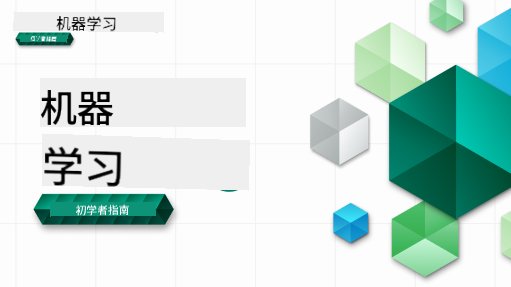

<!--
CO_OP_TRANSLATOR_METADATA:
{
  "original_hash": "ec8385130a8239ad9d827175126a0722",
  "translation_date": "2026-01-01T10:27:00+00:00",
  "source_file": "README.md",
  "language_code": "zh"
}
-->

### 🌐 多语言支持

#### 通过 GitHub Action 提供支持（自动且始终保持最新）

<!-- CO-OP TRANSLATOR LANGUAGES TABLE START -->
[阿拉伯语](../ar/README.md) | [孟加拉语](../bn/README.md) | [保加利亚语](../bg/README.md) | [缅甸语（缅甸）](../my/README.md) | [中文（简体）](./README.md) | [中文（繁体，香港）](../hk/README.md) | [中文（繁体，澳门）](../mo/README.md) | [中文（繁体，台湾）](../tw/README.md) | [克罗地亚语](../hr/README.md) | [捷克语](../cs/README.md) | [丹麦语](../da/README.md) | [荷兰语](../nl/README.md) | [爱沙尼亚语](../et/README.md) | [芬兰语](../fi/README.md) | [法语](../fr/README.md) | [德语](../de/README.md) | [希腊语](../el/README.md) | [希伯来语](../he/README.md) | [印地语](../hi/README.md) | [匈牙利语](../hu/README.md) | [印尼语](../id/README.md) | [意大利语](../it/README.md) | [日语](../ja/README.md) | [卡纳达语](../kn/README.md) | [韩语](../ko/README.md) | [立陶宛语](../lt/README.md) | [马来语](../ms/README.md) | [马拉雅拉姆语](../ml/README.md) | [马拉地语](../mr/README.md) | [尼泊尔语](../ne/README.md) | [尼日利亚皮钦语](../pcm/README.md) | [挪威语](../no/README.md) | [波斯语（法尔西）](../fa/README.md) | [波兰语](../pl/README.md) | [葡萄牙语（巴西）](../br/README.md) | [葡萄牙语（葡萄牙）](../pt/README.md) | [旁遮普语（古尔穆奇）](../pa/README.md) | [罗马尼亚语](../ro/README.md) | [俄语](../ru/README.md) | [塞尔维亚语（西里尔文）](../sr/README.md) | [斯洛伐克语](../sk/README.md) | [斯洛文尼亚语](../sl/README.md) | [西班牙语](../es/README.md) | [斯瓦希里语](../sw/README.md) | [瑞典语](../sv/README.md) | [他加禄语（菲律宾）](../tl/README.md) | [泰米尔语](../ta/README.md) | [泰卢固语](../te/README.md) | [泰语](../th/README.md) | [土耳其语](../tr/README.md) | [乌克兰语](../uk/README.md) | [乌尔都语](../ur/README.md) | [越南语](../vi/README.md)
<!-- CO-OP TRANSLATOR LANGUAGES TABLE END -->

#### 加入我们的社区

我们正在举办一个 Discord 的“与 AI 学习”系列，了解更多并在 2025 年 9 月 18 日至 30 日加入我们：[Learn with AI Series](https://aka.ms/learnwithai/discord)。你将获得使用 GitHub Copilot 进行数据科学的技巧与窍门。

# 面向初学者的机器学习 - 课程

> 🌍 通过世界各地的文化探索机器学习，环游世界 🌍

微软的云布道者（Cloud Advocates）很高兴提供一个为期 12 周、共 26 节课的关于 **机器学习** 的课程。在本课程中，你将学习有时被称为 **经典机器学习** 的内容，主要使用 Scikit-learn 作为库，并避开深度学习（深度学习在我们的 [面向初学者的 AI 课程](https://aka.ms/ai4beginners) 中有介绍）。同时，可将这些课程与我们的 [面向初学者的数据科学课程](https://aka.ms/ds4beginners) 配套学习。

和我们一起环游世界，将这些经典技术应用于来自世界各地的数据。每节课都包含课前和课后测验、完成课程的文字说明、解答、作业，以及更多内容。我们以项目为基础的教学法让你在动手构建时学习，这是一种经过验证的新技能“巩固”方式。

**✍️ 特别感谢我们的作者** Jen Looper、Stephen Howell、Francesca Lazzeri、Tomomi Imura、Cassie Breviu、Dmitry Soshnikov、Chris Noring、Anirban Mukherjee、Ornella Altunyan、Ruth Yakubu 和 Amy Boyd

**🎨 感谢我们的插画师** Tomomi Imura、Dasani Madipalli 和 Jen Looper

**🙏 特别感谢 🙏 我们的 Microsoft 学生大使作者、审稿人和内容贡献者**，特别是 Rishit Dagli、Muhammad Sakib Khan Inan、Rohan Raj、Alexandru Petrescu、Abhishek Jaiswal、Nawrin Tabassum、Ioan Samuila 和 Snigdha Agarwal

**🤩 额外感谢 Microsoft 学生大使 Eric Wanjau、Jasleen Sondhi 和 Vidushi Gupta 为我们的 R 课程所做的贡献！**

# 入门

按以下步骤操作：
1. **Fork 仓库**：点击此页面右上角的 “Fork” 按钮。
2. **克隆仓库**：   `git clone https://github.com/microsoft/ML-For-Beginners.git`

> [在我们的 Microsoft Learn 集合中找到本课程的所有附加资源](https://learn.microsoft.com/en-us/collections/qrqzamz1nn2wx3?WT.mc_id=academic-77952-bethanycheum)

> 🔧 **需要帮助吗？** 请查看我们的 [故障排除指南](TROUBLESHOOTING.md)，了解有关安装、设置和运行课程常见问题的解决方案。

**[学生](https://aka.ms/student-page)**，要使用本课程，请将整个仓库 fork 到你自己的 GitHub 帐户，并单独或与小组一起完成练习：

- 从课前测验开始。
- 阅读讲义并完成活动，每个知识点停下来反思。
- 尝试通过理解课程内容而不是直接运行解答代码来创建项目；不过这些代码可以在每个以项目为导向的课程的 `/solution` 文件夹中找到。
- 参加课后测验。
- 完成挑战。
- 完成作业。
- 在完成一组课程后，访问 [讨论区](https://github.com/microsoft/ML-For-Beginners/discussions) 并通过填写相应的 PAT 量表来“公开学习”。“PAT” 是一个进度评估工具（Progress Assessment Tool），是你填写以促进学习的量表。你也可以对其他人的 PAT 做出反应，以便我们一起学习。

> 如需进一步学习，我们建议关注这些 [Microsoft Learn](https://docs.microsoft.com/en-us/users/jenlooper-2911/collections/k7o7tg1gp306q4?WT.mc_id=academic-77952-leestott) 模块和学习路径。

**教师**，我们已在 [一些建议](for-teachers.md) 中介绍了如何使用本课程。

---

## 视频演练

部分课程以短视频形式提供。你可以在课程中找到所有这些视频，或在 [Microsoft Developer YouTube 频道上的 ML for Beginners 播放列表](https://aka.ms/ml-beginners-videos) 中查看，点击下方图片。

---

## 团队成员

**动图作者** [Mohit Jaisal](https://linkedin.com/in/mohitjaisal)

> 🎥 点击上方图片，了解关于该项目及其创建者的视频！

---

## 教学法

在构建本课程时，我们选择了两个教学原则：确保其实践性与 **基于项目**，并包含 **频繁测验**。此外，本课程具有统一的 **主题** 以增强连贯性。

通过确保内容与项目对齐，学习过程对学生更具吸引力，概念的记忆也会增强。此外，课堂前的低风险测验有助于学生确立学习意图，而课后的第二次测验则可确保进一步的记忆。本课程设计灵活有趣，可以全部或部分学习。项目从小型开始，随着 12 周周期的推进逐步变得更复杂。本课程还包括关于机器学习在现实世界中应用的后记，可作为额外学分或讨论素材。

> 查阅我们的 [行为准则](CODE_OF_CONDUCT.md)、[贡献指南](CONTRIBUTING.md)、[翻译指南](TRANSLATIONS.md) 和 [故障排除](TROUBLESHOOTING.md) 指南。我们欢迎你的建设性反馈！

## 每课包含

- 可选的草图笔记
- 可选的补充视频
- 视频演练（仅限部分课程）
- [课前热身测验](https://ff-quizzes.netlify.app/en/ml/)
- 文字讲义
- 对于基于项目的课程，关于如何构建项目的逐步指南
- 知识点检测
- 一个挑战
- 补充阅读
- 作业
- [课后测验](https://ff-quizzes.netlify.app/en/ml/)

> **关于语言的说明**：这些课程主要以 Python 编写，但许多课程也提供 R 版本。要完成 R 课程，请转到 `/solution` 文件夹并查找 R 课程。它们包含一个 .rmd 扩展名，表示一个 **R Markdown** 文件，这可以简单地定义为在 `Markdown 文档` 中嵌入 `code chunks`（R 或其他语言）和一个 `YAML header`（指导如何将输出格式化为 PDF 等）的方式。因此，它作为数据科学的示例性创作框架，因为它允许你将代码、代码输出和想法结合起来，并通过 Markdown 将它们写下来。此外，R Markdown 文档可以渲染为诸如 PDF、HTML 或 Word 等输出格式。

> **关于测验的说明**：所有测验都包含在 [Quiz App folder](../../quiz-app) 中，总共有 52 个测验，每个测验包含三道题。它们在课程中有链接，但测验应用程序可以本地运行；请按 `quiz-app` 文件夹中的说明在本地托管或部署到 Azure。

| 课次编号 |                             主题                              |                   课程分组                   | 学习目标                                                                                                             |                                                              关联课程                                                               |                        作者                        |
| :-----------: | :------------------------------------------------------------: | :-------------------------------------------------: | ------------------------------------------------------------------------------------------------------------------------------- | :--------------------------------------------------------------------------------------------------------------------------------------: | :--------------------------------------------------: |
|      01       |                机器学习简介                |      [介绍](1-Introduction/README.md)       | 学习机器学习的基本概念                                                                                |                                             [课程](1-Introduction/1-intro-to-ML/README.md)                                             |                       Muhammad                       |
|      02       |                机器学习的历史                 |      [介绍](1-Introduction/README.md)       | 了解这一领域的历史                                                                                         |                                            [课程](1-Introduction/2-history-of-ML/README.md)                                            |                     Jen and Amy                      |
|      03       |                 公平性与机器学习                  |      [介绍](1-Introduction/README.md)       | 在构建和应用机器学习模型时，学生应考虑哪些与公平性相关的重要哲学问题？ |                                              [课程](1-Introduction/3-fairness/README.md)                                               |                        Tomomi                        |
|      04       |                机器学习技术                 |      [介绍](1-Introduction/README.md)       | 机器学习研究人员用哪些技术来构建机器学习模型？                                                                       |                                          [课程](1-Introduction/4-techniques-of-ML/README.md)                                           |                    Chris and Jen                     |
|      05       |                   回归简介                   |        [回归](2-Regression/README.md)         | 使用 Python 和 Scikit-learn 开始构建回归模型                                                                  |         [Python](2-Regression/1-Tools/README.md) • [R](../../2-Regression/1-Tools/solution/R/lesson_1.html)         |      Jen • Eric Wanjau       |
|      06       |                北美南瓜价格 🎃                |        [回归](2-Regression/README.md)         | 为机器学习准备数据：可视化和清洗数据                                                                                  |          [Python](2-Regression/2-Data/README.md) • [R](../../2-Regression/2-Data/solution/R/lesson_2.html)          |      Jen • Eric Wanjau       |
|      07       |                北美南瓜价格 🎃                |        [回归](2-Regression/README.md)         | 构建线性和多项式回归模型                                                                                   |        [Python](2-Regression/3-Linear/README.md) • [R](../../2-Regression/3-Linear/solution/R/lesson_3.html)        |      Jen and Dmitry • Eric Wanjau       |
|      08       |                北美南瓜价格 🎃                |        [回归](2-Regression/README.md)         | 构建逻辑回归模型                                                                                               |     [Python](2-Regression/4-Logistic/README.md) • [R](../../2-Regression/4-Logistic/solution/R/lesson_4.html)      |      Jen • Eric Wanjau       |
|      09       |                          Web 应用 🔌                          |           [Web App](3-Web-App/README.md)            | 构建一个用于使用已训练模型的 Web 应用                                                                                       |                                                 [Python](3-Web-App/1-Web-App/README.md)                                                  |                         Jen                          |
|      10       |                 分类简介                 |    [分类](4-Classification/README.md)     | 清理、准备并可视化数据；分类简介                                                            | [Python](4-Classification/1-Introduction/README.md) • [R](../../4-Classification/1-Introduction/solution/R/lesson_10.html)  | Jen and Cassie • Eric Wanjau |
|      11       |             美味的亚洲和印度菜肴 🍜             |    [分类](4-Classification/README.md)     | 分类器简介                                                                                                     | [Python](4-Classification/2-Classifiers-1/README.md) • [R](../../4-Classification/2-Classifiers-1/solution/R/lesson_11.html) | Jen and Cassie • Eric Wanjau |
|      12       |             美味的亚洲和印度菜肴 🍜             |    [分类](4-Classification/README.md)     | 更多分类器                                                                                                                | [Python](4-Classification/3-Classifiers-2/README.md) • [R](../../4-Classification/3-Classifiers-2/solution/R/lesson_12.html) | Jen and Cassie • Eric Wanjau |
|      13       |             美味的亚洲和印度菜肴 🍜             |    [分类](4-Classification/README.md)     | 使用你的模型构建推荐系统 Web 应用                                                                                    |                                              [Python](4-Classification/4-Applied/README.md)                                              |                         Jen                          |
|      14       |                   聚类简介                   |        [聚类](5-Clustering/README.md)         | 清理、准备并可视化数据；聚类简介                                                                |         [Python](5-Clustering/1-Visualize/README.md) • [R](../../5-Clustering/1-Visualize/solution/R/lesson_14.html)         |      Jen • Eric Wanjau       |
|      15       |              探索尼日利亚音乐偏好 🎧              |        [聚类](5-Clustering/README.md)         | 探索 K-Means 聚类方法                                                                                           |           [Python](5-Clustering/2-K-Means/README.md) • [R](../../5-Clustering/2-K-Means/solution/R/lesson_15.html)           |      Jen • Eric Wanjau       |
|      16       |        自然语言处理简介 ☕️         |   [自然语言处理](6-NLP/README.md)    | 通过构建一个简单的机器人学习 NLP 基础知识                                                                             |                                             [Python](6-NLP/1-Introduction-to-NLP/README.md)                                              |                       Stephen                        |
|      17       |                      常见的 NLP 任务 ☕️                      |   [自然语言处理](6-NLP/README.md)    | 通过理解处理语言结构时常见的任务来加深你的 NLP 知识                          |                                                    [Python](6-NLP/2-Tasks/README.md)                                                     |                       Stephen                        |
|      18       |             翻译与情感分析 ♥️              |   [自然语言处理](6-NLP/README.md)    | 以简·奥斯汀的作品进行翻译与情感分析                                                                             |                                            [Python](6-NLP/3-Translation-Sentiment/README.md)                                             |                       Stephen                        |
|      19       |                  欧洲浪漫酒店 ♥️                  |   [自然语言处理](6-NLP/README.md)    | 使用酒店评论进行情感分析（1）                                                                                         |                                               [Python](6-NLP/4-Hotel-Reviews-1/README.md)                                                |                       Stephen                        |
|      20       |                  欧洲浪漫酒店 ♥️                  |   [自然语言处理](6-NLP/README.md)    | 使用酒店评论进行情感分析（2）                                                                                         |                                               [Python](6-NLP/5-Hotel-Reviews-2/README.md)                                                |                       Stephen                        |
|      21       |            时间序列预测简介             |        [时间序列](7-TimeSeries/README.md)        | 时间序列预测简介                                                                                         |                                             [Python](7-TimeSeries/1-Introduction/README.md)                                              |                      Francesca                       |
|      22       | ⚡️ 世界电力使用量 ⚡️ - 使用 ARIMA 的时间序列预测 |        [时间序列](7-TimeSeries/README.md)        | 使用 ARIMA 的时间序列预测                                                                                              |                                                 [Python](7-TimeSeries/2-ARIMA/README.md)                                                 |                      Francesca                       |
|      23       |  ⚡️ 世界电力使用量 ⚡️ - 使用 SVR 的时间序列预测  |        [时间序列](7-TimeSeries/README.md)        | 使用支持向量回归器的时间序列预测                                                                           |                                                  [Python](7-TimeSeries/3-SVR/README.md)                                                  |                       Anirban                        |
|      24       |             强化学习简介             | [强化学习](8-Reinforcement/README.md) | 使用 Q 学习的强化学习简介                                                                          |                                             [Python](8-Reinforcement/1-QLearning/README.md)                                              |                        Dmitry                        |
|      25       |                 帮助 Peter 避开狼！ 🐺                  | [强化学习](8-Reinforcement/README.md) | 强化学习 Gym                                                                                                      |                                                [Python](8-Reinforcement/2-Gym/README.md)                                                 |                        Dmitry                        |
|  Postscript   |            真实世界的机器学习场景与应用            |      [真实世界的 ML](9-Real-World/README.md)       | 经典机器学习在真实世界中有趣且富有启发性的应用                                                               |                                             [课程](9-Real-World/1-Applications/README.md)                                              |                         Team                         |
|  Postscript   |            使用 RAI 仪表板对机器学习模型进行调试          |      [真实世界的 ML](9-Real-World/README.md)       | 使用 Responsible AI 仪表板组件进行机器学习模型调试                                                              |                                             [课程](9-Real-World/2-Debugging-ML-Models/README.md)                                              |                         Ruth Yakubu                       |

> [在我们的 Microsoft Learn 收藏中查找本课程的所有其他资源](https://learn.microsoft.com/en-us/collections/qrqzamz1nn2wx3?WT.mc_id=academic-77952-bethanycheum)

## 离线访问

你可以使用 [Docsify](https://docsify.js.org/#/) 离线运行此文档。Fork 本仓库，在你的本地机器上 [安装 Docsify](https://docsify.js.org/#/quickstart)，然后在此仓库的根文件夹中输入 `docsify serve`。网站将在本地的 3000 端口提供服务：`localhost:3000`。

## PDF

带有链接的课程 PDF 可在 [这里](https://microsoft.github.io/ML-For-Beginners/pdf/readme.pdf) 获取。

## 🎒 其他课程 

我们的团队还制作了其他课程！查看：

<!-- CO-OP TRANSLATOR OTHER COURSES START -->
### LangChain

---

### Azure / Edge / MCP / Agents

---
 
### 生成式 AI 系列

[-9333EA?style=for-the-badge&labelColor=E5E7EB&color=9333EA)](https://github.com/microsoft/Generative-AI-for-beginners-dotnet?WT.mc_id=academic-105485-koreyst)
[-C084FC?style=for-the-badge&labelColor=E5E7EB&color=C084FC)](https://github.com/microsoft/generative-ai-for-beginners-java?WT.mc_id=academic-105485-koreyst)
[-E879F9?style=for-the-badge&labelColor=E5E7EB&color=E879F9)](https://github.com/microsoft/generative-ai-with-javascript?WT.mc_id=academic-105485-koreyst)

---
 
### 核心学习

---
 
### Copilot 系列

<!-- CO-OP TRANSLATOR OTHER COURSES END -->

## 获取帮助

如果在构建 AI 应用时遇到困难或有任何问题，请加入学习者和经验丰富的开发者的讨论，一起参与 MCP。这里是一个支持性的社区，欢迎提问并自由分享知识。

如果您在构建过程中有产品反馈或遇到错误，请访问：

---

<!-- CO-OP TRANSLATOR DISCLAIMER START -->
免责声明：
本文件使用 AI 翻译服务 [Co-op Translator](https://github.com/Azure/co-op-translator) 进行翻译。尽管我们努力确保准确性，但请注意，自动翻译可能包含错误或不准确之处。应以原文（原始语言版本）为权威来源。对于重要信息，建议采用专业人工翻译。我们不对因使用本翻译而产生的任何误解或曲解承担责任。
<!-- CO-OP TRANSLATOR DISCLAIMER END -->