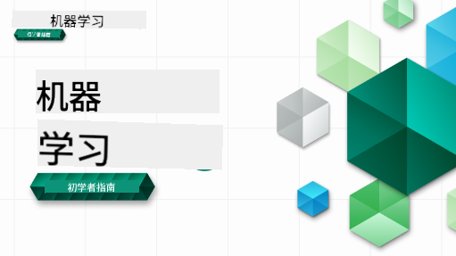

<!--
CO_OP_TRANSLATOR_METADATA:
{
  "original_hash": "7a13afb3674838f557d61f8d67e4d5f8",
  "translation_date": "2025-10-24T08:55:35+00:00",
  "source_file": "README.md",
  "language_code": "zh"
}
-->
  
  
  
  
  

  
  
  

### 🌐 多语言支持  

#### 通过 GitHub Action 支持（自动化且始终保持最新）  

<!-- CO-OP TRANSLATOR LANGUAGES TABLE START -->  
[阿拉伯语](../ar/README.md) | [孟加拉语](../bn/README.md) | [保加利亚语](../bg/README.md) | [缅甸语](../my/README.md) | [中文（简体）](./README.md) | [中文（繁体，香港）](../hk/README.md) | [中文（繁体，澳门）](../mo/README.md) | [中文（繁体，台湾）](../tw/README.md) | [克罗地亚语](../hr/README.md) | [捷克语](../cs/README.md) | [丹麦语](../da/README.md) | [荷兰语](../nl/README.md) | [爱沙尼亚语](../et/README.md) | [芬兰语](../fi/README.md) | [法语](../fr/README.md) | [德语](../de/README.md) | [希腊语](../el/README.md) | [希伯来语](../he/README.md) | [印地语](../hi/README.md) | [匈牙利语](../hu/README.md) | [印尼语](../id/README.md) | [意大利语](../it/README.md) | [日语](../ja/README.md) | [韩语](../ko/README.md) | [立陶宛语](../lt/README.md) | [马来语](../ms/README.md) | [马拉地语](../mr/README.md) | [尼泊尔语](../ne/README.md) | [挪威语](../no/README.md) | [波斯语](../fa/README.md) | [波兰语](../pl/README.md) | [葡萄牙语（巴西）](../br/README.md) | [葡萄牙语（葡萄牙）](../pt/README.md) | [旁遮普语](../pa/README.md) | [罗马尼亚语](../ro/README.md) | [俄语](../ru/README.md) | [塞尔维亚语（西里尔字母）](../sr/README.md) | [斯洛伐克语](../sk/README.md) | [斯洛文尼亚语](../sl/README.md) | [西班牙语](../es/README.md) | [斯瓦希里语](../sw/README.md) | [瑞典语](../sv/README.md) | [他加禄语](../tl/README.md) | [泰米尔语](../ta/README.md) | [泰语](../th/README.md) | [土耳其语](../tr/README.md) | [乌克兰语](../uk/README.md) | [乌尔都语](../ur/README.md) | [越南语](../vi/README.md)  
<!-- CO-OP TRANSLATOR LANGUAGES TABLE END -->  

#### 加入我们的社区  

  

我们正在进行一个关于 AI 的 Discord 学习系列，了解更多并加入我们吧：[Learn with AI Series](https://aka.ms/learnwithai/discord)，时间为 2025 年 9 月 18 日至 30 日。您将学习使用 GitHub Copilot 进行数据科学的技巧和窍门。  

  

# 初学者的机器学习课程  

> 🌍 跟随我们环游世界，通过世界文化学习机器学习 🌍  

微软的云倡导者团队很高兴为大家提供一个为期 12 周、共 26 节课的课程，内容全部围绕 **机器学习**。在这个课程中，您将学习一些被称为 **经典机器学习** 的内容，主要使用 Scikit-learn 库，并避免涉及深度学习（深度学习内容在我们的 [AI for Beginners' curriculum](https://aka.ms/ai4beginners) 中有详细介绍）。同时，您也可以将这些课程与我们的 ['Data Science for Beginners' curriculum](https://aka.ms/ds4beginners) 搭配学习！  

跟随我们环游世界，将这些经典技术应用于来自世界各地的数据。每节课都包括课前和课后测验、完成课程的书面指导、解决方案、作业等。我们的项目式教学法让您在实践中学习，这是一种被证明能让新技能更牢固掌握的方式。  

**✍️ 特别感谢我们的作者** Jen Looper、Stephen Howell、Francesca Lazzeri、Tomomi Imura、Cassie Breviu、Dmitry Soshnikov、Chris Noring、Anirban Mukherjee、Ornella Altunyan、Ruth Yakubu 和 Amy Boyd  

**🎨 同样感谢我们的插画师** Tomomi Imura、Dasani Madipalli 和 Jen Looper  

**🙏 特别感谢 🙏 我们的微软学生大使作者、审阅者和内容贡献者**，尤其是 Rishit Dagli、Muhammad Sakib Khan Inan、Rohan Raj、Alexandru Petrescu、Abhishek Jaiswal、Nawrin Tabassum、Ioan Samuila 和 Snigdha Agarwal  

**🤩 额外感谢微软学生大使 Eric Wanjau、Jasleen Sondhi 和 Vidushi Gupta 为我们提供的 R 课程！**  

# 开始学习  

按照以下步骤操作：  
1. **Fork 仓库**：点击页面右上角的 "Fork" 按钮。  
2. **克隆仓库**：`git clone https://github.com/microsoft/ML-For-Beginners.git`  

> [在我们的 Microsoft Learn 集合中找到本课程的所有额外资源](https://learn.microsoft.com/en-us/collections/qrqzamz1nn2wx3?WT.mc_id=academic-77952-bethanycheum)  

> 🔧 **需要帮助？** 查看我们的 [故障排除指南](TROUBLESHOOTING.md)，解决安装、设置和运行课程时的常见问题。  

**[学生](https://aka.ms/student-page)**，要使用此课程，请将整个仓库 fork 到您的 GitHub 账户，并独立或与小组一起完成练习：  

- 从课前测验开始。  
- 阅读课程内容并完成活动，在每个知识检查点暂停并反思。  
- 尝试通过理解课程内容来创建项目，而不是直接运行解决方案代码；不过这些代码可以在每个项目课程的 `/solution` 文件夹中找到。  
- 完成课后测验。  
- 完成挑战。  
- 完成作业。  
- 完成一个课程组后，访问 [讨论板](https://github.com/microsoft/ML-For-Beginners/discussions)，通过填写相应的 PAT 评分表“公开学习”。PAT 是一个进度评估工具，您可以通过填写评分表来进一步学习。您还可以对其他 PAT 进行互动，以便我们共同学习。  

> 如需进一步学习，我们建议您跟随这些 [Microsoft Learn](https://docs.microsoft.com/en-us/users/jenlooper-2911/collections/k7o7tg1gp306q4?WT.mc_id=academic-77952-leestott) 模块和学习路径。  

**教师们**，我们提供了一些关于如何使用此课程的 [建议](for-teachers.md)。  

---

## 视频讲解  

部分课程提供了短视频形式的讲解。您可以在课程中找到这些视频，或者点击下方图片访问 [Microsoft Developer YouTube 频道上的 ML for Beginners 播放列表](https://aka.ms/ml-beginners-videos)。  

  

---

## 团队介绍  

  

**Gif 作者** [Mohit Jaisal](https://linkedin.com/in/mohitjaisal)  

> 🎥 点击上方图片观看关于项目及其创作者的视频！  

---

## 教学法  

在设计本课程时，我们选择了两个教学原则：确保课程是 **基于项目的实践**，并且包含 **频繁的测验**。此外，这个课程还有一个共同的 **主题**，使其更具连贯性。  

通过确保内容与项目相结合，学习过程变得更加有趣，学生对概念的记忆也会得到增强。此外，课前的低风险测验可以让学生专注于学习主题，而课后的测验可以进一步巩固知识。这门课程设计灵活有趣，可以整体学习，也可以部分学习。项目从简单开始，到 12 周课程结束时逐渐变得复杂。课程还包括一个关于机器学习实际应用的后记，可以作为额外的学分或讨论的基础。  

> 查看我们的 [行为准则](CODE_OF_CONDUCT.md)、[贡献指南](CONTRIBUTING.md)、[翻译指南](TRANSLATIONS.md) 和 [故障排除指南](TROUBLESHOOTING.md)。我们欢迎您的建设性反馈！  

## 每节课包括  

- 可选的手绘笔记  
- 可选的补充视频  
- 视频讲解（部分课程提供）  
- [课前热身测验](https://ff-quizzes.netlify.app/en/ml/)  
- 书面课程内容  
- 对于基于项目的课程，提供逐步指导如何构建项目  
- 知识检查  
- 挑战  
- 补充阅读材料  
- 作业  
- [课后测验](https://ff-quizzes.netlify.app/en/ml/)  

> **关于语言的说明**：这些课程主要使用 Python 编写，但许多课程也提供 R 版本。要完成 R 课程，请转到 `/solution` 文件夹并查找 R 课程。这些课程包含 `.rmd` 扩展名，表示 **R Markdown** 文件，它可以简单定义为在 `Markdown 文档` 中嵌入 `代码块`（R 或其他语言）和 `YAML 头部`（指导如何格式化输出，例如 PDF）。因此，它是数据科学的一个典范创作框架，因为它允许您通过 Markdown 将代码、输出和想法结合起来。此外，R Markdown 文档可以渲染为 PDF、HTML 或 Word 等输出格式。  

> **关于测验的说明**：所有测验都包含在 [Quiz App 文件夹](../../quiz-app) 中，共有 52 个测验，每个测验包含三个问题。它们在课程中有链接，但测验应用可以在本地运行；请按照 `quiz-app` 文件夹中的说明在本地托管或部署到 Azure。  

| 课程编号 |                             主题                              |                   课程分组                   | 学习目标                                                                                                             |                                                              课程链接                                                               |                        作者                        |  
| :-----------: | :------------------------------------------------------------: | :-------------------------------------------------: | ------------------------------------------------------------------------------------------------------------------------------- | :--------------------------------------------------------------------------------------------------------------------------------------: | :--------------------------------------------------: |  
|      01       |                机器学习简介                |      [Introduction](1-Introduction/README.md)       | 学习机器学习的基本概念                                                                                |                                             [Lesson](1-Introduction/1-intro-to-ML/README.md)                                             |                       Muhammad                       |
|      02       |                机器学习的历史                 |      [Introduction](1-Introduction/README.md)       | 学习这一领域的历史背景                                                                                         |                                            [Lesson](1-Introduction/2-history-of-ML/README.md)                                            |                     Jen 和 Amy                      |
|      03       |                 公平性与机器学习                  |      [Introduction](1-Introduction/README.md)       | 学生在构建和应用机器学习模型时需要考虑哪些关于公平性的重要哲学问题？ |                                              [Lesson](1-Introduction/3-fairness/README.md)                                               |                        Tomomi                        |
|      04       |                机器学习的技术                 |      [Introduction](1-Introduction/README.md)       | 机器学习研究人员用什么技术来构建机器学习模型？                                                                       |                                          [Lesson](1-Introduction/4-techniques-of-ML/README.md)                                           |                    Chris 和 Jen                     |
|      05       |                   回归简介                   |        [Regression](2-Regression/README.md)         | 使用 Python 和 Scikit-learn 开始学习回归模型                                                                  |         [Python](2-Regression/1-Tools/README.md) • [R](../../2-Regression/1-Tools/solution/R/lesson_1.html)         |      Jen • Eric Wanjau       |
|      06       |                北美南瓜价格 🎃                |        [Regression](2-Regression/README.md)         | 可视化和清理数据，为机器学习做准备                                                                                  |          [Python](2-Regression/2-Data/README.md) • [R](../../2-Regression/2-Data/solution/R/lesson_2.html)          |      Jen • Eric Wanjau       |
|      07       |                北美南瓜价格 🎃                |        [Regression](2-Regression/README.md)         | 构建线性和多项式回归模型                                                                                   |        [Python](2-Regression/3-Linear/README.md) • [R](../../2-Regression/3-Linear/solution/R/lesson_3.html)        |      Jen 和 Dmitry • Eric Wanjau       |
|      08       |                北美南瓜价格 🎃                |        [Regression](2-Regression/README.md)         | 构建逻辑回归模型                                                                                               |     [Python](2-Regression/4-Logistic/README.md) • [R](../../2-Regression/4-Logistic/solution/R/lesson_4.html)      |      Jen • Eric Wanjau       |
|      09       |                          一个网络应用 🔌                          |           [Web App](3-Web-App/README.md)            | 构建一个使用您训练模型的网络应用                                                                                       |                                                 [Python](3-Web-App/1-Web-App/README.md)                                                  |                         Jen                          |
|      10       |                 分类简介                 |    [Classification](4-Classification/README.md)     | 清理、准备和可视化数据；分类简介                                                            | [Python](4-Classification/1-Introduction/README.md) • [R](../../4-Classification/1-Introduction/solution/R/lesson_10.html)  | Jen 和 Cassie • Eric Wanjau |
|      11       |             美味的亚洲和印度菜肴 🍜             |    [Classification](4-Classification/README.md)     | 分类器简介                                                                                                     | [Python](4-Classification/2-Classifiers-1/README.md) • [R](../../4-Classification/2-Classifiers-1/solution/R/lesson_11.html) | Jen 和 Cassie • Eric Wanjau |
|      12       |             美味的亚洲和印度菜肴 🍜             |    [Classification](4-Classification/README.md)     | 更多分类器                                                                                                                | [Python](4-Classification/3-Classifiers-2/README.md) • [R](../../4-Classification/3-Classifiers-2/solution/R/lesson_12.html) | Jen 和 Cassie • Eric Wanjau |
|      13       |             美味的亚洲和印度菜肴 🍜             |    [Classification](4-Classification/README.md)     | 使用您的模型构建一个推荐系统网络应用                                                                                    |                                              [Python](4-Classification/4-Applied/README.md)                                              |                         Jen                          |
|      14       |                   聚类简介                   |        [Clustering](5-Clustering/README.md)         | 清理、准备和可视化数据；聚类简介                                                                |         [Python](5-Clustering/1-Visualize/README.md) • [R](../../5-Clustering/1-Visualize/solution/R/lesson_14.html)         |      Jen • Eric Wanjau       |
|      15       |              探索尼日利亚的音乐品味 🎧              |        [Clustering](5-Clustering/README.md)         | 探索 K-Means 聚类方法                                                                                           |           [Python](5-Clustering/2-K-Means/README.md) • [R](../../5-Clustering/2-K-Means/solution/R/lesson_15.html)           |      Jen • Eric Wanjau       |
|      16       |        自然语言处理简介 ☕️         |   [Natural language processing](6-NLP/README.md)    | 通过构建一个简单的机器人学习 NLP 的基础知识                                                                             |                                             [Python](6-NLP/1-Introduction-to-NLP/README.md)                                              |                       Stephen                        |
|      17       |                      常见的 NLP 任务 ☕️                      |   [Natural language processing](6-NLP/README.md)    | 通过了解处理语言结构时所需的常见任务来加深 NLP 知识                          |                                                    [Python](6-NLP/2-Tasks/README.md)                                                     |                       Stephen                        |
|      18       |             翻译和情感分析 ♥️              |   [Natural language processing](6-NLP/README.md)    | 使用简·奥斯汀的作品进行翻译和情感分析                                                                             |                                            [Python](6-NLP/3-Translation-Sentiment/README.md)                                             |                       Stephen                        |
|      19       |                  欧洲浪漫酒店 ♥️                  |   [Natural language processing](6-NLP/README.md)    | 使用酒店评论进行情感分析 1                                                                                         |                                               [Python](6-NLP/4-Hotel-Reviews-1/README.md)                                                |                       Stephen                        |
|      20       |                  欧洲浪漫酒店 ♥️                  |   [Natural language processing](6-NLP/README.md)    | 使用酒店评论进行情感分析 2                                                                                         |                                               [Python](6-NLP/5-Hotel-Reviews-2/README.md)                                                |                       Stephen                        |
|      21       |            时间序列预测简介             |        [Time series](7-TimeSeries/README.md)        | 时间序列预测简介                                                                                         |                                             [Python](7-TimeSeries/1-Introduction/README.md)                                              |                      Francesca                       |
|      22       | ⚡️ 世界电力使用 ⚡️ - 使用 ARIMA 进行时间序列预测 |        [Time series](7-TimeSeries/README.md)        | 使用 ARIMA 进行时间序列预测                                                                                              |                                                 [Python](7-TimeSeries/2-ARIMA/README.md)                                                 |                      Francesca                       |
|      23       |  ⚡️ 世界电力使用 ⚡️ - 使用 SVR 进行时间序列预测  |        [Time series](7-TimeSeries/README.md)        | 使用支持向量回归器进行时间序列预测                                                                           |                                                  [Python](7-TimeSeries/3-SVR/README.md)                                                  |                       Anirban                        |
|      24       |             强化学习简介             | [Reinforcement learning](8-Reinforcement/README.md) | 使用 Q-Learning 学习强化学习简介                                                                          |                                             [Python](8-Reinforcement/1-QLearning/README.md)                                              |                        Dmitry                        |
|      25       |                 帮助 Peter 避开狼！🐺                  | [Reinforcement learning](8-Reinforcement/README.md) | 强化学习 Gym                                                                                                      |                                                [Python](8-Reinforcement/2-Gym/README.md)                                                 |                        Dmitry                        |
|  后记   |            真实世界中的机器学习场景和应用            |      [ML in the Wild](9-Real-World/README.md)       | 有趣且发人深省的经典机器学习真实世界应用                                                               |                                             [Lesson](9-Real-World/1-Applications/README.md)                                              |                         Team                         |
|  后记   |            使用 RAI 仪表板进行机器学习模型调试          |      [ML in the Wild](9-Real-World/README.md)       | 使用负责任的 AI 仪表板组件进行机器学习模型调试                                                              |                                             [Lesson](9-Real-World/2-Debugging-ML-Models/README.md)                                              |                         Ruth Yakubu                       |

> [在我们的 Microsoft Learn 集合中找到本课程的所有额外资源](https://learn.microsoft.com/en-us/collections/qrqzamz1nn2wx3?WT.mc_id=academic-77952-bethanycheum)

## 离线访问

您可以使用 [Docsify](https://docsify.js.org/#/) 离线运行此文档。Fork 此仓库，在本地机器上[安装 Docsify](https://docsify.js.org/#/quickstart)，然后在此仓库的根文件夹中输入 `docsify serve`。网站将在本地的 3000 端口上运行：`localhost:3000`。

## PDFs

在[这里](https://microsoft.github.io/ML-For-Beginners/pdf/readme.pdf)找到带有链接的课程 PDF。

## 🎒 其他课程

我们的团队还制作了其他课程！查看以下内容：

### Azure / Edge / MCP / Agents

---

### 生成式 AI 系列

[-9333EA?style=for-the-badge&labelColor=E5E7EB&color=9333EA)](https://github.com/microsoft/Generative-AI-for-beginners-dotnet?WT.mc_id=academic-105485-koreyst)
[-C084FC?style=for-the-badge&labelColor=E5E7EB&color=C084FC)](https://github.com/microsoft/generative-ai-for-beginners-java?WT.mc_id=academic-105485-koreyst)
[-E879F9?style=for-the-badge&labelColor=E5E7EB&color=E879F9)](https://github.com/microsoft/generative-ai-with-javascript?WT.mc_id=academic-105485-koreyst)

---

### 核心学习
  
  
  
  
  
  
  

---

### Copilot 系列  
  
  
  

## 获取帮助  

如果在构建AI应用时遇到困难或有任何问题，请加入：  

  

如果有产品反馈或在构建过程中遇到错误，请访问：  

  

---

**免责声明**：  
本文档使用AI翻译服务[Co-op Translator](https://github.com/Azure/co-op-translator)进行翻译。尽管我们努力确保翻译的准确性，但请注意，自动翻译可能包含错误或不准确之处。原始语言的文档应被视为权威来源。对于关键信息，建议使用专业人工翻译。我们对因使用此翻译而产生的任何误解或误读不承担责任。